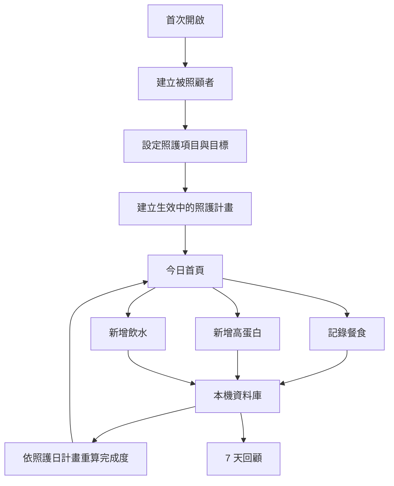
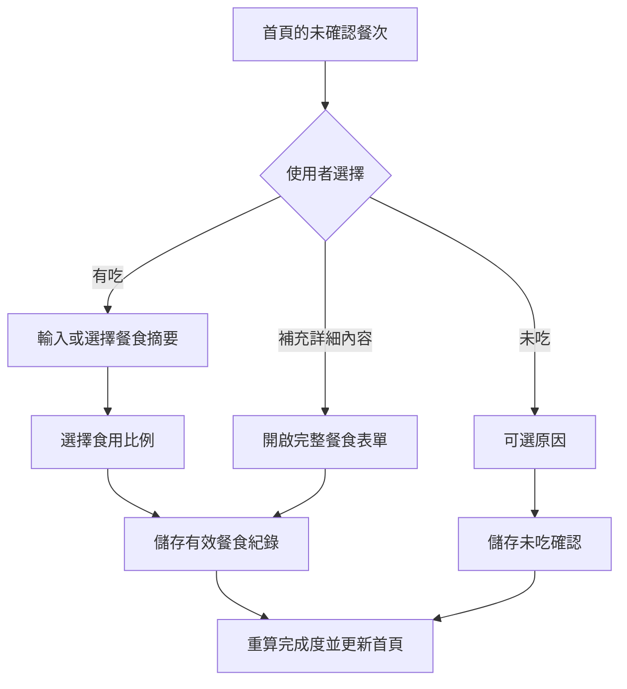

# CareNest MVP：每日照護確認設計

Status: Planned

Implementation: Superseded by split specs

> 本文件保留為拆分來源，不得直接作為實作設計。請依同目錄 `roadmap.md` 指向的新規格執行。

## 文件定位

本文件實作 [requirements.md](requirements.md) 所定義的 MVP 行為。專案尚未建立 Flutter 原始碼，因此所有檔案路徑均為建立專案後的目標計畫，非現有契約。

## 已知契約狀態

| 類型 | 已知契約 |
| --- | --- |
| 需求來源 | 本 spec 的 `requirements.md` 與已升格 MVP 草案 |
| 公開 API | 無；MVP 不建立 API Server 或帳號系統 |
| 外部資料契約 | 無；不得上傳健康資料或照片 |
| 平台契約 | Flutter iOS／Android 應用程式，需支援離線與本機通知 |
| 資料契約 | 本機 SQLite 由 Drift 管理；照片只存應用程式私有目錄 |
| 既有實作 | 無；目前僅有專案 README |
| 不可假造的行為 | 不提供醫療判讀、不管理藥品、不支援多人同步或多位長輩 |

## Bounded Context

### 包含

- 單一被照顧者與其照護計畫版本。
- 每日餐食、補充品、飲水、體重、血壓紀錄。
- 照護事項完成度計算。
- 本機通知、7 天回顧、備份與還原。
- 本機資料保護、照片生命週期與資料刪除。

### 不包含

- 家庭帳號、角色、權限、同步衝突與共享資料。
- 醫療規則、異常偵測、處方或風險評分。
- 食物辨識、營養推估、外部分析與遠端服務。
- 藥物相關資料或流程。

## 設計原則

1. 本機事實優先：每次操作先寫入本機資料庫，再由單一來源重建畫面狀態。
2. 完成度可重建：不把百分比當作唯一真相；任何新增、修改、刪除與計畫變更都能以紀錄與計畫快照重新計算。
3. 計畫版本不可回寫：一個照護日必須綁定當日生效計畫，歷史日不受日後設定影響。
4. 最小資料與最小權限：照片、通知、檔案只在使用者發起對應功能時才存取。
5. 描述性而非診斷性：資料層與呈現層均不實作閾值判讀、風險分類或醫療建議。
6. 漸進式結構：先使用 Flutter、Drift 與功能導向目錄；不在 MVP 引入遠端 Repository、複雜事件匯流排或多層 Clean Architecture。

## 目標結構

```text
lib/
  main.dart
  app.dart
  core/
    database/
      app_database.dart
      tables/
      daos/
    time/
      care_day.dart
    backup/
      backup_service.dart
    notifications/
      reminder_service.dart
  features/
    onboarding/
    care_plan/
    dashboard/
    meals/
    supplements/
    water/
    measurements/
    history/
    reminders/
    settings/
  shared/
    widgets/
    theme/
    validation/
test/
integration_test/
```

每個 `features/<feature>/` 先放頁面、控制器、狀態與專屬 Widget。當某段規則能在不依賴 Widget 的情況下測試時，放在同功能的純 Dart 類別。`core/` 只放跨功能且已證實共用的基礎能力。

## 主要流程



首次設定採三個步驟：建立被照顧者、選擇照護項目、設定作息與目標。照護項目初始狀態為早餐、午餐、晚餐、高蛋白補充、飲水啟用，體重與血壓關閉。年齡、生日與照片均為可略過資料；不得阻止使用者完成首次設定。

## 今日首頁資訊層級

首頁是家庭照護的當日確認入口，不是健康數據儀表板。其資訊層級必須固定如下：

1. 主要訊息：尚未確認或需要處理的事項數量與最高優先項目。
2. 立即行動：對每個待處理事項提供直接開始紀錄的入口。
3. 輔助進度：已完成數／應完成數與完成度百分比。
4. 已確認事實：三餐摘要、補充品份數與飲水累積，讓家人不需進入詳情就能得到基本答案。
5. 快速紀錄：飲水、高蛋白與餐食的最短操作入口。

當所有當日事項完成時，首頁主要訊息改為「今天的照護事項已確認」，並保留三餐摘要與食用比例、高蛋白份數、飲水累積等可回顧事實；不得只顯示百分比或以醫療詞彙評價結果。

待處理事項排序規則：

1. 已逾期且尚未確認的餐次，依其原定餐次時間由早到晚排列。
2. 已過提醒時間、且尚未達到使用者目標的高蛋白與飲水，依提醒時間由早到晚排列。
3. 尚未到時間的後續事項，依預定時間由早到晚排列。
4. 沒有設定提醒時間的項目，放在相同優先群組的最後，並依固定項目順序排序。

此排序只決定首頁待處理清單的呈現順序，不改變完成度計算，也不得使用健康風險推論作為排序依據。

### 餐食快速確認流程



快速確認入口的第一層只包含「有吃」、「未吃」、「補充詳細內容」。選擇有吃後才要求摘要與食用比例；選擇未吃可直接確認，原因始終為選填。使用者取消任何流程時不得建立不完整紀錄。

餐食摘要以使用者自由文字作為唯一主資料。查詢最近紀錄時，依最近使用時間去重並提供最多 8 筆摘要作為快速選取項目；不得建立預設食物分類、營養資料庫或從摘要推估熱量與蛋白質。

## 照護日與計畫版本

### 照護日

`CareDay` 是使用者設定的日界線與裝置時區共同決定的日期字串，例如 `2026-08-17`。所有紀錄在寫入時都要保存：

- `occurredAt`：實際紀錄發生或使用者指定的時間，採 UTC 儲存。
- `careDay`：依當時時區與日界線計算的照護日。
- `createdAt`、`updatedAt`：資料異動時間，採 UTC 儲存。

使用者日後改變日界線或時區時，不回寫既有 `careDay`，以避免歷史完成度改變；新紀錄才使用新規則。

### 計畫生效

`CarePlan` 以 `effectiveFromCareDay` 排序。讀取任一照護日時，選擇不晚於該日的最新計畫。計畫建立後不可直接覆蓋；設定修改建立一份新版本。

## 資料契約

### 被照顧者與計畫

| 實體 | 欄位 | 約束 |
| --- | --- | --- |
| CareRecipient | id、displayName、birthDate 可空、photoPath 可空、timeZoneId、careDayStartMinutes、createdAt、updatedAt | MVP 介面只允許一筆；名稱不可空白 |
| CarePlan | id、recipientId、effectiveFromCareDay、createdAt | 同一 recipient 與生效日唯一 |
| CarePlanItem | id、planId、type、enabled、targetValue 可空、scheduledDays、scheduledTimeMinutes 可空、sortOrder | `type` 為 mealBreakfast、mealLunch、mealDinner、supplement、water、weight、bloodPressure |

`targetValue` 的單位由 `type` 決定：補充品是份數，飲水是 ml。體重與血壓只保存排程資訊，不產生目標範圍。

高蛋白與飲水的 `enabled` 為真時，`targetValue` 必須為有效正數；否則首次設定與計畫儲存必須要求使用者輸入目標或關閉項目。資料庫不得以產品預設的醫療或營養數字補值。未啟用或無有效目標的項目不參與完成度分母。

早餐、午餐、晚餐的 `scheduledTimeMinutes` 為使用者設定的當地時間。首次設定使用 08:00、12:00、18:00，但它們只是可修改的作息預設，不代表醫療或營養建議。

### 每日紀錄

| 實體 | 欄位 | 約束 |
| --- | --- | --- |
| MealRecord | id、recipientId、careDay、mealType、status、summary 可空、intakePercent 可空、photoPath 可空、note 可空、occurredAt、createdAt、updatedAt | 每位長輩、照護日、餐別最多一筆；`ate` 時 summary 與比例必填；`notAte` 時比例為 0 |
| SupplementProduct | id、recipientId、name、caloriesPerServing 可空、proteinGramsPerServing 可空、createdAt、updatedAt | 名稱不可空白 |
| SupplementRecord | id、recipientId、careDay、productId 可空、productNameSnapshot、servings、occurredAt、note 可空、createdAt、updatedAt | 份數必須大於 0；名稱採快照以保留歷史 |
| WaterRecord | id、recipientId、careDay、milliliters、occurredAt、createdAt、updatedAt | ml 必須為 1 至 5,000 的整數 |
| WeightRecord | id、recipientId、careDay、kilograms、occurredAt、note 可空、createdAt、updatedAt | kg 必須為合理的正數；僅做輸入驗證、不做健康判讀 |
| BloodPressureRecord | id、recipientId、careDay、systolic、diastolic、pulse 可空、occurredAt、note 可空、createdAt、updatedAt | 數值必須為正整數；僅做輸入驗證、不做健康判讀 |

`CarePlanItem` 的高蛋白項目增加 `defaultSupplementProductId` 可空欄位。設定完成預設品項後，首頁 `+ 1 瓶` 以該品項與目前時間建立一筆 `SupplementRecord`；預設品項尚未設定時，不顯示一鍵新增，而引導使用者先建立品項。

首頁飲水區固定提供 `+100`、`+200`、`+300` ml 操作；每次點選即以目前時間建立 `WaterRecord`。自訂水量與歷史補登走「其他水量」流程，需驗證正整數 ml 與使用者指定的時間，並以該時間所屬 `careDay` 更新累積與完成度。

### 完成度讀模型

完成度可在查詢時產生。為提升首頁效能，可將 `DailyCompletionSnapshot` 作為快取保存，但它不能成為唯一真相。

| 欄位 | 說明 |
| --- | --- |
| recipientId、careDay、planId | 決定資料與計畫版本 |
| requiredCount、completedCount、percentage | 呈現完成度 |
| itemStates | 各項目狀態與當日目標快照 |
| calculatedAt | 最後計算時間 |

任何會改變紀錄或計畫的交易後，必須在同一個資料庫交易中使受影響日期的快取失效或重算。

## 完成度演算法

```text
輸入：recipient、careDay、當日有效 CarePlan、當日紀錄

requiredItems = 啟用且在該照護日應執行的項目
completedItems =
  三餐：存在有效的 MealRecord
  補充品：sum(servings) >= targetValue
  飲水：sum(milliliters) >= targetValue

requiredCount = requiredItems.count
completedCount = completedItems.count
percentage = requiredCount == 0 ? 0 : round(completedCount / requiredCount * 100)
```

體重與血壓不進入此演算法。餐食標為 `notAte` 仍表示照顧者已確認事實，因此該餐視為完成的照護確認；呈現層必須保留「未吃」而不可把它描述為進食成功。

## 狀態與錯誤處理

每個功能至少有以下狀態：

- 初始／載入中：不遮蔽已存在資料，必要時顯示局部載入指示。
- 成功：本機寫入完成後立即更新對應畫面與完成度。
- 無資料：清楚說明尚未有紀錄，提供可採取的下一步。
- 可恢復失敗：保留使用者輸入，說明原因並提供重試。
- 不可恢復失敗：不假裝成功，提供安全的離開或回復方式。

所有資料庫寫入、檔案操作、通知排程與備份還原都不可在 Widget `build` 中執行。跨非同步間隔操作畫面前必須確認 `context.mounted`。

## 相片、備份與刪除

### 相片

- 相片只可儲存在應用程式私有目錄，不寫入公開相簿。
- 建立或替換相片前，先複製至私有目錄；資料庫只保存相對路徑。
- 刪除餐食紀錄或替換照片時，在資料庫交易成功後清理無參照相片。
- 讀不到相片時，保留紀錄並顯示「照片無法讀取」，不得刪除其他資料。
- 今日首頁僅在餐食有照片時顯示可點選縮圖；七天回顧摘要不顯示照片；單日明細才載入原圖與完整備註。

### 備份與還原

- 備份格式為版本化、加密的封存檔，包含結構化資料與相片檔案。
- 產品內必須顯示備份產生時間、格式版本、被照顧者名稱與相片數量。
- 還原前先完整驗證格式、版本、內容雜湊與解密結果；驗證失敗不得改動既有資料。
- 「合併」以資料 `id` 去重；衝突時保留本機較新 `updatedAt`，並在還原摘要揭露衝突數量。
- 「取代」先建立自動安全備份，再在單一交易中替換資料；若任一步驟失敗，保留原始資料。

加密演算法、金鑰保存方式與跨平台檔案選取套件，屬實作前需確認的安全設計決策；不可自行以明文 JSON 取代。

## 通知設計

- 通知僅是本機排程，沒有伺服器端推播。
- 提醒設定與系統通知權限分開保存。
- 僅在使用者啟用第一個提醒時請求權限。
- 提醒內容使用中性語句，例如「午餐尚未記錄」或「今日飲水紀錄仍可補上」。
- 日界線、時區變更、計畫變更、提醒停用與應用程式重新啟動後，都要重新排程仍啟用的提醒。

## 七天回顧資訊層級

第一層顯示包含今天在內最近 7 個照護日，每日以「已完成數／應完成數」表達狀態，並列出本週常見未確認項目或未達使用者目標的項目。此層只使用描述性語句，例如「午餐本週有 3 天尚未確認」。

使用者選擇某一日期後，第二層才讀取與呈現該日完整餐食摘要、高蛋白、飲水、體重與血壓原始紀錄。圖表若用於體重或血壓，只能標示日期與原始數值，不可加上異常區間、健康評語或處置建議。

## 受影響檔案計畫

| 檔案或目錄 | 目的 |
| --- | --- |
| `pubspec.yaml` | Flutter SDK、必要套件與資產設定 |
| `lib/core/database/**` | Drift 資料表、遷移、DAO 與交易 |
| `lib/core/time/care_day.dart` | 時區與日界線的單一計算來源 |
| `lib/features/onboarding/**` | 首次設定與計畫建立 |
| `lib/features/dashboard/**` | 首頁與完成度呈現 |
| `lib/features/meals/**` | 餐食紀錄與相片處理 |
| `lib/features/supplements/**` | 常用品項與補充紀錄 |
| `lib/features/water/**` | 快速飲水紀錄 |
| `lib/features/measurements/**` | 體重與血壓純紀錄 |
| `lib/features/history/**` | 7 天回顧與描述性摘要 |
| `lib/core/notifications/**` | 本機通知排程與權限處理 |
| `lib/core/backup/**` | 加密備份、驗證與還原 |
| `test/**`、`integration_test/**` | 規則、資料、流程與回歸測試 |

## 風險與處理方式

| 風險 | 處理方式 |
| --- | --- |
| 使用者將完成度誤解為健康分數 | 顯示完整名稱、分子與分母、明細；不使用臨床詞彙 |
| 餐食摘要增加紀錄阻力 | 常用餐點快速選取；以使用者測試驗證 A1，未通過則調整需求 |
| 日界線變更使歷史資料錯置 | 每筆紀錄持久化 `careDay`，不做回溯改寫 |
| 備份還原破壞資料 | 先驗證、取代前安全備份、交易化寫入、明確摘要 |
| 照片殘留或外洩 | 只使用私有目錄、資料刪除同步清理、備份加密 |
| 套件選擇使新手難以維護 | 每次新增套件先記錄需求、替代方案與維護風險；避免非必要套件 |
