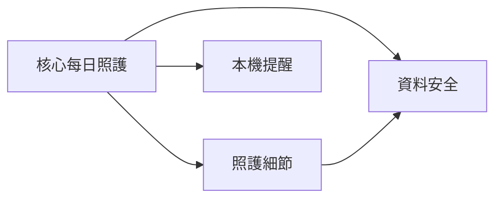

# Roadmap：CareNest MVP 規格拆分

Status: Planned

## 拆分理由

原規格同時包含核心照護確認、相片、量測、通知、加密備份與還原，無法在短週期內驗證「家人是否不必再互相詢問今天有沒有照顧到」的核心假設。因此原規格保留為歷史來源，實作改由以下四份規格推進。

## Spec 清單

| Spec | 狀態 | Depends | 說明 |
|------|------|---------|------|
| `2026-08-17-15-58_Feature-carenest-core-daily-care` | in_progress | 無 | 驗證今日照護確認的核心價值；T1 已完成 |
| `2026-08-17-15-58_Feature-carenest-care-details` | blocked | 核心 MVP | 增加餐食照片、體重與血壓 |
| `2026-08-17-15-58_Feature-carenest-local-reminders` | blocked | 核心 MVP | 增加選用的本機提醒 |
| `2026-08-17-15-58_Feature-carenest-data-safety` | blocked | 核心 MVP、照護細節 | 增加加密備份、還原與完整刪除 |

家庭帳號、多人同步與共享不屬於本次拆分來源，待核心 MVP 驗證後另建 draft。

## 交付順序

1. 完成核心 MVP 的 T2 至 T6。
2. 核心驗證後評估照護細節與本機提醒的實際優先順序。
3. 核心與照護細節穩定後，才開始資料安全決策與實作。

## 跨 Spec 相依

## 整合驗證方式

- 每份規格只驗證自己的新增行為，並重跑核心 MVP 的首頁、餐食、高蛋白、飲水與七天回顧測試。
- 後續規格不得修改完成度的醫療邊界、引入藥品管理或加入遠端資料傳輸。
- 只有第一份核心規格可作為目前的實作入口。
