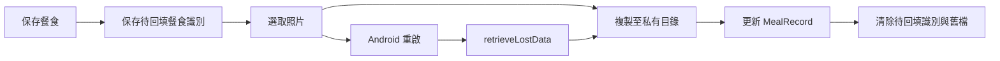

# 設計文件：CareNest 照護細節

## 設計摘要

本設計在核心本機資料上增加私有照片與純量測資料。照片生命週期與餐食交易協調，量測獨立於完成數。無後端、同步、影像辨識或醫療判讀。

## 文件定位

對應同目錄 requirements，等待核心 MVP 完成後才可實作，不重寫核心 dashboard completion 邏輯。

## 已知契約狀態

- 需求來源: requirements 三個驗收情境
- API / CLI / Hook contract: 無遠端 API；Flutter CLI 驗證
- Data contract: 擴充 MealRecord；新增 WeightRecord、BloodPressureRecord
- 既有實作: 核心 MVP 待完成
- 不可假造: 健康範圍、異常狀態、營養分析、遠端照片 URL

## Bounded Context

包含：餐食照片、私有檔案服務、體重、血壓與原始數值回顧。

不包含：健康閾值、完成數、通知、備份、同步與 AI。

## 設計原則

- 照片先複製成功再更新資料庫，資料交易成功後才刪除舊檔。
- 量測只做格式與正數驗證。
- 缺失照片不刪除餐食紀錄。

## 需求對應

| 需求 / 驗收情境 | 設計處理方式 | 驗證方式 |
|-----------------|--------------|----------|
| 照片生命週期 | 私有檔案服務與 MealRecord 路徑 | `meal_photo_flow_test.dart` |
| 純量測 | 獨立資料表與中性呈現 | `measurement_presentation_test.dart` |
| 核心不變 | 量測查詢不進入 completion | 核心回歸 |

## 受影響檔案計畫

| 檔案 | 預期變更 | 原因 | 風險 |
|------|----------|------|------|
| `lib/features/meals/**` | 照片選取與呈現 | 餐食細節 | 權限與檔案遺失 |
| `lib/core/files/**` | 私有檔案服務 | 生命週期集中 | 無參照檔案 |
| `lib/features/measurements/**` | 量測 CRUD | 純記錄 | 醫療誤解 |
| `lib/features/history/**` | 單日與七天量測 | 回顧 | 圖表誤解 |

## 目標結構或流程

餐食照片沿用餐食 CRUD；啟動系統選圖前先保存待回填的餐食識別。Android 若在選圖期間重建 App，啟動時以 `ImagePicker.retrieveLostData()` 取得選圖結果，再只回填到該識別指向的餐食。量測功能獨立寫入 Drift，history 查詢原始數值，不進入 dashboard completion。

## Mermaid Diagrams

## 介面與資料契約

### API / CLI / Hook

- Input: 系統照片選取結果、量測表單
- Output: 私有檔案路徑與本機量測紀錄
- Error: 檔案失敗保留原餐食；數值錯誤顯示可修正訊息

### Data / Config

- 新增資料: MealRecord.photoPath／note、WeightRecord、BloodPressureRecord
- 既有資料相容性: Drift migration 保留核心紀錄，新增欄位可空

## 關鍵行為

- 無照片時不顯示空縮圖；七天第一層不載入照片。
- 量測新增、修改或刪除不觸發完成數變更。

## 前後端或跨模組設計

只有本機資料庫與私有檔案跨模組協調，無前後端設計。

## Protected Behavior

- 核心完成數與快速紀錄不變。
- App 沒有網路依賴與醫療判讀。

## 替代方案

| 方案 | 優點 | 缺點 | 結論 |
|------|------|------|------|
| 私有檔案路徑 | 隱私與控制清楚 | 需自行清理 | 採用 |
| 公開相簿 | 使用者可見 | 隱私與刪除不一致 | 不採用 |

## 風險與處理方式

| 風險 | 影響 | 處理方式 | 驗證 |
|------|------|----------|------|
| 檔案殘留 | 儲存空間增加 | 無參照清理 | 照片流程整合測試 |
| 醫療誤解 | 使用者錯誤判讀 | 中性文字、無健康區間 | 呈現測試 |

## 實作注意事項

- 實作前重新確認平台權限與套件版本。
- migration 與檔案清理必須在正式資料安全 spec 前可獨立測試。
