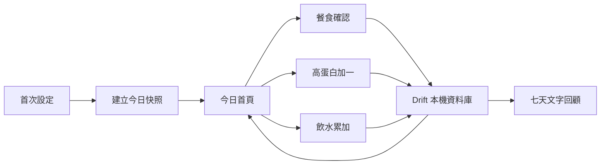

# 設計文件：CareNest 核心 MVP 每日照護確認

## 設計摘要

核心 MVP 使用 Flutter 與 Drift，在單一裝置保存一位被照顧者的設定、每日快照與核心紀錄。首頁每次從本機資料來源重建狀態；設定變更只影響下一個照護日。此設計不建立 Repository 預留層、Backend Server、遠端 API、帳號或同步。

## 文件定位

本設計對應同目錄 `requirements.md`，承接已完成的 Flutter T1 骨架。它只設計核心本機流程，不重寫後續照護細節、提醒與資料安全規格。

## 已知契約狀態

- 需求來源: `requirements.md` 的目標、已定決策與七個驗收情境
- API / CLI / Hook contract: 無遠端 API；驗證命令為 Flutter CLI
- Data contract: Drift schema version 1 已建立於 `lib/core/database/app_database.dart`；欄位定義見本文件「介面與資料契約」
- 既有實作: Flutter T1、T2、T3，包含本機資料庫、`CareNestController`、首次設定、今日首頁、主題 token 與對應測試
- 不可假造: 不得新增後端、帳號、同步、醫療狀態、照片、量測、提醒或備份欄位

## Bounded Context

包含：

- 單一被照顧者與目前照護設定
- 每日設定快照、餐食、高蛋白、飲水
- 今日首頁完成數與七天文字回顧

不包含：

- 照片、體重、血壓、圖表、提醒、備份還原
- Backend Server、API、帳號、多人共享與醫療判讀

## 設計原則

- 本機資料庫是單一事實來源，資料寫入完成後重新查詢畫面狀態。
- 只建立當前功能需要的 feature 目錄與抽象，不預建遠端 Repository。
- 每日設定快照建立後不可變，保護歷史完成數。
- 完成數只表示照護事項已確認，不表示健康品質。
- Flutter UI 遵守 4px 間距、44px 觸控目標、明確表單錯誤與 Light／Dark 語意 token。
- Primitive token 定義原始間距、圓角與色彩；Semantic token 由 ThemeData 的 ColorScheme 表達；Component token 由 Button、Input、Card Theme 與 CareNestSpacing ThemeExtension 統一套用。

## 需求對應

| 需求 / 驗收情境 | 設計處理方式 | 驗證方式 |
|-----------------|--------------|----------|
| 完成首次設定 | CareSettings 保存目前設定，首次開啟首頁建立 DailyCareSnapshot | `integration_test/onboarding_flow_test.dart` |
| 待確認事項優先 | Dashboard 依餐次時間與項目狀態排序 | `pending_priority_test.dart` |
| 餐食快速確認 | 單日單餐唯一 MealRecord，狀態區分 ate／notAte | `meal_quick_flow_test.dart` |
| 快速累加 | 每次操作新增 SupplementRecord 或 WaterRecord | `quick_add_flow_test.dart` |
| 離線流程 | 所有核心讀寫只依賴 Drift | `offline_core_flow_test.dart` |
| 設定隔日生效 | 當日快照不可變，新設定於下一照護日複製 | `effective_next_day_test.dart` |

## 受影響檔案計畫

| 檔案 | 預期變更 | 原因 | 風險 |
|------|----------|------|------|
| `pubspec.yaml` | 新增 drift、path_provider、drift_dev、build_runner | 本機 SQLite 與產碼 | 相依版本相容性 |
| `lib/core/database/**` | schema、DAO、migration | 單一事實來源 | migration 錯誤 |
| `lib/features/onboarding/**` | 首次設定 | 建立照護資料 | 表單負擔 |
| `lib/features/dashboard/**` | 首頁查詢與排序 | 回答今天還缺什麼 | 完成數誤解 |
| `lib/features/meals/**` | 餐食 CRUD | 記錄餐食事實 | 自由文字成本 |
| `lib/features/supplements/**` | 高蛋白快速新增 | 一鍵確認份數 | 重複點擊 |
| `lib/features/water/**` | 飲水快速新增 | 一鍵累加 ml | 輸入範圍 |
| `lib/features/history/**` | 七天文字回顧 | 回顧照護缺口 | 日期邊界 |
| `lib/features/settings/**` | 隔日生效修改 | 保護歷史 | 使用者理解 |
| `test/**`、`integration_test/**` | 自動化驗證 | 覆蓋驗收情境 | 無 |

## 目標結構或流程

```text
lib/
  main.dart
  app.dart
  core/database/
  features/onboarding/
  features/dashboard/
  features/meals/
  features/supplements/
  features/water/
  features/history/
  features/settings/
test/
integration_test/
```

## Mermaid Diagrams



## 介面與資料契約

### API / CLI / Hook

- Input: 使用者表單與首頁快速操作
- Output: 本機資料寫入、首頁狀態與七天文字回顧
- Error: 輸入錯誤需保留內容並顯示繁體中文修正方式；資料庫錯誤不得假裝成功

### Data / Config

- 新增資料:
  - `CareRecipient`: id、displayName、createdAt、updatedAt
  - `CareSettings`: recipientId、mealEnabled、mealTimes、supplementEnabled、supplementTarget、defaultSupplementName、waterEnabled、waterTarget、updatedAt
  - `DailyCareSnapshot`: recipientId、careDay、餐次時間、啟用項目、補充品目標、飲水目標、createdAt
  - `MealRecord`: id、recipientId、careDay、mealType、status、summary、intakePercent、occurredAt、createdAt、updatedAt
  - `SupplementRecord`: id、recipientId、careDay、productNameSnapshot、servings、occurredAt、createdAt、updatedAt
  - `WaterRecord`: id、recipientId、careDay、milliliters、occurredAt、createdAt、updatedAt
- 既有資料相容性: 新專案無既有使用者資料；T2 仍需建立 schema version 1 與 migration 測試骨架

## 關鍵行為

- 每個照護日第一次讀取時，以當前 CareSettings 建立且固定 DailyCareSnapshot。
- MealRecord 的 ate 與 notAte 都代表該餐已確認，但呈現文案必須保留事實差異。
- 高蛋白與飲水達到快照目標後才算完成。
- 新增、修改、刪除紀錄後重新查詢受影響照護日，不以百分比快取作唯一真相。
- 照護日暫用裝置當地曆日 00:00。

## 前後端或跨模組設計

無前後端設計。所有功能均在 Flutter App 與本機 Drift 資料庫內完成，禁止加入 Backend Server 或遠端 API。

## Protected Behavior

- Android Debug APK、`flutter analyze`、`flutter test` 持續通過。
- `android/` 與 `ios/` 平台目錄保留。
- App 不要求網路、登入、照片、通知或檔案權限。
- 不修改後續三份規格的範圍。

## 替代方案

| 方案 | 優點 | 缺點 | 結論 |
|------|------|------|------|
| Drift／SQLite | 型別安全、可測試、離線成熟 | 需要產碼與 migration | 採用；使用 NativeDatabase 與 path_provider 管理原生資料庫位置 |
| SharedPreferences 儲存全部資料 | 初始簡單 | 不適合多筆紀錄與查詢 | 不採用 |
| 自建 Backend | 可同步 | 超出需求、增加帳號與維運 | 禁止採用 |
| 完整 Clean Architecture | 邊界明確 | MVP 過度抽象 | 不採用 |

## 風險與處理方式

| 風險 | 影響 | 處理方式 | 驗證 |
|------|------|----------|------|
| 每日快照錯置 | 歷史完成數錯誤 | 單一 careDay 計算與唯一約束 | `effective_next_day_test.dart` |
| 重複快速點擊 | 累積數量錯誤 | 交易與 UI 提交狀態 | 快速新增 Widget 測試 |
| 完成數被視為健康分數 | 誤解產品 | 待確認事項優先、文案中性 | 首頁 Widget 測試與使用者測試 |
| Drift 相依不相容 | 無法建置 | 確認官方套件版本並鎖定 | `flutter analyze`、Android build |

## 實作注意事項

- 每個 task 開始前只讀取本文件相關章節與 `tasks.md` 當前任務。
- Drift 套件用途：drift 提供型別安全資料存取；path_provider 提供 App 私有資料目錄；drift_dev 與 build_runner 產生程式碼。替代方案 SharedPreferences 無法支援多筆關聯紀錄與查詢；不採用 drift_flutter 與 sqlite3_flutter_libs，因前者目前帶入已停止維護的 SQLite 相容套件，而 Drift 2.32 後原生平台可直接使用 NativeDatabase。
- 若資料契約變更，必須同步更新 requirements 驗收情境與 tasks Verify。
