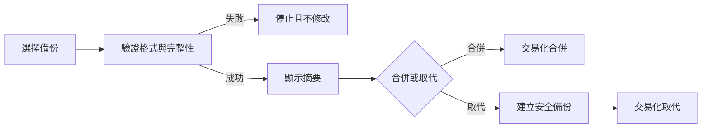

# 設計文件：CareNest 資料安全

## 設計摘要

本設計以版本化加密封存保護本機資料，所有還原先完整驗證。合併與取代都在可回復邊界內執行，取代前建立安全備份。加密與金鑰契約尚未決定，因此正式實作必須等待安全決策紀錄。

## 文件定位

對應同目錄 requirements，接續核心與照護細節，不加入雲端、帳號或同步。

## 已知契約狀態

- 需求來源: requirements 三個驗收情境
- API / CLI / Hook contract: 本機檔案選取與安全儲存；無遠端 API
- Data contract: 核心資料表、量測與私有照片；封存格式待確認
- 既有實作: 等待核心與照護細節完成
- 不可假造: 加密演算法、金鑰恢復、跨平台格式與衝突契約

## Bounded Context

包含：加密封存、完整性驗證、合併／取代還原、刪除與失敗回復。

不包含：雲端、帳號、同步、共享與公開報表。

## 設計原則

- 先驗證再寫入，失敗不破壞現有資料。
- 備份預設加密，日誌不含敏感內容。
- 取代還原必須可回復。

## 需求對應

| 需求 / 驗收情境 | 設計處理方式 | 驗證方式 |
|-----------------|--------------|----------|
| 無效備份 | 寫入前驗證格式、完整性與解密 | `invalid_backup_restore_test.dart` |
| 取代 rollback | 安全備份、暫存與交易化取代 | `replace_restore_rollback_test.dart` |
| 前置回歸 | backup service 不改核心 schema 語意 | 全部回歸 |

## 受影響檔案計畫

| 檔案 | 預期變更 | 原因 | 風險 |
|------|----------|------|------|
| `lib/core/backup/**` | 封存、加密、驗證、還原 | 主要能力 | 安全錯誤 |
| `lib/core/database/**` | 交易與匯入 | 保持一致性 | 半套資料 |
| `lib/core/files/**` | 照片封存與清理 | 完整備份 | 檔案遺失 |
| `lib/features/settings/**` | 備份還原 UI | 使用者控制 | 誤操作 |

## 目標結構或流程

先讀取並驗證封存檔，顯示摘要後才允許合併或取代。取代建立安全備份，再於暫存與交易邊界內完成寫入。

## Mermaid Diagrams

## 介面與資料契約

### API / CLI / Hook

- Input: 使用者選取的備份檔與合併／取代選擇
- Output: 還原摘要、成功結果或可恢復錯誤
- Error: 驗證失敗不寫入；取代失敗執行 rollback

### Data / Config

- 新增資料: 備份 manifest、formatVersion、完整性資訊與封存內容
- 既有資料相容性: 每個 formatVersion 必須定義可接受的 migration 路徑

## 關鍵行為

- 合併以穩定 id 去重，衝突規則需先確認。
- 全部刪除需二次確認並清理無參照照片。

## 前後端或跨模組設計

database、files、backup、settings 於本機協作，無前後端設計。

## Protected Behavior

- 備份與還原失敗不破壞核心與照片資料。
- 不上傳資料、不建立帳號或 Backend Server。

## 替代方案

| 方案 | 優點 | 缺點 | 結論 |
|------|------|------|------|
| 加密離線封存 | 無後端、使用者可控 | 金鑰與 UX 複雜 | 採用，待安全決策 |
| 明文 JSON | 容易實作 | 暴露敏感資料 | 禁止 |
| 雲端備份 | 自動化 | 需要帳號與後端 | 不採用 |

## 風險與處理方式

| 風險 | 影響 | 處理方式 | 驗證 |
|------|------|----------|------|
| 加密契約錯誤 | 無法還原或外洩 | 安全決策與審查 | 技術原型與測試向量 |
| 半套還原 | 資料損壞 | 暫存、交易、rollback | 失敗注入測試 |
| 照片缺失 | 備份不完整 | manifest 與完整性檢查 | 照片數量／雜湊測試 |

## 實作注意事項

- T1 只做安全決策與技術驗證，不得直接交付正式備份格式。
- 任何契約確定後需同步更新 requirements、tasks 與隱私說明。

