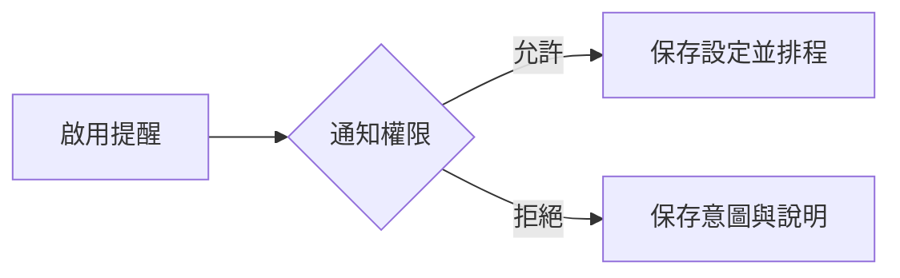

# 設計文件：CareNest 本機提醒

## 設計摘要

本設計新增 ReminderSettings、通知權限狀態與裝置本機排程。每個提醒使用穩定識別碼，變更時先取消舊排程。沒有伺服器、推播 token、用藥或醫療警報。

## 文件定位

對應同目錄 requirements，等待核心 MVP 完成後實作，不改變核心資料契約與完成數。

## 已知契約狀態

- 需求來源: requirements 三個驗收情境
- API / CLI / Hook contract: iOS／Android 本機通知 API；無遠端 API
- Data contract: 新增 ReminderSettings，核心資料不變
- 既有實作: 核心 MVP 待完成
- 不可假造: 推播 token、用藥類型、醫療緊急程度、伺服器狀態

## Bounded Context

包含：提醒設定、權限狀態、本機排程、取消與重新排程。

不包含：遠端推播、背景同步、用藥與醫療警報。

## 設計原則

- 權限請求由使用者啟用提醒的行為觸發。
- 設定與系統權限分開保存。
- 排程失敗不得阻擋資料記錄。

## 需求對應

| 需求 / 驗收情境 | 設計處理方式 | 驗證方式 |
|-----------------|--------------|----------|
| 首次權限 | 啟用第一個提醒時呼叫 permission gateway | `reminder_permission_flow_test.dart` |
| 修改排程 | 穩定 id，先 cancel 再 schedule | `reminder_reschedule_test.dart` |
| 核心不變 | notification error 與資料層隔離 | 核心回歸 |

## 受影響檔案計畫

| 檔案 | 預期變更 | 原因 | 風險 |
|------|----------|------|------|
| `lib/core/notifications/**` | 排程 gateway | 平台隔離 | 套件差異 |
| `lib/features/reminders/**` | 設定與狀態 | 使用者控制 | 權限理解 |
| `android/**`、`ios/**` | 必要平台設定 | 本機通知 | 平台限制 |

## 目標結構或流程

啟用提醒後檢查權限；允許時保存設定並排程，拒絕時保存意圖與權限狀態但不排程。設定或時間變更均先取消舊排程。

## Mermaid Diagrams

## 介面與資料契約

### API / CLI / Hook

- Input: 提醒類型、時間、啟用狀態
- Output: 本機排程或可恢復的權限狀態
- Error: 排程失敗顯示設定指引，不影響核心紀錄

### Data / Config

- 新增資料: ReminderSettings、platformPermissionState
- 既有資料相容性: migration 新增設定表，不修改核心紀錄

## 關鍵行為

- 未啟用時不請求權限。
- App 啟動與設定變更時校正有效排程。

## 前後端或跨模組設計

只有 Flutter 與平台通知 API，無前後端設計。

## Protected Behavior

- 核心離線紀錄、完成數與首頁不依賴通知結果。
- 不新增網路權限或遠端服務。

## 替代方案

| 方案 | 優點 | 缺點 | 結論 |
|------|------|------|------|
| 本機通知 | 無後端、符合隱私 | 跨裝置不可用 | 採用 |
| 遠端推播 | 可集中控制 | 需要後端與 token | 不採用 |

## 風險與處理方式

| 風險 | 影響 | 處理方式 | 驗證 |
|------|------|----------|------|
| 重複通知 | 使用者困擾 | 穩定 id 與取消舊排程 | 重排程測試 |
| 權限拒絕 | 提醒不可用 | 可恢復說明、核心不受影響 | 權限情境測試 |

## 實作注意事項

- 實作前確認官方套件版本與平台限制。
- 不因通知需求引入 Backend Server。

