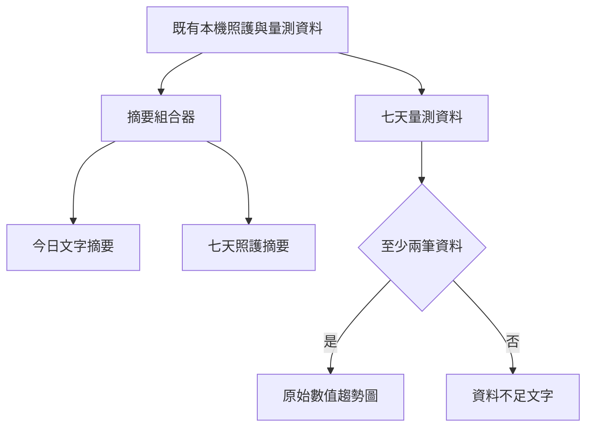

# 設計文件：CareNest 照護摘要與量測趨勢

## 文件定位

對應同目錄 requirements，接續既有的本機照護與量測資料。不改變資料庫 schema、量測 CRUD、首頁完成數或遠端邊界。

## 已知契約狀態

- 資料來源：DailyCareSnapshot、MealRecord、SupplementRecord、WaterRecord、WeightRecord、BloodPressureRecord。
- 既有 UI：今日首頁、七天回顧、量測紀錄頁。
- 不可假造：健康範圍、異常狀態、治療建議與遠端歷史資料。

## Bounded Context

包含：本機資料摘要、七天完成數文字摘要、七天原始量測折線圖。

不包含：量測記錄本身、任何醫療規則、通知、同步、備份與 Backend Server。

## 設計原則

- 首頁一句摘要服務今天的交接，不取代待確認事項。
- 圖表是資料瀏覽元件，不是健康評估元件。
- 少於兩個資料點時以文字說明取代折線。
- 使用 Flutter 既有 Canvas／CustomPainter 或小型本機元件；引入第三方圖表套件前須另行確認。

## 目標流程

## 受影響檔案計畫

| 檔案 | 預期變更 | 原因 |
|------|----------|------|
| `lib/features/dashboard/**` | 今日摘要卡 | 首頁快速交接 |
| `lib/features/history/**` | 七天完成摘要 | 回顧層次 |
| `lib/features/measurements/**` | 七天趨勢元件 | 原始數值可視化 |
| `lib/shared/widgets/**` | 小型趨勢圖元件 | 限於有兩處共用時才抽出 |
| `test/features/**` | 摘要與趨勢測試 | 驗收與回歸 |

## 關鍵行為

- 今日摘要以目前的當日快照與紀錄組合，不寫入新資料。
- 七天照護摘要沿用既有歷史日期順序。
- 體重折線以公斤原始值繪製；血壓以收縮壓、舒張壓兩條可辨識線繪製。
- 每個圖表資料點以日期與數字可讀取，不只依賴顏色。

## 風險與處理方式

| 風險 | 處理方式 | 驗證 |
|------|----------|------|
| 小螢幕標籤擁擠 | 固定七天、縮短日期格式、可讀取資料列表 | Widget 與實機檢查 |
| 資料不足誤導 | 少於兩筆顯示文字替代 | 空資料／單筆測試 |
| 醫療誤解 | 中性標題與說明，不加入閾值 | 字串與 Widget 測試 |
