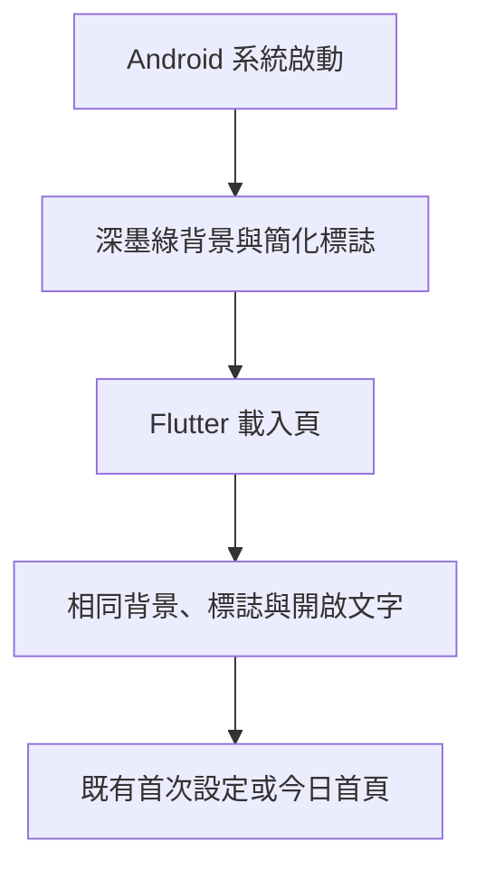

# 設計文件：CareNest Android 啟動體驗

## 文件定位

對應同目錄 requirements。本任務處理 Android 啟動窗口和 Flutter `loading` 狀態；只調整 `CareNestController.initialize()` 的呼叫時機，不改寫其資料讀取、錯誤處理、路由或照護資料流。

## 已知契約狀態

- Android `LaunchTheme` 目前以 `launch_background` 為窗口背景；night 資源使用系統黑色背景。
- Android API 31 以上系統會使用 SplashScreen；目前已改為透明背景啟動標誌，但離場仍採系統預設切換。
- Flutter `_LoadingPage` 顯示原始透明標誌與「正在開啟 CareNest」。
- 已有桌面用 `assets/branding/carenest_app_icon.png`；此任務需使用不同的透明背景啟動標誌。

## Bounded Context

包含：Android values、drawable、API 31 SplashScreen 設定、透明啟動標誌資產、Flutter 載入頁、初始化呼叫時機與相關 Widget 測試。

不包含：iOS、桌面圖示、一般頁面主題、資料庫初始化規則、動畫與網路流程。

## 設計原則

- 系統畫面與 Flutter 首幀共用深墨綠 `#15201E`，避免閃屏。
- 系統 SplashScreen 顯示深墨綠背景與小型原始標誌；開啟文字由 Flutter 載入頁顯示。
- 透明背景啟動標誌不重複使用滿版桌面圖示。
- Flutter 第一個可見畫面後固定等待 500ms，再執行既有初始化，確保載入內容可被看見。
- 載入頁切換至首次設定或今日首頁時，以 240ms `easeOut` 淡入新頁、`easeIn` 淡出舊頁，避免突兀切換。
- Android 12 使用 720 × 720 的透明留白 PNG，中央直接嵌入 432 × 432 的原始標誌，讓 Android 系統遮罩縮放後呈現小型過渡圖示；Flutter 首幀就緒後立刻移除系統畫面。Flutter 載入頁保留固定原始標誌與開啟文字。

## 流程

## 受影響檔案

| 檔案 | 變更 |
|---|---|
| `assets/branding/carenest_launch_mark.png` | 透明背景簡化標誌 |
| `pubspec.yaml` | 宣告既有本機啟動標誌資產 |
| `lib/app.dart` | 品牌化 Flutter 載入頁 |
| `android/app/src/main/res/values*/styles.xml` | 啟動背景與 API 31 SplashScreen 設定 |
| `android/app/src/main/res/drawable*/launch_background.xml` | 深墨綠窗口背景 |
| `android/app/src/main/res/drawable-nodpi/carenest_launch_mark.png` | Android 系統啟動標誌 |
| `android/app/src/main/kotlin/**/MainActivity.kt` | Android 12 SplashScreen 離場動畫 |
| `test/widget_test.dart` | 載入頁驗收 |

## 風險與處理

| 風險 | 處理 |
|---|---|
| Android 12 對啟動圖示自動遮罩 | 以透明留白縮小原始圖示，讓系統遮罩後仍保持合理比例 |
| 原生動畫重繪品牌圖形 | 不採用動畫重繪；直接使用原始透明 PNG |
| 系統與 Flutter 背景不一致 | 明確固定兩階段同一背景色 |
| 離場動畫造成等待感 | Flutter 首幀就緒後立刻移除系統畫面 |
| 載入時間很短看不到文字 | 文字不承擔關鍵操作，僅作為過場狀態 |
| 初始化在首幀前完成，導致系統畫面直接跳首頁 | 將既有初始化排到第一個 Flutter 畫面後 500ms 執行 |
