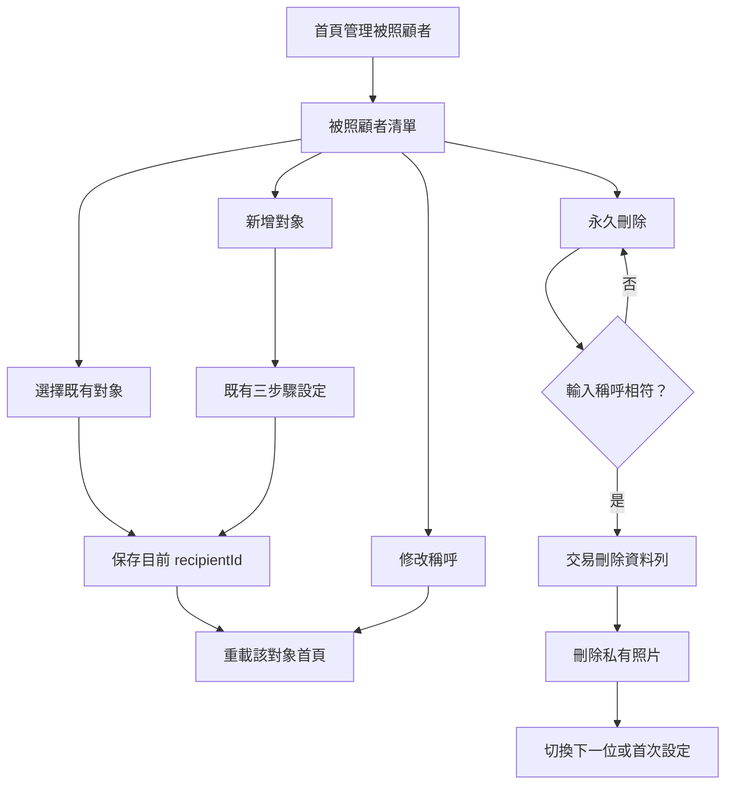

# 設計文件：CareNest 多位被照顧者

## 文件定位

對應同目錄 `requirements.md`，接續核心 MVP 原先的單一對象資料模型。既有照護紀錄已依 `recipientId` 分隔，因此本功能著重解除限制、保存目前選取對象與提供安全的管理操作。

## 已知契約狀態

- `CareRecipients` 已有 `id`、`displayName`、`createdAt`、`updatedAt`。
- `CareSettings`、每日快照、餐食、高蛋白、飲水、體重與血壓全部以 `recipientId` 關聯。
- schema version 為 3；升級須保留現有資料。
- `CareNestController` 已以 `CareDashboardData.recipientId` 執行所有照護紀錄操作。
- 餐食照片在 App 私有檔案區，資料庫 `MealRecords.photoPath` 只存檔案位置。

## Bounded Context

包含：多位被照顧者 CRUD、目前選取對象的本機持久化、首頁切換、既有首次設定重用、關聯資料與照片完整刪除、必要測試。

不包含：跨裝置同步、帳號、被照顧者資料合併、封存、還原、既有照護設定欄位的修改介面與任何醫療建議。

## 設計原則

- `recipientId` 是每筆照護資料唯一的隔離邊界，不從 UI 名稱推導對象。
- 目前選取對象儲存在單列 `ActiveRecipientSelections` 表，App 重啟後仍可回到上次對象。
- 既有單一對象資料不搬移、不重建；升級時新增選取表，首次讀取自動選取現有最早建立對象。
- 刪除以資料庫 transaction 先取得照片清單、刪除所有關聯資料與對象，交易成功後才刪除私有照片檔案。
- 管理頁把切換、修改與刪除集中於一處；永久刪除需要輸入正確稱呼並顯示完整影響。

## 資料設計

```text
CareRecipients 1 ── * CareSettings / DailyCareSnapshots / MealRecords /
                      SupplementRecords / WaterRecords / WeightRecords /
                      BloodPressureRecords

ActiveRecipientSelections (id = 1) ── 0..1 CareRecipients
```

`ActiveRecipientSelections` 欄位：

- `id`：固定為 1 的主鍵。
- `recipientId`：可為空的目前對象；刪除目前對象前先清除。

資料庫由 version 3 升級至 version 4，只新增 `ActiveRecipientSelections`。

## 操作流程



## 受影響檔案計畫

| 檔案 | 變更 |
|---|---|
| `lib/core/database/app_database.dart`、產生檔 | version 4、選取對象表、多位 CRUD、transaction 刪除 |
| `lib/features/dashboard/care_nest_controller.dart` | 初始化選取、切換、新增、改名與完整刪除流程 |
| `lib/features/onboarding/care_setup_page.dart` | 新增模式完成後回到管理頁 |
| `lib/features/recipients/care_recipient_management_page.dart` | 新增管理、切換、改名與危險刪除頁面 |
| `lib/features/dashboard/care_dashboard_page.dart` | 提供管理入口 |
| `test/core/database/multi_recipient_test.dart` | 資料隔離與完整刪除 |
| `test/features/recipients/multi_recipient_controller_test.dart` | 切換、改名、刪除與最後一位行為 |
| `test/widget_test.dart` | 既有首次設定與首頁回歸 |

## 關鍵行為

- `initialize()` 優先讀取已保存的 active recipient；若不存在或已無效，改選最早建立的對象並保存。
- 新增對象建立設定與今日快照後設為 active recipient。
- 修改稱呼僅更新 `CareRecipients.displayName` 與 `updatedAt`，不修改任何 `recipientId` 關聯資料。
- 刪除 transaction 會取得所有餐食 `photoPath`，清除 active selection、所有子表與 recipient；交易成功後由 `MealPhotoStore` 清除檔案。
- 刪除非目前對象不改變首頁；刪除目前對象時改選下一位；最後一位刪除後進入 `needsSetup`。

## 風險與處理

| 風險 | 處理 |
|---|---|
| 選取已刪除對象 | `initialize()` 驗證選取 ID，無效時自動選擇現有對象或清空 |
| 関聯資料或照片遺漏 | transaction 明列所有七個關聯表；照片路徑在交易前取得，交易後逐一刪除 |
| 刪除誤觸 | 顯示不可復原影響並要求輸入完整稱呼 |
| 對象切換時照片回填錯置 | 對象切換前清除待回填照片識別；既有照片回填仍以餐食 ID 驗證 |
| 舊資料升級失敗 | 只新增新表，既有 recipient 與紀錄資料表不變；加入 migration 回歸測試 |
