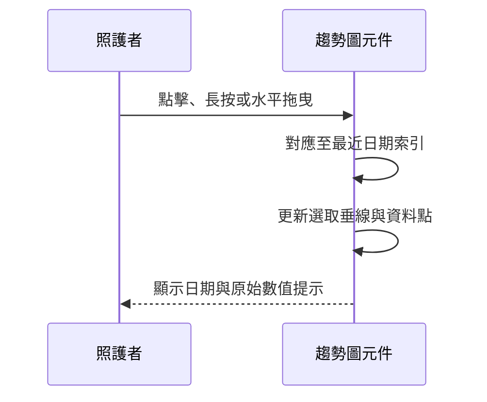

# 設計文件：CareNest 可互動量測趨勢圖

Status: Complete

## 已知契約與範圍

- 資料來源：`CareDayMeasurements`，每個日期最多取第一筆體重與第一筆血壓作為趨勢點。
- 既有資料欄位：體重公斤、血壓收縮壓／舒張壓、量測日期。
- 包含：`care_measurements_page.dart` 內的趨勢圖與其 Widget 測試。
- 不包含：資料表變更、數據聚合、健康判讀、外部圖表套件。

## 設計原則

- 使用時間序列折線圖；X 軸依最近七天日期，Y 軸依現有資料合理留白後動態縮放。
- 顯示點與文字標籤，不單以顏色區分收縮壓、舒張壓。
- 手勢只選取最接近日期欄位，避免在小螢幕要求精準點到圓點。
- 互動提示放在圖表下方，避免遮住座標軸與折線。

## 視覺色彩規格

色彩僅套用於量測趨勢圖，照護首頁與一般表單維持既有淺色介面。深色圖表區用來聚焦數據；資料名稱、日期、單位與選取後的原始數值仍以文字呈現，避免僅靠顏色辨識。

| 用途 | 色號 | 實作常數 | 使用說明 |
| --- | --- | --- | --- |
| 圖表底色 | `#082C40` | `_chartBackground` | 深墨藍，建立與照護頁分離的數據閱讀區。 |
| 座標軸 | `#5C8291` | `_axisColor` | 藍灰色，用於 X／Y 軸。 |
| 格線 | `#5C8291`，32% 透明度 | `_axisColor.withValues(alpha: .32)` | 低對比格線，提供刻度定位但不搶走資料線注意力。 |
| 刻度與日期文字 | `#BED5DA` | `_labelColor` | 淡霧藍，在深色底上維持清楚可讀。 |
| 體重／收縮壓資料線 | `#23AAB5` | `_primaryLineColor` | 青綠色。體重與血壓為分開圖表，因此不造成同圖混淆。 |
| 舒張壓資料線 | `#EF6B67` | `_secondaryLineColor` | 暖珊瑚色，與收縮壓搭配時需同時顯示文字標示。 |
| 選取定位線 | `#C9E5DC` | `_selectionColor` | 淡薄荷色，標示點擊或拖曳後的日期位置。 |

## 色彩使用限制

- 不以色彩表示正常、異常、風險或任何醫療判讀。
- 血壓圖固定顯示「收縮壓／舒張壓」文字；選取點後提示同時列出兩個原始數值與 `mmHg`。
- 選取狀態同時使用垂直定位線、加大的圓點與文字提示，避免只以顏色作為狀態差異。

## 互動流程

## 技術設計

- 將 `_TrendCard` 改為 StatefulWidget，保有選取日期索引。
- 以 `GestureDetector` 包住 `CustomPaint`；利用圖表繪製區與手勢 X 座標換算最近日期索引。
- `_TrendPainter` 負責格線、X／Y 軸、刻度、折線、資料點及選取垂線。
- 體重一條線；血壓兩條線，固定文字圖例「收縮壓」「舒張壓」。
- 刻度為顯示用途，資料提示與列表只採用原始資料值。

## 風險與處理

- 數值範圍很小會導致圖線不易辨識：Y 軸上下加入最小留白。
- 某日期缺資料：該線不補點；選取提示顯示當日沒有該類數值。
- 螢幕寬度不足：縮短日期為 `M/D`，Y 軸文字置於圖內左側。
- 深色圖表辨識不足：維持淡霧藍刻度文字與高亮選取線，並保留圖表下方的原始數值文字。
