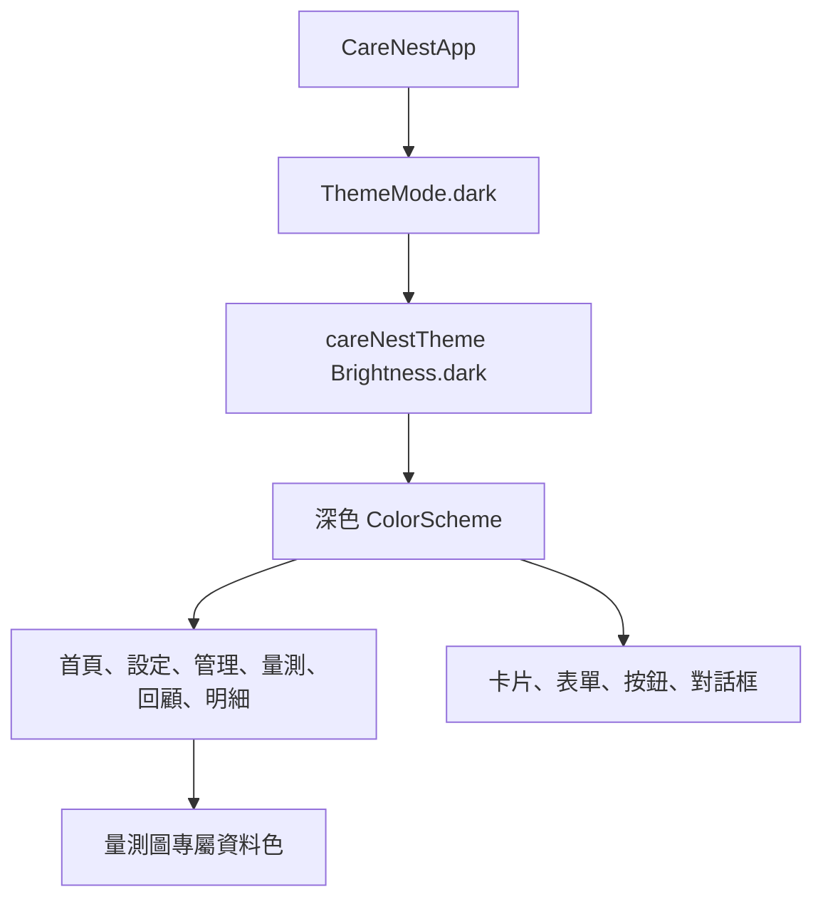

# 設計文件：CareNest 預設深色主題

Status: Complete

## 文件定位與已知契約

- 需求來源：使用者確認參考圖為 CareNest 的深色主題方向。
- 既有實作：`CareNestApp` 同時提供 `theme` 與 `darkTheme`，但目前採用 `ThemeMode.system`；主題入口為 `care_nest_theme.dart`。
- 資料契約：本機 SQLite 資料結構、Controller 狀態與頁面路由均不變。
- 不可假造：不新增帳號、雲端、醫療狀態或遠端資料。

## Bounded Context

### 包含

- 全域 Material `ColorScheme`、表面階層、文字與元件主題。
- 啟動時預設選用深色主題。
- 量測圖與全域色彩語意的對齊。
- 最小必要的 Widget 測試調整與 Android 實機驗證。

### 不包含

- 主題切換器、使用者偏好儲存與淺色主題重新設計。
- 資料庫、商業規則、頁面導覽與照護流程改寫。
- 圖示、品牌標誌或啟動畫面的重新繪製。

## 色彩 Token

| 語意 | 色號 | 使用位置 |
| --- | --- | --- |
| 頁面背景 | `#061F2D` | `Scaffold` 與最底層背景。 |
| 卡片表面 | `#0C3345` | Card、清單群組與一般內容表面。 |
| 提高表面 | `#124257` | Dialog、輸入欄與需要凸顯的表面。 |
| 主要文字 | `#E7F2F2` | 標題與主要內容。 |
| 輔助文字 | `#B8D0D7` | 說明、日期、次要資訊。 |
| 主要操作青綠 | `#23AAB5` | FilledButton、進度與主要互動焦點。 |
| 青綠容器 | `#0E4E5A` | 已選取或低強度主要操作表面。 |
| 暖珊瑚 | `#EF6B67` | 僅用於血壓第二資料線與必要錯誤提示，不代表健康風險。 |
| 淡薄荷 | `#C9E5DC` | 趨勢圖選取定位線與深色底上的高亮。 |
| 邊框藍灰 | `#5C8291` | Outline、座標軸與低強度分隔。 |

## 設計原則

- 深色不是純黑：以深墨藍背景搭配兩層藍綠表面，讓卡片與對話框有明確層次。
- 青綠只表示主要操作或目前選取；完成、錯誤與不可用狀態另以文字、圖示或元件狀態輔助。
- 保留既有 4px 間距系統、12px／16px 圓角與至少 48px 觸控目標。
- 不用色彩作為唯一訊息；被選取的被照顧者仍顯示「目前查看」，圖表仍顯示日期與原始數值。
- 所有色彩須由主題語意值取得；僅量測圖的資料線與定位線允許保留明確的圖表 Token。

## 目標結構與流程

## 受影響檔案計畫

| 檔案 | 變更 |
| --- | --- |
| `lib/shared/theme/care_nest_theme.dart` | 明確建立深色 `ColorScheme` 與 Material 元件表面／文字／輸入欄主題。 |
| `lib/app.dart` | 預設改為 `ThemeMode.dark`。 |
| `lib/features/measurements/care_measurements_page.dart` | 確認圖表 Token 與全域深色主題一致。 |
| `test/widget_test.dart` | 驗證 MaterialApp 預設深色主題與既有首屏流程。 |

## 風險與處理

- 某些頁面直接指定淺色：實作前以程式碼搜尋定位，僅在必要處以語意色取代。
- 深色卡片與文字對比不足：使用固定的主要與輔助文字色，並在實機檢查。
- 原有系統主題使用者行為改變：此為已確認的產品決策，預設固定使用深色；本次不提供切換器。
