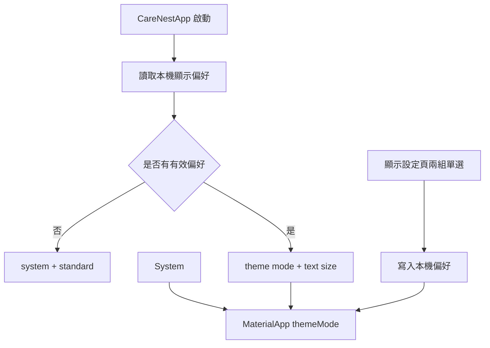

# 設計文件：CareNest 三種顯示模式

Status: Planned

## 文件定位與已知契約

- 前置文件：`2026-08-20-16-48_Feature-carenest-default-dark-theme`。該文件所完成的深色 Token 保留，但 App 的預設強制深色行為由本規格取代。
- 既有主題入口：`lib/shared/theme/care_nest_theme.dart` 的 `careNestTheme(Brightness)`。
- 既有 App 入口：`lib/app.dart` 目前固定 `ThemeMode.dark`，必須改為由使用者偏好決定。
- 資料契約：照護資料為 Drift SQLite 本機資料；本功能只增加 App 層級顯示偏好，不關聯任何被照顧者。

## Bounded Context

### 包含

- 淺色與深色 `ColorScheme` 的語意 Token。
- App 層級顯示模式列舉、讀取、保存與即時套用。
- 顯示設定頁或同等入口中的單選項目。
- 最小資料庫 migration 與測試。

### 不包含

- 依被照顧者區分設定。
- 雲端同步與跨裝置偏好同步。
- 自訂顏色、文字縮放與無關的偏好設定。

## 顯示偏好資料模型

```text
AppearanceMode
  system  跟隨系統
  light   淺色主題
  dark    深色主題

TextSizePreference
  standard  標準，100%
  large     較大，115%
  extraLarge 特大，130%
```

- 儲存值使用穩定小寫字串：`system`、`light`、`dark`。
- 缺少或無法辨識的值一律退回 `system`，避免舊版資料造成啟動失敗。
- 文字大小儲存值使用 `standard`、`large`、`extra_large`；缺少或無效值退回 `standard`。
- 偏好只存在本機 SQLite；不透過網路傳送。

## 文字縮放規格

| 選項 | `TextScaler` 比例 | 使用目的 |
| --- | ---: | --- |
| 標準 | 1.00 | 預設一般閱讀。 |
| 較大 | 1.15 | 協助長時間閱讀照護紀錄。 |
| 特大 | 1.30 | 協助視力較弱的照護者閱讀。 |

- 以 `MediaQuery.textScaler` 在 App 根節點全域套用，所有遵守 Flutter `TextTheme` 的文字同步調整。
- 文字大小與 `ThemeMode` 是兩個獨立欄位，可任意組合，例如「深色＋特大」或「跟隨系統＋較大」。
- 不以固定高度容器承載可放大的文字。卡片、對話框與按鈕需允許內容增加高度。
- 自訂繪製的量測圖不可直接套用全域文字倍率；刻度文字採用受限縮放，特大文字時降低 X 軸日期密度或增加圖表高度，確保折線與刻度不重疊。

## 色彩 Token

| 語意 | 淺色主題 | 深色主題 |
| --- | --- | --- |
| 頁面背景 | `#F6F8FA` | `#061F2D` |
| 卡片表面 | `#FFFFFF` | `#0C3345` |
| 提高表面／輸入欄 | `#EEF3F7` | `#124257` |
| 主要文字 | `#2F3A42` | `#E7F2F2` |
| 輔助文字 | `#61727C` | `#B8D0D7` |
| 主要操作 | `#4D9FE2` | `#23AAB5` |
| 主要操作容器 | `#D9EBFA` | `#0E4E5A` |
| 邊框／低強度分隔 | `#B9C7D3` | `#5C8291` |
| 第二資料線／錯誤 | `#E86B68` | `#EF6B67` |
| 圖表選取線 | `#376F9D` | `#C9E5DC` |

淺色配色採用使用者提供參考圖的冷灰白與柔和藍色方向；深色配色延續先前確認的深墨藍、青綠與暖珊瑚方向。所有資料線、選取線、完成狀態與錯誤狀態均保留文字、圖示或控制項狀態作為非色彩辨識方式。

## 目標結構與資料流程



## 受影響檔案計畫

| 檔案 | 變更 |
| --- | --- |
| `lib/core/database/app_database.dart` | 新增 App 層級主題模式與文字大小偏好資料表／欄位，並提供可回溯 migration。 |
| `lib/core/database/app_database.g.dart` | 由 `build_runner` 產生，不手動編輯。 |
| `lib/features/appearance/appearance_mode.dart` | 定義主題模式、文字大小、資料轉換與本機讀寫邏輯。 |
| `lib/features/appearance/appearance_settings_page.dart` | 顯示三種模式的單選設定頁。 |
| `lib/shared/theme/care_nest_theme.dart` | 明確建立淺色與深色 Token。 |
| `lib/app.dart` | 讀取與保存模式，將值提供給 `MaterialApp.themeMode`。 |
| `lib/features/dashboard/care_dashboard_page.dart` | 提供顯示設定入口。 |
| `test/` | 新增偏好持久化、模式選擇與 App 主題 Widget 測試。 |

## 關鍵行為

- 主題模式屬於整個 App，不因切換被照顧者而改變。
- 顯示設定分為「顯示模式」與「文字大小」兩組單選清單，每個選項有標題、簡短說明與目前選取指示。
- 儲存失敗時保留目前顯示模式，並顯示繁體中文可理解的錯誤訊息。
- 跟隨系統模式不可模擬或覆寫作業系統設定；Flutter 的 `ThemeMode.system` 是唯一決策來源。

## 風險與處理

- Migration 失敗影響既有資料：僅新增獨立單列表，不接觸既有照護資料表；加入 migration 測試。
- 啟動時主題閃爍：在 App 初始化期間先使用安全的 `system` 值，讀取後再更新，不阻塞既有照護初始化。
- 淺色參考圖對比過低：不直接複製模糊視覺效果，固定使用可讀的主要與輔助文字 Token。
- 文字放大造成橫向擠壓：頂端導覽改以可擴展的語意按鈕處理；Widget 測試與實機檢查特大文字下的換行、裁切與觸控目標。
