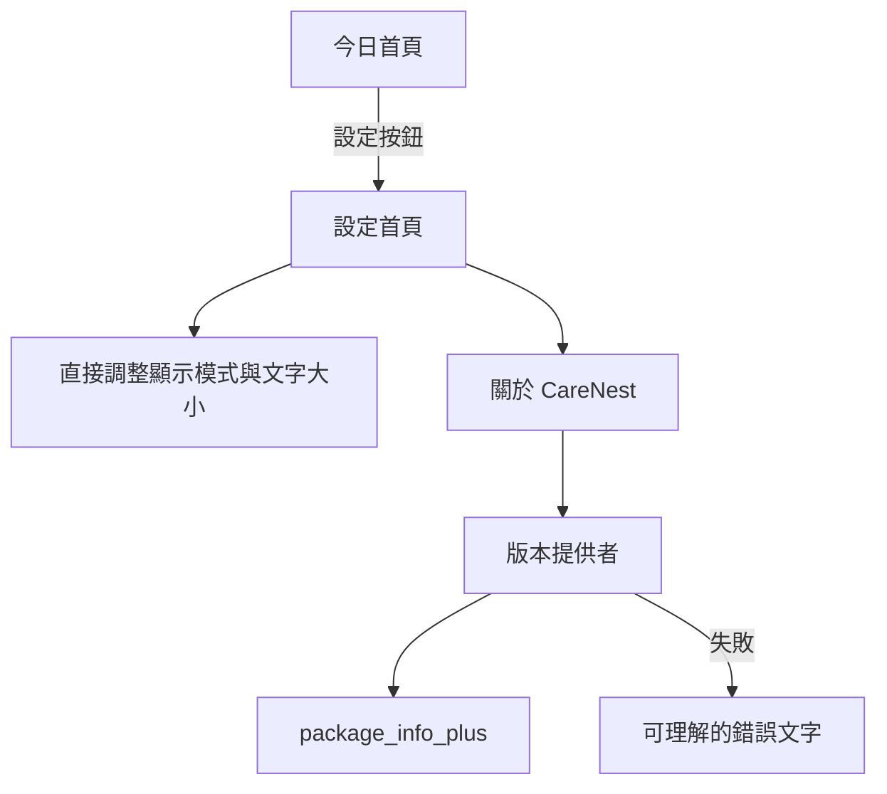

# 設計文件：CareNest 設定與關於頁

## 設計摘要

今日首頁不再直接進入獨立的顯示設定頁，而是進入新的設定首頁。設定首頁直接承接既有顯示模式與文字大小控制，另提供關於頁入口，避免顯示設定多一層導航。關於頁透過可注入的版本提供者包裝 `package_info_plus`，動態顯示安裝版本並可測試錯誤狀態；本功能不新增資料庫或網路行為。

## 文件定位

本設計對應同目錄的 `requirements.md`，擴充 `CareDashboardPage` 的設定導航並新增 settings/about 模組。既有 `AppearanceSettingsPage` 的 UI 與狀態處理遷入 `SettingsPage`，遷移完成後不再保留獨立顯示設定路由；外觀偏好 callback、Dashboard controller 與資料庫責任不變，不重寫已完成的照護功能。

## 已知契約狀態

- 需求來源: `requirements.md` 的「已定決策」與四個驗收情境
- API / CLI / Hook contract: 無遠端 API；版本來源為平台套件 metadata
- Data contract: `pubspec.yaml` 使用 `<version>+<buildNumber>`，目前為 `1.0.0+1`
- 既有實作: `CareDashboardPage` 直接 push `AppearanceSettingsPage`；外觀頁以 callback 保存偏好
- 不可假造: 不得硬編碼版本、政策網址、公司名稱、聯絡資訊、登入狀態或雲端狀態

## Bounded Context

包含：

- 今日首頁的設定入口
- 設定首頁及其顯示模式、文字大小控制
- 既有顯示設定 UI 與狀態處理的最小遷移
- 關於 CareNest 導航項目
- 關於 CareNest 頁面及版本 metadata 顯示
- 設定、關於與特大字狀態的 Widget tests

不包含：

- 顯示偏好的資料庫 schema 與保存邏輯改寫
- Google Account、Google Drive、家庭空間、訂閱及任何伺服器
- 隱私權政策、使用條款及客服網址內容
- 版本遞增、簽署、打包或商店發布流程

## 設計原則

- 使用 Material 導航與既有主題，不引入不同的視覺風格。
- 導航選項同時使用圖示、標題與說明，不只靠顏色表達用途。
- 關於頁在所有文字大小下可垂直捲動。
- 平台 metadata 讀取與 UI 分離，以便測試成功及失敗狀態。
- 版本讀取不得阻塞 App 啟動或今日首頁。

## 需求對應

| 需求 / 驗收情境 | 設計處理方式 | 驗證方式 |
|-----------------|--------------|----------|
| 從今日首頁進入設定 | AppBar 使用 `settings_outlined` 並 push `SettingsPage` | `今日首頁的設定按鈕可開啟設定首頁` |
| 既有顯示設定可直接操作 | `SettingsPage` 直接承接既有 RadioGroup 與 callback | `設定首頁可直接調整既有顯示設定` |
| 查看關於與版本 | `AboutCareNestPage` 顯示品牌及 `AppVersionInfo` | `關於頁顯示產品資訊與版本編號` |
| 版本讀取失敗 | 版本提供者錯誤轉為使用者可理解狀態 | `關於頁無法取得版本時顯示可理解提示` |
| 特大字不裁切 | `ListView`、可換行文字與適當間距 | 特大字 Widget test |

## 受影響檔案計畫

| 檔案 | 預期變更 | 原因 | 風險 |
|------|----------|------|------|
| `pubspec.yaml` | 新增 `package_info_plus` | 動態取得安裝版本與建置編號 | 套件相容性 |
| `pubspec.lock` | 鎖定解析後依賴 | 建置可重現 | 間接依賴變更 |
| `lib/features/dashboard/care_dashboard_page.dart` | 設定圖示改導向設定首頁 | 提供統一入口 | 導航回歸 |
| `lib/features/settings/settings_page.dart` | 新增設定首頁並承接顯示控制 | 集中顯示設定與關於入口 | 狀態遷移與特大字高度 |
| `lib/features/appearance/appearance_settings_page.dart` | 遷移完成後移除獨立頁面 | 避免重複 UI 與多一層導航 | 既有測試及 import 需同步更新 |
| `lib/features/settings/about_care_nest_page.dart` | 新增關於頁 | 顯示產品及版本資訊 | 非同步錯誤狀態 |
| `lib/features/settings/app_version_info.dart` | 包裝版本資料與讀取介面 | 避免 UI 直接依賴平台通道並提升可測試性 | 過度抽象；維持最小介面 |
| `test/features/settings/settings_page_test.dart` | 新增設定頁測試 | 驗證顯示控制、保存及關於入口 | 無 |
| `test/features/appearance/appearance_settings_page_test.dart` | 將既有斷言遷入設定頁測試後移除 | 舊頁不再存在 | 不得減少顯示偏好覆蓋 |
| `test/features/settings/about_care_nest_page_test.dart` | 新增關於頁測試 | 驗證版本、錯誤與特大字 | 無 |

## 目標結構或流程

```text
今日首頁
  └─ 設定
      ├─ 顯示模式
      ├─ 文字大小
      └─ 關於 CareNest
          ├─ 品牌圖與產品定位
          ├─ 本機使用與無廣告承諾
          └─ AppVersionInfoProvider
              └─ package_info_plus
```

版本顯示流程：

1. 開啟關於頁時才要求版本提供者讀取套件 metadata。
2. 讀取期間顯示固定高度的「正在取得版本資訊」。
3. 成功時組合為 `版本 <version>（<buildNumber>）`。
4. 失敗時顯示「版本資訊暫時無法取得」，頁面其餘內容維持可見。

## Mermaid Diagrams



## 介面與資料契約

### API / CLI / Hook

- Input: 使用者點擊設定、直接調整顯示選項或點擊關於入口
- Output: 本機頁面導航；關於頁顯示實際安裝版本
- Error: 版本讀取失敗時顯示「版本資訊暫時無法取得」，不得拋出至紅畫面

### Data / Config

- 新增資料: `AppVersionInfo(version, buildNumber)`；只存在記憶體，不落地
- 既有資料相容性: 無 migration；既有外觀偏好資料及 callback 不變

## 關鍵行為

- 設定入口的 tooltip 與語意標籤為「設定」。
- 設定首頁每個導航列具有最少 48 logical pixels 的觸控高度，標題與說明可換行。
- 關於頁重用 `assets/branding/carenest_launch_mark.png`，保持原始長寬比，不拉伸。
- 版本與建置編號皆來自安裝套件 metadata；畫面不讀取或解析 `pubspec.yaml`。
- 關於頁不出現登入、訂閱、雲端同步或尚未存在的政策連結。

## 前後端或跨模組設計

本功能只涉及 Flutter UI 與平台套件 metadata。沒有 Backend Server、網路請求、資料同步或資料庫寫入。

## Protected Behavior

- 顯示模式與文字大小的選取、立即更新及本機保存維持不變。
- 今日首頁的量測、回顧、明細及被照顧者管理入口維持可用。
- 淺色、深色與跟隨系統主題皆能閱讀設定及關於頁。
- Android 優先實作，但不得移除或破壞 iOS 專案。

## 替代方案

| 方案 | 優點 | 缺點 | 結論 |
|------|------|------|------|
| 將關於內容直接放在原顯示設定頁底部，沿用舊頁名稱 | 變更最少 | 頁面名稱與責任不符，未來設定項目難擴充 | 不採用 |
| 新增設定首頁並保留顯示設定子頁 | 既有顯示頁改動小 | 使用者需多一層導航 | 不採用 |
| 設定首頁直接整合顯示控制，關於資訊使用子頁 | 操作直接且設定責任集中 | 需遷移既有顯示頁及測試 | 採用 |
| 在 Widget 硬編碼 `1.0.0+1` | 不需套件 | 發布時容易顯示錯誤版本 | 不採用 |
| 使用建置參數自行注入版本 | 不需平台套件 | 每個建置命令都需正確傳值，容易遺漏 | 不採用 |

## 風險與處理方式

| 風險 | 影響 | 處理方式 | 驗證 |
|------|------|----------|------|
| `package_info_plus` 與目前工具鏈不相容 | 無法解析或建置 | 實作時先確認相容版本，再執行 Android 建置 | `flutter analyze` 與 Android build |
| 平台 metadata 讀取失敗 | 關於頁版本缺失 | 捕捉錯誤並顯示使用者文字 | 錯誤狀態 Widget test |
| 非同步完成時頁面已離開 | disposed 後更新 UI | 以 `FutureBuilder` 或 mounted-safe 流程實作 | Widget test 快速開關頁面 |
| 特大文字造成裁切 | 長輩無法閱讀 | 可捲動、允許換行並測試 130% 文字 | 特大字 Widget test |

## 實作注意事項

- 新增套件前確認現有相依無法提供版本資訊，並使用與 Flutter 3.47.0、Dart 3.13.0 相容的版本。
- `AppVersionInfoProvider` 只包裝版本讀取，不建立通用 service 層或全域狀態。
- 若實作發現 Android 或 iOS 需要平台設定，必須先更新本文件與 `tasks.md` 的 Boundary。
