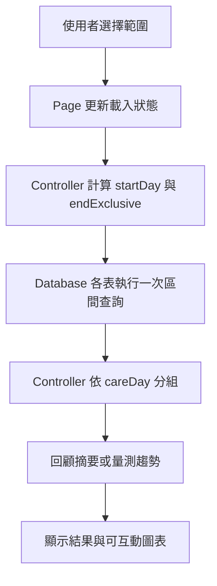

# 設計文件：CareNest 延伸回顧與量測範圍

## 設計摘要

回顧頁保留最近七天預設，新增最近三十天及單日日期選擇；量測頁新增七、三十、九十天範圍。資料庫以每張表一次的日期區間查詢取代目前逐日查詢，再依 `careDay` 在記憶體分組。長期趨勢仍使用既有折線圖與手勢，但減少未選取點及 X 軸標籤密度，保留選取定位與原始值。

## 文件定位

本設計對應同目錄 `requirements.md`，接續已完成的可互動量測趨勢圖規格。既有趨勢圖座標、顏色、血壓雙線、垂直定位線及原始數值契約均為 Protected Behavior；本文件只增加查詢範圍、回顧日期導航及長範圍視覺密度策略。

## 已知契約狀態

- 需求來源: `requirements.md` 的目標、已定決策及六個驗收情境
- API / CLI / Hook contract: 無外部 API；內部 controller 目前提供 `historyForLastSevenDays()`、`historyForDay()`、`measurementsForLastSevenDays()`
- Data contract: 所有照護與量測表均具有 `recipientId` 與 `careDay`；資料持續留在 SQLite，沒有保存期限欄位
- 既有實作: 回顧逐日呼叫 `historyForDay()`；量測逐日分別查詢體重與血壓；趨勢每天取查詢結果第一筆，而現有排序代表當日最新一筆
- 不可假造: 不得補值、平均、推算、健康判讀或建立不存在的歷史快照

## Bounded Context

包含：

- 回顧 7／30 天範圍控制與摘要
- 單日日期選擇與只讀歷史明細
- 量測 7／30／90 天範圍控制
- 日期區間資料庫查詢及依日分組
- 長範圍趨勢標籤密度、資料點密度與手勢選取
- 本機資料不自動清理的回歸測試

不包含：

- 資料庫 schema、migration 或保存期限設定
- 自訂日期區間、月曆總覽、匯出及報表
- 新增、修改、刪除紀錄的業務規則變更
- 雲端、登入、同步、家庭空間、訂閱或後端
- 醫療判讀或第三方圖表套件

## 設計原則

- 時間資料依 LATCH 的 Time 原則排序：摘要由舊到新便於閱讀趨勢，紀錄列表由新到舊便於操作。
- 時間序列維持折線圖；超過 10 個資料點時不常駐顯示所有圓點，選取後才強調實際點。
- 顯示範圍與保存期限是兩個獨立概念，UI 不提供會讓使用者誤解為清理資料的控制。
- 範圍查詢使用半開區間 `[startDay, endExclusive)`，避免時間與月底邊界錯誤。
- 單日歷史查詢完全只讀，不得因查看舊日期產生快照。

## 需求對應

| 需求 / 驗收情境 | 設計處理方式 | 驗證方式 |
|-----------------|--------------|----------|
| 7／30 天回顧 | `HistoryRange` 驅動一次區間載入與摘要重算 | 回顧 controller 與 Widget tests |
| 選擇單日 | 日期選擇器限制建立日至今天，呼叫只讀 `historyForDay` | 空白日無寫入測試 |
| 7／30／90 天量測 | `MeasurementRange` 驅動兩張量測表的區間載入 | 量測 controller 與 Widget tests |
| 90 天仍可互動 | 繪製全折線、稀疏標籤；手勢選最近實際點 | 90 天拖曳 Widget test |
| 不自動刪除 | 不新增清理 API 或 background job | 讀取 90 天以前資料測試 |
| 查詢效率 | 每張表單次區間 query，再按日分組 | Database tests 與 query call 邊界檢查 |

## 受影響檔案計畫

| 檔案 | 預期變更 | 原因 | 風險 |
|------|----------|------|------|
| `lib/core/database/app_database.dart` | 新增照護、量測區間查詢 | 避免逐日多次查詢 | 日期邊界及排序 |
| `lib/features/dashboard/care_nest_controller.dart` | 將固定七天方法一般化並依日分組 | 支援範圍選擇 | 多位對象隔離 |
| `lib/features/history/care_history_page.dart` | 新增 7／30 天控制與單日選擇 | 使用既有歷史資料 | 大字與長列表 |
| `lib/features/measurements/care_measurements_page.dart` | 新增 7／30／90 天控制及密度策略 | 支援較長趨勢 | 圖表可讀性 |
| `test/core/database/` | 新增日期區間與保存回歸測試 | 驗證資料契約 | 測試日期時區 |
| `test/features/history/` | 擴充回顧與單日空狀態測試 | 驗收回顧流程 | 無 |
| `test/features/measurements/` | 擴充範圍與 90 天互動測試 | 驗收趨勢流程 | CustomPainter 定位 |

## 目標結構或流程

```text
回顧頁
  ├─ 範圍：7 天｜30 天
  ├─ 選擇日期
  ├─ 範圍摘要
  └─ 日期列表

量測頁
  ├─ 範圍：7 天｜30 天｜90 天
  ├─ 體重趨勢
  ├─ 血壓趨勢
  └─ 範圍內有資料的日期列表
```

資料流：



## 介面與資料契約

### 內部查詢介面

- `historyForRange({required int days})`
  - Input: 僅接受 7 或 30
  - Output: 連續日曆日的 `CareDayHistory`，依日期由舊到新
  - Error: 非允許天數丟出 `ArgumentError`，UI 不傳入任意值
- `measurementsForRange({required int days})`
  - Input: 僅接受 7、30 或 90
  - Output: 連續日曆日的 `CareDayMeasurements`，供圖表由舊到新繪製；紀錄列表可反向顯示
  - Error: 非允許天數丟出 `ArgumentError`
- `historyForDay(DateTime day)`
  - 維持只讀契約；不得呼叫 `getOrCreateSnapshot`

### 日期區間

- `endExclusive = startOfCareDay(today + 1 day)`
- `startDay = endExclusive - days`
- Database where 條件固定為：
  - `recipientId == activeRecipientId`
  - `careDay >= startDay`
  - `careDay < endExclusive`
- 切換月份、跨年及夏令時間環境都以本機日曆日建構日期，不以固定秒數解析使用者日期。

### Data / Config

- 新增資料: `HistoryRange`、`MeasurementRange` enum 或等價不可變型別
- 既有資料相容性: 無 schema migration；舊資料可直接由區間查詢讀取
- 範圍偏好: 第一版只存在頁面記憶體，離開頁面後回到預設 7 天

## 圖表密度規則

| 範圍 | X 軸日期標籤 | 一般資料點 | 選取狀態 |
|------|--------------|------------|----------|
| 7 天 | 最多 7 個 | 顯示 | 垂直線、加大點、日期與原始值 |
| 30 天 | 約 5 至 6 個均勻刻度 | 超過 10 點時隱藏 | 同上 |
| 90 天 | 約 4 至 6 個均勻刻度 | 隱藏 | 同上 |

- 折線使用全部實際每日趨勢點，不因隱藏圓點而抽樣或丟棄數據。
- 某日沒有資料時不補點；折線不可跨越缺值製造連續假象，沿用既有缺資料處理方式。
- 血壓固定保留「收縮壓／舒張壓」文字及兩條線；不可只靠顏色區分。
- 選取演算法從最近日期欄位提升為最近「實際趨勢點」，避免手指落在空白日期時顯示不存在的值。

## 載入與錯誤狀態

- 切換範圍後保留頁面架構並在內容區顯示載入狀態，避免全頁閃爍。
- 載入成功且沒有資料時，顯示指定範圍名稱的空狀態。
- 載入失敗時顯示「目前無法讀取最近 N 天資料，請重新載入」，並提供重試操作。
- 快速連續切換範圍時，較早完成的 Future 不得覆蓋較新的選擇；可使用請求序號或以目前 Future 綁定畫面。

## Protected Behavior

- 預設仍為最近七天。
- 趨勢圖 X／Y 軸、動態 Y 軸、既有深淺主題色彩、血壓雙線及垂直定位線維持不變。
- 每日趨勢只取當日最新一筆量測；下方紀錄仍保留當日所有原始量測。
- 新增、修改、刪除體重與血壓後，以目前選定範圍重新載入，不強制跳回七天。
- 回顧摘要只讀既有快照，不因查看日期建立資料。
- 多位被照顧者資料持續隔離。

## 替代方案

| 方案 | 優點 | 缺點 | 結論 |
|------|------|------|------|
| 只把七天改成三十天 | 實作最少 | 失去快速七天視角，量測仍缺長期趨勢 | 不採用 |
| 提供任意起訖日期 | 彈性最高 | 手機操作複雜，可能一次載入多年資料 | 第一版不採用 |
| 回顧 7／30 天加單日選擇；量測 7／30／90 天 | 符合不同資訊密度，操作清楚 | 多一組範圍狀態 | 建議採用 |
| 沿用逐日 query | 修改 controller 最少 | 30／90 天會放大查詢次數 | 不採用 |
| 新增複合索引與 schema migration | 長期查詢更穩定 | 增加 migration 風險，現階段資料量未證明必要 | 先不採用，量測後再決定 |

## 風險與處理方式

| 風險 | 影響 | 處理方式 | 驗證 |
|------|------|----------|------|
| 日期包含端點錯誤 | 少一天或多一天 | 統一半開區間並測試跨月、跨年 | Database unit tests |
| 90 天圖表過密 | 無法閱讀或點選 | 稀疏標籤、隱藏一般點、選最近實際點 | Widget tests 與實機 |
| 逐日 query 效能 | 切換延遲 | 各表一次 range query | 90 天測試資料載入檢查 |
| 查歷史時寫入快照 | 改變照護紀錄 | 只呼叫 `getSnapshot`，檢查資料筆數不變 | Unit test |
| 目前工作樹已有設定頁變更 | 誤覆蓋尚未提交成果 | 本任務實作時只修改 Boundary 內檔案，先保留現有變更 | `git diff --stat` |

## 實作注意事項

- 正式實作前先由使用者確認 requirements 的五個待確認項目。
- 不得修改已完成可互動趨勢圖 spec；新規格以擴充方式接續。
- 若 90 天測試資料在目標手機上載入明顯超過 300ms，再更新文件評估索引 migration，不可在 task 外直接加入。
