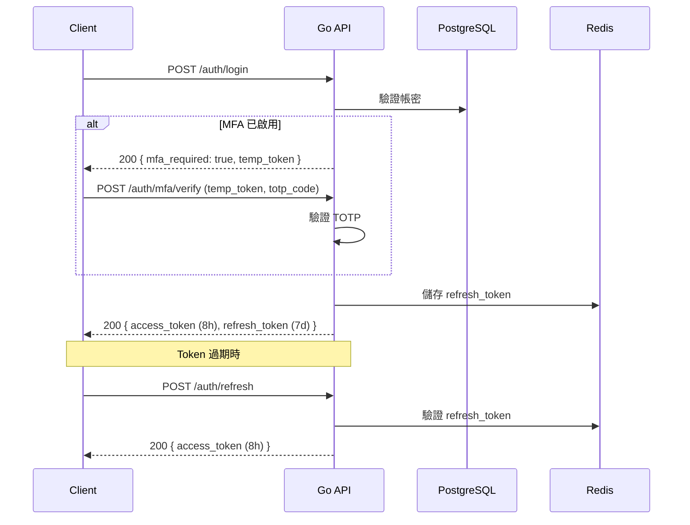
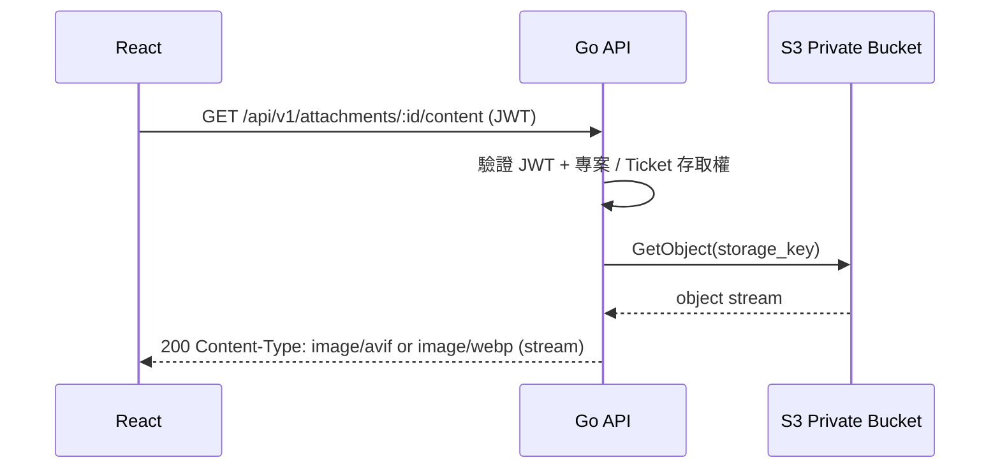

# Backend Design

## Data Models

### 時區規則

- 資料庫所有時間欄位使用 `TIMESTAMPTZ`，狀態變更、審計日誌與系統事件以 UTC 儲存。
- 系統業務時區固定為 `Asia/Taipei`；排班日期、報表區間與日期篩選需先以 `Asia/Taipei` 計算，再轉為 UTC 查詢資料庫。
- Docker runtime 需設定 `TZ=Asia/Taipei`，Go 程式啟動時需載入 `Asia/Taipei` 作為 business timezone。

### 圖片處理 Runtime

- 圖片附件正式轉檔實作統一使用 `github.com/davidbyttow/govips/v2/vips`，依賴 `libvips >= 8.14`。
- Go build 必須使用 `CGO_ENABLED=1`；build stage 提供 C compiler 與 `pkg-config`，runtime image 提供 libvips、WebP 所需的 libwebp，以及 AVIF 所需的 libheif。
- `govips` 版本需鎖定於 `go.mod`，libvips / libwebp / libheif 版本需鎖定於 container image，不使用浮動 latest。
- 程序啟動時初始化 libvips 並驗證 WebP / AVIF 輸出能力，不支援時立即啟動失敗；graceful shutdown 時釋放 libvips。
- 程序呼叫 `vips.Startup` 前必須以 `vips.LoggingSettings` 註冊 log bridge，將 `govips` / `libvips` 的 `error`、`critical`、`warning`、`message`、`info`、`debug` 對應到 `zlogger` 等級；輸出需包含 `subsystem=attachment`、`component=libvips`、`vips_domain`、`vips_level`，不得直接由 govips 預設 logger 寫入 stderr。
- 正式圖片轉檔流程不得呼叫 `ffmpeg` 或使用 `bimg` fallback。

### 識別碼策略

- 系統內部主鍵與對外 API resource id 統一使用 ULID（26 字元 Crockford Base32），由 PostgreSQL 透過 ULID extension / function 產生。
- 資料庫欄位使用 `CHAR(26)` 儲存 ULID，不使用 PostgreSQL `UUID` 型別或 `gen_random_uuid()`。
- Migration 需安裝選定的 PostgreSQL ULID extension，並建立穩定 wrapper function `generate_ulid()`；所有 ULID 主鍵欄位預設值使用 `DEFAULT generate_ulid()`。
- Application layer 不實作 ULID 產生器；新增資料時省略 id，由 DB 回填。
- 外部系統 ID（例如 Jira Issue Key、外部單號）維持原始文字格式，不轉換為 ULID。

> ### 排班架構總覽
>
> ```text
> shift_groups          — 班制定義（固定班 / 三班制 / 四班二輪 / On-call）
>   └── duty_shifts     — 具體班別（早/中/晚，附時間與週期位置）
>
> users                 — 純人員（帳號、角色、聯絡資訊，不綁定排班）
>   └── user_shift_assignments  — 班制歸屬（含時效，可追溯調動歷史）
>
> shift_periods         — 排班週期（對應 Google Sheet Tab，以班制為單位）
>   └── user_schedules  — 每人每日排班（day_type 含班別+假別，單表查完）
>   │     └── user_schedule_history  — 排班異動審計日誌
>   └── shift_period_confirmations   — 各班組長簽名確認
>
> oncall_schedules      — On-call 待命時間窗口（TIMESTAMPTZ 精度，防重疊）
>
> public_holidays       — 國定假日行事曆（手動匯入，預留 API 擴充）
>
> form_nodes            — 表單樹節點（root / category / form，form_key 路徑識別）
> groups                — 權限群組（與 shift_groups 班制群組無關）
>   ├── group_members           — 使用者 ↔ 群組
>   └── group_form_permissions  — 業務授權來源表，群組對表單節點的操作層級（read/create/update/delete）
> oidc_group_mappings  — OIDC 外部群組對內部角色 / 權限群組的登入同步規則
> casbin_rule          — Casbin policy adapter table，runtime 授權判斷來源
> form_audit_logs       — 表單樹與群組權限異動審計
> login_logs            — 登入成功與失敗安全稽核日誌
> system_audit_logs     — 系統操作審計日誌
> security_audit_logs   — 安全事件審計日誌
> schedulers            — 排程任務定義
> ```
>
> Ticket 本身不直接記錄歸屬班別；開單人由 `tickets.created_by` 記錄，每次建立 / 更新 / 處理由 `ticket_activities.actor_id` 記錄。若需依班別統計，依操作人員與人員班制 / 排班資料查詢。

Ticket 列表 API 支援 `creator_id` query parameter，使用參數化條件 `tickets.created_by = ?` 篩選開單人。此條件適用於專案 Ticket 列表與跨專案 Ticket 列表，並與既有搜尋、指派人、班別及日期條件交集套用。

Ticket metadata API 回傳 `creators`，資料來源為指定專案中 `deleted_at IS NULL` Ticket 的 `created_by`，JOIN `users` 取得 `username` 與 `full_name` 後去重並依顯示名稱排序。此清單專供開單人篩選，不使用 `project_members`，避免與指派人員候選內容混淆。
>
> **驗證規則（app layer）：**
>
> 1. 同一天同一班制，例假（`statutory_holiday`）或休假（`day_off`）不得超過一人同時排定
> 2. 每 7 天至少一個例假（一週一例，法規要求）

### users

> 人員為純粹的身份概念，不綁定排班相關欄位。班制歸屬由 `user_shift_assignments` 管理。

```sql
CREATE TABLE users (
  id CHAR(26) PRIMARY KEY DEFAULT generate_ulid(),
  employee_no   VARCHAR(20),
  username      VARCHAR(64) UNIQUE NOT NULL,
  email         VARCHAR(255) UNIQUE,              -- NULL 允許（未填寫），多個 NULL 不衝突
  full_name     VARCHAR(128) NOT NULL,
  password_hash VARCHAR(255) NOT NULL,
  phone         VARCHAR(32),
  global_role   VARCHAR(32) NOT NULL DEFAULT 'member' CHECK (global_role IN ('admin','op_admin','member')),
  is_active     BOOLEAN NOT NULL DEFAULT TRUE,
  remark        TEXT,
  created_at    TIMESTAMPTZ NOT NULL DEFAULT NOW(),
  updated_at    TIMESTAMPTZ NOT NULL DEFAULT NOW()
);
-- email UNIQUE 約束天然允許多個 NULL（PostgreSQL NULL != NULL）
CREATE INDEX ON users (is_active);
CREATE INDEX ON users (global_role);
COMMENT ON TABLE users IS '系統使用者資料，僅描述身份，不綁定排班';
COMMENT ON COLUMN users.id IS '使用者唯一識別碼(ULID)';
COMMENT ON COLUMN users.employee_no IS '員工編號';
COMMENT ON COLUMN users.username IS '登入帳號(唯一)';
COMMENT ON COLUMN users.email IS '電子郵件(唯一)';
COMMENT ON COLUMN users.full_name IS '使用者姓名';
COMMENT ON COLUMN users.password_hash IS '密碼雜湊值(不可存明文)';
COMMENT ON COLUMN users.phone IS '聯絡電話';
COMMENT ON COLUMN users.global_role IS '系統角色：admin(系統管理員)、op_admin(運維管理員)、member(一般成員)';
COMMENT ON COLUMN users.is_active IS '帳號狀態：TRUE=啟用、FALSE=停用/離職';
COMMENT ON COLUMN users.remark IS '備註說明';
COMMENT ON COLUMN users.created_at IS '建立時間';
COMMENT ON COLUMN users.updated_at IS '最後更新時間';
```

### shift_groups

> 班制定義（輪班制度層），描述「哪種排班方式」。

```sql
CREATE TABLE shift_groups (
  id CHAR(26) PRIMARY KEY DEFAULT generate_ulid(),
  code        VARCHAR(32) NOT NULL UNIQUE,
  name        VARCHAR(64) NOT NULL,
  type        VARCHAR(32) NOT NULL CHECK (type IN ('fixed','rotating','oncall')),
  cycle_days  SMALLINT,   -- 輪班週期天數；fixed/oncall 填 NULL
  description TEXT,
  is_active   BOOLEAN NOT NULL DEFAULT TRUE,
  created_at  TIMESTAMPTZ NOT NULL DEFAULT NOW(),
  updated_at  TIMESTAMPTZ NOT NULL DEFAULT NOW()
);
COMMENT ON TABLE shift_groups IS '班制定義，描述排班制度類型與輪班週期';
COMMENT ON COLUMN shift_groups.id IS '班制唯一識別碼(ULID)';
COMMENT ON COLUMN shift_groups.code IS '班制代碼，全系統唯一';
COMMENT ON COLUMN shift_groups.name IS '班制名稱，例如：正常班、三班制';
COMMENT ON COLUMN shift_groups.type IS '班制類型：fixed(固定班)、rotating(輪班)、oncall(On-call輪值)';
COMMENT ON COLUMN shift_groups.cycle_days IS '輪班週期天數，fixed/oncall 為 NULL';
COMMENT ON COLUMN shift_groups.is_active IS '是否啟用';

INSERT INTO shift_groups (code, name, type, cycle_days, description) VALUES
  ('normal',       '正常班',   'fixed',    NULL, '標準日班，09:00 ~ 18:00'),
  ('3shift',       '三班制',   'rotating', 3,    '早中晚三班輪流，週期 3 天'),
  ('4shift_2turn', '四班二輪', 'rotating', 8,    '4 組人輪 2 種班次（日/夜），週期 8 天'),
  ('oncall',       'On-call',  'oncall',   NULL, 'On-call 待命輪值');
```

### duty_shifts

> 具體班別（時間定義層），歸屬某個班制，描述「早班幾點到幾點」。

```sql
CREATE TABLE duty_shifts (
  id CHAR(26) PRIMARY KEY DEFAULT generate_ulid(),
  group_id         CHAR(26) NOT NULL REFERENCES shift_groups(id),
  code             VARCHAR(20) NOT NULL UNIQUE,
  name             VARCHAR(50) NOT NULL,
  start_time       TIME NOT NULL,
  end_time         TIME NOT NULL,
  crosses_midnight BOOLEAN NOT NULL DEFAULT FALSE,  -- 跨午夜（例如晚班 23:00 ~ 07:00）
  cycle_position   SMALLINT,   -- 在輪班週期中的順序（rotating 類型才有意義）
  description      TEXT,
  sort_order       SMALLINT NOT NULL DEFAULT 0,
  is_active        BOOLEAN NOT NULL DEFAULT TRUE,
  created_at       TIMESTAMPTZ NOT NULL DEFAULT NOW(),
  updated_at       TIMESTAMPTZ NOT NULL DEFAULT NOW()
);
COMMENT ON TABLE duty_shifts IS '具體班別主檔，歸屬班制，定義班別時間';
COMMENT ON COLUMN duty_shifts.id IS '班別唯一識別碼(ULID)';
COMMENT ON COLUMN duty_shifts.group_id IS '所屬班制編號';
COMMENT ON COLUMN duty_shifts.code IS '班別代碼，全系統唯一';
COMMENT ON COLUMN duty_shifts.name IS '班別名稱';
COMMENT ON COLUMN duty_shifts.start_time IS '班別開始時間';
COMMENT ON COLUMN duty_shifts.end_time IS '班別結束時間';
COMMENT ON COLUMN duty_shifts.crosses_midnight IS '是否跨午夜，例如 23:00 ~ 07:00 為 TRUE';
COMMENT ON COLUMN duty_shifts.cycle_position IS '輪班週期中的位置順序，rotating 類型使用';
COMMENT ON COLUMN duty_shifts.sort_order IS '顯示排序';
COMMENT ON COLUMN duty_shifts.is_active IS '是否啟用';
CREATE INDEX ON duty_shifts (group_id);
CREATE INDEX ON duty_shifts (group_id, cycle_position);

-- 正常班
INSERT INTO duty_shifts (group_id, code, name, start_time, end_time, crosses_midnight, cycle_position, sort_order)
SELECT id, 'normal', '正常班', '09:00', '18:00', FALSE, NULL, 1 FROM shift_groups WHERE code = 'normal';

-- 三班制
INSERT INTO duty_shifts (group_id, code, name, start_time, end_time, crosses_midnight, cycle_position, sort_order)
SELECT id, 'morning',   '早班', '07:00', '15:00', FALSE, 1, 1 FROM shift_groups WHERE code = '3shift';
INSERT INTO duty_shifts (group_id, code, name, start_time, end_time, crosses_midnight, cycle_position, sort_order)
SELECT id, 'afternoon', '中班', '15:00', '23:00', FALSE, 2, 2 FROM shift_groups WHERE code = '3shift';
INSERT INTO duty_shifts (group_id, code, name, start_time, end_time, crosses_midnight, cycle_position, sort_order)
SELECT id, 'night',     '晚班', '23:00', '07:00', TRUE,  3, 3 FROM shift_groups WHERE code = '3shift';

-- 四班二輪（日班/夜班各一種）
INSERT INTO duty_shifts (group_id, code, name, start_time, end_time, crosses_midnight, cycle_position, sort_order)
SELECT id, 'day_shift',   '日班', '08:00', '20:00', FALSE, 1, 1 FROM shift_groups WHERE code = '4shift_2turn';
INSERT INTO duty_shifts (group_id, code, name, start_time, end_time, crosses_midnight, cycle_position, sort_order)
SELECT id, 'night_shift', '夜班', '20:00', '08:00', TRUE,  2, 2 FROM shift_groups WHERE code = '4shift_2turn';
```

### user_shift_assignments

> 人員班制歸屬（含時效），記錄某人從何時起歸屬哪個班制，支援調動歷史追溯。

```sql
-- 需要 btree_gist extension 支援 EXCLUDE 約束
CREATE EXTENSION IF NOT EXISTS btree_gist;

CREATE TABLE user_shift_assignments (
  id CHAR(26) PRIMARY KEY DEFAULT generate_ulid(),
  user_id        CHAR(26) NOT NULL REFERENCES users(id) ON DELETE CASCADE,
  shift_group_id CHAR(26) NOT NULL REFERENCES shift_groups(id),
  effective_from DATE NOT NULL,
  effective_to   DATE,   -- NULL 表示目前仍有效
  remark         TEXT,
  assigned_by    CHAR(26) NOT NULL REFERENCES users(id),
  created_at     TIMESTAMPTZ NOT NULL DEFAULT NOW(),
  -- 同一人在同一時間段只能有一個有效歸屬，防止時間重疊
  CONSTRAINT uq_shift_assignment_no_overlap EXCLUDE USING gist (
    user_id WITH =,
    daterange(effective_from, COALESCE(effective_to, '9999-12-31'::DATE), '[)') WITH &&
  )
);
CREATE INDEX ON user_shift_assignments (user_id, effective_from, effective_to);
COMMENT ON TABLE user_shift_assignments IS '人員班制歸屬紀錄，含時效，支援調動歷史追溯';
COMMENT ON COLUMN user_shift_assignments.user_id IS '人員編號';
COMMENT ON COLUMN user_shift_assignments.shift_group_id IS '歸屬班制編號';
COMMENT ON COLUMN user_shift_assignments.effective_from IS '歸屬生效日期（含）';
COMMENT ON COLUMN user_shift_assignments.effective_to IS '歸屬結束日期（不含）；NULL 表示目前仍有效';
COMMENT ON COLUMN user_shift_assignments.assigned_by IS '設定此歸屬的操作人員';
```

查詢某人目前有效班制：

```sql
SELECT usa.shift_group_id, sg.code, sg.name, sg.type
FROM user_shift_assignments usa
JOIN shift_groups sg ON sg.id = usa.shift_group_id
WHERE usa.user_id = $1
  AND usa.effective_from <= CURRENT_DATE
  AND (usa.effective_to IS NULL OR usa.effective_to > CURRENT_DATE);
```

### user_schedules

> 每日排班記錄，支援正常排班（每人每天唯一）與多段代班。

```sql
CREATE TABLE user_schedules (
  id CHAR(26) PRIMARY KEY DEFAULT generate_ulid(),
  user_id          CHAR(26) NOT NULL REFERENCES users(id),
  shift_id         CHAR(26) NOT NULL REFERENCES duty_shifts(id),
  schedule_date    DATE NOT NULL,
  -- 代班時間覆寫（NULL 表示整班，時間以 duty_shifts 的 start_time/end_time 為準）
  override_start   TIME,
  override_end     TIME,
  crosses_midnight BOOLEAN NOT NULL DEFAULT FALSE,
  -- 來源與代班關係
  source           VARCHAR(16) NOT NULL DEFAULT 'manual'
                   CHECK (source IN ('manual','auto','adhoc')),
  is_substitute    BOOLEAN NOT NULL DEFAULT FALSE,
  original_user_id CHAR(26) REFERENCES users(id),  -- 被代替的人，is_substitute=TRUE 時必填
  substitute_note  TEXT,
  -- 軟刪除（修改排班時不刪除舊記錄，改為 is_active=FALSE）
  is_active        BOOLEAN NOT NULL DEFAULT TRUE,
  created_by       CHAR(26) NOT NULL REFERENCES users(id),
  remark           TEXT,
  created_at       TIMESTAMPTZ NOT NULL DEFAULT NOW(),
  updated_at       TIMESTAMPTZ NOT NULL DEFAULT NOW()
);

-- 正常排班：同一人同一天只能有一筆有效記錄
CREATE UNIQUE INDEX ux_user_schedules_normal
  ON user_schedules (user_id, schedule_date)
  WHERE is_substitute = FALSE AND is_active = TRUE;

-- 查詢索引
CREATE INDEX idx_user_schedules_user_date
  ON user_schedules (user_id, schedule_date)
  WHERE is_active = TRUE;
CREATE INDEX idx_user_schedules_substitute
  ON user_schedules (original_user_id, schedule_date)
  WHERE is_substitute = TRUE AND is_active = TRUE;

COMMENT ON TABLE user_schedules IS '人員每日排班記錄，支援正常排班與多段代班';
COMMENT ON COLUMN user_schedules.shift_id IS '班別編號';
COMMENT ON COLUMN user_schedules.schedule_date IS '排班日期';
COMMENT ON COLUMN user_schedules.override_start IS '代班時間覆寫起點，NULL 表示沿用班別預設 start_time';
COMMENT ON COLUMN user_schedules.override_end IS '代班時間覆寫終點，NULL 表示沿用班別預設 end_time';
COMMENT ON COLUMN user_schedules.crosses_midnight IS '代班是否跨午夜（覆寫時使用）';
COMMENT ON COLUMN user_schedules.source IS 'manual=人工排班、auto=系統自動排班、adhoc=臨時代班';
COMMENT ON COLUMN user_schedules.is_substitute IS '是否為代班記錄；TRUE 時 original_user_id 必填';
COMMENT ON COLUMN user_schedules.original_user_id IS '被代替的人員編號';
COMMENT ON COLUMN user_schedules.is_active IS '軟刪除：FALSE 表示已取消或被覆蓋，歷史仍保留';
```

> 代班時間重疊驗證在 app layer 執行，防止同一人同日多段代班時間重疊：
>
> ```go
> // 查詢同日已存在的代班記錄，確認 override_start ~ override_end 不重疊
> SELECT 1 FROM user_schedules
> WHERE user_id = $1 AND schedule_date = $2
>   AND is_substitute = TRUE AND is_active = TRUE
>   AND override_start < $4   -- 新記錄的 end
>   AND override_end   > $3   -- 新記錄的 start
> LIMIT 1;
> ```

### user_schedule_history

> 排班異動完整審計日誌，記錄「誰在何時改了什麼」。

```sql
CREATE TABLE user_schedule_history (
  id CHAR(26) PRIMARY KEY DEFAULT generate_ulid(),
  schedule_id CHAR(26) NOT NULL,           -- 對應 user_schedules.id
  user_id CHAR(26) NOT NULL,
  shift_id CHAR(26) NOT NULL,
  schedule_date   DATE NOT NULL,
  action          VARCHAR(16) NOT NULL CHECK (action IN ('INSERT','UPDATE','DELETE')),
  changed_by      CHAR(26) REFERENCES users(id),
  changed_at      TIMESTAMPTZ NOT NULL DEFAULT NOW(),
  before_snapshot JSONB,   -- UPDATE/DELETE 時記錄異動前的完整欄位值
  after_snapshot  JSONB    -- INSERT/UPDATE 時記錄異動後的完整欄位值
);
CREATE INDEX ON user_schedule_history (schedule_id, changed_at DESC);
CREATE INDEX ON user_schedule_history (user_id, schedule_date, changed_at DESC);
COMMENT ON TABLE user_schedule_history IS '排班異動審計日誌，每次 INSERT/UPDATE/DELETE 各記一筆';
COMMENT ON COLUMN user_schedule_history.schedule_id IS '對應的排班記錄 ID';
COMMENT ON COLUMN user_schedule_history.action IS '操作類型：INSERT/UPDATE/DELETE';
COMMENT ON COLUMN user_schedule_history.before_snapshot IS 'UPDATE/DELETE 前的完整欄位快照（JSONB）';
COMMENT ON COLUMN user_schedule_history.after_snapshot IS 'INSERT/UPDATE 後的完整欄位快照（JSONB）';
CREATE INDEX ON user_schedule_history (changed_by, changed_at DESC);
```

### oncall_schedules

> On-call 待命時間窗口，時間精度到分鐘，支援跨天，支援多段代班。

```sql
CREATE TABLE oncall_schedules (
  id CHAR(26) PRIMARY KEY DEFAULT generate_ulid(),
  user_id          CHAR(26) NOT NULL REFERENCES users(id),
  shift_id         CHAR(26) NOT NULL REFERENCES duty_shifts(id),  -- 對應 oncall 類型的班別
  oncall_start     TIMESTAMPTZ NOT NULL,
  oncall_end       TIMESTAMPTZ NOT NULL,
  rotation_no      SMALLINT,   -- 輪值序號（顯示用，例如「第 3 輪」）
  source           VARCHAR(16) NOT NULL DEFAULT 'manual'
                   CHECK (source IN ('manual','auto','adhoc')),
  is_substitute    BOOLEAN NOT NULL DEFAULT FALSE,
  original_user_id CHAR(26) REFERENCES users(id),
  substitute_note  TEXT,
  is_active        BOOLEAN NOT NULL DEFAULT TRUE,
  created_by       CHAR(26) NOT NULL REFERENCES users(id),
  remark           TEXT,
  created_at       TIMESTAMPTZ NOT NULL DEFAULT NOW(),
  updated_at       TIMESTAMPTZ NOT NULL DEFAULT NOW(),
  CONSTRAINT chk_oncall_range CHECK (oncall_end > oncall_start),
  -- 防止同一人的 on-call 時間窗口重疊
  CONSTRAINT oncall_no_overlap EXCLUDE USING gist (
    user_id WITH =,
    tstzrange(oncall_start, oncall_end, '[)') WITH &&
  ) WHERE (is_active = TRUE)
);
CREATE INDEX ON oncall_schedules (user_id, oncall_start, oncall_end);
CREATE INDEX ON oncall_schedules (shift_id);
CREATE INDEX ON oncall_schedules (original_user_id) WHERE is_substitute = TRUE AND is_active = TRUE;
COMMENT ON TABLE oncall_schedules IS 'On-call 待命時間窗口排班，精度到分鐘，支援跨天';
COMMENT ON COLUMN oncall_schedules.oncall_start IS 'On-call 開始時間（含時區）';
COMMENT ON COLUMN oncall_schedules.oncall_end IS 'On-call 結束時間（含時區）';
COMMENT ON COLUMN oncall_schedules.rotation_no IS '輪值序號，顯示用';
COMMENT ON COLUMN oncall_schedules.is_substitute IS '是否為代班記錄';
COMMENT ON COLUMN oncall_schedules.original_user_id IS '被代替的人員，代班時必填';
COMMENT ON COLUMN oncall_schedules.is_active IS '軟刪除';
```

### public_holidays

```sql
CREATE TABLE public_holidays (
  id CHAR(26) PRIMARY KEY DEFAULT generate_ulid(),
  holiday_date DATE NOT NULL UNIQUE,
  name         VARCHAR(64) NOT NULL,
  year         SMALLINT NOT NULL,
  source       VARCHAR(16) NOT NULL DEFAULT 'manual'
               CHECK (source IN ('manual','api')),
  created_at   TIMESTAMPTZ NOT NULL DEFAULT NOW()
);
CREATE INDEX ON public_holidays (year);
COMMENT ON TABLE public_holidays IS '國定假日行事曆，支援手動匯入或未來對接人事行政總處 API';
COMMENT ON COLUMN public_holidays.holiday_date IS '假日日期，全系統唯一';
COMMENT ON COLUMN public_holidays.name IS '假日名稱，例如：元旦、春節';
COMMENT ON COLUMN public_holidays.year IS '所屬年度，用於批次查詢';
COMMENT ON COLUMN public_holidays.source IS 'manual=手動匯入、api=人事行政總處 API（預留擴充）';
```

### user_leave_records

```sql
CREATE TABLE user_leave_records (
  id CHAR(26) PRIMARY KEY DEFAULT generate_ulid(),
  user_id      CHAR(26) NOT NULL REFERENCES users(id) ON DELETE CASCADE,
  leave_type   VARCHAR(16) NOT NULL
               CHECK (leave_type IN ('sick','personal','annual','compensatory','other')),
  leave_date   DATE NOT NULL,
  hours        NUMERIC(4,1) NOT NULL DEFAULT 8.0,  -- 請假時數（4.0=半天，8.0=全天）
  note         TEXT,
  approved_by  CHAR(26) REFERENCES users(id),
  source       VARCHAR(16) NOT NULL DEFAULT 'manual'
               CHECK (source IN ('manual','hr_system')),
  created_at   TIMESTAMPTZ NOT NULL DEFAULT NOW(),
  updated_at   TIMESTAMPTZ NOT NULL DEFAULT NOW()
);
CREATE INDEX ON user_leave_records (user_id, leave_date);
CREATE INDEX ON user_leave_records (leave_date, leave_type);
COMMENT ON TABLE user_leave_records IS '人員假別記錄，含病/事/年假/補休，支援手動登記或對接人事系統';
COMMENT ON COLUMN user_leave_records.leave_type IS 'sick=病假、personal=事假、annual=年假、compensatory=補休、other=其他';
COMMENT ON COLUMN user_leave_records.hours IS '請假時數：4.0=半天，8.0=全天';
COMMENT ON COLUMN user_leave_records.source IS 'manual=手動登記、hr_system=人事系統匯入（預留擴充）';
COMMENT ON COLUMN user_leave_records.approved_by IS '核准者；NULL 表示尚未核准或不需核准';
```

`user_schedules.day_type` 補充：整合班別與假別為單一欄位，一張表查完，無需跨表組合。假別細項（年/公/病/事/其他）目前支援手動輸入，預留 `source` 追蹤來源，日後對接人事系統時可批次更新：

```sql
ALTER TABLE user_schedules
  ADD COLUMN day_type VARCHAR(20) NOT NULL DEFAULT 'workday'
    CHECK (day_type IN (
      'workday',           -- 正常出勤
      'statutory_holiday', -- 例假（法定每 7 天一天，不可挪移）
      'day_off',           -- 休假（排定的班休）
      'public_holiday',    -- 國定假日（對應 public_holidays）
      'annual',            -- 年假
      'official',          -- 公假
      'sick',              -- 病假
      'personal',          -- 事假
      'other'              -- 其他（婚/喪等）
    )),
  ADD COLUMN leave_source VARCHAR(16) NOT NULL DEFAULT 'manual'
    CHECK (leave_source IN ('manual','hr_system'));
    -- 'manual'=手動登記；'hr_system'=人事系統匯入（預留擴充）

COMMENT ON COLUMN user_schedules.day_type IS 'workday=出勤、statutory_holiday=例假、day_off=休假、public_holiday=國定假、annual=年假、official=公假、sick=病假、personal=事假、other=婚喪等';
COMMENT ON COLUMN user_schedules.leave_source IS 'manual=手動登記、hr_system=人事系統匯入（預留擴充）';
```

> 年/公/病/事/其他假別目前以手動方式登記（`leave_source = 'manual'`）；日後對接人事系統時，批次匯入並將 `leave_source` 更新為 `'hr_system'`，不需修改表結構。

### shift_periods（排班週期）

> 對應現有 Google Sheet 的 Tab，以 4 週為一週期。每個週期結束後由各班組長簽名確認，確認後鎖定不可修改。

```sql
CREATE TABLE shift_periods (
  id CHAR(26) PRIMARY KEY DEFAULT generate_ulid(),
  name           VARCHAR(64) NOT NULL,           -- 例如：20260108-0204
  start_date     DATE NOT NULL,
  end_date       DATE NOT NULL,
  shift_group_id CHAR(26) NOT NULL REFERENCES shift_groups(id),
  status         VARCHAR(16) NOT NULL DEFAULT 'draft'
                 CHECK (status IN ('draft','confirmed','locked')),
  created_by     CHAR(26) NOT NULL REFERENCES users(id),
  created_at     TIMESTAMPTZ NOT NULL DEFAULT NOW(),
  updated_at     TIMESTAMPTZ NOT NULL DEFAULT NOW(),
  CONSTRAINT chk_period_range CHECK (end_date >= start_date)
);
CREATE INDEX ON shift_periods (shift_group_id, start_date);
CREATE INDEX ON shift_periods (status);
COMMENT ON TABLE shift_periods IS '排班週期，對應 Google Sheet Tab，以班制為單位管理（早/中/夜各一個週期）';
COMMENT ON COLUMN shift_periods.name IS '週期名稱，例如：20260108-0204';
COMMENT ON COLUMN shift_periods.status IS 'draft=草稿可修改、confirmed=已確認（組長簽名）、locked=鎖定不可修改';
```

### shift_period_confirmations（週期簽名確認）

> 每班組長各自確認自己負責的班組，對應圖片底部三欄簽名欄位。

```sql
CREATE TABLE shift_period_confirmations (
  id CHAR(26) PRIMARY KEY DEFAULT generate_ulid(),
  period_id   CHAR(26) NOT NULL REFERENCES shift_periods(id) ON DELETE CASCADE,
  confirmed_by CHAR(26) NOT NULL REFERENCES users(id),  -- 簽名的組長
  confirmed_at TIMESTAMPTZ NOT NULL DEFAULT NOW(),
  remark      TEXT,
  UNIQUE (period_id, confirmed_by)
);
CREATE INDEX ON shift_period_confirmations (period_id);
COMMENT ON TABLE shift_period_confirmations IS '排班週期簽名確認，每班組長各自確認，一個週期可有多位組長簽名';
COMMENT ON COLUMN shift_period_confirmations.confirmed_by IS '簽名確認的組長編號';
```

`user_schedules` 加入 `period_id`：

```sql
ALTER TABLE user_schedules
  ADD COLUMN period_id CHAR(26) REFERENCES shift_periods(id);
CREATE INDEX ON user_schedules (period_id) WHERE period_id IS NOT NULL;
COMMENT ON COLUMN user_schedules.period_id IS '所屬排班週期；NULL 表示非週期性排班（例如臨時代班）';
```

### 排班驗證規則（app layer）

### **規則 1：同組同天不得同時例/休**

```sql
-- 驗證：同一班制同一天，statutory_holiday 或 day_off 的人數不得 >= 組員總數
-- 實作於 app layer，新增/修改 day_type 時觸發
SELECT COUNT(*)
FROM user_schedules us
JOIN user_shift_assignments usa ON usa.user_id = us.user_id
  AND usa.effective_from <= us.schedule_date
  AND (usa.effective_to IS NULL OR usa.effective_to > us.schedule_date)
WHERE us.schedule_date = $1
  AND usa.shift_group_id = $2
  AND us.day_type IN ('statutory_holiday','day_off')
  AND us.is_active = TRUE;
-- 若 COUNT >= 組員人數 → 拒絕，回傳 409 衝突錯誤
```

### **規則 2：一週一例檢查（法規：每 7 天至少一個例假）**

```go
// app layer 在排班儲存後執行，也用於匯出時標示「✅ 全部正確」或「⚠ 缺例假」
func CheckWeeklyStatutoryHoliday(
  ctx context.Context,
  userID string,
  periodStart, periodEnd time.Date,
) ([]WeeklyCheckResult, error) {
  // 以每 7 天為一個窗口，檢查是否有 statutory_holiday
  // 回傳每週的檢查結果
}

type WeeklyCheckResult struct {
  WeekStart   time.Time
  WeekEnd     time.Time
  HasStatutory bool    // false = ⚠ 缺例假
}
```

### 排班週期統計（查詢設計）

> 對應圖片右側統計欄：出勤天數、國/例/休計數、假別明細、底部總計。

```sql
-- 單人週期統計（對應每列右側數字）
SELECT
  us.user_id,
  COUNT(*) FILTER (WHERE us.day_type = 'workday')           AS workdays,
  COUNT(*) FILTER (WHERE us.day_type = 'public_holiday')    AS public_holidays,
  COUNT(*) FILTER (WHERE us.day_type = 'statutory_holiday') AS statutory_holidays,
  COUNT(*) FILTER (WHERE us.day_type = 'day_off')           AS day_offs,
  COUNT(*) FILTER (WHERE us.day_type = 'annual')            AS annual_leaves,
  COUNT(*) FILTER (WHERE us.day_type = 'official')          AS official_leaves,
  COUNT(*) FILTER (WHERE us.day_type = 'sick')              AS sick_leaves,
  COUNT(*) FILTER (WHERE us.day_type = 'personal')          AS personal_leaves,
  COUNT(*) FILTER (WHERE us.day_type = 'other')             AS other_leaves
FROM user_schedules us
WHERE us.period_id = $1
  AND us.is_active = TRUE
GROUP BY us.user_id;

-- 週期總計（對應底部 總休假日/總例假日/總國定假）
SELECT
  COUNT(*) FILTER (WHERE day_type = 'day_off')             AS total_day_offs,
  COUNT(*) FILTER (WHERE day_type = 'statutory_holiday')   AS total_statutory,
  COUNT(*) FILTER (WHERE day_type = 'public_holiday')      AS total_public_holidays
FROM user_schedules
WHERE period_id = $1
  AND is_active = TRUE;
```

### 匯出格式規格

匯出 Excel / CSV 還原現有 Google Sheet 格式，由後端產生，格式如下：

```text
橫軸：日期（日期列 + 星期列）
縱軸：依班制分組（早班組 / 中班組 / 夜班組），每人一列
每格：早 / 中 / 夜 / 例（例假）/ 休（休假）/ 年 / 公 / 病 / 事 / 其他

右側統計欄（每人）：
  - 出勤天數
  - 國/例/休 計數（格式：國定假數/例假數/休假數）
  - 一週一例檢查（✅ 全部正確 / ⚠ 第N週缺例假）
  - 假別欄：年 / 公 / 病 / 事 / 其他（婚/喪）

底部彙總列：
  - 總休假日、總例假日、總國定假

底部簽名欄：
  - 各班組長確認簽名（對應 shift_period_confirmations）

Sheet Tab 名稱：
  - 格式：YYYYMMDD-MMDD（例如：20260108-0204）
```

API：

```text
GET /api/v1/shift-periods/:id/export?format=xlsx|csv
```

MVP 實體表名為 `user_mfa_devices`；為相容早期設計稿與報表查詢，migration 另提供 `mfa_devices` 唯讀 view。

```sql
CREATE TABLE user_mfa_devices (
  id CHAR(26) PRIMARY KEY DEFAULT generate_ulid(),
  user_id     CHAR(26) NOT NULL REFERENCES users(id) ON DELETE CASCADE,
  name        VARCHAR(128) NOT NULL,
  secret      VARCHAR(255) NOT NULL,  -- AES-256-GCM 加密儲存
  is_verified BOOLEAN NOT NULL DEFAULT FALSE,
  is_active   BOOLEAN NOT NULL DEFAULT TRUE,
  last_used_at TIMESTAMPTZ,
  created_at  TIMESTAMPTZ NOT NULL DEFAULT NOW(),
  updated_at  TIMESTAMPTZ NOT NULL DEFAULT NOW()
);
COMMENT ON TABLE user_mfa_devices IS 'MFA裝置訊息';
COMMENT ON COLUMN user_mfa_devices.id IS 'MFA裝置編號';
COMMENT ON COLUMN user_mfa_devices.user_id IS '使用者編號';
COMMENT ON COLUMN user_mfa_devices.name IS '裝置名稱(例如：手機)';
COMMENT ON COLUMN user_mfa_devices.secret IS 'MFA裝置密鑰(AES-256-GCM 加密儲存)';
COMMENT ON COLUMN user_mfa_devices.is_verified IS '是否已驗證';
COMMENT ON COLUMN user_mfa_devices.is_active IS '是否啟用';
COMMENT ON COLUMN user_mfa_devices.last_used_at IS '最後成功驗證時間';
COMMENT ON COLUMN user_mfa_devices.created_at IS '建立時間';
COMMENT ON COLUMN user_mfa_devices.updated_at IS '最後更新時間';
CREATE INDEX ON user_mfa_devices (user_id, is_active);
```

**未驗證 MFA 裝置清理規則：**

- `POST /api/v1/auth/mfa/setup` 會建立 `is_verified = FALSE`、`is_active = TRUE` 的待驗證裝置，僅供當次 QR Code / TOTP 綁定流程使用
- `GET /api/v1/auth/mfa/devices` 預設只回傳 `is_active = TRUE AND is_verified = TRUE` 的裝置；未完成驗證的待驗證裝置不得出現在「已綁定裝置」列表
- `POST /api/v1/auth/mfa/verify` 驗證成功後才將裝置標記為 `is_verified = TRUE`
- 待驗證裝置若超過 `security.mfa.pending_device_retention_minutes` 仍未完成驗證，後端需以軟刪除方式將 `is_active` 設為 `FALSE`
- 清理器需在服務啟動時執行一次，並由排程 `clean_unverified_mfa_devices` 週期執行；清理結果需寫入 scheduler log，錯誤需記錄結構化日誌
- 清理條件必須限制 `is_verified = FALSE AND is_active = TRUE AND created_at < now() - retention`，不得刪除已驗證裝置
- `security.mfa.pending_device_retention_minutes` 預設為 `30`；設定缺值、停用或無效時使用預設值 30 分鐘

### projects

```sql
CREATE TABLE projects (
  id CHAR(26) PRIMARY KEY DEFAULT generate_ulid(),
  key         VARCHAR(32) UNIQUE NOT NULL,
  name        VARCHAR(128) NOT NULL,
  description TEXT,
  visibility  VARCHAR(16) NOT NULL DEFAULT 'private' CHECK (visibility IN ('public','private')),
  status      VARCHAR(16) NOT NULL DEFAULT 'active' CHECK (status IN ('active','inactive','archived')),
  created_by  CHAR(26) NOT NULL REFERENCES users(id),
  created_at  TIMESTAMPTZ NOT NULL DEFAULT NOW(),
  updated_at  TIMESTAMPTZ NOT NULL DEFAULT NOW(),
  deleted_at  TIMESTAMPTZ,
  deleted_by  CHAR(26) REFERENCES users(id)
);
COMMENT ON TABLE projects IS '主專案資料';
COMMENT ON COLUMN projects.id IS '主專案唯一識別碼(ULID)';
COMMENT ON COLUMN projects.key IS '主專案代碼(唯一)';
COMMENT ON COLUMN projects.name IS '主專案名稱';
COMMENT ON COLUMN projects.description IS '主專案描述';
COMMENT ON COLUMN projects.visibility IS '主專案可見性：public(公開)、private(私有)';
COMMENT ON COLUMN projects.status IS '主專案狀態：active(啟用)、inactive(停用)、archived(封存)';
COMMENT ON COLUMN projects.created_by IS '建立者編號';
COMMENT ON COLUMN projects.created_at IS '建立時間';
COMMENT ON COLUMN projects.updated_at IS '最後更新時間';
COMMENT ON COLUMN projects.deleted_at IS '軟刪除時間，NULL 表示未刪除';
COMMENT ON COLUMN projects.deleted_by IS '執行軟刪除的使用者';
CREATE INDEX ON projects (status) WHERE deleted_at IS NULL;
CREATE INDEX ON projects (created_by);
```

### sub_projects

```sql
CREATE TABLE sub_projects (
  id CHAR(26) PRIMARY KEY DEFAULT generate_ulid(),
  project_id  CHAR(26) NOT NULL REFERENCES projects(id) ON DELETE CASCADE,
  key         VARCHAR(8) NOT NULL,  -- 大寫英文或數字，2~8 字元，同一專案內唯一
  name        VARCHAR(128) NOT NULL,
  description TEXT,
  is_active   BOOLEAN NOT NULL DEFAULT TRUE,
  created_at  TIMESTAMPTZ NOT NULL DEFAULT NOW(),
  updated_at  TIMESTAMPTZ NOT NULL DEFAULT NOW(),
  deleted_at  TIMESTAMPTZ,
  deleted_by  CHAR(26) REFERENCES users(id),
  UNIQUE (project_id, key)
);
COMMENT ON TABLE sub_projects IS '子專案資料';
COMMENT ON COLUMN sub_projects.id IS '子專案唯一識別碼(ULID)';
COMMENT ON COLUMN sub_projects.project_id IS '所屬專案編號';
COMMENT ON COLUMN sub_projects.key IS '子專案代碼，同一專案內唯一，大寫英文或數字，2~8字元';
COMMENT ON COLUMN sub_projects.name IS '子專案名稱';
COMMENT ON COLUMN sub_projects.description IS '子專案描述';
COMMENT ON COLUMN sub_projects.is_active IS '子專案狀態：TRUE=啟用、FALSE=停用';
COMMENT ON COLUMN sub_projects.created_at IS '建立時間';
COMMENT ON COLUMN sub_projects.updated_at IS '最後更新時間';
COMMENT ON COLUMN sub_projects.deleted_at IS '軟刪除時間，NULL 表示未刪除';
COMMENT ON COLUMN sub_projects.deleted_by IS '執行軟刪除的使用者';
CREATE INDEX ON sub_projects (project_id, is_active) WHERE deleted_at IS NULL;
```

### project_members

```sql
CREATE TABLE project_members (
  project_id CHAR(26) NOT NULL REFERENCES projects(id) ON DELETE CASCADE,
  user_id    CHAR(26) NOT NULL REFERENCES ops_user(id) ON DELETE CASCADE,
  joined_at  TIMESTAMPTZ NOT NULL DEFAULT NOW(),
  PRIMARY KEY (project_id, user_id)
);
COMMENT ON TABLE project_members IS '專案成員資料，包含專案內的運維人員與角色';
COMMENT ON COLUMN project_members.project_id IS '專案編號';
COMMENT ON COLUMN project_members.user_id IS '運維人員編號';
-- 反向查詢：某位運維人員參與了哪些專案
CREATE INDEX ON project_members (user_id);
```

### Operations User（ops_user）

```sql
CREATE TABLE ops_user (
  id CHAR(26) PRIMARY KEY DEFAULT generate_ulid(),
  user_name   VARCHAR(128) NOT NULL,
  description TEXT,
  created_at  TIMESTAMPTZ NOT NULL DEFAULT NOW(),
  updated_at  TIMESTAMPTZ NOT NULL DEFAULT NOW()
);
COMMENT ON TABLE ops_user IS '運維人員資料，用於專案內指定操作人員';
COMMENT ON COLUMN ops_user.id IS '運維人員唯一識別碼(ULID)';
COMMENT ON COLUMN ops_user.user_name IS '使用者名稱';
COMMENT ON COLUMN ops_user.description IS '運維人員描述';
COMMENT ON COLUMN ops_user.created_at IS '建立時間';
COMMENT ON COLUMN ops_user.updated_at IS '最後更新時間';
```

### tickets（月份分區）

```sql
CREATE TABLE tickets (
  id CHAR(26) NOT NULL DEFAULT generate_ulid(),  -- ULID
  description        TEXT NOT NULL,
  ticket_type_id     CHAR(26) NOT NULL REFERENCES ticket_types(id),              -- app layer 驗證 FK
  priority           VARCHAR(4) NOT NULL,                                        -- app layer 驗證 FK
  status             VARCHAR(32) NOT NULL DEFAULT 'open',
  project_id         CHAR(26) NOT NULL REFERENCES projects(id),                      -- app layer 驗證 FK
  sub_project_id     CHAR(26) NOT NULL REFERENCES sub_projects(id),                  -- app layer 驗證 FK
  services_level_id  CHAR(26) REFERENCES services_level(id),                         -- app layer 驗證 FK
  ticket_resource_id CHAR(26) NOT NULL REFERENCES ticket_resources(id),              -- app layer 驗證 FK
  external_ref       VARCHAR(255),
  assignee_id        CHAR(26) REFERENCES ops_user(id),                               -- app layer 驗證 FK
  created_by         CHAR(26) NOT NULL REFERENCES users(id),                         -- app layer 驗證 FK
  resolved_at        TIMESTAMPTZ,
  closed_at          TIMESTAMPTZ,
  resolution_summary TEXT,
  cancel_reason      TEXT,
  created_at         TIMESTAMPTZ NOT NULL DEFAULT NOW(),
  updated_at         TIMESTAMPTZ NOT NULL DEFAULT NOW(),
  deleted_at         TIMESTAMPTZ,
  deleted_by         CHAR(26) REFERENCES users(id),                                 -- app layer 驗證 FK
  PRIMARY KEY (id, created_at)
) PARTITION BY RANGE (created_at);
-- 初始分區範例（後續由排程自動建立）
CREATE TABLE tickets_2026_06 PARTITION OF tickets
  FOR VALUES FROM ('2026-06-01') TO ('2026-07-01');
CREATE INDEX ON tickets_2026_06 (project_id, status, created_at);
CREATE INDEX ON tickets_2026_06 (ticket_type_id);
CREATE INDEX ON tickets_2026_06 (assignee_id);
CREATE INDEX ON tickets_2026_06 (ticket_resource_id);
CREATE INDEX ON tickets_2026_06 (deleted_at);

COMMENT ON TABLE tickets IS '工單資料，使用月份分區以優化查詢與維護';
COMMENT ON COLUMN tickets.id IS '工單編號，ULID 格式（26 字元 Crockford Base32）';
COMMENT ON COLUMN tickets.description IS '工單描述，Markdown 格式';
COMMENT ON COLUMN tickets.ticket_type_id IS 'Ticket 事件類型，對應 ticket_types.id';
COMMENT ON COLUMN tickets.priority IS '工單優先級：P1(最高)、P2、P3、P4(最低)';
COMMENT ON COLUMN tickets.status IS '工單狀態：open(開啟)、in_progress(進行中)、resolved(已解決)、closed(已關閉)、cancelled(已取消)';
COMMENT ON COLUMN tickets.project_id IS '所屬專案編號';
COMMENT ON COLUMN tickets.sub_project_id IS '所屬子專案編號';
COMMENT ON COLUMN tickets.ticket_resource_id IS '工單資訊來源引用，對應 ticket_resources.id';
COMMENT ON COLUMN tickets.external_ref IS '外部參考，例如：Jira issue key';
COMMENT ON COLUMN tickets.assignee_id IS '指派給的使用者編號';
COMMENT ON COLUMN tickets.created_by IS '建立者編號';
COMMENT ON COLUMN tickets.resolved_at IS '解決時間';
COMMENT ON COLUMN tickets.closed_at IS '關閉時間';
COMMENT ON COLUMN tickets.resolution_summary IS '解決摘要';
COMMENT ON COLUMN tickets.cancel_reason IS '取消原因';
COMMENT ON COLUMN tickets.created_at IS '建立時間';
COMMENT ON COLUMN tickets.updated_at IS '最後更新時間';
COMMENT ON COLUMN tickets.deleted_at IS '軟刪除時間，NULL 表示未刪除';
COMMENT ON COLUMN tickets.deleted_by IS '執行軟刪除的使用者';
```

**軟刪除規則（Project / Sub Project / Ticket）：**

1. Project、Sub Project、Ticket 刪除皆採 soft delete，寫入 `deleted_at` / `deleted_by`，不進行實體刪除。
2. 刪除操作需寫入 `ticket_activities` 或審計日誌，包含操作人員、時間、刪除對象與刪除前快照。
3. 一般查詢預設排除 `deleted_at IS NOT NULL` 的資料；管理查詢可透過明確參數包含已刪除資料。

### ticket_types

```sql
CREATE TABLE ticket_types (
  id                  CHAR(26) PRIMARY KEY DEFAULT generate_ulid(),
  code                VARCHAR(32) NOT NULL UNIQUE,
  name                VARCHAR(64) NOT NULL,
  description         TEXT,
  supports_escalation BOOLEAN NOT NULL DEFAULT FALSE,
  applies_sla         BOOLEAN NOT NULL DEFAULT FALSE,
  allowed_priorities  TEXT[] NOT NULL DEFAULT ARRAY['P3','P4'],
  default_priority    VARCHAR(4) NOT NULL DEFAULT 'P4',
  assignee_required   BOOLEAN NOT NULL DEFAULT FALSE,
  is_system           BOOLEAN NOT NULL DEFAULT FALSE,
  sort_order          INT NOT NULL DEFAULT 0,
  is_active           BOOLEAN NOT NULL DEFAULT TRUE,
  created_at          TIMESTAMPTZ NOT NULL DEFAULT NOW(),
  updated_at          TIMESTAMPTZ NOT NULL DEFAULT NOW()
);
COMMENT ON TABLE ticket_types IS 'Ticket 事件類型主檔，預設包含 Daily / Issue';
COMMENT ON COLUMN ticket_types.code IS '事件類型代碼，例如 daily、issue';
COMMENT ON COLUMN ticket_types.name IS '事件類型顯示名稱，例如 Daily、Issue';
COMMENT ON COLUMN ticket_types.supports_escalation IS '是否支援 Escalated 狀態';
COMMENT ON COLUMN ticket_types.applies_sla IS '是否套用 SLA';
COMMENT ON COLUMN ticket_types.allowed_priorities IS '允許的優先級清單';
COMMENT ON COLUMN ticket_types.default_priority IS '預設優先級';
COMMENT ON COLUMN ticket_types.assignee_required IS '是否要求指派 Assignee';
COMMENT ON COLUMN ticket_types.is_system IS '是否為系統內建類型；Daily / Issue 為 TRUE，不可刪除且不可修改核心流程設定';
CREATE INDEX ON ticket_types (is_active, sort_order);

INSERT INTO ticket_types (code, name, description, supports_escalation, applies_sla, allowed_priorities, default_priority, assignee_required, is_system, sort_order) VALUES
  ('daily', 'Daily', '日常巡檢與例行作業', FALSE, FALSE, ARRAY['P3','P4'], 'P4', FALSE, TRUE, 1),
  ('issue', 'Issue', '異常事件與問題處理', TRUE, TRUE, ARRAY['P1','P2','P3','P4'], 'P3', FALSE, TRUE, 2);

-- App layer 規則：is_system = TRUE 的事件類型不可刪除，且不可修改 code、supports_escalation、
-- applies_sla、allowed_priorities、default_priority 等會破壞既有流程與報表語意的核心設定。

```

### ticket_resources

```sql
CREATE TABLE ticket_resources (
  id CHAR(26) PRIMARY KEY DEFAULT generate_ulid(),
  code          VARCHAR(64) NOT NULL,
  name          VARCHAR(128) NOT NULL,
  resource_type VARCHAR(32) NOT NULL,
  description   TEXT,
  project_id  CHAR(26) NOT NULL REFERENCES projects(id) ON DELETE CASCADE,
  sub_project_id CHAR(26),
  is_active   BOOLEAN NOT NULL DEFAULT TRUE,
  sort_order  INT NOT NULL DEFAULT 0,
  created_at  TIMESTAMPTZ NOT NULL DEFAULT NOW(),
  updated_at  TIMESTAMPTZ NOT NULL DEFAULT NOW()
);
COMMENT ON TABLE ticket_resources IS '工單資訊來源選項';
COMMENT ON COLUMN ticket_resources.id IS '資訊來源唯一識別碼(ULID)';
COMMENT ON COLUMN ticket_resources.code IS '資訊來源代碼，同一專案內唯一，例如 tg_alert、mail、zabbix_alert';
COMMENT ON COLUMN ticket_resources.name IS '資訊來源顯示名稱，例如：TG Alert、Mail、Signal 項目群';
COMMENT ON COLUMN ticket_resources.resource_type IS '資訊來源類型，例如：alert、message、business_operation';
COMMENT ON COLUMN ticket_resources.description IS '資訊來源說明文字';
COMMENT ON COLUMN ticket_resources.project_id IS '所屬專案編號';
COMMENT ON COLUMN ticket_resources.sub_project_id IS '所屬子專案編號，選填，不建立資料庫外鍵；有值時由 app layer 驗證';
COMMENT ON COLUMN ticket_resources.is_active IS '是否啟用；刪除資訊來源時改為 false';
COMMENT ON COLUMN ticket_resources.sort_order IS '排序值，數字越小越前面';
COMMENT ON COLUMN ticket_resources.created_at IS '建立時間';
COMMENT ON COLUMN ticket_resources.updated_at IS '最後更新時間';
CREATE INDEX ON ticket_resources (project_id, sub_project_id);
CREATE UNIQUE INDEX ON ticket_resources (project_id, code);
CREATE INDEX ON ticket_resources (project_id, resource_type);
CREATE INDEX ON ticket_resources (project_id, is_active, sort_order);
```

> 收斂規則：`ticket_resources` 是唯一資訊來源資料表。不得新增或依賴 `ticket_sources` 作為 Ticket 建立、列表篩選、詳情顯示或 metadata options 的資料來源。原先常用來源如 `tg_alert`、`mail`、`signal`、`signal_project_group`、`whatsapp`、`whatsapp_project_group`、`zabbix_alert`、`business_domain_change` 應作為每個 project 的 `ticket_resources` 預設資料或專案初始化資料，而不是放在獨立 `ticket_sources` 表。

### ticket_collaborators / ticket_tags / ticket_affected_services

```sql
CREATE TABLE ticket_collaborators (
  ticket_id CHAR(26) NOT NULL,
  user_id   CHAR(26) NOT NULL REFERENCES users(id) ON DELETE CASCADE,
  added_at  TIMESTAMPTZ NOT NULL DEFAULT NOW(),
  PRIMARY KEY (ticket_id, user_id)
);
COMMENT ON TABLE ticket_collaborators IS 'Ticket 協作者列表';
COMMENT ON COLUMN ticket_collaborators.ticket_id IS '工單編號';
COMMENT ON COLUMN ticket_collaborators.user_id IS '使用者編號';
COMMENT ON COLUMN ticket_collaborators.added_at IS '加入協作者的時間';
-- 反向查詢：某位使用者協作了哪些工單
CREATE INDEX ON ticket_collaborators (user_id);

CREATE TABLE ticket_tags (
  ticket_id CHAR(26) NOT NULL,
  tag       VARCHAR(64) NOT NULL,
  PRIMARY KEY (ticket_id, tag)
);
COMMENT ON TABLE ticket_tags IS 'Ticket 標籤列表';
COMMENT ON COLUMN ticket_tags.tag IS '標籤名稱，例如：database';
-- 按 tag 查詢工單
CREATE INDEX ON ticket_tags (tag);

CREATE TABLE ticket_affected_services (
  ticket_id CHAR(26) NOT NULL,
  service   VARCHAR(128) NOT NULL,
  PRIMARY KEY (ticket_id, service)
);
COMMENT ON TABLE ticket_affected_services IS 'Ticket 受影響的服務列表';
COMMENT ON COLUMN ticket_affected_services.service IS '服務名稱，例如：auth-service';
-- 按服務名稱查詢受影響的工單
CREATE INDEX ON ticket_affected_services (service);
```

### services level

```sql
CREATE TABLE services_level (
  id CHAR(26) PRIMARY KEY DEFAULT generate_ulid(),
  name        VARCHAR(128) NOT NULL,
  project_id  CHAR(26) NOT NULL REFERENCES projects(id) ON DELETE CASCADE,
  sub_project_id CHAR(26) NOT NULL REFERENCES sub_projects(id) ON DELETE CASCADE,
  created_at  TIMESTAMPTZ NOT NULL DEFAULT NOW(),
  updated_at  TIMESTAMPTZ NOT NULL DEFAULT NOW()
);
COMMENT ON TABLE services_level IS '服務層級列表';
COMMENT ON COLUMN services_level.id IS '服務層級唯一識別碼(ULID)';
COMMENT ON COLUMN services_level.name IS '服務層級名稱';
COMMENT ON COLUMN services_level.project_id IS '所屬專案編號';
COMMENT ON COLUMN services_level.sub_project_id IS '所屬子專案編號';
COMMENT ON COLUMN services_level.created_at IS '建立時間';
COMMENT ON COLUMN services_level.updated_at IS '最後更新時間';
CREATE INDEX ON services_level (project_id, sub_project_id);

```

### attachments / ticket_attachments

MVP 實體表名為 `attachments`，包含 `storage_backend`、`deleted_at`、`deleted_by` 以支援 Local / S3 與軟刪除；migration 另提供 `ticket_attachments` 唯讀 view，對齊早期設計稿命名。

```sql
CREATE TABLE attachments (
  id CHAR(26) PRIMARY KEY DEFAULT generate_ulid(),
  ticket_id CHAR(26) NOT NULL,
  filename     VARCHAR(255) NOT NULL,
  content_type VARCHAR(64) NOT NULL,   -- 實際儲存格式：image/avif | image/webp
  size_bytes   BIGINT NOT NULL,        -- 轉檔後實際儲存大小
  storage_backend VARCHAR(16) NOT NULL CHECK (storage_backend IN ('local','s3')),
  storage_key  VARCHAR(512) NOT NULL,  -- Local 相對路徑 或 S3 object key（yyyy/mm/dd/{ulid}.avif|webp）
  uploaded_by  CHAR(26) NOT NULL REFERENCES users(id),
  deleted_at   TIMESTAMPTZ,
  deleted_by   CHAR(26) REFERENCES users(id),
  created_at   TIMESTAMPTZ NOT NULL DEFAULT NOW()
);
CREATE INDEX idx_attachments_ticket_id ON attachments(ticket_id) WHERE deleted_at IS NULL;
COMMENT ON TABLE attachments IS '工單附件列表';
COMMENT ON COLUMN attachments.id IS '附件唯一識別碼(ULID)';
COMMENT ON COLUMN attachments.filename IS '使用者上傳的原始檔名，僅供顯示與稽核';
COMMENT ON COLUMN attachments.content_type IS '轉檔後實際儲存格式，僅允許 image/avif 或 image/webp';
COMMENT ON COLUMN attachments.size_bytes IS '轉檔後實際儲存大小，單位為位元組';
COMMENT ON COLUMN attachments.storage_backend IS '儲存後端：local 或 s3';
COMMENT ON COLUMN attachments.storage_key IS '儲存 key：S3 與 Local 統一為 yyyy/mm/dd/{attachment_ulid}.avif 或 .webp';
COMMENT ON COLUMN attachments.uploaded_by IS '上傳者編號';
COMMENT ON COLUMN attachments.deleted_at IS '軟刪除時間';
COMMENT ON COLUMN attachments.deleted_by IS '執行軟刪除的使用者';
COMMENT ON COLUMN attachments.created_at IS '上傳時間';
```

### ticket_activities（月份分區，保留期限由設定控制）

```sql
CREATE TABLE ticket_activities (
  id             CHAR(26) NOT NULL DEFAULT generate_ulid(),
  ticket_id      CHAR(26) NOT NULL,
  actor_id       CHAR(26) NOT NULL REFERENCES users(id),
  action_type    VARCHAR(64) NOT NULL
                 CHECK (action_type IN (
                   'created',
                   'field_updated',
                   'status_changed',
                   'assigned',
                   'collaborator_added',
                   'collaborator_removed',
                   'comment_added',
                   'attachment_added',
                   'attachment_deleted',
                   'deleted',
                   'sla_breached'
                 )),
  field_changes  JSONB,
  content        TEXT,
  is_internal    BOOLEAN NOT NULL DEFAULT FALSE,
  mentioned_user_ids JSONB,
  created_at     TIMESTAMPTZ NOT NULL DEFAULT NOW(),
  PRIMARY KEY (id, created_at)
) PARTITION BY RANGE (created_at);

CREATE TABLE ticket_activities_2026_06 PARTITION OF ticket_activities
  FOR VALUES FROM ('2026-06-01') TO ('2026-07-01');
CREATE INDEX ON ticket_activities_2026_06 (ticket_id, created_at);
CREATE INDEX ON ticket_activities_2026_06 (actor_id, created_at);
-- 排程依 system.log.ticket_activity_keep_days 決定是否清理；0 表示長期保留
COMMENT ON TABLE ticket_activities IS 'Ticket 操作與處理明細，使用月份分區以優化查詢與維護，保留期限由 system.log.ticket_activity_keep_days 控制';
COMMENT ON COLUMN ticket_activities.id IS '活動紀錄唯一識別碼(ULID)';
COMMENT ON COLUMN ticket_activities.ticket_id IS '工單編號';
COMMENT ON COLUMN ticket_activities.actor_id IS '操作人員編號';
COMMENT ON COLUMN ticket_activities.action_type IS '操作類型：created、field_updated、status_changed、assigned、collaborator_added、collaborator_removed、comment_added、attachment_added、attachment_deleted、deleted、sla_breached';
COMMENT ON COLUMN ticket_activities.field_changes IS '欄位異動內容，JSON格式，包含 before / after';
COMMENT ON COLUMN ticket_activities.content IS '留言、處理說明或操作補充內容';
COMMENT ON COLUMN ticket_activities.is_internal IS '是否為內部備註，action_type=comment_added 時使用';
COMMENT ON COLUMN ticket_activities.mentioned_user_ids IS '被 @mention 的使用者 ULID 陣列，JSON格式';
COMMENT ON COLUMN ticket_activities.created_at IS '操作時間';
```

`ticket_activities.field_changes` 規格：

```json
{
  "status": {
    "before": "Open",
    "after": "InProgress"
  },
  "priority": {
    "before": "P3",
    "after": "P2"
  },
  "assignee_id": {
    "before": null,
    "after": "01HYX7Y9Z4Q9V7A3QF9M6B2C8D",
    "before_label": null,
    "after_label": "john"
  }
}
```

- `field_changes` 為 JSON object，key 使用資料欄位名稱。
- 每個欄位異動至少包含 `before` / `after`。
- FK 或 enum 欄位可額外寫入 `before_label` / `after_label`，作為 activity timeline 顯示快照。
- 一次 API 更新多個欄位時寫入同一筆 activity，`field_changes` 包含所有異動欄位。
- 純系統欄位（例如 `updated_at`）不需記錄，避免 activity timeline 被系統時間欄位污染。

### sla_configs

```sql
CREATE TABLE sla_configs (
  id CHAR(26) PRIMARY KEY DEFAULT generate_ulid(),
  project_id       CHAR(26) NOT NULL REFERENCES projects(id) ON DELETE CASCADE,
  priority         VARCHAR(4) NOT NULL CHECK (priority IN ('P1','P2','P3','P4')),
  response_minutes INT NOT NULL,
  resolve_minutes  INT NOT NULL,
  UNIQUE (project_id, priority)
);
COMMENT ON TABLE sla_configs IS '專案 SLA 設定，每個專案可針對不同優先級設定回應與解決時間';
COMMENT ON COLUMN sla_configs.id IS 'SLA設定唯一識別碼(ULID)';
COMMENT ON COLUMN sla_configs.project_id IS '所屬專案編號';
COMMENT ON COLUMN sla_configs.priority IS '工單優先級：P1(最高)、P2、P3、P4(最低)';
COMMENT ON COLUMN sla_configs.response_minutes IS '回應時間，單位為分鐘';
COMMENT ON COLUMN sla_configs.resolve_minutes IS '解決時間，單位為分鐘';
```

### report_templates

```sql
CREATE TABLE report_templates (
  id CHAR(26) PRIMARY KEY DEFAULT generate_ulid(),
  project_id  CHAR(26) NOT NULL REFERENCES projects(id) ON DELETE CASCADE,
  name        VARCHAR(128) NOT NULL,
  description TEXT,
  config      JSONB NOT NULL,  -- ReportTemplateConfig JSON
  created_by  CHAR(26) NOT NULL REFERENCES users(id),
  created_at  TIMESTAMPTZ NOT NULL DEFAULT NOW(),
  updated_at  TIMESTAMPTZ NOT NULL DEFAULT NOW()
);
COMMENT ON TABLE report_templates IS '報表範本資料';
COMMENT ON COLUMN report_templates.id IS '報表範本唯一識別碼(ULID)';
COMMENT ON COLUMN report_templates.project_id IS '所屬專案編號';
COMMENT ON COLUMN report_templates.name IS '報表範本名稱';
COMMENT ON COLUMN report_templates.description IS '報表範本描述';
COMMENT ON COLUMN report_templates.config IS 'ReportTemplateConfig JSON：report_mode(A|B|C|D)、維度、指標、圖表與統計口徑';
COMMENT ON COLUMN report_templates.created_by IS '建立者編號';
COMMENT ON COLUMN report_templates.created_at IS '建立時間';
COMMENT ON COLUMN report_templates.updated_at IS '最後更新時間';
CREATE INDEX ON report_templates (project_id);
CREATE INDEX ON report_templates (created_by);
```

### jira_issues（年份分區）

```sql
CREATE TABLE jira_issues (
  id CHAR(26) PRIMARY KEY DEFAULT generate_ulid(),
  issue_key              VARCHAR(64) NOT NULL,
  created_date           DATE NOT NULL,           -- 分區鍵
  project_id CHAR(26) NOT NULL,
  summary                TEXT,
  issue_id               VARCHAR(64),
  issue_type             VARCHAR(64),
  status                 VARCHAR(64),
  project_key            VARCHAR(32),
  project_name           VARCHAR(255),
  project_type           VARCHAR(64),
  project_lead           VARCHAR(255),
  project_desc           TEXT,
  project_url            VARCHAR(512),
  priority               VARCHAR(64),
  resolution             VARCHAR(64),
  assignee               VARCHAR(255),
  reporter               VARCHAR(255),
  creator                VARCHAR(255),
  updated_at             TIMESTAMPTZ,
  last_viewed_at         TIMESTAMPTZ,
  resolved_at            TIMESTAMPTZ,
  due_date               DATE,
  votes                  INT,
  labels                 TEXT[],
  description            TEXT,
  environment            TEXT,
  watchers               TEXT,
  original_estimate      INT,
  remaining_estimate     INT,
  time_spent             INT,
  work_ratio             INT,
  agg_original_estimate  INT,
  agg_remaining_estimate INT,
  agg_time_spent         INT,
  security_level         VARCHAR(64),
  cf_epic_status         VARCHAR(64),
  cf_epic_color          VARCHAR(32),
  cf_story_points        NUMERIC(6,1),
  cf_epic_name           VARCHAR(255),
  cf_epic_link           VARCHAR(64),
  cf_level               VARCHAR(64),
  imported_at            TIMESTAMPTZ NOT NULL DEFAULT NOW(),
  PRIMARY KEY (id,issue_key, created_date)
) PARTITION BY RANGE (created_date);

CREATE TABLE jira_issues_2026 PARTITION OF jira_issues
  FOR VALUES FROM ('2026-01-01') TO ('2027-01-01');
CREATE INDEX ON jira_issues_2026 (project_id, created_date);
CREATE INDEX ON jira_issues_2026 (assignee);
CREATE INDEX ON jira_issues_2026 (project_key);
-- 去重：INSERT ... ON CONFLICT (issue_key, created_date) DO NOTHING
COMMENT ON TABLE jira_issues IS 'Jira Issue 資料表,產生業務方所需月報表使用，使用年份分區以優化查詢與維護';
COMMENT ON COLUMN jira_issues.issue_key IS 'Jira Issue Key，例如：PROJ-123';
COMMENT ON COLUMN jira_issues.created_date IS 'Issue 建立日期，用於分區';
COMMENT ON COLUMN jira_issues.project_id IS '對應的專案編號';
COMMENT ON COLUMN jira_issues.summary IS 'Issue 摘要';
COMMENT ON COLUMN jira_issues.issue_id IS 'Jira 原始 Issue ID';
COMMENT ON COLUMN jira_issues.issue_type IS 'Issue 類型，例如：Bug、Task';
COMMENT ON COLUMN jira_issues.status IS 'Issue 狀態，例如：To Do、In Progress、Done';
COMMENT ON COLUMN jira_issues.project_key IS 'Jira 專案 Key，例如：PROJ';
COMMENT ON COLUMN jira_issues.project_name IS 'Jira 專案名稱';
COMMENT ON COLUMN jira_issues.project_type IS 'Jira 專案類型，例如：Software、Service Management';
COMMENT ON COLUMN jira_issues.project_lead IS 'Jira 專案負責人';
COMMENT ON COLUMN jira_issues.project_desc IS 'Jira 專案描述';
COMMENT ON COLUMN jira_issues.project_url IS 'Jira 專案 URL';
COMMENT ON COLUMN jira_issues.priority IS 'Issue 優先級，例如：High、Medium、Low';
COMMENT ON COLUMN jira_issues.resolution IS 'Issue 解決方案，例如：Fixed、Won not Fix';
COMMENT ON COLUMN jira_issues.assignee IS 'Issue 指派對象';
COMMENT ON COLUMN jira_issues.reporter IS 'Issue 報告者';
COMMENT ON COLUMN jira_issues.creator IS 'Issue 建立者';
COMMENT ON COLUMN jira_issues.updated_at IS 'Issue 最後更新時間';
COMMENT ON COLUMN jira_issues.last_viewed_at IS 'Issue 最後查看時間';
COMMENT ON COLUMN jira_issues.resolved_at IS 'Issue 解決時間';
COMMENT ON COLUMN jira_issues.due_date IS 'Issue 到期日';
COMMENT ON COLUMN jira_issues.votes IS 'Issue 投票數';
COMMENT ON COLUMN jira_issues.labels IS 'Issue 標籤列表';
COMMENT ON COLUMN jira_issues.description IS 'Issue 描述';
COMMENT ON COLUMN jira_issues.environment IS 'Issue 環境資訊';
COMMENT ON COLUMN jira_issues.watchers IS 'Issue 觀察者列表';
COMMENT ON COLUMN jira_issues.original_estimate IS '原始預估時間，單位為分鐘';
COMMENT ON COLUMN jira_issues.remaining_estimate IS '剩餘預估時間，單位為分鐘';
COMMENT ON COLUMN jira_issues.time_spent IS '已花費時間，單位為分鐘';
COMMENT ON COLUMN jira_issues.work_ratio IS '工作比率，計算方式為 (original_estimate - remaining_estimate) / original_estimate * 100';
COMMENT ON COLUMN jira_issues.agg_original_estimate IS '包含子任務的原始預估時間總和，單位為分鐘';
COMMENT ON COLUMN jira_issues.agg_remaining_estimate IS '包含子任務的剩餘預估時間總和，單位為分鐘';
COMMENT ON COLUMN jira_issues.agg_time_spent IS '包含子任務的已花費時間總和，單位為分鐘';
COMMENT ON COLUMN jira_issues.security_level IS 'Issue 安全等級';
COMMENT ON COLUMN jira_issues.cf_epic_status IS 'Epic 狀態，例如：To Do、In Progress、Done';
COMMENT ON COLUMN jira_issues.cf_epic_color IS 'Epic 顏色，例如：紅色、藍色';
COMMENT ON COLUMN jira_issues.cf_story_points IS '故事點數';
COMMENT ON COLUMN jira_issues.cf_epic_name IS 'Epic 名稱';
COMMENT ON COLUMN jira_issues.cf_epic_link IS 'Epic 連結，例如：PROJ-1';
COMMENT ON COLUMN jira_issues.cf_level IS '自訂欄位：事件等級，例如：Level 1、Level 2';
COMMENT ON COLUMN jira_issues.imported_at IS '資料匯入時間';
```

### roles

```sql
CREATE TABLE roles (
  id CHAR(26) PRIMARY KEY DEFAULT generate_ulid(),
  name        VARCHAR(64) UNIQUE NOT NULL,
  code        VARCHAR(32) UNIQUE NOT NULL,
  description TEXT,
  is_active   BOOLEAN NOT NULL DEFAULT TRUE,
  is_builtin  BOOLEAN NOT NULL DEFAULT FALSE,
  created_at  TIMESTAMPTZ NOT NULL DEFAULT NOW(),
  updated_at  TIMESTAMPTZ NOT NULL DEFAULT NOW()
);
COMMENT ON TABLE roles IS '系統角色定義表，包含內建與自訂角色';
COMMENT ON COLUMN roles.id IS '角色唯一識別碼(ULID)';
COMMENT ON COLUMN roles.name IS '角色名稱，例如：系統管理員';
COMMENT ON COLUMN roles.code IS '角色代碼，例如：admin';
COMMENT ON COLUMN roles.description IS '角色描述';
COMMENT ON COLUMN roles.is_active IS '角色是否啟用';
COMMENT ON COLUMN roles.is_builtin IS '角色是否為內建角色';
COMMENT ON COLUMN roles.created_at IS '建立時間';
COMMENT ON COLUMN roles.updated_at IS '最後更新時間';

INSERT INTO roles (name, code, description, is_builtin) VALUES
  ('系統管理員', 'admin',    '系統管理員，擁有所有權限',       TRUE),
  ('管理員',     'manager',  '系統管理員，擁有大部分管理權限', FALSE),
  ('操作員',     'operator', '系統操作員，可執行常規操作',     FALSE),
  ('只讀用戶',   'viewer',   '只讀用戶，僅有查看權限',         TRUE);
```

### oidc_group_mappings

> OIDC 外部群組對應只在登入 / callback 同步流程使用，不取代 `users.global_role`、`roles`、`groups`、`group_members` 與 `group_form_permissions`。系統其他授權流程仍讀內部模型。

```sql
CREATE TABLE oidc_group_mappings (
  id CHAR(26) PRIMARY KEY DEFAULT generate_ulid(),
  provider       VARCHAR(64) NOT NULL DEFAULT 'default',
  external_group VARCHAR(128) NOT NULL,
  target_type    VARCHAR(32) NOT NULL CHECK (target_type IN ('global_role','permission_group')),
  target_code    VARCHAR(64) NOT NULL,
  priority       SMALLINT NOT NULL DEFAULT 100,
  is_active      BOOLEAN NOT NULL DEFAULT TRUE,
  created_at     TIMESTAMPTZ NOT NULL DEFAULT NOW(),
  updated_at     TIMESTAMPTZ NOT NULL DEFAULT NOW(),
  UNIQUE (provider, external_group, target_type, target_code)
);
CREATE INDEX ON oidc_group_mappings (provider, external_group) WHERE is_active = TRUE;
COMMENT ON TABLE oidc_group_mappings IS 'OIDC 外部群組對內部 global_role 或權限群組的對應規則';
COMMENT ON COLUMN oidc_group_mappings.external_group IS 'IdP 回傳的群組名稱，例如 ops_admin';
COMMENT ON COLUMN oidc_group_mappings.target_type IS '對應目標：global_role 或 permission_group';
COMMENT ON COLUMN oidc_group_mappings.target_code IS 'global_role 值或 groups.code';

INSERT INTO oidc_group_mappings (external_group, target_type, target_code, priority) VALUES
  ('ops_admin',    'global_role', 'admin',    10),
  ('ops_op_admin', 'global_role', 'op_admin', 20),
  ('ops_member',   'global_role', 'member',   30),
  ('ops_op_member','global_role', 'member',   30)
ON CONFLICT (provider, external_group, target_type, target_code) DO NOTHING;
```

**登入同步規則：**

1. OIDC callback 驗證 token 後讀取外部群組 claim，claim key 由設定指定，預設 `groups`。
2. 依 `provider + external_group` 查詢啟用中的 mapping。
3. `target_type = global_role` 時，只允許寫入 `admin`、`op_admin`、`member`；多筆命中時取最高權限序 `admin > op_admin > member`。
4. `target_type = permission_group` 時，必須確認 `groups.code = target_code` 存在且啟用，才可同步 `group_members`；缺少群組時記錄警告，不得自動建立未審核權限群組。
5. 未命中任何 mapping 的 OIDC 新使用者預設 `global_role = member`，且不加入權限群組。
6. `roles.code` 不參與 OIDC mapping，不得要求把外部群組名稱改寫到 `roles`。

### form_nodes

> 對應需求 2：表單樹狀結構。`form_key` 為父節點下的路徑區段；`full_path` 為完整路徑（例如 `ticket/create`），全系統唯一。

```sql
CREATE TABLE form_nodes (
  id CHAR(26) PRIMARY KEY DEFAULT generate_ulid(),
  parent_id   CHAR(26) REFERENCES form_nodes(id) ON DELETE RESTRICT,
  node_type   VARCHAR(16) NOT NULL CHECK (node_type IN ('root','category','form')),
  form_key    VARCHAR(64) NOT NULL,   -- 父節點下的區段 key，例如 create
  full_path   VARCHAR(256) NOT NULL,  -- 完整路徑，例如 ticket/create
  name        VARCHAR(128) NOT NULL,
  description TEXT,
  sort_order  INT NOT NULL DEFAULT 0,
  is_active   BOOLEAN NOT NULL DEFAULT TRUE,
  created_by  CHAR(26) NOT NULL REFERENCES users(id),
  created_at  TIMESTAMPTZ NOT NULL DEFAULT NOW(),
  updated_at  TIMESTAMPTZ NOT NULL DEFAULT NOW(),
  UNIQUE (parent_id, form_key),
  UNIQUE (full_path)
);
CREATE INDEX ON form_nodes (parent_id, sort_order);
CREATE INDEX ON form_nodes (node_type) WHERE is_active = TRUE;
COMMENT ON TABLE form_nodes IS '表單樹節點，以 form_key/full_path 識別';
COMMENT ON COLUMN form_nodes.parent_id IS '父節點編號；root 節點為 NULL';
COMMENT ON COLUMN form_nodes.node_type IS '節點類型：root(根)、category(中繼)、form(葉節點)';
COMMENT ON COLUMN form_nodes.form_key IS '父節點下路徑區段，同一 parent 下唯一';
COMMENT ON COLUMN form_nodes.full_path IS '完整路徑式識別碼，全系統唯一';
COMMENT ON COLUMN form_nodes.name IS '節點顯示名稱';
COMMENT ON COLUMN form_nodes.sort_order IS '同層排序';

-- 預設種子：Ticket 開單表單
INSERT INTO form_nodes (parent_id, node_type, form_key, full_path, name, sort_order, created_by)
SELECT NULL, 'root', 'ticket', 'ticket', 'Ticket', 1, u.id
FROM users u WHERE u.global_role = 'admin' LIMIT 1;

INSERT INTO form_nodes (parent_id, node_type, form_key, full_path, name, sort_order, created_by)
SELECT fn.id, 'form', 'create', 'ticket/create', '建立 Ticket', 1, fn.created_by
FROM form_nodes fn WHERE fn.full_path = 'ticket';
```

**預設選單樹 seed（系統管理）：**

> 此 seed 仍寫入 `form_nodes`，但前端顯示文字稱為「選單樹」。路徑需與前端側邊欄管理入口對齊，供選單可見性與後端授權檢查共用。

```sql
WITH admin_user AS (
  SELECT id FROM users WHERE username = 'admin' LIMIT 1
),
system_root AS (
  INSERT INTO form_nodes (parent_id, node_type, form_key, full_path, name, description, sort_order, created_by)
  SELECT NULL, 'root', 'system', 'system', '系統管理', 'Admin 管理功能根節點', 90, id
  FROM admin_user
  ON CONFLICT (full_path) DO UPDATE SET
    name = EXCLUDED.name,
    description = EXCLUDED.description,
    sort_order = EXCLUDED.sort_order,
    is_active = TRUE,
    updated_at = NOW()
  RETURNING id, created_by
),
system_root_existing AS (
  SELECT id, created_by FROM system_root
  UNION ALL
  SELECT id, created_by FROM form_nodes WHERE full_path = 'system'
  LIMIT 1
)
INSERT INTO form_nodes (parent_id, node_type, form_key, full_path, name, description, sort_order, created_by)
SELECT root.id, node_type, form_key, full_path, name, description, sort_order, root.created_by
FROM system_root_existing root
CROSS JOIN (VALUES
  ('form', 'users',      'system/users',      '用戶管理', 'Admin 用戶管理入口', 10),
  ('form', 'roles',      'system/roles',      '角色管理', 'Admin 角色管理入口', 20),
  ('form', 'menus',      'system/menus',      '選單管理', 'Admin 選單管理入口', 30),
  ('form', 'projects',   'system/projects',   '專案管理', 'Admin 專案管理入口', 40),
  ('form', 'logs',       'system/logs',       '日誌查詢', 'Admin 日誌查詢入口', 50),
  ('form', 'schedulers', 'system/schedulers', '排程管理', 'Admin 排程管理入口', 60),
  ('form', 'settings',   'system/settings',   '全域設定', 'Admin 全域設定入口', 70)
) AS nodes(node_type, form_key, full_path, name, description, sort_order)
ON CONFLICT (full_path) DO UPDATE SET
  parent_id = EXCLUDED.parent_id,
  node_type = EXCLUDED.node_type,
  form_key = EXCLUDED.form_key,
  name = EXCLUDED.name,
  description = EXCLUDED.description,
  sort_order = EXCLUDED.sort_order,
  is_active = TRUE,
  updated_at = NOW();
```

**刪除規則（app layer）：**

1. 存在子節點 → 409，拒絕刪除
2. 業務資料仍引用該 `full_path`（例如已有 Ticket 使用 `ticket/create`）→ 409，拒絕刪除

### groups

> 權限群組，用於批次賦予表單操作層級。與 `shift_groups`（班制）無關，也不等同於 `roles` 或 `users.global_role`。`roles` 僅描述系統角色資料；表單 / 選單權限來源固定為 `groups`、`group_members`、`group_form_permissions`。

```sql
CREATE TABLE groups (
  id CHAR(26) PRIMARY KEY DEFAULT generate_ulid(),
  code        VARCHAR(64) UNIQUE NOT NULL,
  name        VARCHAR(128) NOT NULL,
  description TEXT,
  is_active   BOOLEAN NOT NULL DEFAULT TRUE,
  created_by  CHAR(26) NOT NULL REFERENCES users(id),
  created_at  TIMESTAMPTZ NOT NULL DEFAULT NOW(),
  updated_at  TIMESTAMPTZ NOT NULL DEFAULT NOW()
);
COMMENT ON TABLE groups IS '表單權限群組';
COMMENT ON COLUMN groups.code IS '群組代碼，全系統唯一';
COMMENT ON COLUMN groups.name IS '群組名稱';

INSERT INTO groups (code, name, description, created_by)
SELECT 'engineers', '值班工程師', 'Ticket 讀寫與建立', u.id
FROM users u WHERE u.global_role = 'admin' LIMIT 1;
```

**預設 OIDC / 選單權限群組 seed：**

```sql
WITH admin_user AS (
  SELECT id FROM users WHERE username = 'admin' LIMIT 1
)
INSERT INTO groups (code, name, description, created_by)
SELECT code, name, description, admin_user.id
FROM admin_user
CROSS JOIN (VALUES
  ('ops_admin',    '系統管理權限群組', 'OIDC ops_admin 對應群組，可管理系統管理選單樹'),
  ('ops_op_admin', '運維管理權限群組', 'OIDC ops_op_admin 對應群組，預設僅可讀取系統管理中的日誌查詢')
) AS seed(code, name, description)
ON CONFLICT (code) DO UPDATE SET
  name = EXCLUDED.name,
  description = EXCLUDED.description,
  is_active = TRUE,
  updated_at = NOW();
```

### group_members

```sql
CREATE TABLE group_members (
  group_id    CHAR(26) NOT NULL REFERENCES groups(id) ON DELETE CASCADE,
  user_id     CHAR(26) NOT NULL REFERENCES users(id) ON DELETE CASCADE,
  created_at  TIMESTAMPTZ NOT NULL DEFAULT NOW(),
  PRIMARY KEY (group_id, user_id)
);
CREATE INDEX ON group_members (user_id);
COMMENT ON TABLE group_members IS '使用者與權限群組的多對多關聯';
```

### group_form_permissions

> 業務授權來源表，記錄群組對表單節點的操作層級。`inherit_children=TRUE` 時權限套用至所有子節點；子節點另設且 `override_parent=TRUE` 時，該子樹以子節點設定為準。application layer 需依此表計算有效權限並同步為 Casbin policy；API runtime 不直接查此表判斷授權。

```sql
CREATE TABLE group_form_permissions (
  id CHAR(26) PRIMARY KEY DEFAULT generate_ulid(),
  group_id         CHAR(26) NOT NULL REFERENCES groups(id) ON DELETE CASCADE,
  form_node_id     CHAR(26) NOT NULL REFERENCES form_nodes(id) ON DELETE CASCADE,
  can_read         BOOLEAN NOT NULL DEFAULT FALSE,
  can_create       BOOLEAN NOT NULL DEFAULT FALSE,
  can_update       BOOLEAN NOT NULL DEFAULT FALSE,
  can_delete       BOOLEAN NOT NULL DEFAULT FALSE,
  inherit_children BOOLEAN NOT NULL DEFAULT TRUE,
  override_parent  BOOLEAN NOT NULL DEFAULT FALSE,
  created_at       TIMESTAMPTZ NOT NULL DEFAULT NOW(),
  updated_at       TIMESTAMPTZ NOT NULL DEFAULT NOW(),
  UNIQUE (group_id, form_node_id),
  CHECK (can_read OR can_create OR can_update OR can_delete)
);
CREATE INDEX ON group_form_permissions (form_node_id);
COMMENT ON TABLE group_form_permissions IS '群組對表單節點的操作層級，作為同步 Casbin policy 的業務授權來源表';
COMMENT ON COLUMN group_form_permissions.can_read IS '讀取權限';
COMMENT ON COLUMN group_form_permissions.can_create IS '新增權限';
COMMENT ON COLUMN group_form_permissions.can_update IS '修改權限';
COMMENT ON COLUMN group_form_permissions.can_delete IS '刪除權限';
COMMENT ON COLUMN group_form_permissions.inherit_children IS '是否套用至所有子節點';
COMMENT ON COLUMN group_form_permissions.override_parent IS '是否覆寫父節點繼承的權限';

-- 預設：值班工程師群組可讀寫 ticket/create
INSERT INTO group_form_permissions (group_id, form_node_id, can_read, can_create, can_update, can_delete)
SELECT g.id, fn.id, TRUE, TRUE, TRUE, FALSE
FROM groups g, form_nodes fn
WHERE g.code = 'engineers' AND fn.full_path = 'ticket/create';
```

**預設選單權限 seed：**

> 業務來源必須先寫入 `group_form_permissions`。`casbin_rule` 是後端 runtime policy table，可由 Go service 同步；若以 migration seed 初始 policy，也必須與來源表保持一致，不提供前端直接管理介面。

```sql
-- ops_admin：system 與所有 system/* 節點具備 read/create/update/delete。
INSERT INTO group_form_permissions (
  group_id,
  form_node_id,
  can_read,
  can_create,
  can_update,
  can_delete,
  inherit_children,
  override_parent
)
SELECT g.id, fn.id, TRUE, TRUE, TRUE, TRUE, FALSE, FALSE
FROM groups g
JOIN form_nodes fn ON fn.full_path = 'system' OR fn.full_path LIKE 'system/%'
WHERE g.code = 'ops_admin'
ON CONFLICT (group_id, form_node_id) DO UPDATE SET
  can_read = EXCLUDED.can_read,
  can_create = EXCLUDED.can_create,
  can_update = EXCLUDED.can_update,
  can_delete = EXCLUDED.can_delete,
  inherit_children = EXCLUDED.inherit_children,
  override_parent = EXCLUDED.override_parent,
  updated_at = NOW();

-- ops_op_admin：只能讀取系統管理中的日誌查詢。
INSERT INTO group_form_permissions (
  group_id,
  form_node_id,
  can_read,
  can_create,
  can_update,
  can_delete,
  inherit_children,
  override_parent
)
SELECT g.id, fn.id, TRUE, FALSE, FALSE, FALSE, FALSE, TRUE
FROM groups g
JOIN form_nodes fn ON fn.full_path = 'system/logs'
WHERE g.code = 'ops_op_admin'
ON CONFLICT (group_id, form_node_id) DO UPDATE SET
  can_read = EXCLUDED.can_read,
  can_create = EXCLUDED.can_create,
  can_update = EXCLUDED.can_update,
  can_delete = EXCLUDED.can_delete,
  inherit_children = EXCLUDED.inherit_children,
  override_parent = EXCLUDED.override_parent,
  updated_at = NOW();
```

**與角色管理的邊界：**

- 後端不得提供未落地資料模型的「角色直接綁選單」假 API，例如 `/api/v1/admin/roles/:id/menus`
- 前端若從角色管理頁進入選單權限設定，仍需呼叫 `/api/v1/admin/groups` 與 `/api/v1/admin/groups/:id/permissions`
- 前端不得直接讀寫 `casbin_rule`，也不需要建立 Casbin policy 管理頁；Casbin policy 只能由後端依 `group_form_permissions` 同步
- 若未來要支援角色預設權限群組，需新增明確資料表與 migration，例如 `role_permission_groups`，不得以角色名稱硬編碼群組關係
- `global_role = admin` 是最高權限例外；其他角色皆需依群組成員與 Casbin policy 判斷表單 / 選單操作層級

### form_audit_logs

```sql
CREATE TABLE form_audit_logs (
  id CHAR(26) PRIMARY KEY DEFAULT generate_ulid(),
  entity_type     VARCHAR(32) NOT NULL CHECK (entity_type IN ('form_node','group','group_member','group_form_permission','casbin_policy')),
  entity_id CHAR(26) NOT NULL,
  action          VARCHAR(16) NOT NULL CHECK (action IN ('create','update','delete')),
  operator_id     CHAR(26) NOT NULL REFERENCES users(id),
  before_snapshot JSONB,
  after_snapshot  JSONB,
  created_at      TIMESTAMPTZ NOT NULL DEFAULT NOW()
);
CREATE INDEX ON form_audit_logs (entity_type, entity_id);
CREATE INDEX ON form_audit_logs (operator_id, created_at DESC);
COMMENT ON TABLE form_audit_logs IS '表單樹與群組權限異動審計日誌';
```

### casbin_rule

> Casbin policy adapter table。因專案 DDL 採手動 SQL，不依賴 adapter AutoMigrate，需在初始化 SQL 明確建立此表。

```sql
CREATE TABLE casbin_rule (
  id BIGINT GENERATED ALWAYS AS IDENTITY PRIMARY KEY,
  ptype VARCHAR(100) NOT NULL,
  v0 VARCHAR(100) NOT NULL DEFAULT '',
  v1 VARCHAR(100) NOT NULL DEFAULT '',
  v2 VARCHAR(100) NOT NULL DEFAULT '',
  v3 VARCHAR(100) NOT NULL DEFAULT '',
  v4 VARCHAR(100) NOT NULL DEFAULT '',
  v5 VARCHAR(100) NOT NULL DEFAULT '',
  created_at TIMESTAMPTZ NOT NULL DEFAULT NOW(),
  updated_at TIMESTAMPTZ NOT NULL DEFAULT NOW(),
  UNIQUE (ptype, v0, v1, v2, v3, v4, v5)
);
CREATE INDEX ON casbin_rule (ptype);
CREATE INDEX ON casbin_rule (v0);
CREATE INDEX ON casbin_rule (v1);
COMMENT ON TABLE casbin_rule IS 'Casbin policy adapter table，runtime 授權判斷來源';
COMMENT ON COLUMN casbin_rule.ptype IS 'Casbin policy type，例如 p 或 g';
COMMENT ON COLUMN casbin_rule.v0 IS 'Casbin policy 第一欄，通常為 subject 或 user';
COMMENT ON COLUMN casbin_rule.v1 IS 'Casbin policy 第二欄，通常為 object 或 role';
COMMENT ON COLUMN casbin_rule.v2 IS 'Casbin policy 第三欄，通常為 action';
```

### Casbin 授權策略

> Casbin 是 API runtime 的授權判斷核心。`group_form_permissions` 保留為後台管理與審計可讀的業務授權來源表；權限異動後由 application layer 將有效權限同步到 Casbin policy。

**模型概念：**

```ini
[request_definition]
r = sub, obj, act

[policy_definition]
p = sub, obj, act

[role_definition]
g = _, _

[policy_effect]
e = some(where (p.eft == allow))

[matchers]
m = g(r.sub, p.sub) && r.obj == p.obj && r.act == p.act
```

**同步規則：**

1. 群組代碼寫入 Casbin role，例如 `group::engineers`
2. 使用者加入群組時寫入 `g, userID, group::engineers`
3. 群組對表單的有效操作層級寫入 `p, group::engineers, ticket/create, create`
4. 表單樹繼承與 `override_parent` 由 application layer 在同步 policy 前計算
5. 表單樹、群組、群組成員、群組權限異動需在同一 use case 內更新來源表、同步 Casbin policy、寫入 `form_audit_logs`；若 Casbin policy 與來源表同在 PostgreSQL，需使用同一 transaction

### api_keys 不實作

<!-- ```sql
CREATE TABLE api_keys (
  id CHAR(26) PRIMARY KEY DEFAULT generate_ulid(),
  project_id   CHAR(26) NOT NULL REFERENCES projects(id) ON DELETE CASCADE,
  name         VARCHAR(128) NOT NULL,
  key_hash     VARCHAR(255) NOT NULL UNIQUE,
  created_by   CHAR(26) NOT NULL REFERENCES users(id),
  last_used_at TIMESTAMPTZ,
  expires_at   TIMESTAMPTZ,
  is_active    BOOLEAN NOT NULL DEFAULT TRUE,
  created_at   TIMESTAMPTZ NOT NULL DEFAULT NOW()
);
COMMENT ON TABLE api_keys IS 'API 金鑰資料表，用於專案級別的 API 存取控制';
COMMENT ON COLUMN api_keys.id IS 'API 金鑰唯一識別碼(ULID)';
COMMENT ON COLUMN api_keys.project_id IS '所屬專案編號';
COMMENT ON COLUMN api_keys.name IS 'API 金鑰名稱';
COMMENT ON COLUMN api_keys.key_hash IS 'API 金鑰的雜湊值，使用 SHA-256 加密儲存';
COMMENT ON COLUMN api_keys.created_by IS '建立者編號';
COMMENT ON COLUMN api_keys.last_used_at IS '最後使用時間';
COMMENT ON COLUMN api_keys.expires_at IS '過期時間';
COMMENT ON COLUMN api_keys.is_active IS '金鑰狀態：TRUE=啟用、FALSE=停用';
COMMENT ON COLUMN api_keys.created_at IS '建立時間';

``` -->

### login_logs

```sql
CREATE TABLE login_logs (
  id CHAR(26) PRIMARY KEY DEFAULT generate_ulid(),
  username VARCHAR(128) NOT NULL,
  user_id CHAR(26) REFERENCES users(id) ON DELETE SET NULL,
  ip_address VARCHAR(64) NOT NULL DEFAULT '',
  user_agent TEXT NOT NULL DEFAULT '',
  result VARCHAR(16) NOT NULL CHECK (result IN ('success', 'failed')),
  reason TEXT NOT NULL DEFAULT '',
  created_at TIMESTAMPTZ NOT NULL DEFAULT NOW()
);
CREATE INDEX ON login_logs (created_at DESC);
CREATE INDEX ON login_logs (username, created_at DESC);
CREATE INDEX ON login_logs (result, created_at DESC);
COMMENT ON TABLE login_logs IS '登入成功與失敗安全稽核日誌';
COMMENT ON COLUMN login_logs.username IS '使用者輸入的登入帳號或 email';
COMMENT ON COLUMN login_logs.user_id IS '登入成功時對應的使用者 ID，失敗時可為空';
COMMENT ON COLUMN login_logs.result IS '登入結果：success、failed';
COMMENT ON COLUMN login_logs.reason IS '登入失敗或系統記錄原因';
```

### system_audit_logs

```sql
CREATE TABLE system_audit_logs (
  id CHAR(26) PRIMARY KEY DEFAULT generate_ulid(),
  actor_id CHAR(26) REFERENCES users(id) ON DELETE SET NULL,
  username VARCHAR(128) NOT NULL DEFAULT '',
  module VARCHAR(64) NOT NULL,
  action VARCHAR(64) NOT NULL,
  target_type VARCHAR(64) NOT NULL DEFAULT '',
  target_id VARCHAR(128) NOT NULL DEFAULT '',
  method VARCHAR(12) NOT NULL DEFAULT '',
  path TEXT NOT NULL DEFAULT '',
  ip_address VARCHAR(64) NOT NULL DEFAULT '',
  status_code INT CHECK (status_code IS NULL OR (status_code >= 100 AND status_code <= 599)),
  result VARCHAR(16) NOT NULL DEFAULT 'success' CHECK (result IN ('success', 'failed')),
  duration_ms INT CHECK (duration_ms IS NULL OR duration_ms >= 0),
  detail JSONB NOT NULL DEFAULT '{}'::jsonb,
  created_at TIMESTAMPTZ NOT NULL DEFAULT NOW()
);
CREATE INDEX ON system_audit_logs (created_at DESC);
CREATE INDEX ON system_audit_logs (actor_id, created_at DESC);
CREATE INDEX ON system_audit_logs (username, created_at DESC);
CREATE INDEX ON system_audit_logs (module, created_at DESC);
CREATE INDEX ON system_audit_logs (method, created_at DESC);
CREATE INDEX ON system_audit_logs (status_code, created_at DESC);
COMMENT ON TABLE system_audit_logs IS '系統操作審計日誌';
COMMENT ON COLUMN system_audit_logs.actor_id IS '執行操作的使用者 ID';
COMMENT ON COLUMN system_audit_logs.username IS '執行操作的使用者帳號，供列表查詢與匯出使用';
COMMENT ON COLUMN system_audit_logs.module IS '操作所屬模組';
COMMENT ON COLUMN system_audit_logs.action IS '操作類型';
COMMENT ON COLUMN system_audit_logs.method IS 'HTTP method，非 HTTP 來源可為空字串';
COMMENT ON COLUMN system_audit_logs.path IS 'API path，非 HTTP 來源可為空字串';
COMMENT ON COLUMN system_audit_logs.status_code IS 'HTTP response status code，非 HTTP 來源可為 NULL';
COMMENT ON COLUMN system_audit_logs.result IS '操作結果：success 或 failed';
COMMENT ON COLUMN system_audit_logs.duration_ms IS 'HTTP request 或操作耗時，單位毫秒';
COMMENT ON COLUMN system_audit_logs.detail IS '操作細節摘要，禁止寫入敏感值';
```

### security_audit_logs

```sql
CREATE TABLE security_audit_logs (
  id CHAR(26) PRIMARY KEY DEFAULT generate_ulid(),
  actor_id CHAR(26) REFERENCES users(id) ON DELETE SET NULL,
  event_type VARCHAR(64) NOT NULL,
  result VARCHAR(16) NOT NULL CHECK (result IN ('success', 'failed')),
  ip_address VARCHAR(64) NOT NULL DEFAULT '',
  user_agent TEXT NOT NULL DEFAULT '',
  detail JSONB NOT NULL DEFAULT '{}'::jsonb,
  created_at TIMESTAMPTZ NOT NULL DEFAULT NOW()
);
CREATE INDEX ON security_audit_logs (created_at DESC);
CREATE INDEX ON security_audit_logs (actor_id, created_at DESC);
CREATE INDEX ON security_audit_logs (event_type, created_at DESC);
COMMENT ON TABLE security_audit_logs IS '安全事件審計日誌';
COMMENT ON COLUMN security_audit_logs.actor_id IS '事件關聯使用者 ID，系統事件可為空';
COMMENT ON COLUMN security_audit_logs.event_type IS '安全事件類型，例如 mfa_enabled、password_changed';
COMMENT ON COLUMN security_audit_logs.result IS '事件結果：success、failed';
COMMENT ON COLUMN security_audit_logs.detail IS '事件細節摘要，禁止寫入敏感值';
```

### system_settings

```sql
CREATE TABLE system_settings (
  key          VARCHAR(128) PRIMARY KEY,
  value        TEXT NOT NULL DEFAULT '',
  category     VARCHAR(32) NOT NULL DEFAULT 'general'
               CHECK (category IN ('general','system','mail','security','storage','ui')),
  value_type   VARCHAR(16) NOT NULL DEFAULT 'string'
               CHECK (value_type IN ('string','number','boolean','json')),
  description  TEXT,
  sort_order   INT NOT NULL DEFAULT 0,
  is_active    BOOLEAN NOT NULL DEFAULT TRUE,
  is_secret    BOOLEAN NOT NULL DEFAULT FALSE,
  updated_by   CHAR(26) REFERENCES users(id),
  updated_at   TIMESTAMPTZ NOT NULL DEFAULT NOW()
);
CREATE INDEX ON system_settings (category);
COMMENT ON TABLE system_settings IS '系統設定表，用於儲存可由管理員調整的設定項目';
COMMENT ON COLUMN system_settings.key IS '設定項目鍵值，格式為 category.name，例如：general.site_name';
COMMENT ON COLUMN system_settings.value IS '設定項目值，根據 value_type 解析';
COMMENT ON COLUMN system_settings.category IS '設定類別，例如：general、system、mail、security、storage、ui';
COMMENT ON COLUMN system_settings.value_type IS '設定值類型：string、number、boolean、json';
COMMENT ON COLUMN system_settings.description IS '設定項目描述';
COMMENT ON COLUMN system_settings.sort_order IS '同一類別內的顯示順序';
COMMENT ON COLUMN system_settings.is_active IS '設定項目是否啟用';
COMMENT ON COLUMN system_settings.is_secret IS '是否為敏感設定，TRUE 的項目將在 API 回應中隱藏值';
COMMENT ON COLUMN system_settings.updated_by IS '最後更新者編號';
COMMENT ON COLUMN system_settings.updated_at IS '最後更新時間';

INSERT INTO system_settings (key, value, category, value_type, description, sort_order) VALUES
  ('general.site_name',              'OnCall Ticket System', 'general',  'string',  '網站名稱',           1),
  ('general.site_logo',              '',                     'general',  'string',  '網站 Logo URL',       2),
  ('security.mfa.force_enable',      'false',                'security', 'boolean', '是否強制所有用戶啟用 MFA', 1),
  ('security.mfa.allowed_types',     '["totp"]',             'security', 'json',    '允許的 MFA 驗證類型', 2),
  ('security.mfa.pending_device_retention_minutes', '30',    'security', 'number',  '未驗證 MFA 裝置保留分鐘數', 3),
  ('security.login.password_length', '4',                    'security', 'number',  '登入密碼最小長度',    4),
  ('security.session.timeout',       '28800',                'security', 'number',  '會話超時時間（秒）',  5),
  ('storage.image.output_format',    'webp',                 'storage',  'string',  '附件圖片實際儲存格式：avif 或 webp', 1),
  ('storage.image.temp_retention_minutes', '60',             'storage',  'number',  '圖片轉檔暫存檔最長保留分鐘數', 2),
  ('system.log.ticket_activity_keep_days', '0',              'system',   'number',  'Ticket Activity Log 保留天數，0 表示長期保留', 1),
  ('system.log.security_audit_keep_days',  '180',            'system',   'number',  '安全稽核日誌保留天數', 2),
  ('system.log.system_audit_keep_days',    '180',            'system',   'number',  '系統稽核日誌保留天數', 3),
  ('system.log.login_keep_days',           '180',            'system',   'number',  '登入日誌保留天數',     4),
  ('system.log.scheduler_keep_days',       '180',            'system',   'number',  '排程日誌保留天數',     5),
  ('ui.sidebar.collapsed',           'false',                'ui',       'boolean', '側邊欄預設是否收合',  1),
  -- 排班設定
  ('schedule.rotating_labor_law',    '4week',                'system',   'string',  '三班制適用的變形工時制：4week（四週變形）、8week（八週變形）', 10),
  ('schedule.max_daily_hours',       '10',                   'system',   'number',  '變形工時制單日最長工時（小時），預設 10 小時', 11),
  ('schedule.public_holiday_source', 'manual',               'system',   'string',  '國定假日來源：manual（手動匯入）、api（人事行政總處 API，預留擴充）', 12),
  -- 敏感設定（is_secret = TRUE）
  ('jwt.secret',                     '',  'security', 'string', 'JWT 簽名金鑰',          10, TRUE),
  ('jwt.access_ttl',                 '8h','security', 'string', 'Access Token 有效期',   11),
  ('jwt.refresh_ttl',                '168h','security','string','Refresh Token 有效期',  12);
```

設定讀取優先級：**system_settings 表 > ENV > config.yaml**。Admin API 更新後透過 Redis Pub/Sub 熱重載，不需重啟。

敏感設定不得依賴「前端可解密」的混淆或加密 response 保護。`is_secret = TRUE` 的設定在任何前端 API 中不得明文回傳；Admin API 僅可回傳遮罩值或是否已設定，更新時只接受新值寫入，不提供讀取舊明文的能力。JWT secret、OIDC client secret、S3 secret、DB / Redis 密碼等高敏感設定優先放在環境變數、Kubernetes Secret、Vault 或雲端 Secret Manager；若必須存 DB，需使用 envelope encryption，且加密 key 不得存放於同一資料庫。

`storage.image.output_format` 僅允許 `avif` 或 `webp`，預設為 `webp`。此設定同時套用 Local 與 S3 儲存後端；設定異動只影響異動後新上傳的附件，既有附件維持原儲存格式並依其 `content_type` 正常讀取。

`storage.image.temp_retention_minutes` 預設為 `60`，供啟動清理與排程清理判斷異常殘留暫存工作目錄。正常請求不等待保留時間，無論轉檔成功、失敗或請求取消皆需立即清理。

### schedulers

```sql
CREATE TABLE schedulers (
  id CHAR(26) PRIMARY KEY DEFAULT generate_ulid(),
  name VARCHAR(64) NOT NULL,
  task_key VARCHAR(64) UNIQUE NOT NULL,
  category VARCHAR(32) NOT NULL DEFAULT 'system',
  cron_expr VARCHAR(64) NOT NULL,
  description TEXT NOT NULL DEFAULT '',
  is_enabled BOOLEAN NOT NULL DEFAULT TRUE,
  last_triggered_at TIMESTAMPTZ,
  created_at TIMESTAMPTZ NOT NULL DEFAULT NOW(),
  updated_at TIMESTAMPTZ NOT NULL DEFAULT NOW()
);
CREATE INDEX ON schedulers (is_enabled, category);
COMMENT ON TABLE schedulers IS '排程任務定義表';
COMMENT ON COLUMN schedulers.name IS '排程任務名稱';
COMMENT ON COLUMN schedulers.task_key IS '排程任務鍵值，供程式註冊與日誌關聯';
COMMENT ON COLUMN schedulers.category IS '排程分類，例如 system、storage';
COMMENT ON COLUMN schedulers.cron_expr IS 'Cron 表達式';
COMMENT ON COLUMN schedulers.is_enabled IS '是否啟用';
COMMENT ON COLUMN schedulers.last_triggered_at IS '最後觸發時間';
```

### scheduler_logs

```sql
CREATE TABLE scheduler_logs (
  id CHAR(26) PRIMARY KEY DEFAULT generate_ulid(),
  name        VARCHAR(64) NOT NULL,
  task_key    VARCHAR(64),
  started_at  TIMESTAMPTZ NOT NULL,
  finished_at TIMESTAMPTZ,
  status      VARCHAR(16) NOT NULL CHECK (status IN ('running','success','failed')),
  duration_ms INT,
  detail      TEXT,
  created_at  TIMESTAMPTZ NOT NULL DEFAULT NOW()
);
CREATE INDEX ON scheduler_logs (name, started_at DESC);
COMMENT ON TABLE scheduler_logs IS '排程任務執行紀錄表';
COMMENT ON COLUMN scheduler_logs.id IS '排程紀錄唯一識別碼(ULID)';
COMMENT ON COLUMN scheduler_logs.name IS '排程任務名稱';
COMMENT ON COLUMN scheduler_logs.task_key IS '排程任務鍵值，對應 schedulers.task_key';
COMMENT ON COLUMN scheduler_logs.started_at IS '排程開始時間';
COMMENT ON COLUMN scheduler_logs.finished_at IS '排程結束時間';
COMMENT ON COLUMN scheduler_logs.status IS '排程執行狀態：running(執行中)、success(成功)、failed(失敗)';
COMMENT ON COLUMN scheduler_logs.duration_ms IS '排程執行持續時間，單位為毫秒';
COMMENT ON COLUMN scheduler_logs.detail IS '排程執行細節，例如錯誤訊息';
COMMENT ON COLUMN scheduler_logs.created_at IS '紀錄建立時間';
```

---

### 統一回應格式

```go
type APIResponse[T any] struct {
  Code    int    `json:"code"`
  Message string `json:"message"`
  Data    T      `json:"data,omitempty"`
  TraceID string `json:"trace_id,omitempty"`
}
```

### 認證

- `POST   /api/v1/auth/login` — 帳密登入
- `POST   /api/v1/auth/refresh` — 刷新 Token
- `POST   /api/v1/auth/logout` — 登出
- `GET    /api/v1/auth/password-policy` — 取得目前登入使用者可用的密碼政策，需登入，僅回傳最小必要欄位
- `GET    /api/v1/auth/session-policy` — 取得目前登入使用者可用的會話政策，需登入，僅回傳閒置逾時秒數
- `PUT    /api/v1/auth/password` — 使用者修改自己的密碼，需驗證目前密碼
- `GET    /api/v1/auth/oidc/login` — 導向 OIDC Provider
- `GET    /api/v1/auth/oidc/callback` — OIDC 回調
- `POST   /api/v1/auth/mfa/setup` — 初始化 MFA
- `POST   /api/v1/auth/mfa/verify` — 驗證 TOTP
- `GET    /api/v1/auth/mfa/devices` — 列出 MFA 裝置
- `DELETE /api/v1/auth/mfa/devices/:id` — 移除 MFA 裝置

Admin 使用者列表與單筆查詢 response 需包含 `has_mfa`。後端以 `EXISTS` 判斷 `user_mfa_devices.user_id = users.id AND is_active = TRUE AND is_verified = TRUE`，只回傳布林值，不回傳裝置數量、裝置名稱、secret 或任何敏感 MFA 細節。

#### 修改自己的密碼

`GET /api/v1/auth/password-policy` 需使用 Bearer Access Token，只回傳前端驗證與提示所需的最小資訊，不回傳 `system_settings` key、category、description、`is_secret`、設定來源或任何其他安全設定。response 不做前端可解密的混淆或加密，因為前端可解密即不具備有效保護；安全性由權限控制、最小揭露與後端最終驗證承擔。

Response：

```json
{
  "min_length": 4
}
```

#### 閒置時間自動登出政策

`GET /api/v1/auth/session-policy` 需使用 Bearer Access Token，只回傳前端閒置自動登出需要的最小資訊，不回傳 `system_settings` key、category、description、`is_secret`、設定來源或任何其他安全設定。

Response：

```json
{
  "idle_timeout_seconds": 28800
}
```

`idle_timeout_seconds` 來源為 `system_settings.security.session.timeout`，`value_type = 'number'`，預設值為 `28800`。設定值小於等於 `0` 時表示停用前端閒置自動登出；設定不存在、停用、非整數或格式無效時使用預設值 `28800` 並記錄 warning log。此 API 僅提供前端行為設定，不延長、縮短或取代 JWT Access Token 與 Refresh Token 的後端有效期驗證。

測試驗收：

- service 測試需覆蓋 `security.session.timeout` 正常值、小於等於 0、缺值、停用與非整數格式
- delivery 測試需覆蓋未登入回傳 401、已登入只回傳 `idle_timeout_seconds`
- response 不得包含 `security.session.timeout`、`system_settings`、`category`、`description`、`is_secret` 或設定來源欄位
- migration / seed 測試或 SQL 檢查需確認 `security.session.timeout` 可重複執行且不覆蓋既有管理端設定

`PUT /api/v1/auth/password` 需使用 Bearer Access Token，不接受指定 `user_id`。後端從 Token 取得目前使用者，讀取 `users.password_hash`，以 bcrypt 比對 `current_password`；驗證成功且 `new_password` 符合密碼規則後，才更新 `users.password_hash` 與 `updated_at`。

新密碼最小長度由 `system_settings` 的 `security.login.password_length` 定義，`value_type = 'number'`，預設值為 `4`。後端是最終驗證來源，每次修改密碼都必須讀取有效設定；若設定不存在、停用、不是正整數或小於 1，使用預設值 `4` 並記錄 warning log。

Request：

```json
{
  "current_password": "old-password",
  "new_password": "new-password"
}
```

驗證與錯誤處理：

- `current_password`、`new_password` 必填；`new_password` 長度需大於等於 `security.login.password_length` 的有效值
- 目前密碼錯誤回傳 401 或 400，錯誤訊息不得洩漏帳號是否存在、`password_hash` 或雜湊比對細節
- 更新成功後記錄 `security_audit_logs`，`event_type = 'password_changed'`，不得記錄明文密碼或 hash
- 此 API 不得沿用 Admin 使用者更新流程跳過目前密碼驗證

### 健康檢查與可觀測性

- `GET /api/v1/healthz/live` — Liveness（無需認證）
- `GET /api/v1/healthz/ready` — Readiness（檢查 DB / Redis）
- `GET /metrics` — Prometheus metrics（可選 Basic Auth）

### 表單樹與 RBAC 權限（Admin，需求 2）

> 以下端點僅 `global_role = admin` 可呼叫（管理表單樹與群組設定）。一般使用者透過「有效權限查詢」取得自己的操作層級。

**表單樹管理**

- `GET    /api/v1/admin/forms` — 取得完整表單樹（可選 `?parent_path=ticket` 限縮子樹）
- `GET    /api/v1/admin/forms/:id` — 節點詳情
- `POST   /api/v1/admin/forms` — 新增節點（body: `parent_id`, `node_type`, `form_key`, `name`, `description`, `sort_order`）
- `PUT    /api/v1/admin/forms/:id` — 修改節點屬性（不可變更 `full_path` 若已有子節點或引用）
- `DELETE /api/v1/admin/forms/:id` — 刪除節點（無子節點且無引用，否則 409）

**群組 CRUD**

- `GET/POST   /api/v1/admin/groups` — 列出 / 建立群組；可選 `?status=active|inactive` 篩選，未傳時回傳全部狀態
- `GET/PUT/DELETE /api/v1/admin/groups/:id` — `PUT` 可更新 `name`、`description`，並可選送 `is_active` 啟用 / 停用群組；`DELETE` 為真正刪除，需同步清除 `group_members`、`group_form_permissions` 與該群組的 `casbin_rule` policy，稽核紀錄保留 before snapshot
- `GET/POST   /api/v1/admin/groups/:id/members` — 群組成員列表 / 新增成員
- `DELETE     /api/v1/admin/groups/:id/members/:uid` — 移除成員

群組列表需至少回傳：

```json
{
  "items": [
    {
      "id": "01K...",
      "code": "engineers",
      "name": "值班工程師",
      "description": "Ticket 讀寫與建立",
      "is_active": true,
      "member_count": 8,
      "permission_count": 3,
      "updated_at": "2026-06-15T08:00:00Z"
    }
  ],
  "total": 1
}
```

**群組表單權限**

- `GET    /api/v1/admin/groups/:id/permissions` — 列出群組已綁定的表單權限
- `POST   /api/v1/admin/groups/:id/permissions` — 新增或更新業務授權來源，並同步 Casbin policy（body: `form_node_id`, `can_read`, `can_create`, `can_update`, `can_delete`, `inherit_children`, `override_parent`）
- `DELETE /api/v1/admin/groups/:id/permissions/:pid` — 刪除業務授權來源，並同步移除 Casbin policy

權限列表需回傳直接授權與繼承狀態，供前端顯示權限來源：

```json
{
  "items": [
    {
      "id": "01K...",
      "group_id": "01K...",
      "form_node_id": "01K...",
      "form_path": "ticket/create",
      "form_name": "建立 Ticket",
      "can_read": true,
      "can_create": true,
      "can_update": true,
      "can_delete": false,
      "inherit_children": true,
      "override_parent": false,
      "source": "direct"
    }
  ]
}
```

`source` 可為 `direct`、`inherited`、`override`。目前 `GET /api/v1/admin/groups/:id/permissions` 回傳的是 `group_form_permissions` 來源表資料：一般來源表資料回 `direct`，`override_parent=true` 回 `override`；`inherited` 保留給後續有效權限展開 API 回傳，前端不得自行推測繼承結果。

**有效權限查詢（已認證使用者）**

- `GET /api/v1/forms/tree` — 依 Casbin `Enforce(userID, formPath, "read")` 過濾的可見子樹
- `GET /api/v1/forms/permissions?path=ticket/create` — 透過 Casbin 逐一檢查 `read/create/update/delete`，回傳當前使用者對該 `full_path` 的有效操作層級 `{ read, create, update, delete }`

**一般工作區讀取 API 權限對應**

對應需求 2.18。凡是前端側邊欄、專案工作區 tab 或一般工作入口會以 `form_nodes.full_path` 控制顯示的功能，後端讀取 API 必須先檢查相同節點的有效 `read` 權限。不得以「具備任一工作區 read 權限」、單純 `global_role = op_admin`、或 project member 身分取代指定表單節點權限。

| API | 表單節點權限 | 補充規則 |
| --- | --- | --- |
| `GET /api/v1/dashboard` | `dashboard:read` | 全域資料仍依使用者可存取專案範圍聚合 |
| `GET /api/v1/projects/:id/dashboard` | `dashboard:read` | `read` 通過後需確認專案存在與可讀 |
| `GET /api/v1/projects` | 任一工作區入口 `read` | 專案列表用於選擇工作區，允許以任一工作區 read 決定可見入口 |
| `GET /api/v1/projects/:id` | 任一工作區入口 `read` | 只回工作區專案基本資訊 |
| `GET /api/v1/projects/:id/sub-projects`、`GET /api/v1/sub-projects/:sid` | `tickets/sub-projects:read` | 管理操作仍需 `update/delete` 與 project role |
| `GET /api/v1/projects/:id/ticket-resources`、`GET /api/v1/ticket-resources/:rid` | `tickets/sources:read` | 管理操作仍需 `create/update/delete` 與 project role |
| `GET /api/v1/projects/:id/members` | `tickets/members:read` | 成員異動仍需 manager 權限 |
| `GET /api/v1/ticket-types`、`GET /api/v1/ticket-types/:tid` | `tickets/ticket-types:read` | 新增、修改、刪除仍需管理權限 |
| `GET /api/v1/projects/:id/sla` | `tickets/sla:read` | 更新 SLA 仍需 manager 權限 |
| `GET /api/v1/tickets`、`GET /api/v1/projects/:id/tickets`、`GET /api/v1/tickets/:id` | `tickets/list:read` | 寫入、狀態、留言、指派依 action 與 project role 檢查 |
| `GET /api/v1/tickets/:id/attachments`、`GET /api/v1/attachments/:id/content` | `tickets/list:read` | 不要求 `project_members` |
| `POST /api/v1/tickets/:id/attachments`、`DELETE /api/v1/tickets/:id/attachments/:aid` | `tickets/list:update` | 不要求 `project_members`；刪除另限原上傳者，已關閉 Ticket 不可寫入 |
| `GET /api/v1/ticket-metadata/options` | `tickets/list:read` | 建單頁使用時仍需 `tickets/list:create` 控制入口 |
| `GET /api/v1/schedule/periods`、`GET /api/v1/schedule/periods/:id`、`GET /api/v1/schedule/periods/:id/matrix`、`GET /api/v1/schedule/periods/:id/export` | `schedule/periods:read` | 建立、確認、鎖定、刪除、更新格子依對應 action 檢查 |
| `GET /api/v1/schedule/shift-assignments`、`GET /api/v1/schedule/users/:user_id/duty-shift` | `schedule/assignments:read` | 轉班需 `schedule/assignments:update` |
| `GET /api/v1/schedule/shift-groups`、`GET /api/v1/schedule/duty-shifts`、`GET /api/v1/schedule/current-shift-group` | `schedule/shifts:read` | 班別設定異動需 `schedule/shifts:create/update/delete` |
| `GET /api/v1/projects/:id/jira/report` | `jira/report:read` | 已由 secured route 檢查 |
| `GET /api/v1/projects/:id/jira/export` | `jira/export:read` | 已由 secured route 檢查 |
| `GET /api/v1/projects/:id/report-templates`、`GET /api/v1/projects/:id/report-templates/:template_id`、`GET /api/v1/projects/:id/reports/*` | `reports:read` | 已由 secured route 檢查 |
| `GET /api/v1/system/logs/*` | `system/logs:read` | 已由 secured route 檢查 |

例外：`/auth/*`、個人 profile、個人通知、公開設定、health、metrics、登入 / SSO / MFA 流程，以及僅限 Admin 的使用者、安全設定、角色、表單樹與權限群組管理 API，不使用一般工作區表單 read 權限取代原本安全邊界。

**審計**

- `GET /api/v1/admin/forms/audit-logs` — 表單與群組權限異動日誌（分頁 + `entity_type` / `date_range` 篩選）

### 使用者 / 專案 / 子專案

- `GET/POST /api/v1/users` — 列出 / 建立使用者（Admin）
- `GET/PUT/DELETE /api/v1/users/:id`
- `GET/POST /api/v1/projects`
- `GET/PUT/DELETE /api/v1/projects/:id`
- `POST /api/v1/projects/:id/archive`
- `GET/POST /api/v1/projects/:id/members`
- `PUT/DELETE /api/v1/projects/:id/members/:uid`
- `GET/POST /api/v1/projects/:id/sub-projects`
- `PUT/DELETE /api/v1/projects/:id/sub-projects/:sid`

### Ticket

> `POST /api/v1/tickets` 執行前由 middleware 檢查 `ticket/create` 的 `create` 操作層級（需求 2 / 3.1）；`Admin` 略過群組檢查。
> 建立 Ticket 必須在同一 DB transaction 中寫入 `tickets` 與第一筆 `ticket_activities`：`tickets.created_by = login user`，`ticket_activities.action_type = 'created'`，`ticket_activities.actor_id = login user`。若任一寫入失敗，整個建立流程需 rollback。

- `GET/POST /api/v1/tickets`
- `GET/PUT/DELETE /api/v1/tickets/:id`
- `POST /api/v1/tickets/:id/status`
- `POST /api/v1/tickets/:id/assign`
- `POST/DELETE /api/v1/tickets/:id/collaborators(/:uid)`
- `GET /api/v1/tickets/:id/activities`
- `POST /api/v1/tickets/:id/activities` — 新增處理紀錄 / 留言（`action_type=comment_added` 時 `content` 為 Markdown 留言）
- `POST /api/v1/tickets/:id/attachments` — 上傳（multipart/form-data，≤ 10MB）
- `GET /api/v1/tickets/:id/attachments` — 列出附件 metadata（不含 storage_key）
- `GET /api/v1/attachments/:id/content` — 取得附件內容（需 JWT；Go 自 Local / S3 串流回傳，`Content-Type` 為轉檔後的 `image/avif` 或 `image/webp`）
- `DELETE /api/v1/tickets/:id/attachments/:aid`

### SLA / 報表 / Jira / 儀表板

> 報表設計器與範本（含月報 A–D）屬 **Phase 3**；Phase 2 僅提供 `/reports/preview` 基礎查詢。
> Report 後續後端 API、DTO、OpenAPI 與查詢契約以 `.kiro/specs/2026-06-22_11-06_Report` 為準；本段保留舊版設計背景。

- `GET/PUT /api/v1/projects/:id/sla`
- `GET/POST /api/v1/projects/:id/report-templates` — 範本 CRUD（PM+）
- `PUT/DELETE /api/v1/projects/:id/report-templates/:tid`
- `POST /api/v1/projects/:id/report-templates/:tid/execute` — body: `{ date_range, timezone?: "Asia/Taipei" }`
- `POST /api/v1/projects/:id/reports/preview` — 設計器 / 內建版型即時預覽；body 含 `report_mode` 或完整 `config`
- `POST /api/v1/projects/:id/reports/builtin-monthly` — 快速執行內建月報 A / B / C（body: `{ mode: "A"|"B"|"C", year, month, person_basis? }`）
- `GET /api/v1/projects/:id/reports/export` — CSV 匯出（query 同 preview / execute 參數）
- `POST /api/v1/projects/:id/jira/import`
- `GET /api/v1/projects/:id/jira/report`
- `GET /api/v1/projects/:id/jira/export`
- `GET /api/v1/dashboard`
- `GET /api/v1/projects/:id/dashboard`

### API Key / 系統設定 / 排程（Admin）

- API Key endpoint 為 Phase 3 保留設計，MVP 階段不實作：
  - `GET/POST /api/v1/projects/:id/api-keys`
  - `DELETE /api/v1/projects/:id/api-keys/:kid`
- `GET    /api/v1/admin/global-settings` — 全域設定列表（分頁 + 分類篩選 + 關鍵字）
- `POST   /api/v1/admin/global-settings` — 新增設定
- `GET    /api/v1/admin/global-settings/:key` — 單筆
- `PUT    /api/v1/admin/global-settings/:key` — 更新
- `DELETE /api/v1/admin/global-settings/:key` — 刪除
- `GET    /api/v1/admin/roles` — 角色列表（分頁 + 關鍵字）
- `POST   /api/v1/admin/roles` — 新增角色
- `GET    /api/v1/admin/roles/:id` — 單筆
- `PUT    /api/v1/admin/roles/:id` — 更新角色
- `DELETE /api/v1/admin/roles/:id` — 刪除角色（is_builtin=true 回傳 403）
- `GET /api/v1/system/schedulers`
- `POST /api/v1/system/schedulers/:name/trigger`
- `GET /api/v1/system/schedulers/:name/logs`

### 日誌查詢（Admin）

- `GET /api/v1/admin/logs/activity` — 操作日誌列表（分頁 + 篩選：username / module / ip / method / status_code / result / date_range）
  - Response item 必須回傳：`id`、`actor_id`、`username`、`module`、`action`、`target_type`、`target_id`、`method`、`path`、`ip_address`、`status_code`、`result`、`duration_ms`、`detail`、`created_at`
  - `method`、`path`、`status_code`、`result`、`duration_ms` 是一等欄位，不可只藏在 `detail` JSON 讓前端猜測
- `GET /api/v1/admin/logs/login` — 登入日誌列表（分頁 + 篩選：username / ip / result / date_range）
- `GET /api/v1/admin/logs/export` — 匯出 CSV（`?type=activity|login` + 同篩選參數）

### Admin 操作審計寫入

- 管理端路由通過 `AuthMiddleware` 與 `RequireAdmin` 後，統一套用 Admin audit middleware。
- 需記錄所有非 GET / HEAD / OPTIONS 管理操作，包含 `/admin/*` 與 `/system/schedulers*`。
- 寫入欄位：`actor_id`、`username`、`module`、`action`、`target_type`、`target_id`、`method`、`path`、`ip_address`、`status_code`、`result`、`duration_ms`、`detail`。
- `result` 由 response status 判斷：`status_code < 400` 為 `success`，其餘為 `failed`。
- `detail` 僅可保存安全摘要，例如 `raw_path`、`route`、`target_param`；不得保存 request body 中的 password、secret、token、MFA secret、OIDC secret 等敏感值。
- 單一操作只能寫入一筆 `system_audit_logs`，不得同時由 middleware 與 handler 重複記錄。

---

## 核心元件設計

### ULID 產生

```sql
-- Migration 前置條件：PostgreSQL 必須先安裝選定的 ULID extension。
-- 具體 extension 與底層函式依部署選型決定；此處以 generate_ulid() 作為系統內穩定 wrapper。
-- CREATE EXTENSION IF NOT EXISTS <ulid_extension>;
-- CREATE OR REPLACE FUNCTION generate_ulid() RETURNS CHAR(26) ...
-- 若 extension 或 generate_ulid() 不存在，migration / app 啟動需失敗並提示安裝。
```

### 權限合併規則

對應需求 1.11。Authorization middleware 需依下列順序判斷：

1. `global_role = admin`：系統最高權限，所有操作直接放行。
2. `global_role = op_admin`：可管理運維資料與跨專案運維視圖；系統安全設定、全域使用者、MFA / SSO 設定仍需 `admin`。
3. `global_role = member`：不具跨專案權限，需依專案角色與表單群組權限共同判斷。
4. 專案內操作需同時滿足 Project Role 與 Form Permission；例如建立 Ticket 需具備專案 `Engineer` 以上角色，且對 `ticket/create` 具備 `create` 操作層級。
5. OIDC 自動建立或同步的使用者需先透過 `oidc_group_mappings` 將外部群組轉為內部 `global_role` 與權限群組成員；未命中任何 mapping 時預設為 `member`，未加入專案前不具私有專案存取權。

### 表單權限解析（AuthorizationService + Casbin）

對應需求 2.6–2.8。`Admin` 直接放行所有操作層級；`op_admin` 依運維管理範圍放行，但不略過系統安全設定限制。

```go
type FormOperation string // "read" | "create" | "update" | "delete"

type EffectivePermission struct {
  Read   bool `json:"read"`
  Create bool `json:"create"`
  Update bool `json:"update"`
  Delete bool `json:"delete"`
}

// Check 透過 Casbin Enforce 統一判斷使用者對 fullPath 是否具備指定操作層級，避免 handler 分散授權邏輯。
func (s *AuthorizationService) Check(ctx context.Context, userID string, fullPath string, op FormOperation) (bool, error)

// Resolve 逐一檢查 read/create/update/delete，供 UI 顯示目前使用者的有效操作層級。
func (s *AuthorizationService) Resolve(ctx context.Context, userID string, fullPath string) (EffectivePermission, error)
```

**runtime 判斷流程：**

1. Authorization middleware 依路由設定取得 `fullPath` 與 `FormOperation`
2. `admin` 直接放行；`op_admin` 依運維管理範圍放行，但不略過系統安全設定限制
3. 一般使用者呼叫 Casbin `Enforce(userID, fullPath, op)`
4. 專案內操作需額外滿足 Project Role；Form Permission 與 Project Role 任一不符即回傳 403
5. handler 只處理 request / use case，不自行查 `group_form_permissions`

**policy 同步流程：**

1. 管理端異動 `groups`、`group_members`、`group_form_permissions` 或 `form_nodes`
2. application layer 依 `form_nodes` 祖先鏈與 `inherit_children` / `override_parent` 計算有效權限
3. 多群組結果以 Casbin role membership 表示，policy 只描述群組對表單路徑的操作層級
4. 同步 Casbin policy 後寫入 `form_audit_logs`，記錄來源表異動與 policy 異動摘要

異動表單樹或群組權限時，由 application layer 同步 Casbin policy 並寫入 `form_audit_logs`（含 `before_snapshot` / `after_snapshot`）。

### JWT 認證流程



### SLA 計算

```go
type SLAStatus struct {
  ResponseDeadline    time.Time
  ResolveDeadline     time.Time
  IsResponseBreached  bool
  IsResolveBreached   bool
  ResponseRemaining   time.Duration
  ResolveRemaining    time.Duration
}
```

SLA 計時從 Ticket 建立時開始，`Resolved` 或 `Closed` 時停止。`Cancelled` 不計入 SLA。

### 報表範本 Config 結構

對應需求 14.1 / 14.8。`report_mode` 決定查詢與回傳圖表結構：

| report_mode | 說明 |
| ------------- | ------ |
| `A` | 指標導向月報：週區間橫軸，每指標一圖 |
| `B` | 任務導向月報：Ticket 標題 × 人員 |
| `C` | 人員 × 子專案堆疊月報（整月單圖） |
| `D` | 設計器自訂：依 `x_axis` / `y_axis` / `metrics` / `chart_type` 動態查詢 |

```go
type ReportTemplateConfig struct {
  ReportMode    string   `json:"report_mode"`              // "A" | "B" | "C" | "D"
  XAxis         string   `json:"x_axis"`                   // "day" | "week" | "month" | "person" | "sub_project"
  YAxis         string   `json:"y_axis"`                   // "shift" | "person" | "task_title"
  Metrics       []string `json:"metrics"`                  // ["ticket_type","source","sub_project"]
  ChartType     string   `json:"chart_type"`               // "bar" | "stacked_bar"
  PersonBasis   string   `json:"person_basis,omitempty"`   // "created_by" | "actor"（模式 C 或 D 含人員維度時）
  TitleTemplate string   `json:"title_template,omitempty"` // 例如 "{{year}}年{{from}}-{{to}}運維處理事件數量"
  Indicators    []string `json:"indicators,omitempty"`     // 模式 A：各指標 key（jira_count / alert_count / domain_change）
}
```

**模式 C 查詢要點：**

- 時間區間：整月，`Asia/Taipei` 起訖日轉 UTC 查 `tickets.created_at`
- 分組：`person_basis=created_by` → `tickets.created_by`；`person_basis=actor` → `ticket_activities.actor_id`（需 JOIN 並篩選活動類型）
- 堆疊維度：`sub_projects.id` / `sub_projects.key`
- 回傳單一 `ReportChartPayload`（非多圖）

**模式 D 查詢要點：**

- 完全依 `XAxis` / `YAxis` / `Metrics` 動態組 SQL；不強制週區間或人員 × 子專案版型
- 儲存於 `report_templates.config` 後，`execute` 與 `preview` 共用同一查詢邏輯

### 報表 API 回應結構

```go
type ReportChartPayload struct {
  Title      string              `json:"title"`
  ReportMode string              `json:"report_mode"`
  ChartType  string              `json:"chart_type"`
  XAxis      ReportAxis          `json:"x_axis"`
  Series     []ReportSeries      `json:"series"`
  Table      *ReportDetailTable  `json:"table,omitempty"` // 模式 A/B 明細表
  Meta       ReportMeta          `json:"meta"`
}

type ReportAxis struct {
  Type   string   `json:"type"`   // category | value
  Labels []string `json:"labels"`
}

type ReportSeries struct {
  Name  string    `json:"name"`
  Stack string    `json:"stack,omitempty"`
  Data  []float64 `json:"data"`
}

type ReportMeta struct {
  ProjectID   string `json:"project_id"`
  DateFrom    string `json:"date_from"` // YYYY-MM-DD, Asia/Taipei
  DateTo      string `json:"date_to"`
  PersonBasis string `json:"person_basis,omitempty"`
  GeneratedAt string `json:"generated_at"`
}
```

### GORM 使用規範

- 使用 `gorm.io/gorm` + `gorm.io/driver/postgres`
- 禁止 `AutoMigrate`，DDL 由手動執行 `sql/` 目錄下的 `.sql` 檔案管理
- 檔案命名格式：`{4位序號}_{功能簡單敘述}.sql`，例如：
  - `0001_create_base_tables.sql`
  - `0002_create_partitioned_tables.sql`
  - `0003_create_indexes.sql`
  - `0004_seed_system_settings.sql`
- 序號遞增，不可跳號；已執行的檔案禁止修改，需新增檔案做變更
- 分區表 model 需在 `TableName()` 指定母表名稱
- 查詢分區表時必須帶入分區鍵條件，確保 partition pruning 生效
- 複雜報表查詢使用 `db.Raw()` 撰寫原生 SQL

### 排程設計

使用 `robfig/cron/v3`，整合至 `graceful.Run` 生命週期。排程定義從 `schedulers` 表讀取，支援動態新增 / 修改 / 停用。

| 名稱                 | task_key                            | Cron          | 說明                                                                                                               |
| -------------------- | ----------------------------------- | ------------- | ------------------------------------------------------------------------------------------------------------------ |
| 分區維護             | `partition_maintenance`             | `0 0 1 * *`   | 每月 1 日建立下兩個月分區，並依 `system.log.ticket_activity_keep_days` 清理 ticket_activities 分區（0 表示不清理） |
| SLA 檢查             | `sla_checker`                       | `*/5 * * * *` | 每 5 分鐘檢查 SLA 超時，寫入 ticket_activities                                                                     |
| 清理過期安全稽核日誌 | `clean_expired_security_audit_logs` | `0 2 * * *`   | 依 `system.log.security_audit_keep_days` 清理                                                                      |
| 清理過期系統稽核日誌 | `clean_expired_system_audit_logs`   | `0 2 * * *`   | 依 `system.log.system_audit_keep_days` 清理                                                                        |
| 清理過期登入日誌     | `clean_expired_login_logs`          | `0 2 * * *`   | 依 `system.log.login_keep_days` 清理                                                                               |
| 清理過期排程日誌     | `clean_expired_scheduler_logs`      | `0 2 * * *`   | 依 `system.log.scheduler_keep_days` 清理                                                                           |
| 清理未驗證 MFA 裝置  | `clean_unverified_mfa_devices`      | `*/15 * * * *`| 將超過 `security.mfa.pending_device_retention_minutes` 且仍未驗證的 active MFA 裝置軟刪除                           |
| 清理圖片轉檔暫存檔   | `clean_image_conversion_temp`       | `*/15 * * * *`| 清理超過 `storage.image.temp_retention_minutes` 且未被鎖定的暫存工作目錄                                           |

```go
// 分區建立邏輯
for _, offset := range []int{1, 2} {
    month := time.Now().UTC().AddDate(0, offset, 0)
    start := time.Date(month.Year(), month.Month(), 1, 0, 0, 0, 0, time.UTC)
    end   := start.AddDate(0, 1, 0)
    // CREATE TABLE IF NOT EXISTS tickets_YYYY_MM PARTITION OF tickets
    //   FOR VALUES FROM ('start') TO ('end');
}
// ticket_activities 分區清理邏輯
keepDays := settings.GetInt("system.log.ticket_activity_keep_days")
if keepDays > 0 {
    cutoff := time.Now().UTC().AddDate(0, 0, -keepDays)
    // DROP TABLE IF EXISTS ticket_activities_YYYY_MM;
}
```

### Rate Limiting

Redis Token Bucket，key：`rate:{user_id}:{endpoint}`，每分鐘 60 次。

### 附件儲存後端

無論選用 Local 或 S3，圖片附件寫入儲存後端前一律使用 `govips`（libvips）轉換為 `AVIF` 或 `WebP`。實際輸出格式由 Global Setting `storage.image.output_format` 決定，兩種儲存後端共用相同轉檔與命名規則。正式執行路徑不使用 `ffmpeg` 或 `bimg` 作為 fallback，避免節點間輸出品質、metadata 與動畫處理行為不一致。

S3 採 **Private Bucket**，Browser 不直接存取 S3；一律由 Go API 代理串流（需求 3.12）。



**S3 / Local storage key 規則：**

```text
{yyyy}/{mm}/{dd}/{attachment_ulid}.{ext}

範例：
2026/06/04/01HYX7Y9Z4Q9V7A3QF9M6B2C8D.avif
2026/06/04/01HYX7Y9Z4Q9V7A3QF9M6B2C8D.webp
```

- `yyyy/mm/dd`：上傳日，業務時區 `Asia/Taipei`
- `{attachment_ulid}`：`ticket_attachments.id`（ULID）
- `{ext}`：依 `storage.image.output_format` 決定，只允許 `avif` 或 `webp`
- `filename` 保留使用者上傳的原始檔名；`storage_key`、`content_type`、`size_bytes` 一律記錄轉檔後結果

**Backend 介面：**

```go
type Backend interface {
    Put(ctx context.Context, key string, r io.Reader, size int64, contentType string) error
    Open(ctx context.Context, key string) (io.ReadCloser, string, error) // contentType
    Delete(ctx context.Context, key string) error
}

// 產生 storage_key（S3 / Local 共用格式）
func BuildStorageKey(attachmentID string, outputFormat string, uploadedAt time.Time) (string, error) {
    if outputFormat != "avif" && outputFormat != "webp" {
        return "", ErrUnsupportedImageOutputFormat
    }
    date := uploadedAt.In(taipei).Format("2006/01/02")
    return fmt.Sprintf("%s/%s.%s", date, attachmentID, outputFormat), nil
}
```

- **Local**：`Open` 讀取 `{base_path}/{storage_key}`，同一支 `GET /attachments/:id/content` 串流
- **S3**：`Open` 呼叫 `GetObject`，不回傳 Pre-signed URL
- Local 與 S3 僅負責保存轉檔後位元組，不可各自執行不同格式轉換

**圖片轉檔介面：**

```go
type ImageConverter interface {
    Convert(ctx context.Context, src io.Reader, inputContentType string, outputFormat string) (ConvertedImage, error)
}

type ConvertedImage struct {
    Reader      io.ReadCloser
    SizeBytes   int64
    ContentType string // image/avif | image/webp
    Extension   string // avif | webp
}
```

- 正式實作使用 `github.com/davidbyttow/govips/v2/vips`
- `govips` 透過 CGO 呼叫 `libvips`；建置環境與執行映像必須提供 `libvips >= 8.14`、C compiler、`pkg-config`，並使用 `CGO_ENABLED=1`
- WebP 支援依賴 libwebp；AVIF 支援依賴帶有 AVIF encoder/decoder 的 libheif；應用程式啟動時必須檢查 AVIF 與 WebP save capability，任一 Global Setting 可選格式無法輸出時必須立即啟動失敗
- 程序啟動時呼叫一次 `vips.Startup(nil)`，graceful shutdown 時呼叫一次 `vips.Shutdown()`；不可在每次 request 重複初始化或關閉 libvips
- 每次轉檔使用 `vips.NewImageFromBuffer` 或等效 buffer/file import，完成後必須呼叫 `image.Close()` 釋放 native memory
- 輸出 WebP 使用 `ExportWebp`；輸出 AVIF 使用 `ExportAvif`
- 正式 converter 不得透過 `os/exec` 建立外部轉檔程序
- `outputFormat` 由 Global Setting `storage.image.output_format` 取得，不接受前端指定
- 先解碼並驗證實際圖片格式，不可只信任 request 的 `Content-Type` 或副檔名
- 載入後先執行 `AutoRotate()`，再執行 `RemoveMetadata()`；輸出參數必須啟用 strip metadata，避免保留 EXIF、GPS 等敏感資訊
- 動態 GIF 載入時必須要求所有頁面；轉出 WebP / AVIF 時必須保留動畫。若目前 libvips / encoder 組合不支援動畫輸出，回傳 `422`，不可靜默只保存第一幀
- 必須限制最大寬度、高度與總像素數，避免小檔案解碼後耗盡 native memory
- libvips concurrency 與 cache 上限必須在程序啟動時設定，並納入容器 memory limit 壓力測試
- 轉檔失敗時不得寫入 Local / S3、附件 metadata 或 `ticket_activities`

**govips 生命週期：**

```go
func main() {
    vips.Startup(nil)
    defer vips.Shutdown()

    // 啟動前驗證 WebP 與 AVIF 輸出能力，再啟動 HTTP server。
}
```

**govips converter 核心流程：**

```go
importParams := vips.NewImportParams()
importParams.NumPages.Set(-1)
image, err := vips.LoadImageFromBuffer(sourceBytes, importParams)
if err != nil {
    return ConvertedImage{}, ErrInvalidImageContent
}
defer image.Close()

if err := image.AutoRotate(); err != nil {
    return ConvertedImage{}, err
}
if err := image.RemoveMetadata(); err != nil {
    return ConvertedImage{}, err
}

switch outputFormat {
case "webp":
    output, metadata, err = image.ExportWebp(&vips.WebpExportParams{
        StripMetadata: true,
    })
case "avif":
    output, metadata, err = image.ExportAvif(&vips.AvifExportParams{
        StripMetadata: true,
    })
default:
    return ConvertedImage{}, ErrUnsupportedImageOutputFormat
}
```

> 實際 `govips` export parameter 欄位需依鎖定版本 API 實作與測試；設計要求為輸出時不得保留原始 metadata。

**轉檔暫存目錄與清理規則：**

- 暫存根目錄由節點設定 `storage.image.temp_dir` 決定，預設為作業系統暫存目錄下的 `opscenter/image-conversion`
- 每次上傳建立獨立工作目錄：`{temp_dir}/{request_ulid}/`，目錄權限使用 `0700`，暫存檔權限使用 `0600`
- 工作目錄至少包含原始上傳暫存檔與轉檔輸出暫存檔；檔名由系統產生，不可使用使用者提供的原始檔名
- Handler / Service 建立工作目錄後需立即註冊 `defer cleanup()`；無論轉檔成功、轉檔失敗、寫入 Local / S3 失敗、DB 寫入失敗、request context 取消或 panic recovery，皆需嘗試刪除整個工作目錄
- 寫入 Local / S3 成功後，必須先關閉所有暫存檔 handle，再刪除原始與轉檔後暫存檔；清理失敗需記錄結構化 error log，但不可將已成功的附件上傳改判為失敗
- 程序啟動時執行一次殘留清理；排程 `clean_image_conversion_temp` 每 15 分鐘再次清理，作為程序異常退出的兜底機制
- 清理器只可刪除修改時間早於 `storage.image.temp_retention_minutes` 的工作目錄，且必須先取得該目錄的非阻塞檔案鎖；無法取得鎖時視為仍在轉檔，不可刪除
- 清理器必須限制於設定的暫存根目錄內，使用清理後的絕對路徑驗證，禁止跟隨符號連結或刪除根目錄外檔案
- 多 Pod 部署時，建議每個 Pod 使用獨立 ephemeral volume；清理排程僅處理本 Pod 的暫存目錄

```go
type ConversionWorkspace interface {
    Create(ctx context.Context, requestID string) (Workspace, error)
    CleanupExpired(ctx context.Context, olderThan time.Time) (int, error)
}

type Workspace interface {
    OriginalPath() string
    ConvertedPath(extension string) string
    Cleanup() error
}
```

S3 認證模式（`storage.s3.auth_mode`）：

| 模式       | 說明                                 | 適用        |
| ---------- | ------------------------------------ | ----------- |
| `irsa`     | EKS IRSA，自動取得臨時憑證           | EKS（推薦） |
| `instance` | EC2 Instance Profile / ECS Task Role | EC2/ECS     |
| `static`   | access_key_id + secret_access_key    | 本機/MinIO  |

- S3 client 使用 AWS SDK for Go v2：`config`、`credentials`、`service/s3`
- `irsa` 與 `instance` 使用 AWS default credential chain，取得並自動更新短期憑證
- `static` 使用明確 static credentials provider；`session_token` 為臨時 static credentials 選填欄位
- MinIO 設定 `endpoint` 為完整 URL，並設定 `use_path_style: true`
- S3 adapter 實作 `PutObject`、`GetObject`、`DeleteObject`，不得建立 Pre-signed URL
- `storage.backend=s3` 時，缺少 bucket、region、認證設定或 endpoint 格式錯誤必須啟動失敗

IRSA Kubernetes ServiceAccount：

```yaml
apiVersion: v1
kind: ServiceAccount
metadata:
  name: oncall-ticket-system
  namespace: default
  annotations:
    eks.amazonaws.com/role-arn: "arn:aws:iam::123456789012:role/oncall-ticket-s3-role"
```

IAM 最小權限：`s3:PutObject`、`s3:GetObject`、`s3:DeleteObject`（`bucket/yyyy/mm/dd/*`）。目前附件流程不需要 `s3:ListBucket`。

上傳驗證流程：

1. 驗證原始上傳 content-type 白名單（jpeg / png / gif / webp）
2. 驗證原始檔案大小 ≤ 10MB
3. 驗證附件數量 < 20
4. 讀取 Global Setting `storage.image.output_format`，僅允許 `avif` 或 `webp`
5. 建立獨立轉檔工作目錄並立即註冊 `defer cleanup()`
6. 將原始圖片寫入暫存檔，交由 `govips` 解碼、`AutoRotate`、移除 metadata 並轉換為指定格式，取得轉檔後 `content_type`、`size_bytes` 與副檔名
7. 產生 ULID → 計算 `storage_key`（`yyyy/mm/dd/{ulid}.avif|webp`）→ 寫入 Local 或 S3 → 寫入 DB → 寫入 `ticket_activities`
8. 關閉暫存檔並刪除工作目錄；任何步驟失敗亦執行相同清理流程

**Content API 流程：**

1. 驗證 JWT 與 Ticket / 專案存取權（公開專案 / 成員 / Admin）
2. 自 DB 讀取 `ticket_attachments`（不暴露 `storage_key` 給前端）
3. `Backend.Open(storage_key)` → `c.DataFromReader` 或等效串流寫入 Response
4. 依轉檔後 metadata 設定 `Content-Type: image/avif|image/webp`、`Content-Length`（若已知）、`Cache-Control: private`

---

## 可觀測性

### 結構化日誌

`vincent119/zlogger`（zap），固定欄位：`trace_id`、`req_id`（ULID）、`subsystem`、`user_id`。

- 依據需求添加 logger message，log level 使用 `info`、`debug`、`error`
- 第三方 library 若提供 logging hook，必須 bridge 到 `zlogger`；無 hook 時需在可控邊界包裝並轉成結構化 log，不允許混用標準 `log.Printf`、stderr 文字 log 與 zlogger JSON / console 格式
- `govips` / `libvips` log 固定使用 `subsystem=attachment`、`component=libvips`、`vips_domain`、`vips_level`，message 保留原始內容但需去除前後空白

### Prometheus Metrics

```text
# HTTP 層
http_requests_total{method, path, status_code}              counter
http_request_duration_seconds{method, path}                 histogram

# Ticket 生命週期
tickets_created_total{project_id, type, priority, shift}    counter
tickets_updated_total{project_id, field}                    counter   # field: status/assignee/priority/title/...
tickets_status_changes_total{project_id, from_status, to_status}  counter
tickets_resolved_duration_seconds{project_id, priority}     histogram # 從建立到 resolved 的耗時
tickets_open_total{project_id, priority, shift}             gauge     # 當前 open ticket 數（定期掃描更新）

# SLA
sla_breaches_total{project_id, priority, breach_type}       counter   # breach_type: response/resolve
sla_at_risk_total{project_id, priority}                     gauge     # 距離 SLA 違反 < 30 分鐘的 ticket 數

# 基礎設施
db_pool_open_connections                                    gauge
db_pool_idle_connections                                    gauge
redis_pool_active_connections                               gauge
```

Labels 設計原則：

- `project_id` 使用 ULID，Grafana 透過 label_values 動態下拉
- 禁止高基數 label（`ticket_id`、`user_id`、`email`）
- `shift` label 值取自 `duty_shifts.code`（動態，不再寫死 `morning/afternoon/night`）

### OTel Tracing

`go.opentelemetry.io/otel`，OTLP exporter。埋點位置：`otelgin` middleware（HTTP）、`otelsql` wrapper（DB）、手動 span（Redis）、跨 BC Use Case 呼叫。

### Health Check

```text
GET /api/v1/healthz/live  → 200（process 存活）
GET /api/v1/healthz/ready → 200 / 503（DB + Redis ping）
```

```json
{ "status": "ok", "checks": { "db": "ok", "redis": "ok" } }
```

---

## 優雅關機

> 優雅關機使用以下套件
> `https://github.com/vincent119/commons/tree/main/graceful`

```go
err := graceful.Run(
    graceful.HTTPTask(srv),
    graceful.WithLogger(logger),
    graceful.WithTimeout(30*time.Second),
    graceful.WithCleanup(func(ctx context.Context) error {
        return srv.Shutdown(ctx)
    }),
    graceful.WithClosers(db, redisClient, tracerProvider),
)
```

關機順序（LIFO）：HTTP Shutdown → OTel flush → Redis → PostgreSQL。

---

## 設定檔（config.yaml）

```yaml
# Generated by AI (review before commit)
app:
  port: 9998
  env: "production"
  business_timezone: "Asia/Taipei"
  read_timeout: "10s"
  write_timeout: "30s"
  shutdown_timeout: "30s"

db:
  name: "ticketdb"
  primary:
    host: "localhost"
    port: 5432
    user: "" # ENV: DB_USER
    password: "" # ENV: DB_PASSWORD
  replicas:
    - host: "localhost"
      port: 5432
      user: "" # ENV: DB_READ_USER
      password: "" # ENV: DB_READ_PASSWORD
  max_open_conns: 25
  max_idle_conns: 5
  conn_max_lifetime: "5m"
  tls:
    enabled: false
    mode: "verify-full"
    ca_cert: ""
    client_cert: ""
    client_key: ""

redis:
  addr: "redis:6379"
  username: "" # ENV: REDIS_USERNAME
  password: "" # ENV: REDIS_PASSWORD
  db: 0
  reserved_dbs:
    refresh_token: 0
    cache: 1
    rate_limit: 2
    scheduler: 3
  tls:
    enabled: false
    insecure_skip_verify: false
    ca_cert: ""
    client_cert: ""
    client_key: ""

jwt:
  secret: "" # ENV: JWT_SECRET
  access_ttl: "8h"
  refresh_ttl: "168h"

mfa:
  issuer: "OnCallTicketSystem"

cors:
  origins:
    - "https://ticket.example.com"

rate_limit:
  requests_per_minute: 60

oidc:
  enabled: false
  provider_url: "https://accounts.example.com"
  client_id: ""
  client_secret: "" # ENV: OIDC_CLIENT_SECRET
  redirect_url: "https://ticket.example.com/api/v1/auth/oidc/callback"
  scopes: ["openid", "profile", "email"]
  auto_provision: true
  shift_claim: "shift"

storage:
  backend: "local"
  image:
    output_format: "webp" # fallback；Global Setting storage.image.output_format 優先
    temp_dir: "" # 空值時使用 OS temp/opscenter/image-conversion；每個 Pod 建議掛載獨立 ephemeral volume
  local:
    base_path: "./data/attachments"
  s3:
    bucket: ""
    region: "ap-northeast-1"
    endpoint: ""
    auth_mode: "irsa" # irsa | static | instance
    access_key_id: "" # ENV: S3_ACCESS_KEY_ID（static 模式）
    secret_access_key: "" # ENV: S3_SECRET_ACCESS_KEY（static 模式）
    session_token: "" # ENV: S3_SESSION_TOKEN（臨時 static credentials 選填）
    use_path_style: false

metrics:
  enabled: true
  path: "/metrics"
  basic_auth:
    enabled: true
    username: "metrics"
    password: "" # ENV: METRICS_PASSWORD

otel:
  enabled: false
  exporter: "otlp"
  endpoint: "http://otel-collector:4318"
  service_name: "oncall-ticket-system"
  basic_auth:
    enabled: false
    username: ""
    password: "" # ENV: OTEL_BASIC_AUTH_PASSWORD

health:
  liveness_path: "/api/v1/healthz/live"
  readiness_path: "/api/v1/healthz/ready"
  basic_auth:
    enabled: false
    username: ""
    password: "" # ENV: HEALTH_PASSWORD

log:
  level: "info"
  format: "json"
```

敏感環境變數：

```text
DB_USER / DB_PASSWORD
REDIS_USERNAME / REDIS_PASSWORD
JWT_SECRET
OIDC_CLIENT_SECRET
METRICS_PASSWORD / OTEL_BASIC_AUTH_PASSWORD / HEALTH_PASSWORD
STORAGE_BACKEND / STORAGE_LOCAL_BASE_PATH
S3_BUCKET / S3_REGION / S3_ENDPOINT / S3_AUTH_MODE / S3_USE_PATH_STYLE
S3_ACCESS_KEY_ID / S3_SECRET_ACCESS_KEY / S3_SESSION_TOKEN  # static 模式才需要
```

> 設定優先級：**system_settings 表 > ENV > config.yaml**
