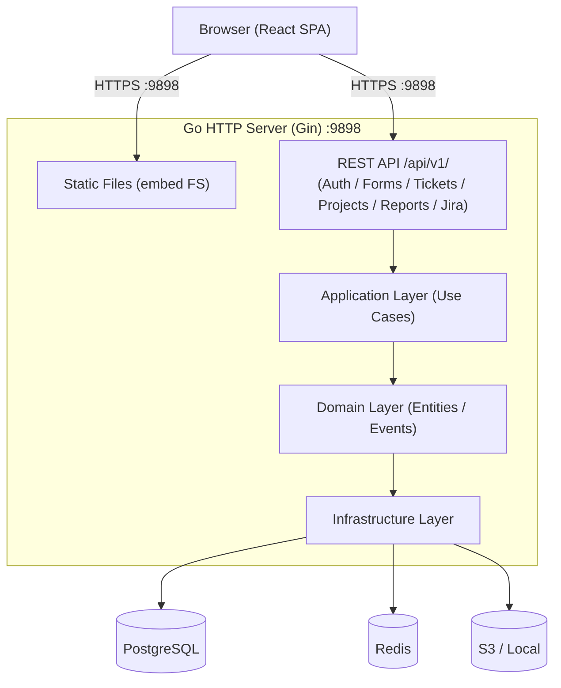
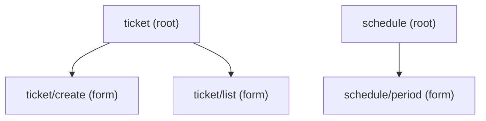
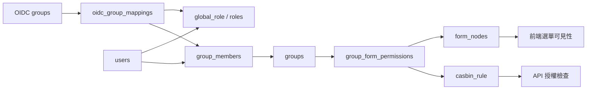
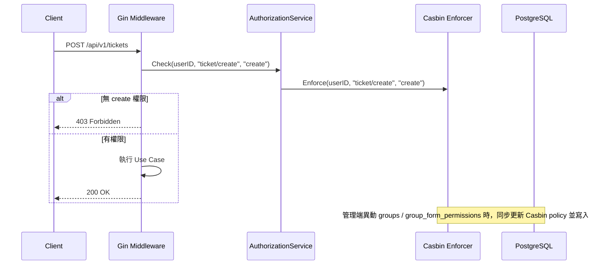
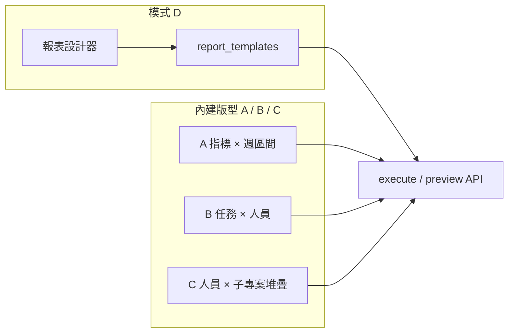
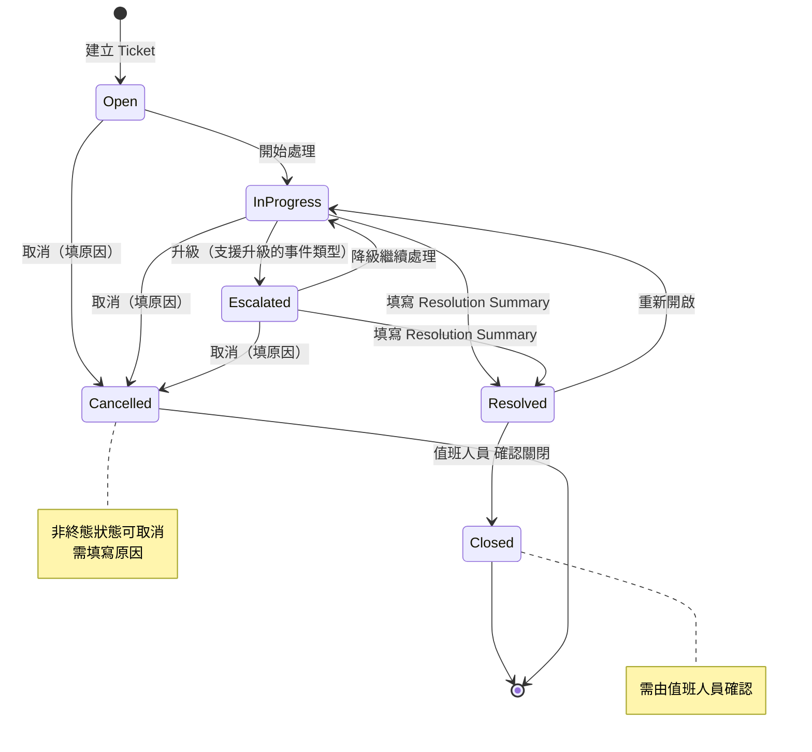

# Design Document

> 詳細設計請參閱：
>
> - [design-backend.md](./design-backend.md) — 後端：Data Models、API、核心元件、排程、安全
> - [design-frontend.md](./design-frontend.md) — 前端：頁面結構、元件、狀態管理、報表

---

## Overview

OnCall Ticket System 是一套供值班工程師使用的運維工單管理平台，採用 Go 後端 + React 前端的單體部署架構。後端透過 `embed` 直接 serve 前端靜態檔案，對外僅暴露單一 port（9898）。

技術選型：

- **後端**：Go 1.25+，Gin 框架，DDD 分層架構，GORM 查詢 DB
- **前端**：React 18+，TypeScript，Material UI v6，i18next（繁中 / 簡中 / 英文），毛玻璃主題
- **資料庫**：PostgreSQL（主要資料）+ Redis（快取、Session）
- **Schema 管理**：手動執行 `.sql` 檔案建立 table；分區由內建排程自動建立
- **部署**：Multi-stage Dockerfile，單一 image

---

## Architecture

### 系統架構圖



### 目錄結構

```text
opscenter/                          # Monorepo 根目錄
├── Dockerfile                          # 放根目錄，build context 可同時存取前後端
├── opscenter-server/              # Go 後端
│   ├── cmd/server/main.go
│   ├── api/
│   │   └── gen/                        # Swagger 產生碼
│   ├── configs/
│   │   ├── config.yaml
│   │   └── .env.example
│   ├── internal/
│   │   ├── ticket/                     # Ticket Bounded Context
│   │   │   ├── domain/
│   │   │   ├── application/
│   │   │   ├── infra/
│   │   │   ├── delivery/
│   │   │   └── di.go
│   │   ├── project/                    # Project / SubProject BC
│   │   ├── user/                       # User / Auth / MFA BC
│   │   ├── form/                       # 表單樹 / 群組權限 BC（需求 2）
│   │   ├── report/                     # Report / Jira Import BC
│   │   ├── sla/                        # SLA BC
│   │   ├── scheduler/                  # 分區自動建立排程
│   │   └── infra/                      # 全域基礎設施
│   │       ├── db/
│   │       ├── cache/
│   │       └── logger/
│   ├── pkg/                            # 通用工具（無業務邏輯）
│   ├── sql/                            # 手動執行的 DDL SQL 檔案
│   │   ├── 0001_create_base_tables.sql
│   │   ├── 0002_create_partitioned_tables.sql
│   │   ├── 0003_create_indexes.sql
│   │   └── 0004_seed_system_settings.sql
│   ├── web/                            # 前端 build 產物掛載點（embed）
│   │   └── dist/                       # Stage 1 build 後 COPY 至此
│   ├── Makefile
│   └── go.mod
│
├── opscenter-web/             # React 前端
│   ├── src/
│   │   ├── components/                 # 共用元件
│   │   │   ├── TicketCard/
│   │   │   ├── StatusBadge/
│   │   │   ├── PriorityBadge/
│   │   │   ├── SLACountdown/
│   │   │   ├── MarkdownEditor/
│   │   │   └── AttachmentUpload/
│   │   ├── features/
│   │   │   ├── auth/                   # 登入、MFA、OIDC
│   │   │   ├── ticket/                 # Ticket CRUD、狀態流轉、留言
│   │   │   ├── project/                # 專案 / 子專案管理
│   │   │   ├── report/                 # 報表設計器、範本執行
│   │   │   ├── jira/                   # Jira CSV 匯入、統計報表
│   │   │   ├── dashboard/              # 儀表板
│   │   │   └── admin/                  # 使用者、表單樹、群組權限、系統設定、排程
│   │   ├── hooks/
│   │   ├── utils/
│   │   ├── types/
│   │   └── App.tsx
│   ├── public/
│   ├── index.html
│   ├── vite.config.ts
│   ├── tsconfig.json
│   └── package.json
│
└── deployments/                        # 部署相關設定
│    └── K8s
│       └── Kustomze  # K8s manifest
│    └── grafana/
│        └── oncall-ticket-dashboard.json  # Grafana 儀表板定義
└── docs/
│    ├── Table_schema.md                  # 總設計文件
└── REDADME.md

```

> **部署流程**：Dockerfile 位於 Monorepo 根目錄（`opscenter/`），build context 為根目錄，可同時存取 `opscenter-web/` 與 `opscenter-server/`。Multi-stage build 先 build 前端，再將 `dist/` COPY 至後端的 `web/dist/`，最後由 Go `embed` 打包進最終 binary。

---

## 表單樹與 RBAC 權限（需求 2）

對應 [requirements.md](./requirements.md) 需求 2：系統管理員自訂表單樹狀結構識別（`form_key`），並透過 **Casbin RBAC 群組權限**賦予使用者對表單的讀取 / 新增 / 修改 / 刪除操作層級。詳細 Data Model 與 API 見 [design-backend.md](./design-backend.md)。

### 表單樹結構

表單以父子層級組織，每個節點具路徑式唯一識別碼 `form_key`（例如 `ticket/create`）。節點類型：

| 類型       | 說明                                           |
| ---------- | ---------------------------------------------- |
| `root`     | 根分類（例如 `ticket`）                        |
| `category` | 中繼分類                                       |
| `form`     | 葉節點，對應實際可操作表單（例如 Ticket 開單） |



- 同一 `parent_id` 下 `form_key` 區段不可重複；完整路徑 `full_path` 全系統唯一
- 刪除節點前須無子節點；若已被業務資料引用則拒絕刪除

### 群組與操作層級

| 操作層級 | 代碼     | 說明                      |
| -------- | -------- | ------------------------- |
| 讀取     | `read`   | 查看表單樹節點與子樹      |
| 新增     | `create` | 建立資料（例如開 Ticket） |
| 修改     | `update` | 更新既有資料              |
| 刪除     | `delete` | 刪除資料                  |

- 使用者可隸屬多個群組（`groups`）；實際權限為各群組權限的**聯集**
- 群組權限綁定至 `form_nodes` 節點；`group_form_permissions` 是業務授權來源表，權限異動後由 application layer 同步為 Casbin policy
- Casbin policy 使用 PostgreSQL adapter table 持久化，migration 需手動建立 policy table，不依賴 AutoMigrate
- 子節點預設**繼承**父節點權限，可對子節點設定 `override_parent` 覆寫；繼承與覆寫計算在同步 policy 時處理
- API runtime 由 authorization middleware / service 呼叫 Casbin `Enforce(userID, formPath, action)` 判斷，handler 不自行查表判斷權限
- 僅 `Admin`（`global_role = admin`）可管理表單樹與群組權限設定
- 未授權操作回傳 **403**
- 前端管理入口為 `/admin/menus`（選單管理），實際 API 使用 `/api/v1/admin/forms` 管理 `form_nodes`；一般使用者側邊欄不得使用管理端 API，需使用 `/api/v1/forms/tree` 取得目前使用者具備 `read` 權限的有效選單樹。畫面設計見 [design-frontend.md](./design-frontend.md)「選單管理頁設計」，後續側邊欄排序與可見性以 `.kiro/specs/2026-06-18_17-45_Menu` 為準。

### 角色、權限群組與選單節點關係

本系統將「系統角色」與「表單 / 選單操作權限」分開管理，避免權限來源混淆：

| 概念 | 資料來源 | 用途 |
| ---- | -------- | ---- |
| 系統角色 | `users.global_role`、`roles` | 控制是否具備系統管理、運維管理或一般使用者身份；`Admin` 可直接放行 |
| OIDC 群組對應 | `oidc_group_mappings` 或啟動設定 | 將外部 IdP 群組轉換為內部 `global_role` 或權限群組成員同步結果 |
| 權限群組 | `groups`、`group_members` | 批次管理使用者對表單樹節點的操作層級 |
| 選單 / 表單節點 | `form_nodes` | 定義功能入口、表單路徑與授權物件 |
| 群組表單權限 | `group_form_permissions` | 記錄群組對節點的 `read/create/update/delete` 授權，並同步為 Casbin policy |

- `roles` 表不直接保存選單權限；不得以角色代碼硬編碼判斷某個表單節點是否可見或可操作
- OIDC 外部群組不得直接取代內部角色模型；登入 / callback 流程需先將外部群組透過 mapping 轉為 `users.global_role` 與 `group_members`
- 預設 OIDC 群組 mapping：`ops_admin -> admin`、`ops_op_admin -> op_admin`、`ops_member -> member`、`ops_op_member -> member`
- 多個 OIDC 群組同時命中時，`global_role` 取最高權限序 `admin > op_admin > member`；權限群組採聯集同步
- 群組管理前端提供權限群組、群組成員與選單權限矩陣；角色管理只負責角色 CRUD，不承載表單節點授權設定。儲存來源仍是 `groups`、`group_members`、`group_form_permissions`
- 一位使用者可同時受 `global_role`、專案角色與多個權限群組影響；表單操作權限以群組權限聯集計算，`Admin` 例外直接放行
- 側邊欄與功能入口只依有效 `read` 權限顯示；後端 API 仍需以 Casbin 再次檢查，不得只信任前端隱藏選單



### 權限檢查流程



### 與其他模組整合

| 模組   | 整合方式                                                        |
| ------ | --------------------------------------------------------------- |
| Ticket | 建立 Ticket 前檢查 `ticket/create` 的 `create` 層級（需求 3.1） |
| 排班   | 可預留 `schedule/period` 等 `form_key`，由群組控制排班頁面 CRUD |
| 稽核   | 表單樹與群組權限異動同步 Casbin policy，並寫入 `form_audit_logs` |

---

## 自訂報表與範本（需求 14）

對應 [requirements.md](./requirements.md) 需求 14：值班組長自訂報表維度、儲存範本並重複套用。詳細 Data Model、API 與前端元件見 [design-backend.md](./design-backend.md)、[design-frontend.md](./design-frontend.md)。

> **Report 後續實作來源：** 本段保留舊版整體設計背景；後續需求、API 契約、前端頁面與 task 以 `.kiro/specs/2026-06-22_11-06_Report` 為準。

### 交付分期

| 階段        | 範圍                                            |
| ----------- | ----------------------------------------------- |
| **MVP**     | 不實作報表設計器                                |
| **Phase 2** | 自訂報表基礎查詢（維度組合有限）                |
| **Phase 3** | 報表設計器、範本 CRUD、週報 / 月報 A–D 完整版型 |

### 報表設計器（模式 D 基礎）

使用者可自由組合（14.1）：

- **橫軸**：日期（日 / 週 / 月）、人員、子專案等
- **縱軸分組**：班制、個人（班制-班別-姓名，班別由排班 BC 查詢推導）
- **統計指標**：Ticket 數量，可依事件類型（`ticket_types`）、資訊來源（`ticket_resources`）、子專案拆分
- **圖表類型**：長條圖、堆疊長條圖

設計完成後儲存為專案層級範本（`report_templates`），同專案成員可執行；建立 / 修改 / 刪除範本限 `Project Manager` 以上。

### 月報四種呈現模式（14.8）

標題格式範例：`2026年0501-0531運維處理事件數量`（整月區間，業務時區 `Asia/Taipei`）。

| 模式  | 類型       | 圖表結構                                                                                  | 對應場景                          |
| ----- | ---------- | ----------------------------------------------------------------------------------------- | --------------------------------- |
| **A** | 內建版型   | 橫軸＝週區間 + 總計；**每個統計指標獨立一張圖**；縱軸＝個人（班別-姓名）；長條圖 + 明細表 | OP：Jira 開單數 / 告警 / 域名更換 |
| **B** | 內建版型   | 縱軸＝Ticket 標題；橫軸＝個人；堆疊長條圖 + 交叉明細表                                    | Juyou：作業 × 人員                |
| **C** | 內建版型   | **整月彙總單圖**；橫軸＝人員；堆疊＝子專案 / 業務項目；堆疊長條圖 + 圖例                  | OP 月報「運維處理事件數量」       |
| **D** | 設計器自訂 | 透過 14.1 自由組合維度與圖表類型，存範本重複套用；時間可整月或自訂                        | 彈性報表、非固定版型              |



**模式 C 統計口徑（可於範本設定）：**

- `person_basis = created_by`：依 Ticket 建立人計數
- `person_basis = actor`：依 `ticket_activities` 操作人計數（需指定活動類型篩選）

**模式 D 與 A/B/C 關係：**

- A / B / C 為系統預設 `report_mode`，可直接執行無需先經設計器
- D 的 `report_mode = "D"`，`config` 完全由設計器產生；亦可用設計器另存自訂 C 類似版型

### 資料流

```text
前端 ReportDesigner / TemplateExecute
    → POST /reports/preview 或 /report-templates/:id/execute
    → ReportQueryService（Go，依 mode + config 組 SQL）
    → PostgreSQL（tickets + ticket_types + ticket_resources + sub_projects；班別需 JOIN 排班 BC）
    → ReportChartPayload JSON
    → 前端 ECharts 渲染 + CSV 匯出
```

---

## 附件存取架構（需求 3.11–3.12）

附件支援 Local / S3 Private Bucket 雙模式，**Browser 一律經 Go API 串流**，不暴露 Bucket URL，**不使用 Pre-signed URL**。

```text
React（ 或 fetch + blob）
    ↓  GET + JWT
Go API  /api/v1/attachments/:id/content
    ↓  Backend.Open(storage_key)
S3 Private Bucket  或  Local FS
    ↓  object stream
Go  →  Content-Type: image/avif | image/webp
    ↓
Browser 顯示圖片
```

圖片上傳後由 Go 後端使用 `govips`（libvips）統一轉換為 AVIF 或 WebP，再寫入 Local / S3。正式轉檔路徑不使用 `ffmpeg` 或 `bimg`，避免不同實作造成輸出與 metadata 行為不一致。

**Local 相對路徑 / S3 object key：** `yyyy/mm/dd/{attachment_ulid}.{ext}`（上傳日 `Asia/Taipei`，`ext` 僅允許 `avif` 或 `webp`）

詳細 Backend 介面與 IAM 設定見 [design-backend.md](./design-backend.md)。

---

## Ticket 狀態機



---

## 部署設計

### Dockerfile（Multi-stage）

Dockerfile 位於 Monorepo 根目錄（`opscenter/`），build context 為根目錄，可同時存取兩個子目錄。

```dockerfile
# Stage 1: 前端 build
FROM node:22-alpine AS frontend
WORKDIR /app/frontend
COPY opscenter-web/package*.json ./
RUN npm ci
COPY opscenter-web/ .
RUN npm run build

# Stage 2: 後端 build
FROM golang:1.25-alpine AS backend
WORKDIR /app/backend
COPY opscenter-server/go.mod opscenter-server/go.sum ./
RUN go mod download
COPY opscenter-server/ .
# 將前端 build 產物複製至 embed 掛載點
COPY --from=frontend /app/frontend/dist ./web/dist
RUN CGO_ENABLED=0 go build -o server ./cmd/server

# Stage 3: 最終 image
FROM gcr.io/distroless/static-debian12
ENV TZ=Asia/Taipei
COPY --from=backend /app/backend/server /server
EXPOSE 9898
ENTRYPOINT ["/server"]
```

```bash
# 從 Monorepo 根目錄執行（build context = opscenter/）
docker build -t oncall-ticket-system:latest .
```

Runtime 預設 `TZ=Asia/Taipei`。資料庫時間欄位仍以 UTC 儲存；排班、報表與日期篩選以業務時區 `Asia/Taipei` 計算。Ticket ID 使用 ULID，由 PostgreSQL 透過 `generate_ulid()` 預設值產生。

### Kubernetes 優雅關機設定

```yaml
terminationGracePeriodSeconds: 40 # shutdown timeout(30s) + buffer(10s)
lifecycle:
  preStop:
    exec:
      command: ["sleep", "5"] # 等待 kube-proxy 更新 iptables
```

---

## 非功能設計

### 效能

- **PostgreSQL 分區策略**：
  - `tickets`、`ticket_activities`：按 `created_at` **月份** RANGE 分區
  - `jira_issues`：按 `created_date` **年份** RANGE 分區（Jira 為批次匯入，年份粒度足夠）
  - 分區由內建排程（`internal/scheduler`）自動建立，每月 1 日 00:00 UTC 執行
  - `ticket_activities` 依 `system.log.ticket_activity_keep_days` 清理分區，`0` 表示長期保留
  - 跨分區 FK 改由 application layer 驗證
- Redis 快取：儀表板統計（TTL 30s）、使用者 Session
- 分頁：cursor-based 或 offset，預設每頁 20 筆
- API 回應時間 P99 < 500ms

### 安全設計

- 密碼：bcrypt（cost=12）
- MFA Secret：AES-256-GCM 加密後儲存
- API Key：Phase 3 保留設計；若後續實作，使用 SHA-256 hash 儲存，明文僅在建立時回傳一次
- JWT：RS256 或 HS256（依部署規模選擇），放於 `Authorization: Bearer` header
- CORS：白名單設定，僅允許前端 domain
- Rate Limiting：Redis Token Bucket，每分鐘 60 次
- 日誌保留期限由 Global Setting 控制，Ticket Activity Log 與安全 / 系統稽核日誌分開設定
- Admin 操作日誌需由後端持久化列表欄位：`username`、`method`、`path`、`status_code`、`result`、`duration_ms`。前端 Data Grid 不得從缺失資料推測成功狀態或 HTTP 欄位；缺欄位只能顯示空值，並需由後端補齊 schema / API。
- 強制 HTTPS（TLS 1.2+），禁止 HTTP 存取
- system_settings 敏感值以 AES-256-GCM 加密儲存

### 可用性

- 系統可用性目標 99.9%
- 支援水平擴展（stateless Go server）
- 設定熱重載：Admin API 更新後透過 Redis Pub/Sub 通知所有實例，不需重啟
