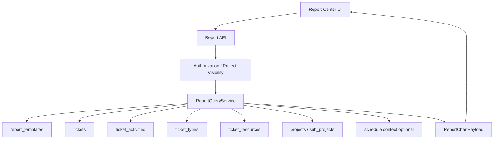

# Report Design

> 詳細設計請參閱：
>
> - [design-backend.md](./design-backend.md)：資料模型、API 契約、查詢服務與安全規則
> - [design-frontend.md](./design-frontend.md)：頁面結構、元件、狀態管理與圖表呈現

## Overview

Report 是專案層級的讀取型 bounded context，負責把 Ticket、活動紀錄、事件類型、資訊來源、子專案與人員資料彙總成圖表與表格。Report 不擁有 Ticket 資料生命週期，也不修改來源資料。

設計目標：

- 報表數字以後端查詢結果為準，前端只負責呈現與互動。
- 所有查詢都受到專案可見性與表單權限控制。
- 時間區間統一以 `Asia/Taipei` 計算，再轉 UTC 查詢。
- 內建月報 A / B / C 與值班統計先滿足固定營運報表，模式 D 保留自訂設計器擴充。
- 空資料與 API 未完成狀態必須明確顯示，不得使用假資料。

## Architecture



## Delivery Boundary

| 階段 | 範圍 |
| ---- | ---- |
| MVP | Report 中心、內建月報 A / B / C、值班統計、預覽、CSV 匯出、空資料與錯誤狀態 |
| Phase 2 | 範本 CRUD、範本執行、有限自訂維度查詢 |
| Phase 3 | 完整模式 D 報表設計器、範本版本、排程產報、非同步大型匯出 |

## Report Modes

| 模式 | 類型 | 查詢口徑 | 呈現 |
| ---- | ---- | -------- | ---- |
| A | 指標導向月報 | 週區間 × 人員 × 指標 | 多張長條圖 + 明細表 |
| B | 任務導向月報 | Ticket 標題 × 人員 | 堆疊長條圖 + 交叉表 |
| C | 人員 × 子專案月報 | 人員 × 子專案，整月彙總 | 單張堆疊長條圖 + 圖例 |
| E | 值班統計 | 日期 × 指標群組 × 班別/人員 | Excel 矩陣表 + 匯出 |
| G | MS-指標導向月報 | 固定 OP 指標 × 週區間 × 開單人員 | 模式 A 圖表 + 明細表 |
| D | 自訂維度 | 依範本 config 白名單決定 | 通用圖表 + 表格 |

模式 A / B / C / E 是內建查詢，不要求使用者先建立範本。模式 E 的顯示名稱為「值班統計」，主要服務 Excel 樣式營運統計表。模式 D 由 `ReportTemplateConfig` 驅動，後續報表設計器產生 config 後可預覽或儲存。

模式 G 僅在目前主專案代碼為 `MS` 時顯示。其使用模式 A 的固定 OP 聚合與呈現，但數值白名單限制為 `op_jira_issue_count`、`op_alert_notification_count`、`op_payment_domain_change_count`，並固定以開單人員統計。

## Mode A OP Monthly Indicators

模式 A 需要支援三個固定 OP 月報指標，格式對齊既有 Excel 報表：

| 指標代碼 | 顯示標題 | 圖表 | 明細表 |
| ---- | ---- | ---- | ---- |
| `op_jira_issue_count` | `YYYY年MM月 OP Jira開單數量統計` | 人員總計柱狀圖 | 值班人員、總計、週區間 |
| `op_alert_notification_count` | `YYYY年MM月 OP 告警通知數量統計` | 人員總計柱狀圖 | 值班人員、總計、週區間 |
| `op_payment_domain_change_count` | `YYYY年MM月 OP 支付or業務項目域名更換統計` | 人員總計柱狀圖 | 值班人員、總計、週區間 |

明細表規則：

- 第一欄為 `值班人員`。
- 第二欄為 `總計`。
- 後續欄位為月內週區間，例如 `6/1-6/4`、`6/5-6/11`。
- 列順序依班別與人員排序：早班、中班、晚班。
- 人員顯示需保留班別前綴，例如 `早-Chenmin`。
- 上述人員標籤與排序同時適用於告警、Jira 開單、支付域名更換三個固定 OP 指標；每張圖的 `x_axis.labels`、`series.data` 與下方 `table.rows` 必須使用同一份有序人員集合，前端不得另行排序。
- 數字以後端 payload 為準，前端不得自行補算。

### Excel 基準修正設計

本次修正以 `202607-Jira開單紀錄表.xlsx` 的 2026 年 7 月統計結果作為整合驗證基準，但不將檔名、專案 id 或固定筆數寫入正式聚合邏輯。預覽請求仍以路由中的 `project_id` 限定資料範圍。

資料流程：

1. Repository 於專案與日期範圍內查出 Ticket、`external_ref`、資訊來源代碼、有效班別、人員資料，以及 importer 建立活動所提供的 Excel 開單記錄來源旗標。
2. 先以範圍內全部 Ticket 建立值班人員名冊，再依所選固定指標套用計數條件。
3. 人員標籤正規化為「班別短名-人員」，例如 `早-Chenmin`，不解析匯入描述作為長期資料契約。
4. 後端依 Excel 週區間規則聚合總計及分週數字，最後產生圖表、明細表與 CSV 共用 payload。

固定指標條件：

| 指標代碼 | 穩定欄位 | 計數條件 |
| ---- | ---- | ---- |
| `op_jira_issue_count` | `tickets.external_ref` | 去除前後空白後非空值 |
| `op_payment_domain_change_count` | `ticket_resources.code` | 等於 `business_domain_change` |

上述兩項指標只統計由 Excel「開單記錄-*」分頁匯入的 Ticket。來源由 `ticket_activities` 的 `created` 活動及 importer 固定 content 前綴判斷，不讀取 `tickets.description`；一般操作建立的 Ticket 即使具有 external reference 或相同 resource code，也不納入 Excel 基準報表。告警通知維持既有來源規則。

2026 年 7 月週區間必須為 `7/1-7/2`、`7/3-7/9`、`7/10-7/16`、`7/17-7/23`、`7/24-7/31`。若一般切週演算法產生月底僅一天的尾段，尾段併入前一區間，避免產生 `7/31-7/31`。

人員名冊與指標資料分離：支付域名更換報表仍需保留當月有值班資料但該指標為 0 的人員。告警通知指標不在本次修正範圍，既有行為保持不變。

## 值班統計

「值班統計」是日期矩陣報表，不以圖表為主要輸出。報表模式只顯示單一「值班統計」，選取後由「數值」欄位選擇統計口徑：

- 告警通知
- 域名更換
- 支付域名更換

每次預覽與匯出只呈現一個口徑，不在同一張矩陣中混放三個區塊；前端分別顯示「值班統計－告警通知」、「值班統計－域名更換」與「值班統計－支付域名更換」。後端 API 仍保留 `metric_groups` 白名單陣列以相容舊呼叫。

矩陣結構：

```text
日期        總計  2026-06-01  2026-06-02  ...
星期              Monday      Tuesday     ...

告警通知數
  人員
    早-Chenmin
    中-Eric
    晚-Turry
```

後端 payload 必須保留群組、縮排層級、列類型與日期欄位。前端只針對上述三個口徑隱藏 `row_type = shift`，並依 `matrix.columns` 將每列日期值相加產生總計；不重新判斷 Ticket 或改變後端核心數字。

## Data Flow

```text
使用者選擇專案與日期區間
  -> 前端送出 preview / builtin-monthly / template execute request
  -> 後端驗證 JWT、表單權限與專案可見性
  -> 後端把 Asia/Taipei 日期轉為 UTC 查詢區間
  -> ReportQueryService 依 mode 選擇查詢器
  -> 查詢 tickets / ticket_activities / ticket_types / ticket_resources / sub_projects
  -> 回傳 ReportChartPayload
  -> 前端渲染圖表、明細表與 CSV 匯出入口
```

## Project Scope Switching

Report 中心需要提供主專案與子專案切換入口，放在專案摘要列右側或同等 header 操作區。

設計規則：

- 主專案下拉選單使用與 Ticket 工作區相同的可見主專案列表 API 與資料格式。
- 主專案下拉選單顯示專案名稱、專案代碼與狀態。
- 目前主專案為主專案下拉選單選取值。
- 切換專案後導向 `/projects/:id/reports`。
- 子專案下拉選單資料來源為目前主專案下的可見子專案。
- 子專案下拉選單預設為空值，空值代表不限定子專案，以目前主專案範圍查詢。
- 選擇子專案後，preview / builtin-monthly / template execute / CSV export 需帶入 `sub_project_id` 或等價查詢條件。
- 切換主專案時，子專案選取值必須重設為空值，避免沿用前一個主專案的子專案。
- 若主專案或子專案列表載入失敗，顯示錯誤狀態或停用切換入口，不顯示假專案。
- 專案範圍切換只影響 Report 工作區路由與查詢條件，不修改來源資料。

## Authorization

- 一般讀取：需通過 `Enforce(userID, "reports", "read")` 或對應 Report form path 的 read 權限，並通過專案可見性檢查。
- 範本新增：需 `create` 權限或 Project Manager 以上。
- 範本修改：需 `update` 權限或 Project Manager 以上。
- 範本刪除：需 `delete` 權限或 Project Manager 以上。
- Admin 可直接放行，但仍需記錄審計。

## Timezone

Report request 使用 `date_from`、`date_to` 與 `timezone`。目前唯一允許的業務時區為 `Asia/Taipei`。後端必須將日期區間轉成 UTC half-open range 查詢：

```text
date_from 00:00:00 Asia/Taipei <= created_at < date_to + 1 day 00:00:00 Asia/Taipei
```

## Error And Empty State

- 查無資料：HTTP 200，回傳空 `series`、空 `table.rows` 與 `meta.empty = true`。
- 參數錯誤：HTTP 400，回傳明確欄位錯誤。
- 權限不足：HTTP 403。
- 專案不存在或不可見：HTTP 404 或 403，依既有 Project API 規則。
- 查詢失敗：HTTP 500，前端顯示錯誤狀態與重試，不顯示假資料。

## Fixed OP Ticket Stable-Field Correction

三個固定 OP 月報均直接以 `tickets` 及其關聯 `ticket_resources` 為統計來源，不使用 `ticket_activities` 的 Excel 匯入 provenance 限制報表資料。

穩定欄位與 predicate：

| 指標 | 穩定欄位 | predicate |
| ---- | ---- | ---- |
| `op_jira_issue_count` | `tickets.external_ref` | `strings.TrimSpace(fact.ExternalRef) != ""` |
| `op_alert_notification_count` | `ticket_resources.resource_type` | `strings.TrimSpace(fact.TicketResourceType) == "alert"` |
| `op_payment_domain_change_count` | `ticket_resources.code` | `strings.TrimSpace(fact.TicketResourceCode) == "business_domain_change"` |

Repository 的 Ticket fact 查詢需加入 `tr.resource_type AS ticket_resource_type`，並移除已無用途的 `ExcelOpenTicketImport` 欄位及 importer activity `EXISTS` 子查詢，避免固定 OP 查詢保留匯入耦合與額外成本。

三個指標均以相同 predicate 建立名冊及計數集合：只有符合所選指標的 Ticket 建立人員會出現在 x 軸與明細表。既有「班別短名-人員」、早中晚排序、月內週區間及圖表／明細／CSV 共用 labels 的行為維持不變。

告警指標不再串接 Ticket 標題、類型、資源與子專案顯示文字搜尋 `alert`／`告警`。若資源主檔名稱為告警但 `resource_type` 設定錯誤，應修正主檔資料，不得由報表以文字猜測補償。
