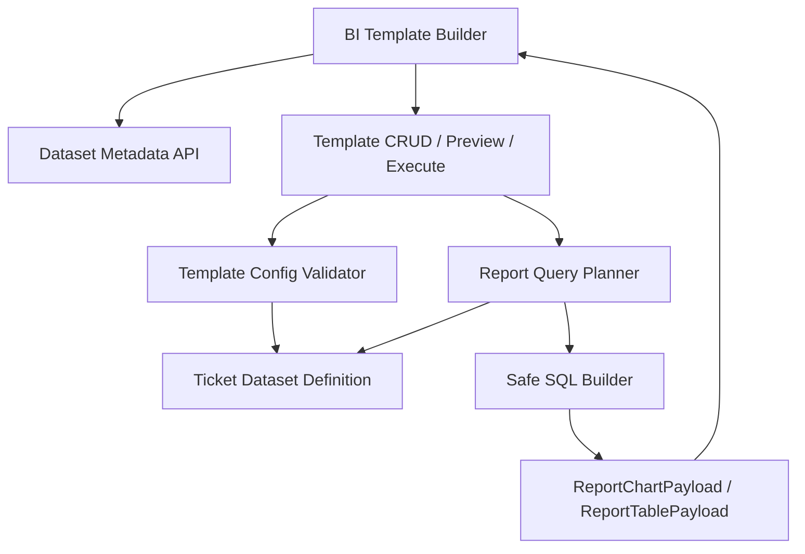

# Report BI Templates Design

> 契約細節請參閱 [contract.md](./contract.md)：V1 盤點、V2 config、相容讀取策略與錯誤碼。

## Overview

Report BI Templates 將目前的 Report 範本從「保存固定查詢表單」提升為「保存分析模型」。範本由資料集、查詢設定、視覺化設定與權限上下文組成。後端負責白名單驗證、查詢組裝與 payload 產生；前端負責根據 metadata API 呈現設定 UI。

此設計不允許前端傳入 SQL 片段，也不允許任意欄位名直接進入 SQL。

## Architecture



## Template Config

範本 config 採版本化結構，避免後續欄位演進破壞舊資料。

```json
{
  "version": 2,
  "dataset": "ticket_events",
  "date": {
    "preset": "this_month",
    "timezone": "Asia/Taipei",
    "grain": "day"
  },
  "query": {
    "x_axis": "person",
    "series": "sub_project",
    "metric": "ticket_count",
    "person_basis": "created_by",
    "filters": [
      {
        "field": "status",
        "operator": "in",
        "values": ["closed", "resolved"]
      }
    ],
    "sort": {
      "field": "total",
      "direction": "desc"
    },
    "limit": 20
  },
  "visualization": {
    "chart_type": "stacked_bar",
    "show_table": true,
    "legend": {
      "placement": "bottom",
      "wrap": true
    }
  }
}
```

報表設計器的日期設定需維持 UI 狀態一致：

- 使用者切換 `preset` 時，預覽用的 `date_from` / `date_to` 需依 Asia/Taipei 重新計算並同步更新。
- 使用者手動修改 `date_from` 或 `date_to` 時，`preset` 需切換為 `custom`。
- 儲存範本時保留 `preset` 與 `timezone`；預覽與匯出使用目前畫面上的起迄日期。

## Dataset Metadata

後端提供 metadata，前端依此產生選項。

```json
{
  "dataset": "ticket_events",
  "label": "Ticket 運維事件",
  "dimensions": [
    { "code": "date", "label": "日期", "supports_grain": true },
    { "code": "person", "label": "人員", "requires_person_basis": true },
    { "code": "sub_project", "label": "子專案" },
    { "code": "ticket_type", "label": "事件類型" },
    { "code": "status", "label": "狀態" },
    { "code": "priority", "label": "優先級" }
  ],
  "metrics": [
    { "code": "ticket_count", "label": "事件數量", "aggregation": "count" }
  ],
  "chart_types": ["stacked_bar", "grouped_bar", "line", "table"]
}
```

## Backend Design

### API

新增或調整 API：

- `GET /api/v1/projects/:id/reports/datasets`
- `GET /api/v1/projects/:id/reports/datasets/:dataset/metadata`
- `POST /api/v1/projects/:id/reports/preview`
- `POST /api/v1/projects/:id/report-templates`
- `PUT /api/v1/projects/:id/report-templates/:template_id`
- `POST /api/v1/projects/:id/report-templates/:template_id/execute`
- `GET /api/v1/projects/:id/reports/export`

`preview`、`execute` 與 `export` 可沿用既有 endpoint，但 request config 需支援 `version = 2`。

### Query Planner

Query Planner 的責任：

- 驗證 dataset 是否存在。
- 將維度代碼映射到固定 SQL fragment。
- 將指標代碼映射到固定 aggregation。
- 將 filter 映射到固定 where builder。
- 套用專案範圍與日期區間。
- 回傳統一 chart payload 與 table payload。

### 白名單範例

```go
type DatasetDefinition struct {
    Code       string
    Dimensions map[string]DimensionDefinition
    Metrics    map[string]MetricDefinition
    Filters    map[string]FilterDefinition
    Sorts      map[string]SortDefinition
}
```

每個 definition 只允許使用後端預先定義的 SQL expression，不接受外部傳入 expression。

## Frontend Design

### Report Center Tabs

報表中心主內容改為同頁兩個頁籤，避免範本列表與報表預覽左右分欄後互相擠壓。

```text
專案摘要列
工具列

[ 報表 ] [ 範本 ]

報表頁籤：
  報表條件
  預覽與圖表 / 矩陣
  匯出 CSV
  儲存範本

範本頁籤：
  範本搜尋與篩選
  範本列表
  套用 / 編輯 / 刪除
```

行為規則：

- 預設進入「報表」頁籤。
- 「報表」頁籤不顯示範本列表，預覽區使用完整可用寬度。
- 「範本」頁籤專門管理範本，不顯示報表預覽矩陣。
- 從「範本」頁籤點選套用時，將範本 config 帶入目前報表設定，並切回「報表」頁籤。
- 切換頁籤不得重設專案、子專案、日期區間、報表模式與未儲存設定。
- 每日值班執行統計矩陣在「報表」頁籤內仍需保留水平捲動與 sticky 左側欄位。

範本頁籤列表建議使用 DataGrid：

- 欄位：範本名稱、資料集、報表模式、人員基準、圖表類型、更新時間、操作。
- 操作：套用、編輯、刪除。
- 資料集、報表模式、人員基準與圖表類型可用 chip 輔助辨識，但範本名稱仍作為主要文字。

### Builder Layout

建議把新增範本 modal 改成右側抽屜或完整頁面，避免目前 modal 過窄且被圖表背景干擾。

主要區塊：

- 基本資料：名稱、描述
- 資料集：Ticket 運維事件
- 日期：預設區間、粒度
- 維度：X 軸、series 分組
- 指標：事件數量
- 篩選：狀態、事件類型、子專案、優先級、人員
- 呈現：圖表類型、是否顯示明細表、Top N、排序
- 預覽：即時或按鈕觸發

### Interaction Rules

- 選擇資料集後載入 metadata。
- X 軸與 series 不得選同一維度。
- 選擇日期維度時需顯示粒度控制。
- 選擇人員維度時需顯示人員口徑控制。
- 預覽成功後才允許儲存。
- metadata 載入失敗時，停用 builder 表單。

## Compatibility

既有 `version` 缺失或 `version = 1` 的範本視為舊格式：

- 若可轉換，後端回傳時補成 `version = 2`。
- 若不可轉換，前端標示為舊版範本，只允許執行與另存新範本。
- 不改變內建月報 A / B / C / E 的 API 契約。

## Error Handling

- 未知 dataset：400。
- 未知 dimension / metric / filter / sort：400。
- 無效維度組合：400。
- 權限不足：403。
- 專案不可見：404 或 403，依既有 Project 規則。
- 查無資料：200，回傳空 payload 與 `meta.empty = true`。
