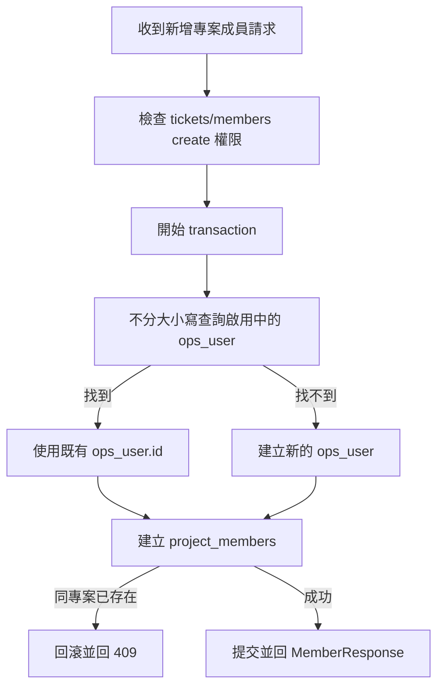
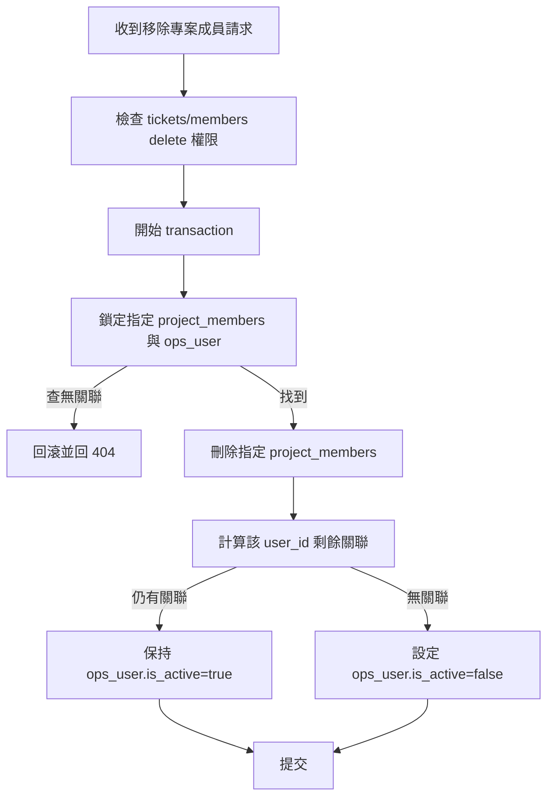

# 專案成員跨專案關聯設計

## 文件定位

本設計實作 `requirements.md` 定義的跨專案成員關聯行為，接續既有 `.kiro/specs/2026-06-15_15-35_Ticket` Project Member Contract。

本文件只覆寫既有「每次新增都建立 `ops_user`」及「移除任一關聯即停用 `ops_user`」兩項契約。既有完成 task 保留為歷史紀錄，不修改完成狀態。

## 已知契約狀態

### 需求來源

- 使用者確認同一人員可同時成為 V16 與 IM 專案成員。
- `requirements.md` 驗收條件 1.1 至 3.4。
- 既有 Ticket spec 的 `project_members -> ops_user` 資料來源契約。

### API contract

- `POST /api/v1/projects/{id}/members`
  - request 維持 `user_name` 與可選 `description`。
  - `project_id` 維持由 path 提供。
  - 成功 response 維持既有 `MemberResponse`。
  - 新增語意改為「確保人員存在並建立指定專案關聯」。
- `DELETE /api/v1/projects/{id}/members/{uid}`
  - `uid` 維持可接受 `ops_user.id` 或既有支援的 `user_name`。
  - 刪除語意改為解除指定專案關聯；只有最後一筆關聯移除後才停用 `ops_user`。
- `GET /api/v1/projects/{id}/members`
  - 維持只列出指定專案中 `ops_user.is_active = true` 的成員。

### Data contract

- `ops_user.id` 是運維人員識別碼。
- 啟用中的 `ops_user.user_name` 受不分大小寫唯一索引保護。
- `project_members` 複合主鍵為 `(project_id, user_id)`，允許相同 `user_id` 出現在不同專案。
- `project_members.user_id` 指向 `ops_user.id`。
- `project_members` 目前沒有 `is_active`、`deleted_at` 或稽核軟刪除欄位。
- `linked_user_id` 不參與本次成員關聯判斷，且不得因新增既有成員而被修改。

### 既有實作

- `project.Service.CreateProjectMember` 執行 `tickets/members:create` 權限檢查後委派 repository。
- `repositoryDB.CreateProjectMember` 在 transaction 中固定新增 `ops_user` 與 `project_members`。
- `repositoryDB.DeleteMember` 找到指定專案成員後直接將 `ops_user.is_active` 設為 `false`，但不刪除 `project_members`。
- 前端新增 Dialog 只送出 `user_name`，不使用候選人選擇器。

## Bounded Context

### 包含

- Project Member 新增與移除的 service、repository 與錯誤 contract。
- 跨專案共用同一個啟用 `ops_user`。
- 專案關聯 transaction 與併發衝突處理。
- Project Member、Ticket 與通知的必要回歸測試。
- 前端對新增專用錯誤的本地化顯示。

### 不包含

- Admin 使用者、SSO 帳號或 `linked_user_id` 對應。
- 群組與表單節點權限模型。
- 專案角色管理 UI。
- 停用人員復用、同名歷史人員合併與舊資料清理。
- `project_members` 稽核歷史或軟刪除 schema。
- Ticket、mention、協作者與通知候選邏輯的重新設計。

## 設計原則

1. 人員身份與專案關聯分離：`ops_user` 表示人員，`project_members` 表示專案歸屬。
2. 重用既有人員：啟用中的相同名稱視為同一位 `ops_user`。
3. 專案隔離：新增與移除只影響 path 指定專案。
4. 原子性：人員與關聯狀態變更必須在同一 transaction 完成。
5. 最小契約變更：維持現有 API path、request 與成功 response。
6. 權限不放寬：仍先通過 `tickets/members` 對應 action 權限。

## 目標資料結構

```text
ops_user
└── Terry（單一 id，is_active=true）
    ├── project_members：V16 + Terry
    └── project_members：IM + Terry
```

同一專案與同一人員最多一筆關聯，由既有複合主鍵保證。

## 新增流程



### Repository 行為

1. 正規化 `project_id` 與 `user_name`。
2. 在 transaction 內以 `LOWER(user_name) = LOWER(?) AND is_active = TRUE` 查找人員。
3. 找到時只使用其 `id` 與既有顯示資料，不更新 `description`、`linked_user_id` 或時間欄位。
4. 找不到時才執行既有 `ops_user` 建立流程。
5. 以取得的 `user_id` 建立 `(project_id, user_id, engineer)`。
6. `project_members` 唯一衝突映射為「已是此專案成員」的 domain error。
7. `ops_user` 建立時若因併發產生名稱唯一衝突，repository 應重新查找啟用人員並嘗試建立關聯，或以可重試的明確衝突回應；實作不得回傳不明確的 generic error。

### 不啟用 upsert 覆寫

不得以 `ON CONFLICT DO UPDATE role` 靜默覆寫既有關聯。重複加入代表使用者操作衝突，需回 `409`，避免新增操作意外變更專案角色。

## 移除流程



### 關聯刪除決策

`project_members` 沒有關聯層級的停用或軟刪除欄位。為了讓「移除專案成員」只影響指定專案，本次採刪除指定 `(project_id, user_id)` 關聯；不刪除 `ops_user`。

若未來需要保存成員加入與移除歷史，應另開 migration，為關聯建立 `is_active`、`removed_at` 或稽核事件，不在本次隱含擴充。

### 併發一致性

- 移除時需鎖定目標人員或以等價 transaction 隔離方式避免「計算為零後，另一 transaction 正在新增關聯」造成誤停用。
- 新增既有停用人員不在本次範圍；查找只重用 `is_active = true` 的人員。
- transaction 中任一步驟失敗皆需完整回滾。

## 錯誤契約

| 情況 | HTTP | Domain 語意 |
|---|---:|---|
| 同專案已有相同人員 | 409 | 專案成員已存在 |
| 新人員名稱建立時無法解決的唯一衝突 | 409 | 人員名稱衝突 |
| 指定專案關聯不存在 | 404 | 專案成員不存在 |
| 權限不足 | 403 | 維持既有表單 action 權限錯誤 |
| transaction 內部失敗 | 500 | 不得留下部分資料 |

前端若需新增錯誤字串，只針對新 domain error 補繁體中文文案，不改動表單欄位或新增角色 UI。

## 受影響檔案計畫

### 後端

- `opscenter-server/internal/project/domain.go`
  - 新增或調整同專案成員重複的 domain error。
- `opscenter-server/internal/project/repository.go`
  - 新增重用啟用人員流程。
  - 移除指定專案關聯並依剩餘關聯決定是否停用人員。
- `opscenter-server/internal/project/middleware.go`
  - 對齊 `409` 錯誤映射。
- `opscenter-server/internal/project/delivery.go`
  - 更新新增專案成員的 Swagger 契約描述。
- `opscenter-server/Docs/openapi.json`
  - 同步產生更新後的 API 文件。
- `opscenter-server/internal/project/repository_test.go`
  - 覆蓋新增、重用、重複、移除與 transaction。
- `opscenter-server/internal/project/service_test.go`
  - 驗證權限與 domain error 傳遞。
- `opscenter-server/internal/ticket/*_test.go`
  - 驗證跨專案成員仍依指定專案提供指派與協作候選。
- `opscenter-server/internal/notification/*_test.go`
  - 驗證移除單一關聯不會讓其他專案成員失效。

### 前端

- `opscenter-frontend/src/features/ticket/pages/ProjectMembersPage.tsx`
  - 必要時映射「已是此專案成員」錯誤。
- `opscenter-frontend/src/locales/*/ticket.json`
  - 必要時補齊各語系相同鍵集合。

### 不預期異動

- SQL migration 與既有資料表 schema。
- Admin 使用者與 SSO schema。
- Project Member API path、request 欄位與成功 response。

## 關鍵行為

- Terry 已在 V16，再由 IM 新增時，兩個 `project_members` 必須共用同一 `user_id`。
- 新增既有 Terry 不得將其描述清空或覆寫。
- 同專案重複新增不得修改 role。
- 從 V16 移除 Terry 後，IM 列表仍能查到 Terry。
- 從最後一個專案移除 Terry 後，Terry 不再出現在啟用人員與專案成員列表。
- Ticket 指派、mention、協作者與通知只認指定專案的關聯，不因另一專案的新增或移除而改變。

## 風險與處理方式

### 風險 1：新增與移除同時執行

處理：使用 transaction 與資料列鎖定或等價隔離策略，讓剩餘關聯判斷與人員停用保持一致。

### 風險 2：同名人員被誤認為同一人

處理：目前系統已以啟用中的不分大小寫 `user_name` 唯一索引定義身份，本次沿用既有契約。若未來允許同名，需另開人員身份規格。

### 風險 3：關聯硬刪除失去歷史

處理：本次不假造不存在的軟刪除欄位；透過既有應用日誌保存操作紀錄。若需要完整關聯歷史，另開 schema 變更。

### 風險 4：既有測試期待名稱衝突

處理：只將「其他專案已存在相同啟用人員」改為成功重用；同專案重複仍為 `409`，並更新對應測試 selector。

## 驗證設計

- Repository 測試驗證 SQL 操作順序、transaction commit 與 rollback。
- Service 與 delivery 測試驗證權限及 `404`、`409` 映射。
- Ticket 與 notification 回歸測試驗證專案隔離。
- 前端型別檢查與錯誤文案鍵集合驗證。
- 人工 SQL 驗證相同 `user_id` 同時存在於 V16、IM，移除其中一筆後人員仍啟用。
