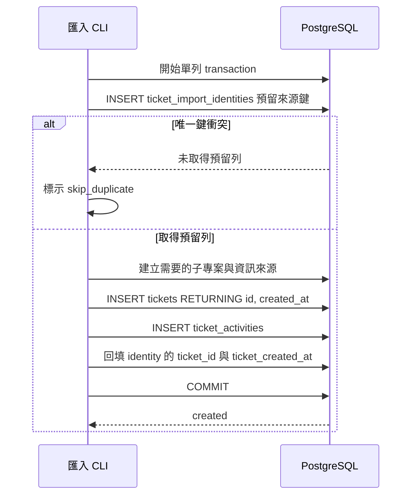

# Ticket Excel 匯入冪等去重設計

## 文件定位

本設計實作 `requirements.md` 所定義的固定歷史 Excel 匯入冪等行為，接續既有 `2026-06-22_15-24_Import_ticket_tools` spec。

不重寫既有 Excel 讀取、欄位映射、使用者對應、子專案／資訊來源自動建立、來源檔保存與報表邏輯。本設計新增最小的跨分區來源識別儲存，以及匯入器的來源鍵生成與原子提交流程。

## 已知契約狀態

### 既有 CLI 契約

- CLI：`opscenter-server/cmd/import_ticket_data`。
- dry-run 為預設；`-commit` 才寫入。
- `Jira單號` 對應 `importRow.ExternalRef`，目前為可選欄位。
- 現況 `validateRows` 只在 `ExternalRef` 非空時呼叫 `ticketExists(project_id, external_ref)`；空白外部單號不去重。
- 現況 `commitRows` 逐列呼叫 `insertTicket`；每列各自 transaction。

### 資料契約

- `tickets` 以 `created_at` 按月分區，主鍵為 `(id, created_at)`。
- 因分區限制，不能只在單一 `tickets_YYYY_MM` 分區加唯一索引以提供跨月份來源鍵唯一性。
- `tickets.external_ref` 保持外部參考語意，且 OP Jira 指標以其非空值判定。
- `ticket_activities` 依 Ticket 建立結果寫入初始 `created` 活動。

### Bounded Context

包含：Excel 匯入 CLI、匯入來源識別、Ticket 建立原子性、CLI 預覽與提交統計。

不包含：Ticket 一般建立 API 的全域去重、Jira 同步、Excel 資料異動後更新、完整匯入批次管理、前端 UI、報表公式變更。

## 設計原則

- `external_ref` 只保存真實 Jira 或外部系統參考，不承載 Excel 內部 fingerprint。
- 來源識別由資料庫唯一約束保護；應用程式層預覽查詢僅用於友善顯示，不作為唯一防線。
- 來源鍵生成必須可重現、明確版本化，且不依賴 Go map 迭代順序或本機時區字串。
- 去重保留 `insert_only` 語意。重複列不更新 Ticket、不建立活動、不建立主資料。
- 既有外部單號 Ticket 需可被來源識別表採納，避免功能上線後第一次重匯仍建立競態重複。

## 資料模型

新增非分區表 `ticket_import_identities`。它不是完整匯入批次表，只保存成功 Ticket 的來源鍵與最小追溯資訊。

```text
ticket_import_identities
├── id                       CHAR(26) 主鍵
├── project_id               CHAR(26) 非空，參照 projects
├── source_type              VARCHAR(32) 非空
├── source_key               VARCHAR(255) 非空
├── ticket_id                CHAR(26) 可空，提交 transaction 中短暫保留用
├── ticket_created_at        TIMESTAMPTZ 可空，與 ticket_id 組成 Ticket 分區主鍵參照
├── sheet_name               VARCHAR(255) 可空
├── excel_row_id             INTEGER 可空
├── created_at               TIMESTAMPTZ 非空
└── UNIQUE (project_id, source_type, source_key)
```

`ticket_id` 與 `ticket_created_at` 在同一 transaction 內建立 Ticket 後回填。migration 應使用複合外鍵參照 `tickets(id, created_at)`；由於識別列的預留與回填在同一 transaction 完成，欄位在資料庫可見時不得只剩空值。

來源種類：

| source_type | source_key | 適用條件 |
| --- | --- | --- |
| `jira` | 正規化 Jira 單號 | `Jira單號` 非空 |
| `excel_row` | SHA-256 fingerprint | `Jira單號` 空白 |

Jira 單號正規化採去除前後空白與一致大小寫。Excel fingerprint 為十六進位 SHA-256 字串。

## 來源鍵生成

### Jira 來源鍵

```text
source_type = jira
source_key = uppercase(trim(external_ref))
```

來源鍵在同一主專案內唯一；不同主專案可使用相同 Jira 單號。

### Excel 列 fingerprint

fingerprint 輸入採固定欄位順序與明確分隔，避免字串拼接歧義：

```text
excel-ticket-import-v1
project_id
normalized_sheet_name
decimal_excel_row_id
opened_at_in_RFC3339
normalized_title
```

實作必須使用固定 UTF-8 編碼與不會出現在欄位值中的長度前綴或結構化序列化。`opened_at` 必須使用既有 business timezone 解析後的固定 RFC3339 表示。title 與 sheet name 使用既有 trim 規則；不得任意改變大小寫或移除中間空白。

## 預覽流程

```text
Excel 列
  -> 欄位正規化與基本必填驗證
  -> 建立來源識別
  -> 同一批次記憶體去重
  -> 查詢 ticket_import_identities
  -> 必要時採納既有 external_ref Ticket
  -> 若重複：skip_duplicate 並停止此列的主資料自動建立判斷
  -> 若未重複：執行既有使用者、子專案與資訊來源驗證
  -> create 或 error
```

同一批次記憶體去重 key 為 `project_id + source_type + source_key`。同一來源鍵的第一列保留原本的驗證結果；後續列標記 `skip_duplicate`，並顯示該批次內重複原因。

既有 Jira Ticket 但尚無 `ticket_import_identities` 時，預覽必須顯示為 `external_ref 已存在`。提交時需將此既有 Ticket 採納為 `jira` 來源識別，以便後續由唯一鍵保護。

## 提交流程與原子性



`insertTicket` 改為回傳明確結果：`created` 或 `skipped_duplicate`。唯一鍵衝突不是失敗；CLI 統計計入 `skipped`。

新增 identity、建立 Ticket、建立 activity、回填 identity 必須位於同一 transaction。任何錯誤都 rollback；不得留下無 Ticket 的 identity 預留列。

預覽與提交之間可能有其他程序先完成匯入，因此提交時必須再次嘗試預留來源鍵；不得信任預覽結果直接 INSERT Ticket。

## Migration 與部署

- 新增下一個未使用連號的 SQL migration，不修改既有 migration。
- migration 建立 `ticket_import_identities`、唯一約束、必要索引與欄位註解。
- migration 必須包含可回滾策略；回滾前須確認沒有依賴本表的後續功能或資料保留需求。
- 先在測試資料庫套用 migration，確認可建立 identity、可觸發唯一衝突、可回滾，再部署應用程式。
- 新表為非分區表，使唯一約束跨所有 Ticket 月份分區有效。

## 受影響檔案計畫

| 類別 | 預計位置 | 變更 |
| --- | --- | --- |
| Migration | `opscenter-server/sql/<next>_create_ticket_import_identities.sql` | 建立來源識別表與唯一約束 |
| CLI | `opscenter-server/cmd/import_ticket_data/main.go` | 來源鍵生成、預覽去重、transaction 預留與回填 |
| CLI 測試 | `opscenter-server/cmd/import_ticket_data/main_test.go` | fingerprint、預覽、提交與回歸測試 |
| 資料庫整合測試 | 專案既有測試位置或新增受控測試 | 唯一約束與並發冪等驗證 |
| 匯入 spec | 本 spec 的 `task.md` | 追蹤遷移、實作與驗證結果 |

## 風險與處理方式

| 風險 | 處理方式 |
| --- | --- |
| Excel 列位置或內容異動導致 fingerprint 改變 | 明確限定歷史資料不可異動；不進行模糊合併 |
| 同時提交造成競態 | 以非分區 identity 表的唯一約束作為唯一真相來源 |
| 已存在 Jira Ticket 沒有 identity | 預覽標示既有外部單號；提交時採納其來源識別 |
| `external_ref` 被誤用為 fingerprint | 不寫入 `external_ref`，並以 report 回歸測試保護 OP Jira 指標 |
| migration 與部署失敗 | 版本化 SQL、測試資料庫驗證、部署前 migration 與明確 rollback 程序 |
