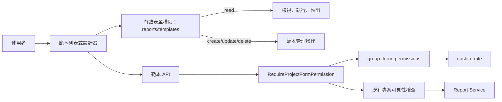

# 報表範本表單權限修正設計

## 文件定位

本設計實作「報表範本表單權限修正需求」。它延伸既有 `Report BI Templates` 的「範本 CRUD 使用 Report 權限」原則，將過度寬泛的 `reports` 節點拆出為具體的 `reports/templates`。不處理 BI 資料集與查詢引擎。

## 已知契約狀態

- `form_nodes` 使用 `full_path` 作為表單節點的唯一識別；`group_form_permissions` 是授權來源，`casbin_rule` 是其有效 policy 投影。
- 現有 Report 範本路由已透過 `auth.RequireProjectFormPermission` 驗證 `reports` 的 read/create/update/delete，並保留專案角色參數與專案可見性服務。
- 範本相關 API 包含 list、create、get、update、delete、execute、execute-layout、block export。
- 前端 `TemplateList` 使用 `useEffectiveMenuPermission('reports', operation)` 控制管理操作。
- 已存在且必須使用的群組代碼為 `engineers`、`ops_admin`、`ops_member`、`ops_op_admin`、`ops_op_member`。

## Bounded Context

### 包含

- `reports/templates` 表單節點、初始群組權限及 Casbin policy 同步。
- 範本 API 的表單節點授權替換。
- 範本列表／設計器中的權限驅動 UI。
- 授權回歸測試與 migration 可重跑驗證。

### 不包含

- 報表中心其他 API 的節點重構。
- 修改專案可見性、Project Role 或群組成員管理。
- 資料庫內範本資料、BI config schema 或資料集定義遷移。

## 設計原則

- 授權來源唯一：後端 middleware、前端 UI 與 Casbin 都以 `group_form_permissions` 投影的有效權限為準。
- 最小權限：唯讀群組僅有 `read`；執行與匯出不另造隱藏操作，仍視為 `read`。
- 節點分離：範本管理使用 `reports/templates`，其他 Report 功能繼續使用 `reports`。
- 相容優先：保留每條 API 的 HTTP 方法、URL、payload、專案可見性檢查與錯誤語意。
- migration 可重跑：節點與指定五個群組的目標權限透過 upsert 建立，並先移除該節點的舊有效 policy 後重建。

## 目標流程

## 資料庫與 migration 設計

新增一個版本化 SQL migration，執行順序如下：

1. 以既有 `reports` 節點為 parent，upsert `form_nodes` 子節點：`form_key = templates`、`full_path = reports/templates`、`node_type = form`、名稱「報表範本」。
2. 對五個既有群組 upsert `group_form_permissions`：
   - `ops_admin`、`ops_op_admin`：四個操作皆為 `TRUE`。
   - `engineers`、`ops_member`、`ops_op_member`：僅 `can_read = TRUE`。
   - `inherit_children = FALSE`、`override_parent = FALSE`，避免父節點改動意外擴張此明確子節點的權限。
3. 僅刪除這五個群組在 `reports/templates` 的 `casbin_rule` policy，再由 `group_form_permissions` 重建 read/create/update/delete policy，避免重跑殘留舊 action。

migration 不修改 `reports` 節點、其他節點或未列入矩陣的群組。若部署資料庫缺少 parent 或任何指定群組，migration 應明確失敗或以受控前置檢查終止，不能悄悄建立不明群組。

## 後端設計

`internal/report/delivery.go` 的 secured routes 按下列映射替換授權 full path：

| API 類別 | 操作 | 表單節點 |
| --- | --- | --- |
| list、get、execute、execute-layout、block export | read | `reports/templates` |
| create | create | `reports/templates` |
| update | update | `reports/templates` |
| delete | delete | `reports/templates` |

其餘 dataset、preview、builtin monthly、daily shift、通用 report export 與 layout preview 保持 `reports` 不變。middleware 的專案角色參數與 service 層專案可見性呼叫保留，不能以表單權限取代資料可見性。

後端測試補齊每種操作的允許與拒絕；特別驗證僅有 `reports` read 不足以呼叫範本 API。

## 前端設計

在範本列表與設計器所有權限判斷改用 `useEffectiveMenuPermission('reports/templates', operation)`：

- `read` 控制範本清單載入與執行入口。
- `create` 控制新增範本。
- `update` 控制編輯／儲存既有範本。
- `delete` 控制刪除操作。

前端隱藏按鈕僅為體驗控制；API 仍是最終授權邊界。若沒有 read，頁面須以現有授權失敗模式處理，不得藉由快取範本資料繼續呈現。

## 受影響檔案計畫

| 區域 | 預期變更 |
| --- | --- |
| `opscenter-server/sql/` | 新增節點、群組矩陣與 policy 同步 migration |
| `opscenter-server/internal/report/delivery.go` | 範本路由改用 `reports/templates` |
| `opscenter-server/internal/report/*_test.go` | 權限矩陣、授權失敗與既有專案範圍回歸 |
| `opscenter-frontend/src/features/report/` | 範本管理與執行 UI 改查新節點 |
| `opscenter-frontend/src/features/report/**/*.test.*` | UI 權限可見性測試；若既有測試基礎不存在，建立最小必要覆蓋 |

## 風險與處理

| 風險 | 處理方式 |
| --- | --- |
| 只改前端造成 API 仍可直連 | 所有範本路由均由後端 middleware 改用新節點並測試。 |
| policy 重跑留下舊寫入權限 | migration 先刪除目標節點與目標群組的有效 policy，再依來源重建。 |
| 父節點繼承使唯讀群組取得寫入 | 新節點寫入明確群組權限，並在測試驗證 effective action。 |
| 破壞其他 Report API | 僅替換 report-template 路由，逐一回歸通用 `reports` 路由。 |
| migration 在資料缺漏環境靜默成功 | 以既有群組／parent 為前置條件；部署前執行 schema 與 seed 檢查。 |

## 回滾

若部署後需回退應用程式，先確認舊版仍使用 `reports` 節點。資料 migration 不刪除新節點或群組權限，以避免破壞審計與管理設定；回滾時將應用程式部署回相容版本，並由後續受控 migration 處理節點移除或權限調整。不可手動刪除 `form_nodes`，因其可能已被權限與審計資料引用。
