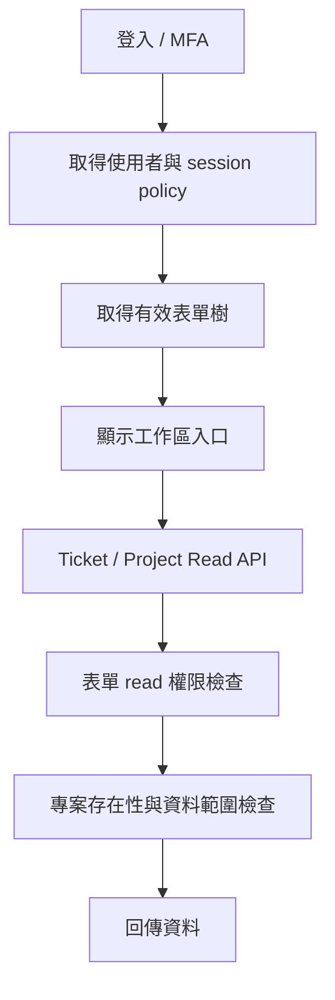
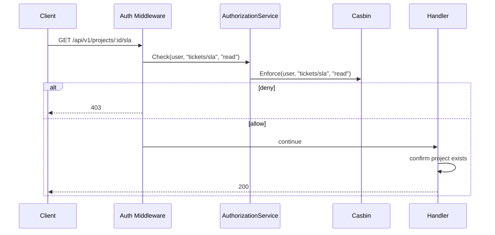

# OnCall Ticket System Core Design

Status: Draft

## 文件定位

本文件收斂原始 `design.md`、`design-backend.md`、`design-frontend.md`，只保留核心平台與 Ticket MVP 的跨層設計。

後續功能的細節不在本文件展開，改由 `roadmap.md` 指向獨立 spec。

## 已知契約狀態

### 需求來源

- `.kiro/specs/2026-06-01_10-22_oncall-ticket-system/requirements.md`
- `.kiro/specs/2026-06-01_10-22_oncall-ticket-system/design.md`
- `.kiro/specs/2026-06-01_10-22_oncall-ticket-system/design-backend.md`
- `.kiro/specs/2026-06-01_10-22_oncall-ticket-system/design-frontend.md`
- `.kiro/specs/2026-06-01_10-22_oncall-ticket-system/task.md`
- `.kiro/specs/2026-06-01_10-22_oncall-ticket-system/task-forntend.md`

### API Contract

- API prefix：`/api/v1`
- Response envelope：`code`、`message`、`data`、`trace_id`
- Auth：JWT access token、refresh token、MFA TOTP
- Session policy：`GET /api/v1/auth/session-policy`
- Effective forms：`GET /api/v1/forms/tree`
- Form permissions：`GET /api/v1/forms/permissions?path=...`

### Data Contract

核心資料表：

- `users`
- `projects`
- `sub_projects`
- `project_members`
- `form_nodes`
- `groups`
- `group_members`
- `group_form_permissions`
- `casbin_rule`
- `tickets`
- `ticket_types`
- `ticket_resources`
- `ticket_activities`
- `attachments`
- `ticket_attachments`
- `system_settings`
- `system_audit_logs`
- `form_audit_logs`
- `scheduler_logs`

不在核心 MVP 內展開：

- `sla_configs`
- `jira_issues`
- 完整排班與假勤 tables
- `api_keys`
- SSO provider settings

### Permission Contract

- `Admin` 直接放行管理操作。
- `op_admin` 不等於所有 read API 自動放行；仍需遵守已定義的表單 read 節點，除非 API 明確定義例外。
- `Member` 依權限群組與專案角色共同判斷。
- 一般工作區 read API 第一層授權來源為 `form_nodes.full_path` 的有效 `read` 權限。
- 寫入操作需依 `create/update/delete` 與必要 project role 檢查。

### UI Contract

- 前端選單依 `/api/v1/forms/tree` 顯示。
- 直接開路由時仍需後端授權檢查。
- 所有新增、修改、刪除、登入、登出、MFA、權限與狀態變更需顯示 Toast。
- 前端不得直接讀取 Admin Global Settings API 取得安全政策。

## Bounded Context

### 包含

- Auth / User / MFA 基礎
- Profile 與 self-service password
- Form tree / group permission / Casbin
- Project / SubProject / Project Member
- Ticket core workflow
- Ticket activity and comment
- Ticket attachment
- Basic dashboard
- Global setting
- Scheduler log and system log
- Structured access log

### 不包含

- SLA checker 與 SLA 報表
- Notification delivery
- Report builder 與 BI template
- Jira CSV import
- 完整 schedule / leave management
- SSO / OIDC / SAML
- API Key
- Kubernetes deployment

## 設計原則

- 共用契約集中定義，功能 spec 引用，不重複各自發明。
- 權限判斷集中在 middleware / service，handler 不自行查表判斷表單權限。
- Ticket 不保存班別快照，班別統計由人員與排班資料推導。
- 附件只透過 API 讀取，不暴露儲存後端路徑。
- 安全設定採最小揭露，不提供前端可解密的 secret。
- 日誌使用結構化 JSON，不混用 Gin 預設 access log。

## 目標流程

## 權限流程

## 受影響檔案計畫

後續若 promote 並實作，預期只允許檢查或修改下列範圍：

- `opscenter-server/internal/auth`
- `opscenter-server/internal/form`
- `opscenter-server/internal/project`
- `opscenter-server/internal/ticket`
- `opscenter-server/internal/attachment`
- `opscenter-server/internal/setting`
- `opscenter-server/internal/server`
- `opscenter-frontend/src/features/auth`
- `opscenter-frontend/src/features/tickets`
- `opscenter-frontend/src/features/admin`
- `opscenter-frontend/src/shared`

禁止在本 spec 內實作：

- SLA checker
- Report builder
- Jira import
- SSO protocol
- K8s manifest

## 關鍵行為

- Ticket 建立必須同交易寫入 activity。
- Ticket 刪除採 soft delete 並寫入活動紀錄。
- 附件上傳必須驗證實際圖片內容，轉成 AVIF 或 WebP，移除不必要 metadata。
- Admin 使用者列表只回傳 `has_mfa`，不回傳 MFA 裝置敏感細節。
- `session-policy` 僅回傳 `idle_timeout_seconds`。
- request log 只輸出 zlogger 結構化格式。

## 風險與處理方式

| 風險 | 處理方式 |
| --- | --- |
| 舊 spec 已完成勾選不代表目前端到端完成 | tasks 需重新列驗收，不沿用舊勾選當完成證明 |
| 權限 read 規則散落各 API | 建立表單節點對 API 的對照，測試 allow/deny |
| Phase 2/3 功能回流核心 spec | `roadmap.md` 明確列為外部 spec |
| 前端選單隱藏被誤認為安全控制 | 後端 middleware 必須重複檢查 |
| secret 被前端 API 洩漏 | 安全政策 API 採最小揭露 |

