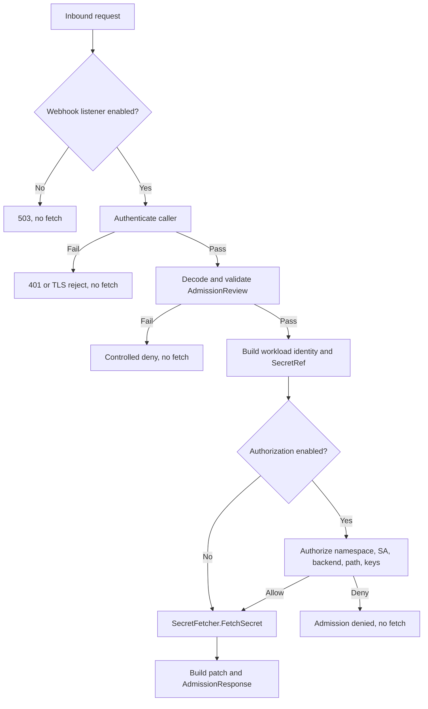

# 安全機密存取設計

## 文件定位

- 對應需求：`requirements.md`
- 來源審查：`_workspace/02_security_review.md`、`_workspace/05_review_summary.md`
- 設計目的：在任何外部 Secret fetch 前建立來源認證、Admission 契約驗證、workload 授權與最小 Kubernetes RBAC
- 保留既有契約：SecretFetcher、JSON Patch 建構、Vault/AWS SDK client 與 Sync Worker 排程流程不重寫

## 已知契約狀態

### 需求來源

1. 未認證 `/mutate` 可把 vault-agent 變成機密讀取端點。
2. annotation 目前是未授權的 backend/path/keys 輸入。
3. RBAC 遠超過 K8sRepository 實際使用的 `list` 與 `update`。

### API contract

1. Kubernetes 使用 `admission.k8s.io/v1` AdmissionReview 呼叫 HTTPS Webhook。
2. `MutatingWebhookConfiguration.clientConfig.caBundle` 只驗證 Webhook server，不驗證 caller。
3. Kubernetes API Server 可透過 Admission controller kubeconfig 提供 client certificate、bearer token 或 Basic Auth；本設計只接受 mTLS 與 bearer。
4. Webhook 回應維持 AdmissionReview v1；已解析 request 的拒絕回應應保留相同 UID。

### Data contract

1. Pod annotation key 維持 `inject-vault-agent`、`.backend`、`.path`、`.keys`。
2. `SecretRef` 維持 backend、path、keys；新增 workload identity 與 authorization decision，不把身分欄位塞入 `SecretRef`。
3. Policy 由唯讀檔案載入，production 來源為 Secret 或受保護的 ConfigMap volume；其中不存放 credential。

### 既有實作

1. `WebhookHandler` 解析 JSON 後直接呼叫 `Mutator.Execute`。
2. `MutateUseCase.Execute` 接受整個 AdmissionRequest 並解析 Pod。
3. Sync Worker 以 label 列出 Secret，再依 annotation fetch。
4. `K8sRepository` 只在 production flow 使用 `ListSecretsByLabel` 與 `UpdateSecret`。

### 不可假造的狀態

1. 不能把 AdmissionRequest.UserInfo 本身視為 caller authentication，因直接網路呼叫者可偽造 payload。
2. 不能假設 managed control plane 可修改 Admission controller kubeconfig。
3. 不能假設 NetworkPolicy 能在所有 CNI 與 control-plane topology 精確辨識 API Server。
4. 不能假設 Vault path 與 AWS SecretId 使用相同的 prefix 語意。

## Bounded Context

### 包含

1. Webhook inbound authentication。
2. AdmissionReview validation。
3. Webhook 與 Sync 的 workload authorization policy。
4. deny-before-fetch orchestration。
5. Webhook 與維運 listener 分離。
6. Kubernetes RBAC 與 ServiceAccount token 收斂。
7. 拒絕指標、稽核日誌及 migration 文件。

### 不包含

1. Vault/AWS policy provisioning controller。
2. Secret value delivery 架構重做。
3. fetch cache、request coalescing 與 retry 改造。
4. Secret 同步刪鍵與 worker shutdown 修正。
5. 通用 Kubernetes IAM 或 multi-cluster policy service。

## 設計原則

1. **Authenticate then validate then authorize then fetch**：順序不可交換。
2. **Default deny**：authorization 預設啟用；啟用時，設定缺漏、解析錯誤、未知 backend、未知 matcher 或 policy 無匹配皆拒絕。
3. **Deny before side effect**：拒絕路徑不得呼叫 Vault、AWS 或 Kubernetes Update。
4. **Credential 與 policy 分離**：API Server credential 存 Secret，授權規則不含 credential。
5. **Backend-aware matching**：Vault path 與 AWS identifier 各自有正規化與匹配器。
6. **Least privilege**：Kubernetes scope 由 RoleBinding 所在 namespace 決定。
7. **Explicit unsafe state**：`disabled` 表示關閉讀取，不提供匿名相容模式。

## 目標流程



## 元件設計

### 1. Inbound authentication

新增 delivery 或 security package 的最小介面：

```go
type RequestAuthenticator interface {
    Authenticate(r *http.Request) (CallerIdentity, error)
}

type CallerIdentity struct {
    Method    string
    Principal string
}
```

實作：

1. `MTLSAuthenticator`：由專用 Webhook `tls.Config` 完成 chain validation，應用層再限制 subject 或 URI SAN allowlist。
2. `BearerAuthenticator`：解析嚴格的 `Authorization: Bearer`，使用 `crypto/subtle.ConstantTimeCompare`，credential 僅從檔案載入。
3. `DisabledAuthenticator`：永遠回傳 service unavailable，不可用於允許匿名請求。

不支援 Basic Auth，避免新增可長期重用的 username/password contract。

### 2. Listener separation

規劃兩個 server：

1. Webhook server：預設 container port `8443`，只註冊 `/mutate`，使用 server TLS；mTLS 模式要求 client certificate。
2. Operations server：預設 container port `8081`，註冊 `/healthz`、`/readyz` 與選配 `/metrics`，不提供 `/mutate`。

Kubernetes Service 的 Webhook port 建議使用 `443 -> 8443`，使 API Server credential kubeconfig name 可使用 `vault-agent.vault-agent.svc`，避免非預設 port 的 name matching 差異。Probe 直接連 operations port。

### 3. Admission validation

新增純函式 validator，回傳已驗證 request 與 Pod：

```go
type ValidatedAdmission struct {
    Request *admissionv1.AdmissionRequest
    Pod     *corev1.Pod
}
```

Validator 負責 apiVersion、kind、request、UID、resource、kind、operation、namespace 與 raw object。Handler 在 authentication 後呼叫 validator，再把已驗證物件交給 use case，避免 application 重複信任原始 payload。

### 4. Authorization policy

設定契約：

```yaml
authorization:
  enabled: true
  policy_file: /etc/vault-agent/policy/policy.yaml
  policy_dir: ""
```

或使用目錄模式：

```yaml
authorization:
  enabled: true
  policy_file: ""
  policy_dir: /etc/vault-agent/policies
```

對應環境變數為 `AUTHORIZATION_ENABLED`、`AUTHORIZATION_POLICY_FILE` 與 `AUTHORIZATION_POLICY_DIR`。

行為：

1. `enabled` 預設為 `true`。
2. `enabled=true` 時必須成功載入 policy，任何錯誤都 fail closed。
3. `enabled=false` 時不要求 policy file，Webhook 與 Sync 略過 workload authorizer。
4. 關閉 authorization 不影響 caller authenticator、Admission validator 或 Kubernetes RBAC。
5. production 允許明確關閉，但必須輸出警告、狀態指標為 0，並由維運者確認 Vault/AWS identity policy 已縮到可接受範圍。
6. `policy_file` 與 `policy_dir` 只能設定一個；authorization 啟用時必須設定其中一個。
7. `policy_file` 適合小型環境；`policy_dir` 適合依團隊或用途拆分多個檔案，兩者使用完全相同的 rule schema。

Policy directory 載入規則：

1. 只讀取目錄第一層、副檔名為 `.yaml` 或 `.yml` 的項目，不遞迴子目錄。
2. 依檔名 byte order 排序後解析，使錯誤順序與測試結果可重現；授權結果不依賴檔案順序。
3. Kubernetes ConfigMap/Secret projected volume 會使用 symlink，因此允許解析 symlink，但解析後目標必須位於 canonical policy directory 內。
4. 每個檔案各自驗證 schema；合併後再次驗證 version 一致與 rule ID 全域唯一。
5. 任一檔案讀取、解析或合併失敗時拒絕整體 policy，不接受部分成功。

建議 policy schema：

```yaml
version: v1
webhook_rules:
  - id: team-a-vault
    namespaces: [team-a]
    namespace_globs: []
    service_accounts: [app]
    resources:
      - backend: vault
        path_prefixes: [teams/team-a/]
        path_prefix_templates: []
        keys: [DB_USER, DB_PASS]
sync_rules:
  - id: team-a-sync
    namespaces: [team-a]
    namespace_globs: []
    resources:
      - backend: vault
        path_prefixes: [teams/team-a/]
        path_prefix_templates: []
```

大量 namespace 可使用模板：

```yaml
version: v1
webhook_rules:
  - id: tenant-default
    namespaces: []
    namespace_globs: [team-*]
    service_accounts: [app]
    resources:
      - backend: vault
        path_prefixes: []
        path_prefix_templates:
          - teams/{{namespace}}/
```

Policy loader 在啟動時驗證：

1. version、rule id 唯一且不可空。
2. namespace 與 ServiceAccount 必須是合法 DNS label。
3. backend 必須有已註冊 matcher。
4. path rule 不可空，不接受全域 `*`。
5. keys 去重且不可包含空字串。
6. rule 必須至少提供一個精確 namespace 或 namespace glob；兩者同時提供時採聯集匹配。
7. namespace glob 必須完整匹配 namespace，只允許 `*` 與 `?`，不接受正規表示式、字元類別或路徑分隔符號。
8. resource 必須至少提供一個 `path_prefixes` 或 `path_prefix_templates`；兩者同時提供時採聯集匹配。
9. path template 第一版只允許 `{{namespace}}`；未知變數、未封閉 placeholder 或空展開結果視為設定錯誤。
10. 展開值取自已驗證的 AdmissionRequest namespace 或 Secret namespace，並交由 Vault/AWS matcher 再次正規化及判斷 delimiter boundary。

授權介面：

```go
type SecretAuthorizer interface {
    AuthorizeWebhook(identity WorkloadIdentity, ref domain.SecretRef) Decision
    AuthorizeSync(namespace string, ref domain.SecretRef) Decision
}
```

`Decision` 僅包含 allow、rule ID 與安全 reason code，不包含 secret value 或完整 path。

### 5. Workload identity

Webhook identity：

1. Namespace 以 AdmissionRequest.Namespace 為權威，並與 Pod namespace 交叉驗證。
2. ServiceAccount 使用 `pod.Spec.ServiceAccountName`；空值正規化為 `default`。
3. 可記錄 AdmissionRequest.UserInfo 作稽核欄位，但本階段不把 username/group 當必要 policy key。

Sync identity：使用 Secret.Namespace；沒有 Pod ServiceAccount，因此必須匹配 `syncRules`，不可重用或推測 webhook rule。

### 6. Backend-aware matcher

Vault matcher：

1. 拒絕空 path、前導 slash、`..`、`.`、連續 slash 與控制字元。
2. 將 policy prefix 正規化為以 `/` 結尾的 segment prefix。
3. 僅允許 exact match 或 delimiter boundary 下的 descendant。
4. 對 path template 展開後的 prefix 套用相同驗證，不提供例外捷徑。

AWS matcher：

1. 區分 friendly name 與 ARN。
2. ARN 使用 AWS ARN parser 或等價嚴格 parser；policy 規則需明確指定 exact ARN、name prefix 或 ARN resource prefix。
3. 不將 Vault slash 規則直接套用到 ARN。
4. AWS template 展開後仍必須符合 friendly name 或 ARN resource 規則；禁止用 namespace template 取代 ARN parser。

### 7. RBAC

建議保留一個名稱明確的 ClusterRole，內容只有：

```yaml
rules:
  - apiGroups: [""]
    resources: ["secrets"]
    verbs: ["list", "update"]
```

此 ClusterRole 不建立 ClusterRoleBinding。每個受管 namespace 建立 RoleBinding：

```yaml
subjects:
  - kind: ServiceAccount
    name: vault-agent
    namespace: vault-agent
roleRef:
  kind: ClusterRole
  name: vault-agent-secret-sync
```

若未配置任何受管 namespace，Sync Worker 應停用。刪除手動 ServiceAccount token Secret與 `system:auth-delegator` 綁定；Vault Server 自身的 reviewer 權限不應由登入 Vault 的 workload client 取得。

### 8. 可觀測性

新增 bounded label metrics：

1. `vault_agent_webhook_authentication_denied_total{reason}`
2. `vault_agent_secret_authorization_denied_total{flow,backend,reason}`
3. `vault_agent_policy_load_errors_total`
4. `vault_agent_authorization_enforcement_enabled`，啟用為 1，停用為 0

不得將 namespace、ServiceAccount、path 或 rule ID 放入 Prometheus label，以避免高 cardinality；這些欄位只進結構化稽核日誌，path 預設記錄 hash 或 policy rule ID。

## 啟動與失敗策略

1. 先載入 config 與 credential；authorization 啟用時再載入 policy。
2. production 中任何 Webhook authentication error 都阻止 Webhook server 啟動；authorization 啟用時，policy error 也阻止啟動，整個程序以非零狀態退出。
3. `disabled` 可讓 operations server 啟動以提供狀態，但 readiness 為 false，`/mutate` 不存在或回傳 503。
4. authorization 啟用時，policy 只在啟動時載入；更新需 rollout，避免部分請求看到不同 policy generation。

## Deployment strategy

1. 先建立 API Server admission credential 與 vault-agent credential Secret。
2. 套用 policy volume 與新雙 listener Deployment，但先保持 webhook disabled。
3. 建立受管 namespace RoleBinding，執行 `kubectl auth can-i` 驗證。
4. 啟用 Webhook authentication，從測試 namespace驗證合法及拒絕請求。
5. 最後切換 MutatingWebhookConfiguration Service port。
6. managed control plane 若無法配置 credential，停止於 disabled，不得跳過步驟 1。

## 受影響檔案計畫

| 檔案或目錄 | 計畫變更 |
|---|---|
| `internal/configs/config.go` | 新增 Webhook auth、listener、policy file/dir 設定及互斥驗證 |
| `internal/syncer/delivery/` | 新增 authenticator、Admission validator 與 handler 整合 |
| `internal/syncer/domain/` | 新增 workload identity、policy、decision 與 backend matcher 契約 |
| `internal/syncer/application/mutate_usecase.go` | 在 fetch 前強制授權，改接收已驗證 admission |
| `internal/syncer/application/sync_worker_usecase.go` | 在 fetch 前套用 sync policy |
| `internal/infra/metrics/metrics.go` | 新增 bounded denial metrics |
| `cmd/vault-agent/main.go` | 載入 credential/policy、組裝 authenticator/authorizer、啟動雙 server |
| `deployments/kustomize/base/` | 分離 ports/probes、收斂 RBAC、移除長效 token |
| `deployments/kustomize/overlays/prod/` | 掛載 credential/policy、顯式 managed namespace RoleBinding |
| `docs/` | 新增認證、policy、RBAC 與 migration 文件 |

## 風險與處理方式

### managed control plane 不支援 Admission credential

- 風險：API Server 無法完成 mTLS 或 bearer authentication。
- 處理：將「可配置 credential」列為上線閘門；否則維持 disabled，或另行設計可驗證 control-plane 身分的 proxy。NetworkPolicy 不可單獨解除閘門。

### mTLS 影響 probes 與 metrics

- 風險：共用 listener 時 kubelet 與 Prometheus 無 client certificate。
- 處理：雙 listener，Webhook 與 operations 分離。

### path prefix 繞過

- 風險：單純 `strings.HasPrefix` 允許相似字首或 backend 語意混淆。
- 處理：backend-specific parser、delimiter boundary 與惡意案例測試。

### RBAC 收斂後 Worker 無法跨 namespace

- 風險：漏建 RoleBinding 造成同步失敗。
- 處理：受管 namespace 清單 GitOps 化，deployment 前執行 `kubectl auth can-i`，readiness 顯示 policy/RBAC 狀態但不擴權自我修復。

### policy 誤設造成服務中斷

- 風險：default deny 會阻止原本可用的 workload。
- 處理：提供 policy validate command 或啟動 dry-run、audit-only 預覽工具。`authorization.enabled=false` 是明確的全域繞過開關，不得在 policy 載入失敗時自動切換。

### 多檔 policy 合併結果不一致

- 風險：重複 rule ID、版本不同、部分檔案失敗或非確定載入順序會造成環境間決策差異。
- 處理：檔名排序、逐檔驗證、合併後全域驗證及 all-or-nothing 載入；不支援後載入檔案覆寫先前規則。

### Namespace glob 或 template 過度匹配

- 風險：寬鬆 glob 或未經驗證的 template 可能讓相似 namespace 跨租戶讀取。
- 處理：glob 必須完整匹配並限制語法；path template 只接受 `{{namespace}}`，展開後仍走 backend matcher。使用 AC-12 證明 `team-a` 不能讀取 `team-b` path。

### 關閉 workload authorization 擴大 Vault/AWS 身分權限

- 風險：任何通過 Kubernetes Admission 的 workload 都能要求 agent identity 可讀取的任意 path，namespace 與 ServiceAccount 不再形成應用層隔離。
- 處理：預設保持啟用；關閉時顯示啟動警告與狀態指標，並要求 Vault/AWS policy 收斂到此 agent 所服務 workload 可共同存取的最小集合。caller authentication 與 RBAC 不得連動關閉。

## 參考

1. Kubernetes Dynamic Admission Control：API Server 可透過 Admission controller kubeconfig 對 Webhook 使用 client certificate 或 bearer token。
2. Kubernetes WebhookClientConfig：`caBundle` 用於驗證 Webhook server certificate，不代表 caller authentication。
3. CWE-306、CWE-862、CWE-863、CWE-250。
