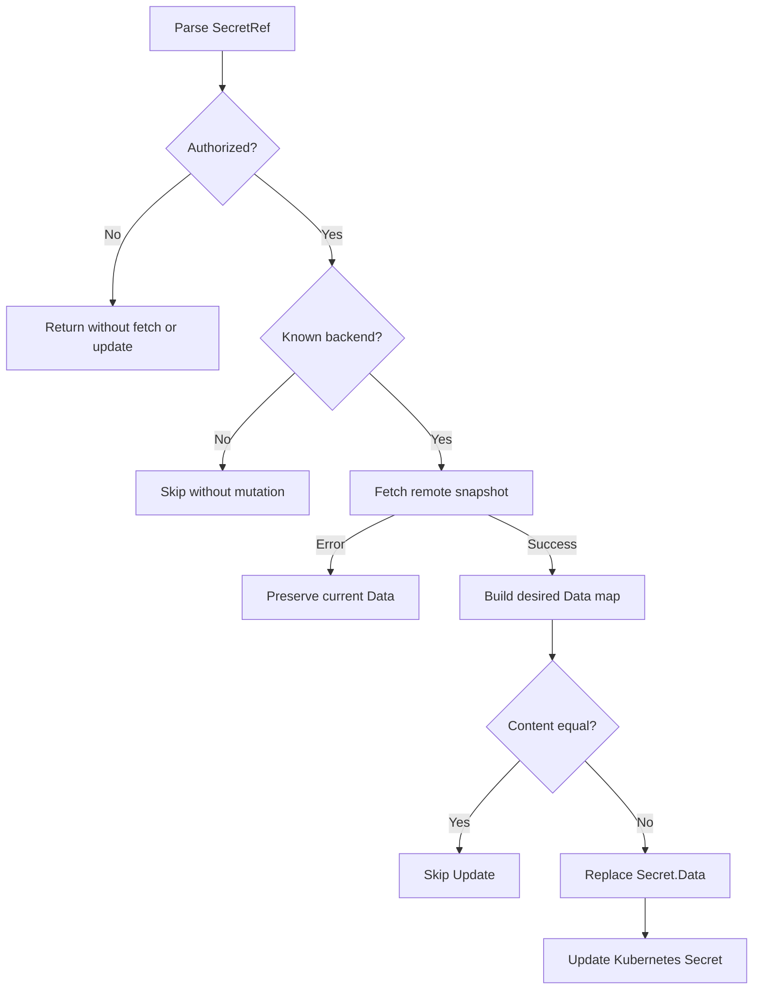

# 設計文件：Secret 刪鍵與撤銷語意

## 設計摘要

本設計將 Sync Worker 從「將遠端 key merge 進現有 Data」改為「以成功 fetch 的完整快照取代 Data」。Worker 會先在本地建立期望 map，以 byte 內容比較後才決定是否 Update，因此能撤銷缺少 key、處理空集合，且不會因 map 順序造成無效更新。授權與 fetch error 的早退路徑保持在差異計算前，確保跨 namespace 與後端故障時零讀取或寫入副作用。

## 文件定位

本文件實現同目錄 `requirements.md` 的撤銷、空集合與跨 namespace 驗收契約，並接續 `.specs/2026-08-04-10-52_Feature-secure-secret-access/design.md` 已建立的 Sync policy 邊界。本設計不重寫 `SecretFetcher`、`PolicyAuthorizer`、`K8sRepository`、Webhook 或 deployment 契約。

## 已知契約狀態

- 需求來源: `requirements.md` 的「目標」、「新行為」與「驗收情境」
- API / CLI / Hook contract: Secret 使用 `inject-vault-agent=true` label 與 `.backend`/`.path`/`.keys` annotations；本次不新增設定鍵
- Data contract: `SecretFetcher.FetchSecret(ctx, path, keys)` 成功回傳 `map[string]string`，失敗回傳非 nil error；`K8sSecretRepo.UpdateSecret` 更新整個 Secret
- 既有實作: `SyncWorkerUseCase.syncSecret` 已完成 parse、authorization、fetcher 選擇、fetch 與 Update，但 Data 比對目前是 merge
- 不可假造: 不從 nil map 推測後端錯誤；錯誤只以 `error` 契約判斷，不新增未定義的 Vault/AWS 狀態

## Bounded Context

包含：

- Sync Worker 對單一 Kubernetes Secret 的 Data 快照對帳
- 成功 fetch 後的 key 新增、修改、刪除與空集合處理
- Sync authorization 的跨 namespace 負面測試與副作用斷言
- 撤銷語意的繁體中文文件

不包含：

- Kubernetes Secret 物件刪除、metadata、type、immutable 或 ownerReferences 調整
- Vault/AWS SDK 讀取、retry 或錯誤分類改寫
- Webhook mutation、Pod ServiceAccount 授權或 Admission validation
- policy schema、loader、RBAC、listener 與 deployment manifests
- Worker shutdown、排程、並行化與 conflict retry

## 設計原則

- 成功快照是權威狀態，不在應用層保留未回傳 key。
- 刪除只能發生在 authorization 與 fetch 都成功後。
- 先建立完整期望 map，再一次指派給 `secret.Data`，避免邊遍歷邊修改造成半完成狀態。
- nil map 與空 map 在對帳內容上等價，不為表示形式差異發出 Update。
- 保留既有介面，將變更限制在 application 層與文件。

## 需求對應

| 需求 / 驗收情境 | 設計處理方式 | 驗證方式 |
|-----------------|--------------|----------|
| 撤銷缺少 key | 建立全新 desired map 後取代 `Secret.Data` | `TestSyncOnce_ReplacesDataAndRevokesMissingKeys` |
| 成功空集合 | 空 fetch result 產生空 desired map，非空 current 會 Update | `TestSyncOnce_EmptyRemoteDataClearsSecret` |
| 空快照幂等 | 比較時將 nil 與零長度 map 視為相同 | `TestSyncOnce_EmptySnapshotsSkipUpdate` |
| fetch 錯誤保留 | 錯誤分支在 desired map 建立前 return | `TestSyncOnce_FetchFailurePreservesData` |
| 指定 keys 快照 | 不依 `ref.Keys` merge，一律以 fetch result 取代 | `TestSyncOnce_RequestedKeysReplaceWholeDataSnapshot` |
| 跨 namespace 拒絕 | 以 `secret.Namespace` 呼叫 `AuthorizeSync`，deny 時立即 return | `TestSyncWorker_CrossNamespaceReferenceDoesNotFetchOrUpdate` |
| 無差異不 Update | 比較 key 數與每個 byte value，不依 map 順序 | `TestSyncOnce_SkipsWhenValuesIdentical` |

## 受影響檔案計畫

| 檔案 | 預期變更 | 原因 | 風險 |
|------|----------|------|------|
| `internal/syncer/application/sync_worker_usecase.go` | 將 merge 比對改為完整快照轉換、內容比較與整體取代 | 傳遞遠端刪鍵與空集合 | 若差異判斷錯誤可能造成誤刪或 Update 風暴 |
| `internal/syncer/application/sync_worker_usecase_test.go` | 新增撤銷、空集合、fetch error、指定 keys 與跨 namespace 測試 | 固定新契約與零副作用 | mock 若共用 map 可掩蓋原資料被修改，需 DeepCopy/原始快照斷言 |
| `internal/syncer/domain/policy_test.go` | 必要時新增 sync template 的跨 namespace 決策測試 | 將 domain 決策與 application 副作用分層驗證 | 不得改動 policy 規則來讓測試通過 |
| `docs/annotations.zh-Hant.md` | 說明受管 Secret 專屬所有權、完整取代、空集合與錯誤保留 | 避免使用者誤以為可混用手動 key | 文件若只寫「覆寫」仍可能被解讀為 merge |

## 目標結構或流程

`syncSecret` 維持目前的安全關卡順序，只取代 fetch 成功後的對帳段落：

1. 解析 Secret annotations，無 path 時返回。
2. authorization 啟用時，使用 `secret.Namespace` 與 `SecretRef` 做 sync policy 決策。
3. 未授權立即返回，不取得 fetcher、不 fetch、不觸碰 Data。
4. 選擇 backend；未知 backend 保持 skip 行為。
5. 呼叫 `FetchSecret`；非 nil error 立即返回，不變更 Data。
6. 將 fetched `map[string]string` 轉換為新的 `map[string][]byte`，每個 value 都建立新 byte slice。
7. 以內容比較 current 與 desired，nil/空都視為零個 key。
8. 若相同則 skip Update；若不同，以 desired 整體指派 `secret.Data`，再呼叫 `UpdateSecret`。

## Mermaid Diagrams

## 介面與資料契約

### API / CLI / Hook

- Input: 帶同步 label 與 backend/path/keys annotations 的 Kubernetes Secret
- Output: 內容相同時無副作用；內容不同時呼叫一次 `UpdateSecret`
- Error: authorization 與 fetch error 傳回給既有 per-secret 日誌流程，不改寫原 Data、不記錄機密值

### Data / Config

- 新增資料: 無持久化 schema；實作可在 application package 新增未匯出的快照轉換/比較 helper
- 既有資料相容性: annotation 與 policy 格式不變；行為上從 merge 改為 replace，首次同步會移除非遠端快照的舊 key

## 關鍵行為

- desired map 必須是新建的 map，不與 fetcher 或現有 Secret 共用可變資料。
- 差異判斷同時比較 key 數、key 存在性與 `[]byte` 內容。
- 非空 current 對空 desired 必須視為 changed；空 current 對 nil desired 必須視為 unchanged。
- fetcher 成功回傳 nil map 也是有效空快照，不可自行改為 error。
- 更新失敗沿用 repository error，不在本次新增 rollback 或 retry。
- 跨 namespace 測試使用 path template，確保實際 namespace 而非 Worker 掃描設定用於展開。

## 前後端或跨模組設計

1. Domain `PolicyAuthorizer` 繼續產生 sync allow/deny 決策，不感知 Data 對帳。
2. Application `SyncWorkerUseCase` 負責在 allow 後取得快照、計算差異與建立更新物件。
3. Infra `SecretFetcher` 繼續負責讀取與 keys 篩選；`K8sRepository` 繼續透過 Kubernetes Update 寫入完整 Secret。
4. 測試在 domain 層驗證跨 namespace 決策，在 application 層驗證決策後沒有 fetch、Update 或 Data 修改。

## Protected Behavior

- 未設 path 的 Secret 繼續 skip，不 fetch/update。
- 未知 backend 繼續 skip，不刪除資料。
- authorization deny 繼續發生在 fetch 前。
- fetch error 繼續增加錯誤 metric 並不 Update。
- 相同快照繼續不 Update。
- 新增與修改 key 的正常同步繼續成功。
- Webhook mutation、Vault/AWS fetcher、policy loader 與 RBAC 不變。

## 替代方案

| 方案 | 優點 | 缺點 | 結論 |
|------|------|------|------|
| 完整快照取代 | 語意單一、可完整撤銷、與現有文件「覆寫 Data」一致 | 會刪除手動 key | 採用；文件明確宣告專屬所有權 |
| 只刪除 `ref.Keys` 列出的 key | 可保留其他手動 key | fetcher 對缺少 requested key 目前回傳 error，無法表示撤銷；規則複雜 | 不採用 |
| 新增 preserve/merge 設定 | 可由使用者選擇所有權 | 新增設定、migration 與安全誤用面 | 不納入本 BugFix |
| 刪除整個 Kubernetes Secret | 撤銷徹底 | 破壞 metadata 與物件契約，風險過高 | 不採用 |

## 風險與處理方式

| 風險 | 影響 | 處理方式 | 驗證 |
|------|------|----------|------|
| fetch error 觸發全部刪鍵 | 機密中斷 | error 早退必須位於快照建立前 | `TestSyncOnce_FetchFailurePreservesData` |
| 手動 key 被刪除 | 使用者意外遺失混合管理資料 | 明確專屬所有權，測試指定 keys 契約 | `TestSyncOnce_RequestedKeysReplaceWholeDataSnapshot` |
| nil/空 map 反覆 Update | API server 負載與 resourceVersion 衝突 | 內容相等比較視兩者為等價 | `TestSyncOnce_EmptySnapshotsSkipUpdate` |
| map alias 使測試無法發現早期修改 | 錯誤路徑可能改動原 Data | 測試保留 DeepCopy 並比對原始內容 | `TestSyncWorker_CrossNamespaceReferenceDoesNotFetchOrUpdate` |
| 跨 namespace path 繞過授權 | 跨租戶機密讀取 | 使用 Secret namespace 展開 template，在 fetch 前 deny | `TestAuthorizer_SyncPathTemplateRejectsCrossNamespace` |

## 實作注意事項

- 先新增會失敗的撤銷與空集合測試，再修改 production code。
- 測試不只檢查 `repo.updated`，還要比對原始 Secret 快照，驗證 deny/error 前沒有 in-memory mutation。
- 可使用標準庫 `bytes.Equal` 與簡單 map 比較 helper；不為此引入新 dependency。
- 若實作需要修改 `SecretFetcher` 或 policy 契約，必須先更新 requirements/tasks 邊界，不可直接擴張。
- 保留 `_workspace/` 為未追蹤審查產物，不納入本 spec 或實作提交。
