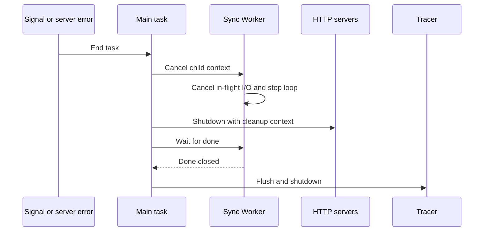

# 設計文件：Sync Worker Graceful Shutdown

## 設計摘要

本設計在 application 層將每輪 timeout context 改為繼承 `Run` 父 context，並在 context 取消後終止本輪剩餘 Secret。main 層新增小型 Worker lifecycle helper，持有 cancel/done，讓 signal 與 server error 都能取消 Worker，並在 graceful cleanup context 內等待結束。不修改外部 graceful manager，不新增設定，不建立獨立 shutdown timeout。

## 文件定位

本設計實現同目錄 `requirements.md` 的 in-flight cancellation、remaining work stop、main wait 與 bounded cleanup 契約。它保留上一個 BugFix 建立的 Secret 完整快照語意，不重寫 `SecretFetcher`、`K8sSecretRepo`、`PolicyAuthorizer`、HTTP server 或 `commons/graceful`。

## 已知契約狀態

- 需求來源: `requirements.md` 的「目標」、「新行為」與「驗收情境」
- API / CLI / Hook contract: 無對外 API 變更；`sync.interval_seconds` 繼續同時作為 ticker interval 與單輪 deadline
- Data contract: `SecretFetcher.FetchSecret`、`ListSecretsByLabel`、`UpdateSecret` 都已接收 `context.Context`；本次不改介面
- 既有實作: `Run` 用 `context.WithTimeout(context.Background(), syncInterval)`；main 用 `go syncWorker.Run(ctx)` 且無 done/wait
- 外部 graceful 實作: task 返回後建立 `context.WithTimeout(context.Background(), 30s)`，以 LIFO 執行 cleaners，cleaner error 會彙總但不中斷後續 cleaner
- 不可假造: 不得假設外部 SDK 必然立即回應 context；不新增 graceful manager 不存在的 wait group API

## Bounded Context

包含：

- Sync Worker 每輪 context 的 cancellation/deadline 組合
- list/fetch/update 進行中取消與剩餘 Secret 停止
- main task 的 Worker child context、cancel 與 done lifecycle
- graceful cleaner 的 Worker wait 與 timeout error
- HTTP、Worker、tracer cleanup 順序
- 優雅關機文件更新

不包含：

- Secret snapshot、annotation、authorization、backend/path/key 語意
- Kubernetes/Vault/AWS client 內部實作與 retry
- HTTP request drain 實作、TLS、health/ready endpoint
- graceful manager 套件修改或替換
- Kubernetes `terminationGracePeriodSeconds` 與 deployment manifest 調整
- metrics schema 新增

## 設計原則

- structured concurrency：Worker 生命週期必須繫定 main task context，並有可等待的 done signal。
- cancellation 優先：取消後不再開始新外部 I/O。
- bounded wait：任何 Worker wait 都使用 graceful cleanup context，不用無 deadline 的 receive。
- 單一 budget：沿用 30 秒 timeout，不叠加另一個使用者難以推理的 timeout。
- 最小介面：以 package-private runner/helper 測試 main lifecycle，不暴露新 public API。

## 需求對應

| 需求 / 驗收情境 | 設計處理方式 | 驗證方式 |
|-----------------|--------------|----------|
| 取消 in-flight fetch | 每輪 context 改以 parent 建立 | `TestRun_CancelsInFlightFetchAndWaitsForExit` |
| 取消 in-flight list | list 使用同一個繼承 parent 的 context | `TestRun_CancelsInFlightListAndWaitsForExit` |
| 停止剩餘 Secret | loop 開始與 error 後檢查 `ctx.Err()` | `TestSyncOnce_CancellationStopsRemainingSecrets` |
| main cancel/done | `startSyncWorker` 回傳 cancel 與 done | `TestStartSyncWorker_CancelAndWait` |
| bounded wait | `waitForSyncWorker` select done 或 cleanup `ctx.Done()` | `TestWaitForSyncWorker_DeadlineExceeded` |
| cleanup 順序 | 利用 LIFO 註冊 tracer、Worker wait、HTTP cleaner | 程式碼檢查與 main helper 測試 |
| 保留正常行為 | 不改動 sync interval、snapshot 與 authorization 邏輯 | `go test -race -count=1 ./...` |

## 受影響檔案計畫

| 檔案 | 預期變更 | 原因 | 風險 |
|------|----------|------|------|
| `internal/syncer/application/sync_worker_usecase.go` | 繼承 parent context，在取消後停止剩餘 Secret，不將 shutdown cancellation 計為 sync error | 修正 detached in-flight work | 錯誤區分 cancellation/deadline 可能掩蓋真實 backend error |
| `internal/syncer/application/sync_worker_usecase_test.go` | 新增 blocking repo/fetcher 與 channel-based cancellation tests | 固定 application lifecycle | 不當 sleep 可造成 flaky |
| `cmd/vault-agent/main.go` | 新增 package-private runner helper，取消 Worker，註冊 wait cleaner | process 退出前等待 Worker | cleaner 註冊順序錯誤可提前關閉 tracer |
| `cmd/vault-agent/main_test.go` | 新增 cancel/done 與 deadline tests | 驗證 main orchestration | package main 測試不得啟動真實 server/backend |
| `README.md` | 說明 30 秒內的 HTTP stop、Worker cancel/wait 與 tracer cleanup | 使文件與實作一致 | 不得聲稱不合作 backend 一定完成 |

## 目標結構或流程

### Application 層

1. `Run(parentCtx)` 等待 ticker 或 parent cancellation。
2. ticker 觸發時，建立 `context.WithTimeout(parentCtx, syncInterval)`。
3. `syncOnce` 使用該 context 進行 list、authorization、fetch 與 update。
4. context 取消時，進行中 I/O 返回；`syncOnce` 終止 loop。
5. `Run` 回到外層 select，看到 parent cancellation 後停止 ticker 並返回。

### Main 層

1. task 啟動時以 parent task context 建立 Worker child context。
2. `startSyncWorker` 啟動 goroutine，回傳 `cancel` 與 read-only `done`。
3. task 因 signal 或 server error 離開時，統一呼叫 `cancel`。
4. graceful manager 建立 30 秒 cleanup context。
5. LIFO cleaners 先執行 HTTP shutdown，再以 `waitForSyncWorker` 等待 done，最後 shutdown tracer。
6. done 先關閉則立即繼續；cleanup context 先到期則回傳 wrapped context error。

## Mermaid Diagrams

## 介面與資料契約

### API / CLI / Hook

- Input: `Run(ctx)` 的 context cancellation，來源為 graceful manager 的 SIGINT/SIGTERM signal context 或 main task 主動 cancel
- Output: Worker done channel 關閉；cleanup 在 Worker 結束後繼續
- Error: Worker wait 逾時回傳 `wait for sync worker: %w`，可透過 `errors.Is(err, context.DeadlineExceeded)` 辨識

### Data / Config

- 新增資料: 無持久化資料；main package 可新增未匯出的 `syncWorkerRunner` 介面與 lifecycle helper
- 既有資料相容性: `sync.interval_seconds` 與所有 YAML/env 格式不變

## 關鍵行為

- `context.WithTimeout` 的 parent 必須是 `Run` 傳入 context，不可再使用 `context.Background()`。
- 取消中的 list/fetch/update error 不繼續觸發其他 Secret 處理。
- 只有 parent shutdown cancellation 不計為 sync error；單輪因 `syncInterval` 到期仍是可觀測錯誤。
- task 的 Worker cancel 必須在所有 return path 執行，可使用 `defer cancel()` 固定。
- wait helper 不接受 nil done，或對 nil 回傳明確 error，避免永久阻塞。
- Worker cleaner 必須在 HTTP cleaner 之前註冊，利用 LIFO 使 HTTP 先執行；tracer cleaner 必須最早註冊，使它最後執行。

## 前後端或跨模組設計

1. `commons/graceful` 負責 signal、cleanup context 與 LIFO 調度，本專案不改其實作。
2. main package 負責將 task context 繫定 Worker，並把 Worker wait 註冊為 cleaner。
3. application package 負責將 cancellation 傳遞到 repository/fetcher，並停止本輪控制流。
4. infra clients 沿用既有 context-aware API，不需要介面變更。

## Protected Behavior

- 正常 ticker 仍使用 `sync.interval_seconds`，不在啟動時立即同步。
- 單輪仍有 `syncInterval` deadline，不得改為只有 parent cancellation。
- Secret 完整快照取代、空集合與撤銷語意不變。
- authorization deny 仍在 fetch 前發生。
- unknown backend、missing path、fetch error 與 Update 差異行為不變。
- HTTP server 仍使用 `Shutdown(ctx)`，失敗時 fallback `Close()`。
- tracer 仍只在 enabled 時註冊 cleanup。
- runtime error 與 log 訊息維持英文。

## 替代方案

| 方案 | 優點 | 缺點 | 結論 |
|------|------|------|------|
| 每輪直接繼承 parent context＋main done wait | 變更小、可測試、沿用現有 budget | backend 必須遵守 context 才能快速退出 | 採用 |
| 保留 detached context，等當輪自然完成 | 不中斷可能已接近完成的 update | 關機可長於 budget，且仍會開始剩餘 Secret | 不採用 |
| 在 main 使用獨立 WaitGroup 且無 context | 實作簡單 | 不合作 backend 會永久阻塞 | 不採用 |
| 替換 `commons/graceful` 為完整 errgroup 架構 | lifecycle 可集中管理 | 變更範圍過大，同時重寫 HTTP/tracer cleanup | 不納入本 BugFix |
| 新增 Worker shutdown timeout 設定 | 可獨立調整 Worker budget | 與全域 30 秒 budget 競合，使用者難以推理 | 不採用 |

## 風險與處理方式

| 風險 | 影響 | 處理方式 | 驗證 |
|------|------|----------|------|
| parent 取消沒有傳到 in-flight fetch | process 退出前仍存取外部機密 | blocking fetcher 直接斷言 context error | `TestRun_CancelsInFlightFetchAndWaitsForExit` |
| 取消後繼續下一個 Secret | 關機邊界後開始新 I/O | loop 檢查 `ctx.Err()` | `TestSyncOnce_CancellationStopsRemainingSecrets` |
| Worker 沒有被 main 等待 | goroutine 在 process exit 被直接終止 | cancel/done helper 與 cleaner wait | `TestStartSyncWorker_CancelAndWait` |
| Worker 忽略 context | cleanup 無限阻塞 | select cleanup deadline 並 wrap error | `TestWaitForSyncWorker_DeadlineExceeded` |
| cleanup 順序提前關閉 tracer | Worker 最後 span 遺失 | 依 graceful LIFO 順序註冊 cleaners | 程式碼檢查 |
| 單輪 deadline 被取消修正移除 | 後端卡住時平時無上限 | 繼續使用 `WithTimeout(parent, interval)` | `TestRun_SyncRoundStillHasIntervalDeadline` |

## 實作注意事項

- T1 先新增 blocking list/fetch 測試，現有 detached context 應使測試 timeout，必須有 cleanup channel 避免留下 goroutine。
- blocking mocks 不可只依賴 sleep 判斷啟動；使用 `started` channel 先確認 I/O 已進入。
- `syncOnce` 現在回傳 void，本次無需改 public 介面；可透過 `ctx.Err()` 決定早退與 error log/metric。
- main helper 只接受最小 `Run(context.Context)` 介面，測試不建立真實 Vault/AWS/Kubernetes client。
- cleaner 註冊順序必須依實際 `commons/graceful` v0.2.4 LIFO 契約，不只依賴名稱推測。
- 若實作需修改 config、infra client 或 deployment，必須先更新 requirements/tasks 邊界或請求確認。
- `_workspace/` 與 `skills-lock.json` 不屬於本 spec，不納入提交。
