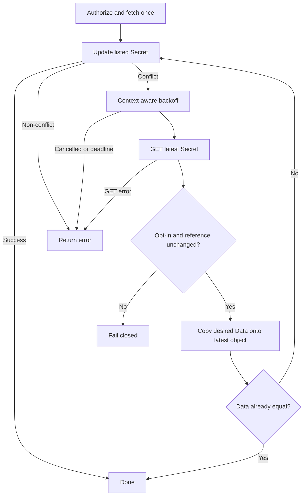

# 設計文件：Sync Update Conflict Retry

## 設計摘要

本設計在 application 層擴充 `K8sSecretRepo.GetSecret`，並將單次 Secret update 改為 context-aware bounded conflict retry。第一次 update 沿用 list 取得的物件；只有 conflict 後才 GET 最新物件。最新物件必須仍有同步 opt-in label，且 parsed backend/path/keys 與本輪已授權 reference 相同，才能只替換 Data 並再次 update。非 conflict、契約改變與 context 結束都立即停止。

## 文件定位

本設計實現同目錄 `requirements.md` 的 conflict retry 與 stale secret reference 防護。它接續既有 Secret 完整快照與 Worker graceful shutdown，不重寫 fetcher、authorization policy、Webhook、Kubernetes client construction 或 graceful manager。

## 已知契約狀態

- 需求來源: `requirements.md` 的新行為與驗收情境
- API / CLI / Hook contract: 無對外 API、CLI、annotation 或 config 變更
- Data contract: 遠端成功結果仍是受管 `Secret.Data` 的完整快照；retry 不 merge 本地 Data
- Kubernetes contract: `Update` 以 `resourceVersion` 實施 optimistic concurrency，conflict 可由 `apierrors.IsConflict` 辨識
- 既有 concrete capability: `K8sRepository.GetSecret(ctx, namespace, name)` 已存在並以 `%w` 保留底層錯誤
- 既有 application gap: `K8sSecretRepo` 未包含 `GetSecret`，`syncSecret` 只 update 一次
- 可用 dependency: 目前 `k8s.io/client-go v0.35.2` 提供 `retry.DefaultBackoff`；`k8s.io/apimachinery` 提供 context-aware `wait.ExponentialBackoffWithContext`
- 不可假造: 不假設 conflict 後 reference、opt-in、metadata 或 Secret 存在狀態不變

## Bounded Context

包含：

- Sync Worker 的 Kubernetes Secret update conflict 判斷
- conflict 後 GET 最新物件與 metadata preservation
- 同步 opt-in 與 secret reference revalidation
- bounded exponential backoff 與 context cancellation
- application repository interface 與測試 mocks 調整
- conflict 行為文件與回歸驗證

不包含：

- Vault/AWS fetch retry 或重新 fetch
- list retry、Webhook mutation retry、server-side apply 或 patch
- policy reload、authorization schema、RBAC 或 Kubernetes deployment
- metrics schema、alert、dashboard 或 retry config
- `Secret.Data` 多 writer ownership 協調

## 設計原則

- fail closed：最新同步契約無法證明與原始已授權 reference 相同時，不寫入資料。
- preserve latest object：conflict 後以最新物件為基底，只改 Data。
- no extra happy-path I/O：第一次 update 成功不 GET。
- bounded and cancellable：重試次數有限，backoff、GET、update 都接受同一 context。
- single fetch：本輪已抓取的 snapshot 只在 reference 不變時重用，不因 conflict 重複存取外部機密。
- minimal surface：不新增 public API、config 或 dependency。

## 需求對應

| 需求 / 驗收情境 | 設計處理方式 | 驗證方式 |
|-----------------|--------------|----------|
| conflict 後成功 | 首次 update conflict 後 GET 最新物件並重試 | `TestSyncSecret_RetriesConflictWithLatestSecret` |
| 正常路徑無 GET | 第一次 attempt 直接使用 list 物件 | `TestSyncSecret_SuccessDoesNotGetLatestSecret` |
| 非 conflict 不重試 | callback 直接返回原錯誤 | `TestSyncSecret_NonConflictUpdateErrorDoesNotRetry` |
| retry exhaustion | 保存最後 conflict，backoff 結束後返回 | `TestSyncSecret_ConflictRetryExhausted` |
| reference 改變 | 比較 parsed ref，不同即 fail closed | `TestSyncSecret_ReferenceChangedDuringConflictDoesNotUpdate` |
| opt-in 移除 | GET 後檢查 label 值仍為 `true` | `TestSyncSecret_OptInRemovedDuringConflictDoesNotUpdate` |
| cancellation | 使用 `ExponentialBackoffWithContext` 與相同 ctx | `TestSyncSecret_ConflictRetryStopsOnContextCancellation` |
| 快照與授權回歸 | retry helper 位於 fetch/authorization 成功之後 | 全套 application tests |

## 受影響檔案計畫

| 檔案 | 預期變更 | 原因 | 風險 |
|------|----------|------|------|
| `internal/syncer/application/sync_worker_usecase.go` | 擴充 repo 介面、新增 retry backoff 欄位與 private update helper | 實作 conflict retry 與契約重驗 | application 增加 Kubernetes retry dependency |
| `internal/syncer/application/sync_worker_usecase_test.go` | mocks 支援 GET/序列錯誤，新增 conflict/cancellation/security tests | 固定 attempts 與 stale write 防護 | mock 狀態需 race-safe |
| `internal/syncer/infra/k8s_repository.go` | 原則上無 production 行為變更；必要時只確保 wrapped error 可辨識 | concrete method 已存在 | 不應把 retry 下推而繞過 application revalidation |
| `README.md` | 補充短暫 update conflict 會 bounded retry | 對外說明操作行為 | 不宣稱持續 conflict 必然成功 |
| 本 spec | 回填狀態與驗證結果 | SDD traceability | 必須與測試 selector 同步 |

## 目標結構或流程

### 正常路徑

1. parse reference。
2. 執行既有 workload authorization。
3. fetch 遠端完整 snapshot 一次。
4. Data 無變化則返回。
5. 以 list 物件執行第一次 update。
6. 成功即返回，不 GET。

### conflict 路徑

1. 第一次 update 回傳 conflict，保存該錯誤。
2. context-aware backoff 等待；context 結束則立即返回。
3. GET 最新 namespace/name Secret。
4. 檢查最新 label `inject-vault-agent=true`。
5. parse 最新 reference；nil、parse error 或與原始 reference 不同即停止。
6. 以最新 Secret deep copy 為基底，只將 Data 設為 desired snapshot。
7. 若最新 Data 已等於 desired snapshot，視為成功，不再 update。
8. update 最新物件；成功返回、conflict 繼續、非 conflict 立即返回。
9. attempts 耗盡時返回最後 conflict。

## Mermaid Diagram



## 介面與資料契約

### Application repository interface

`K8sSecretRepo` 新增：

```go
GetSecret(ctx context.Context, namespace, name string) (*corev1.Secret, error)
```

concrete `K8sRepository` 已符合此方法，不新增 exported implementation。

### Retry policy

- production default: `retry.DefaultBackoff`
- execution: `wait.ExponentialBackoffWithContext`
- current module contract: 4 attempts，初始 10ms、factor 5、jitter 0.1
- 測試: 每個 `SyncWorkerUseCase` instance 可覆寫 private backoff 為零延遲，不修改 package global
- 對外設定: 無

### Reference equality

- 比較 `Backend`、`Path` 與 `Keys`。
- `Keys` 採 parsed slice 精確順序比較；順序改變時保守視為契約變更，延後到下一輪。
- 最新 reference 必須可解析且不可為 nil。
- 最新 Secret 必須保有 label `inject-vault-agent=true`。

### Error contract

- update 必須保留原 Kubernetes error，讓 `apierrors.IsConflict` 能跨 `%w` 辨識。
- 非 conflict、GET error、context error 直接返回可 unwrap 的 cause。
- exhaustion 返回 wrapped last conflict，不以通用 timeout 取代。
- reference 或 opt-in 改變回傳英文錯誤，只包含 namespace/name 與契約類型，不包含 path、keys、Data 或機密值。

## 關鍵行為

- 第一次 update 使用 list 物件，避免正常路徑新增 GET。
- conflict 之後不得再次使用 stale object。
- 最新物件的 labels、annotations、owner references 與其他 metadata 不被舊物件覆蓋。
- reference revalidation 發生在任何 retry update 之前。
- reference 改變時不重新 authorization/fetch；直接停止本輪，避免同一次操作跨越兩個授權決策。
- remote fetch 每個 Secret 每輪最多一次。
- context cancellation 不計入新的 retry error metric；本次不新增 metrics。
- retry helper 不啟動 goroutine，不建立無 bounded wait。

## 替代方案

| 方案 | 優點 | 缺點 | 結論 |
|------|------|------|------|
| application context-aware retry＋reference revalidation | 可保護授權與 stale data 邊界，容易單元測試 | application 依賴 Kubernetes error/backoff package | 採用 |
| 直接使用 `retry.RetryOnConflict` | 官方 helper、程式短 | backoff sleep 不直接接受 context | 不採用 |
| repository 內部透明 retry | infra 封裝完整 | 無法安全比較 application secret reference | 不採用 |
| conflict 後重跑完整 `syncSecret` | reference 改變可立即收斂 | 可能重複 fetch 外部機密並跨授權狀態，控制流複雜 | 不採用 |
| 改用 server-side apply | ownership 模型較明確 | 需要 field manager、相容性與契約重設計 | 不納入本 BugFix |
| 完全不 retry | 變更最小 | 一致性延遲到下一個 interval | 不採用 |

## 風險與處理方式

| 風險 | 影響 | 處理方式 | 驗證 |
|------|------|----------|------|
| stale object 覆蓋 metadata | 其他 controller 的變更遺失 | 每次 conflict 後 GET，以最新物件為基底 | metadata preservation assertion |
| reference 變更後寫入舊資料 | 跨路徑機密洩漏 | parsed ref equality fail closed | reference changed test |
| opt-out 後仍被管理 | 違反 workload 意圖 | retry 前重驗 label | opt-in removed test |
| cancellation 卡在 backoff | 優雅關機延遲 | `ExponentialBackoffWithContext` | blocking GET/cancel test |
| 非 conflict 被誤重試 | 放大 API 壓力 | 只對 `apierrors.IsConflict` 返回 retry condition | forbidden test |
| exhaustion 遺失原因 | 無法辨識 conflict | 保存並 wrap last conflict | exhaustion assertion |
| 測試依賴真實 jitter | flaky 或緩慢 | instance-level zero-delay backoff | race tests |

## 實作注意事項

- 先新增 red tests，再擴充 `K8sSecretRepo.GetSecret`，讓所有 mocks 明確實作新契約。
- tests 建立 Kubernetes conflict 時使用 `apierrors.NewConflict`，不要只比對字串。
- mock 的 GET/update 序列與 counters 若跨 goroutine使用，需以 mutex 或 channel 保護。
- desired Data 套用到 latest object 時建立獨立 map，避免 alias 造成測試或後續 mutation 汙染。
- backoff helper 必須區分 condition error、context error與 attempts exhaustion。
- 若實作需要 config、RBAC、metrics 或 deployment 變更，先更新 requirements/tasks 邊界或詢問使用者。
- `_workspace/` 不屬於本 spec，不納入提交。
