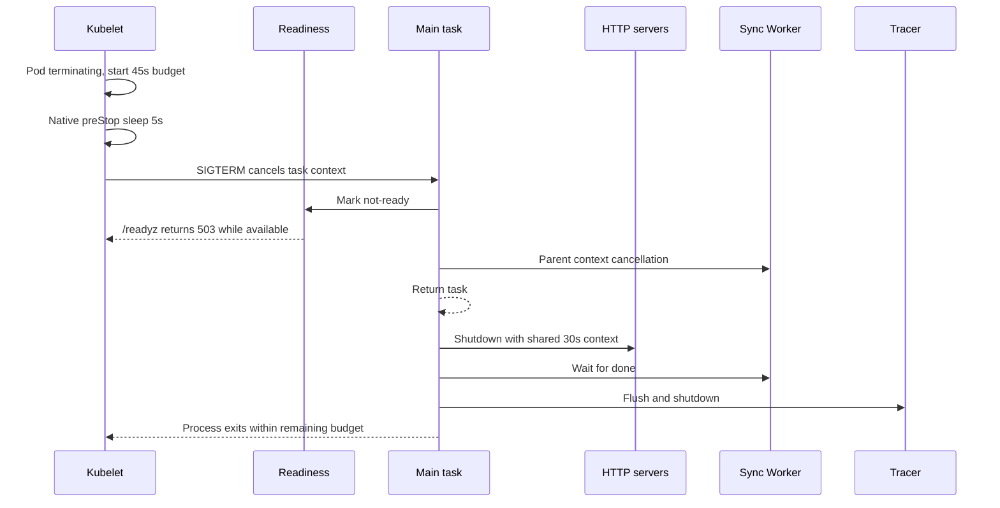

# 設計文件：Kubernetes Graceful Termination

## 設計摘要

本設計新增 package-private atomic readiness state 與 lifecycle wait helper，使 signal/server error path 在 task 返回前統一切換為 not-ready。Deployment 設定 45 秒 termination budget 與 5 秒 Kubernetes native preStop sleep；既有 graceful manager 繼續提供 30 秒 cleanup context，並維持 HTTP、Worker、tracer 的 LIFO cleanup 順序。

## 文件定位

本設計實現同目錄 `requirements.md`，補齊上一個 Worker graceful shutdown spec 未納入的 Kubernetes deployment budget 與 readiness transition。不重寫 Sync Worker cancellation、conflict retry、Webhook security、Secret snapshot 或外部 graceful library。

## 已知契約狀態

- 需求來源: code review 後續清單與 `requirements.md`
- HTTP contract: `/healthz`、`/readyz` 位於 operations port；目前兩者固定回傳 `200`
- process contract: `commons/graceful` 取消 task context，task 返回後建立獨立 30 秒 cleanup context
- Worker contract: task context cancellation 會立即傳到 Worker；cleanup 再 bounded wait done
- cleanup contract: cleaners LIFO，實際順序 HTTP、Worker wait、tracer
- deployment contract: 修正前 base 未設定 termination grace 或 lifecycle hook，prod overlay 直接引用 base
- image contract: Chainguard static runtime 不提供 shell或 `sleep` command
- Kubernetes contract: lifecycle handler 支援 native `sleep.seconds`；本機 `kubectl v1.33.2` 可 render 該 manifest
- 驗證證據: 使用者已在目標 cluster 完成 prod overlay server-side dry-run，Kubernetes API 接受 native sleep

## Bounded Context

包含：

- operations `/readyz` 的 in-memory concurrency-safe state
- signal 與 HTTP server error exit path 的 not-ready transition
- base Deployment termination budget 與 native preStop sleep
- base/prod Kustomize render 驗證
- README 與繁體中文 deployment 文件

不包含：

- `/healthz` state、startup probe 或 readiness gate
- external load balancer/CNI propagation implementation
- graceful library、Worker、tracer 或 HTTP shutdown 重構
- exec hook、sidecar、shell 或 image 變更
- config/env schema、PDB、replicas、rollout strategy
- Kubernetes cluster end-to-end signal test

## 設計原則

- truthful readiness：process 決定退出後不得繼續宣告 ready。
- liveness separation：not-ready 不等於 process dead，shutdown 期間不觸發 liveness restart。
- bounded timeline：preStop、cleanup 與 buffer 都有明確上限。
- static-image compatible：使用 kubelet native sleep，不要求 container 內工具。
- preserve cleanup：只在 task wait boundary 加狀態轉換，不改 cleaners 與 Worker lifecycle。
- deterministic tests：以 context/channel/httptest 驗證，不依賴 OS signal 或 wall-clock sleep。

## 時間預算

| 階段 | 上限 | 執行者 | 說明 |
|------|------|--------|------|
| native preStop drain | 5 秒 | kubelet | Pod terminating 後、SIGTERM 前等待 Endpoint propagation |
| application cleanup | 30 秒 | `commons/graceful` | HTTP Shutdown、Worker wait、tracer shutdown 共用 budget |
| buffer | 10 秒 | Kubernetes runtime | 訊號傳遞、排程與收尾誤差 |
| Pod termination total | 45 秒 | kubelet | 超過後可強制終止 container |

約束：`5 + 30 + 10 = 45`。不得把 preStop 5 秒誤算在 application cleanup context 之外又忽略 Pod total 是從 termination 開始計時。

## 需求對應

| 需求 / 驗收情境 | 設計處理方式 | 驗證方式 |
|-----------------|--------------|----------|
| readiness transition | atomic bool handler | `TestReadinessHandler_TransitionsToNotReady` |
| signal not-ready | wait helper 的 ctx branch | `TestWaitForTermination_ContextMarksNotReady` |
| server error not-ready | wait helper 的 error branch | `TestWaitForTermination_ServerErrorMarksNotReady` |
| termination 45 秒 | Pod spec 明確設定 | Kustomize render |
| shell-free preStop | native `sleep.seconds: 5` | render 中無 exec |
| cleanup 回歸 | 不改 helper/cleaner order | main 與全套 race tests |

## 受影響檔案計畫

| 檔案 | 預期變更 | 原因 | 風險 |
|------|----------|------|------|
| `cmd/vault-agent/main.go` | 新增 readiness state/handler 與 wait helper，task exit 前 mark false | 修正固定 ready | select orchestration 改動可能吞掉 server error |
| `cmd/vault-agent/main_test.go` | 新增 handler、signal、server error tests | 固定 lifecycle contract | 不得用 sleep 同步 |
| `deployments/kustomize/base/deployment.yaml` | termination 45、native preStop sleep 5 | 對齊 Pod/application budget | 舊 cluster API 相容性 |
| `README.md` | 更新優雅關機時間軸 | 對外說明 | 不得宣稱零中斷 |
| `docs/deploy.zh-Hant.md` | 補 termination budget、native hook 與驗證 | 操作文件 | 必須說明 cluster dry-run |
| 本 spec | 回填狀態與驗證 | traceability | selector 需與實作同步 |

## 目標結構或流程

### Readiness state

1. main 建立 readiness state，初始 `true`。
2. `/readyz` handler 讀取 atomic state。
3. ready 時只回傳 `200`；not-ready 時只回傳 `503`。
4. `/healthz` 保持既有固定 `200` handler。

### Task exit

1. servers 與 Worker 依現況啟動。
2. task 呼叫 package-private `waitForTermination(ctx, errCh, readiness)`。
3. ctx cancellation 或 server error 任一發生時，helper 先 mark not-ready。
4. ctx branch 返回 nil；server error branch返回原 error。
5. task defer cancel Worker，接著 graceful cleanup 依現況執行。

### Kubernetes termination

1. Pod 進入 terminating，45 秒總 budget 開始。
2. kubelet 執行 native preStop sleep 5 秒，不進入 container shell。
3. kubelet 對主 process送 SIGTERM。
4. graceful task context 取消，readiness 轉 503、Worker cancellation 傳遞。
5. task 返回，30 秒 cleanup context 開始。
6. HTTP Shutdown、Worker wait、tracer shutdown 完成後 process 退出。

## Mermaid Diagram



## 介面與資料契約

### Readiness helper

建議 package-private 型別：

```go
type readinessState struct {
    ready atomic.Bool
}
```

行為：

- constructor 將 state 設為 true。
- `markNotReady()` 單向設為 false，本次不提供重新 ready。
- `ServeHTTP` 實作 `http.Handler`，只根據 atomic value 寫 status。

### Lifecycle wait helper

建議介面：

```go
func waitForTermination(ctx context.Context, serverErrors <-chan error, readiness *readinessState) error
```

- 任一 select branch 都 mark not-ready。
- context branch 返回 nil，維持 signal 為正常退出。
- server error branch返回相同 error，維持 graceful error aggregation。
- 不關閉外部 channel、不啟動 goroutine、不等待 timer。

### Manifest contract

```yaml
spec:
  template:
    spec:
      terminationGracePeriodSeconds: 45
      containers:
        - name: vault-agent
          lifecycle:
            preStop:
              sleep:
                seconds: 5
```

## 關鍵行為

- readiness state 使用 `sync/atomic`，不得使用未同步 bool。
- readiness false 是單向 transition，避免 shutdown 中被重新設為 ready。
- signal/server error 都在 task 返回前 mark false。
- healthz 不依賴 readiness state。
- native preStop 不修改 process state；SIGTERM 收到後才 mark false。
- preStop 5 秒計入 Pod 45 秒 budget，但不計入 graceful 30 秒 cleanup context。
- 不新增 application sleep，避免同一 drain window 重複計算。
- cleanup option 註冊順序與 shared context 不變。

## 替代方案

| 方案 | 優點 | 缺點 | 結論 |
|------|------|------|------|
| native preStop sleep＋atomic readiness | static image 相容、時間軸清楚 | 需 cluster 支援 native sleep | 採用 |
| exec `sleep 5` | 常見、容易理解 | static image 無 executable | 不採用 |
| application 收到 SIGTERM 後 sleep | 不依賴 lifecycle API | cleanup 延後且容易重複計算 budget | 不採用 |
| HTTP preStop endpoint | 可先 mark not-ready | 未認證 endpoint 可能被濫用，hook completion仍需 delay | 不採用 |
| 只設定 termination 45 秒 | 變更最小 | 無 propagation window、readiness仍不 truthful | 不採用 |
| readiness 初始 false直到 bind 完成 | startup contract更精確 | 需要 listener ownership 重構 | 不納入本 BugFix |

## 風險與處理方式

| 風險 | 影響 | 處理方式 | 驗證 |
|------|------|----------|------|
| readiness data race | race detector failure或錯誤 status | `atomic.Bool` | main race test |
| server error 被吞 | process誤報正常退出 | helper返回原 error | server error test |
| native sleep 不相容 | manifest 被 cluster 拒絕 | target cluster dry-run；文件標註 | Kustomize render 與 server-side dry-run 均通過 |
| budget 小於總時間 | cleanup被 SIGKILL | 5＋30＋10＝45 | manifest assertions |
| liveness 同步變 false | kubelet在 drain 中 restart | healthz維持原 handler | handler/code review |
| cleaner順序變動 | request或 trace 遺失 | 不修改 options registration | existing lifecycle tests/code review |

## 實作注意事項

- T1 先新增 readiness/helper tests，現況缺少型別時應 compile fail；記錄 red test 證據。
- readiness tests 使用 `httptest.NewRecorder`，不啟動真實 server。
- context branch test 使用已取消 context；server error test 使用 buffered channel，均不需要 sleep。
- manifest 只在 base 修改，prod overlay應自然繼承。
- 使用 `kubectl kustomize` render；不要在測試中要求 live cluster credential。
- target cluster 的 server-side dry-run release gate 已由使用者執行並通過；此結果不代表實際 rollout 的 request drain 已完成端對端驗證。
- 若 native sleep 必須支援更舊 cluster，需另行決定 fallback，不在本 spec 偷換 exec hook。
- `_workspace/` 不屬於本 spec，不納入提交。
