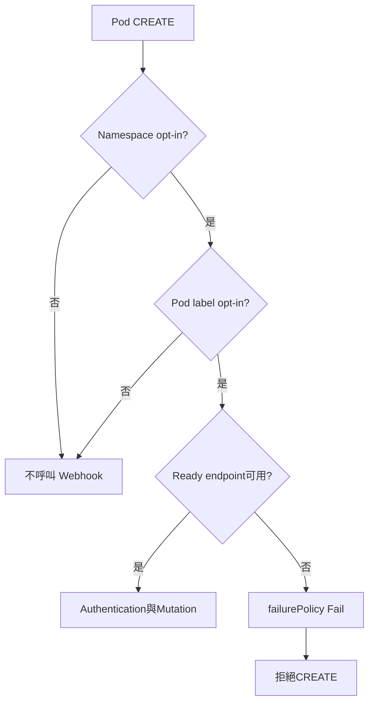

# 設計文件：Webhook Failure Policy 與高可用

## 設計摘要

設計讓canonical Webhook object收斂selector並把final failure policy改為`Fail`。Deployment採2 replicas、RollingUpdate `maxUnavailable: 0`與`maxSurge: 1`、PDB `minAvailable: 1`，並用hostname topology spread與zone preferred pod anti-affinity降低單點故障。首次切換使用兩階段rollout：先套用繼承prod但覆寫`Ignore`的`prod-fail-open`overlay，驗證selector與HA後再套用正式prod；outage rollback反向執行。

## 文件定位

本設計實現同目錄 `requirements.md`，沿用已完成的 `/readyz`、native preStop 5 秒、application cleanup 30 秒與 Pod grace 45 秒契約。不修改 Go handler、Secret fetching 或 authorization policy。

## 已知契約狀態

- 需求來源: secure-secret-access 延後的 failure policy 風險與本 spec requirements
- API / CLI / Hook contract: AdmissionReview v1、Pod CREATE、`/mutate`、timeout 5 秒
- Data contract: namespace label `vault-agent.io/admission-webhooks=enabled`；Pod label與 annotation `inject-vault-agent=true`
- 既有實作: canonical `admission.yaml`、Deployment replica 1、PDB 1、Service selector、readiness/graceful termination
- 不可假造: 不假設 target cluster 有兩個 node、zone label、control-plane metrics或零中斷保證

## Bounded Context

包含：

- canonical Webhook manifest 與 selector
- base/prod replicas、RollingUpdate、topology spread
- PDB 與 Service/Deployment selector consistency
- duplicate manifest cleanup
- staged rollout、failure drill、rollback與操作文件
- availability與admission failure監控需求

不包含：

- Webhook application code、authentication與authorization
- external secret backend HA
- cert-manager、API Server或cluster network HA
- autoscaling、service mesh、Blue-Green、Canary controller
- 數值型SLA/SLO承諾

## 設計原則

- 先縮 blast radius，再啟用 fail closed。
- final desired state安全預設為 `Fail`，首次遷移仍採可驗證的兩階段流程。
- 保持至少一個 ready endpoint，再進行 rollout或voluntary disruption。
- 拓撲不足時允許降級排程，但必須由preflight與監控揭露。
- rollback只暫時放寬 admission availability，不放寬機密認證、授權或RBAC。
- manifest只有一個canonical source，文件不得指向未引用檔案。

## 需求對應

| 需求 / 驗收情境 | 設計處理方式 | 驗證方式 |
|-----------------|--------------|----------|
| 只攔截 opt-in Pod | canonical objectSelector要求 injection label | render assertion＋synthetic admission |
| opt-in fail closed | final `failurePolicy: Fail` | render assertion＋outage drill |
| 非 opt-in unaffected | selector在API Server端排除 | outage drill |
| 單 replica failure continuity | replicas 2＋Service readiness endpoints | delete-one-pod drill |
| safe RollingUpdate | 0 unavailable＋1 surge | render assertion＋rollout observation |
| voluntary disruption | PDB minAvailable 1 | render assertion＋eviction test |
| rollback | 先暫時 Ignore，再rollback Deployment | runbook演練 |

## 受影響檔案計畫

| 檔案 | 預期變更 | 原因 | 風險 |
|------|----------|------|------|
| `deployments/kustomize/base/admission.yaml` | selector與 final failure policy | canonical admission contract | 錯誤 selector會擴大或縮小攔截範圍 |
| `deployments/kustomize/base/deployment.yaml` | replicas、strategy、hostname spread、zone preference | 建立HA與safe rollout | cluster資源或拓撲不足 |
| `deployments/kustomize/base/pdb.yaml` | 確認或明示minAvailable 1 | voluntary disruption保護 | 可能阻擋node drain |
| `deployments/kustomize/base/webhook.yaml` | 移除未引用duplicate | 消除漂移 | 文件引用需同步修正 |
| `deployments/kustomize/overlays/prod/kustomization.yaml` | replicas對齊2 | 避免overlay覆寫回1 | capacity增加 |
| `deployments/kustomize/overlays/prod-fail-open/kustomization.yaml` | 只覆寫failure policy為Ignore | 可重現migration與rollback | 被長期誤用會維持fail open |
| `docs/deploy.zh-Hant.md` | staged rollout、rollback、drill | 操作安全 | 程序未演練 |
| `docs/annotations.zh-Hant.md`、README | canonical selector與fail-closed語意 | 文件一致 | 無 |
| 英文對應文件 | 修正canonical path與已存在段落的契約 | 避免雙語文件漂移 | 翻譯一致性 |

## 目標結構或流程

```text
Pod CREATE
  |
  +-- namespace label不符合 -----------------> 不呼叫本Webhook
  |
  +-- Pod injection label不符合 -------------> 不呼叫本Webhook
  |
  +-- 兩者符合
        |
        +-- 至少一個ready endpoint ----------> 驗證與mutation
        |                                        +-- allow/deny
        |
        +-- 無ready endpoint/TLS/timeout ------> failurePolicy Fail
                                                 +-- CREATE被阻止
```

首次遷移：

```text
Phase 1: prod-fail-open
  apply過渡overlay -> 等待2 ready endpoints -> selector與synthetic tests

Phase 2: Fail
  apply正式prod overlay -> 確認Fail -> outage drill -> observe
```

## Mermaid Diagrams



## 介面與資料契約

### API / CLI / Hook

- Input: namespace與Pod labels、AdmissionReview v1 Pod CREATE
- Output: 正常時沿用既有 AdmissionResponse；Webhook不可達時由API Server依Fail拒絕
- Error: API Server admission error不得被文件描述為application authorization deny

### Data / Config

- 新增資料: 無
- 既有資料相容性: 沒有Pod injection label的既有workload將不再呼叫Webhook；這與文件宣稱的opt-in契約一致

## 關鍵行為

### Selector

- namespaceSelector保留enabled label與system namespace排除。
- objectSelector新增 `inject-vault-agent In ["true"]`，可保留自我排除條件作defense in depth。
- label負責API Server端過濾，annotation仍由application確認明確opt-in與resource reference。

### Availability

- replicas固定2；prod overlay不得覆寫成1。
- strategy為RollingUpdate，`maxUnavailable: 0`、`maxSurge: 1`。
- Service沿用ready endpoints；readiness、preStop與termination budget不變。
- PDB為1，只對voluntary eviction生效。

### Topology

- hostname使用`maxSkew: 1`、`whenUnsatisfiable: ScheduleAnyway`，labelSelector為`app=vault-agent`。
- zone使用weight 100的`preferredDuringSchedulingIgnoredDuringExecution` pod anti-affinity，不是硬性排程條件。
- Kubernetes官方文件指出，多個topology spread constraints會略過缺少任一topology key的node，因此不把zone設為第二個explicit constraint。
- runtime驗證必須回報實際node/zone分布；同node或同zone是degraded，但不使Pod因本設計的zone preference而Pending。
- 參考：[Pod Topology Spread Constraints](https://kubernetes.io/docs/concepts/scheduling-eviction/topology-spread-constraints/)

### Rollout與Rollback

- 首次切換不能只執行一次最終apply並假設資源順序。
- Phase 1套用`prod-fail-open`，它完整繼承prod，只把canonical Webhook的failure policy覆寫為Ignore；確認selector、兩個ready endpoints與正常synthetic admission。
- Phase 2套用正式prod overlay，其他resources不變，只讓failure policy回到canonical Fail，再執行outage drill。
- rollback可重新套用`prod-fail-open`快速解除admission阻塞，再rollback Deployment；不可把過渡overlay當長期desired state。
- outage rollback先切Ignore，再復原Deployment；修復後重新走Phase 1/2。

### Observability

- 必須監控Deployment desired/available replicas、Pod readiness/restarts、Service ready endpoints。
- 平台可用時監控API Server admission webhook failure、rejection與latency。
- 缺少control-plane metrics時，以synthetic opt-in admission、Kubernetes events與audit data補足。
- 告警不得包含secret path、keys、token或完整AdmissionReview。

## 前後端或跨模組設計

API Server先套用selectors，再透過Service選擇ready Pod。Deployment、readiness、topology與PDB提供application endpoint可用性；failurePolicy只決定API Server在呼叫失敗時的CREATE結果，不修復availability本身。

## Protected Behavior

- caller authentication、Admission contract validation與workload authorization順序不變。
- Webhook只處理CREATE，timeout維持5秒。
- namespace opt-in與system namespace排除不變。
- readiness 503、healthz 200、preStop 5秒、cleanup 30秒、termination grace 45秒不變。
- Secret sync、RBAC、policy directory與validation CLI不變。

## 替代方案

| 方案 | 優點 | 缺點 | 結論 |
|------|------|------|------|
| 保持Ignore | Webhook outage不阻塞部署 | opt-in Pod可能缺少機密仍建立 | 不採用作final state |
| 直接改Fail、仍單replica | 變更最小 | 單點故障且selector過寬 | 不採用 |
| Fail＋HA但不縮selector | fail closed | 受管namespace blast radius過大 | 不採用 |
| Fail＋selector＋2 replicas＋safe rollout | 安全邊界與可用性平衡 | 需要capacity、監控與staged migration | 採用 |
| replicas 3 | 更高故障容忍 | 資源成本較高，尚無SLO依據 | 待SLO另案評估 |
| required anti-affinity | 強制跨node | 兩node環境的surge可能無法排程 | 不採用；改best-effort spread |

## 風險與處理方式

| 風險 | 影響 | 處理方式 | 驗證 |
|------|------|----------|------|
| selector錯誤 | 非目標Pod被阻塞或目標Pod未保護 | render assertion＋兩種synthetic Pod | target cluster drill |
| 零ready endpoint | opt-in deploy outage | 2 replicas、0/1 rollout、PDB、alerts | delete-one與scale-zero drill |
| 拓撲同node或zone | 單一failure domain可能失去兩replicas | hostname spread＋zone preference＋distribution alert | node/zone inspection |
| cert/auth/policy失效 | Pods ready可能不足或requests被拒絕 | startup observation、synthetic admission | Phase 2 gate |
| rollback放寬過久 | opt-in Pod重新fail open | 時限化變更、incident紀錄、修復後重啟Phase 1/2 | runbook review |
| duplicate manifest漂移 | 文件與render不一致 | 刪除unused manifest並更新引用 | `kustomize` resources audit |

## 實作注意事項

- 先建立manifest assertions固定現況缺口，再修改YAML。
- 首次production rollout的Phase 1與Phase 2是操作步驟，不得由單次apply宣稱完成。
- failure drill只能在明確的non-production namespace執行，必須先記錄replica restore值與rollback命令。
- 若target cluster只有一個node，仍可render與排程兩replicas，但不得宣稱具備node-level HA。
- `_workspace/`不屬於本spec，不納入提交。
