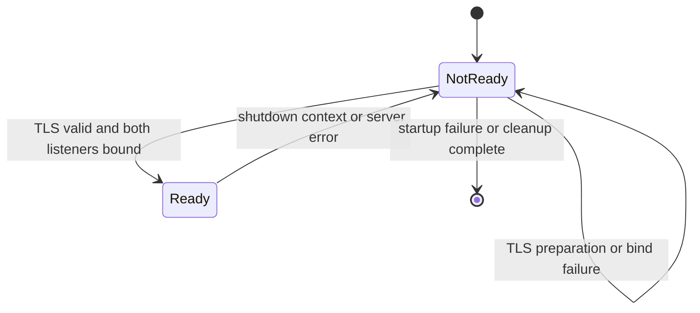
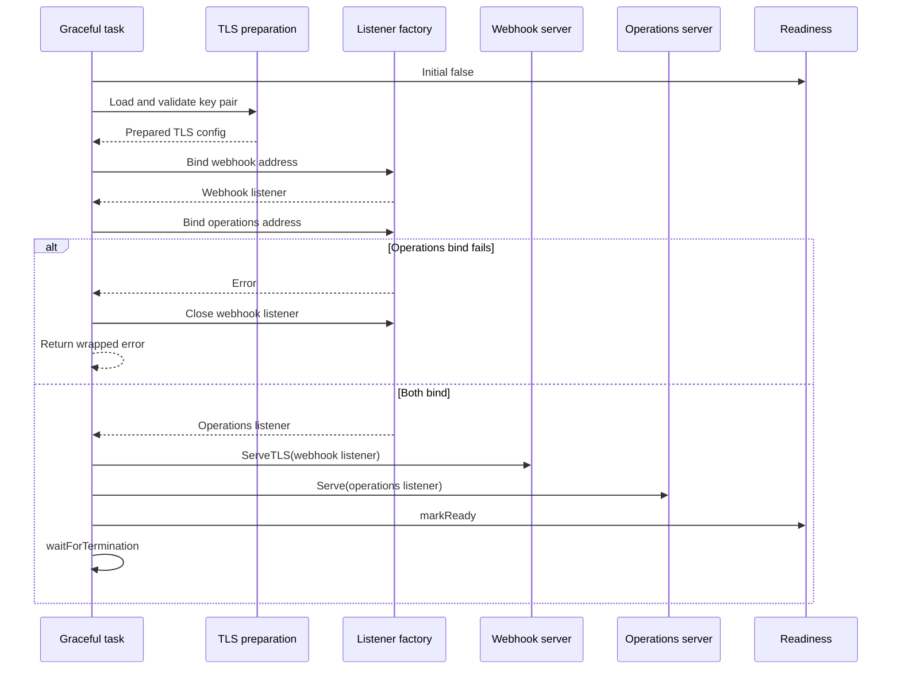

# 設計文件：Webhook Startup Readiness

## 設計摘要

本設計將readiness state改為初始false，新增顯式`markReady()` transition，並把兩個server的socket建立從`ListenAndServe*`內部移到可測試的startup orchestration。流程先同步載入TLS key pair，再依序bind Webhook與operations listeners；第二個bind失敗時立即關閉第一個listener。兩個listeners成功後才啟動既有HTTP servers並mark ready。shutdown與server error沿用既有`waitForTermination`，把狀態切回not-ready。

## 文件定位

本設計實現同目錄`requirements.md`，修正Kubernetes graceful termination spec刻意未納入的startup readiness gate，並降低fail-closed Webhook在rolling startup期間收到流量的風險。不修改AdmissionReview處理、caller authentication、authorization、Secret fetch、Sync Worker語意、Kubernetes manifests或外部backend health model。

## 已知契約狀態

- 需求來源: 使用者要求先規劃startup readiness，目標叢集演練最後再做。
- HTTP contract: `/readyz`與`/healthz`位於operations port；ready為`200`、not-ready為`503`，沒有response body contract。
- readiness contract: `atomic.Bool`已存在，但constructor目前立即設定true，只有`markNotReady()`。
- server contract: Webhook使用`http.Server.ListenAndServeTLS`；operations使用`ListenAndServe`；兩者error經容量2的channel交給`waitForTermination`。
- TLS contract: Webhook TLS config保留最低TLS 1.2與既有mTLS設定；server certificate/key來源為`cfg.TLS.CertFile`與`cfg.TLS.KeyFile`。
- process contract: `commons/graceful` task返回後，以shared 30秒context按HTTP、Worker、tracer順序cleanup。
- deployment contract: readiness probe為operations `/readyz`；preStop 5秒、application cleanup 30秒、Pod termination 45秒。
- HA contract: base/prod為2 replicas、RollingUpdate 0/1、PDB1，final Webhook `failurePolicy: Fail`。
- runtime contract: log與error使用英文，不記錄secret、token、PEM、private key或完整AdmissionReview。

## Bounded Context

包含：

- `readinessState`的initial false、mark ready與mark not-ready transitions
- TLS server key pair的startup prerequisite
- Webhook與operations listener的顯式建立、ownership與partial failure cleanup
- server startup ordering與ready gate
- main package deterministic unit tests
- README與既有中英文部署文件的startup readiness說明

不包含：

- readiness probe manifest、startupProbe、ports或timeouts調整
- handler、authentication、authorization或TLS trust policy變更
- Vault/AWS/Kubernetes API/policy readiness dependency
- Sync Worker首輪、leader election或backend health gate
- graceful library、cleanup順序、30秒timeout或5/45 manifest契約
- PDB、replicas、topology、rolling strategy或failurePolicy
- live cluster rollout、failure drill或AdmissionReview端對端測試

## 設計原則

- truthful startup：尚未取得所有必要listener前不得宣告ready。
- fail atomically：任一startup prerequisite失敗時維持not-ready並完整回收本次已取得資源。
- explicit ownership：由取得listener的startup layer負責在交付server前處理partial failure；交付後由`http.Server`與既有Shutdown lifecycle管理。
- preserve security：保留同一份TLS config、最低版本、client authentication與request authenticator。
- preserve lifecycle：不改signal/error semantics、Worker cancellation、cleaner order或shared timeout。
- deterministic tests：以injected function、fake listener與sentinel error驗證順序，不依賴port競爭、sleep或真實OS signal。
- bounded readiness：readiness只代表本process可接受兩個listener的流量，不代表外部secret backend健康。

## 狀態模型



允許的正常transition為`false -> true -> false`。本spec不提供retry loop，因此startup failure不會在同一process內由false重新嘗試；由process退出與Kubernetes restart處理。

## 啟動流程



## 關鍵技術決策

### 1. readiness初始false

`newReadinessState()`只建立zero-value `atomic.Bool`，不再儲存true。新增package-private `markReady()`，並保留`markNotReady()`。HTTP handler仍只根據atomic值回傳status。

建議介面：

```go
type readinessState struct {
    ready atomic.Bool
}

func newReadinessState() *readinessState
func (s *readinessState) markReady()
func (s *readinessState) markNotReady()
func (s *readinessState) ServeHTTP(http.ResponseWriter, *http.Request)
```

### 2. TLS key pair同步準備

在listener bind與mark ready前呼叫`tls.LoadX509KeyPair`。成功後把certificate放入既有`webhookServer.TLSConfig.Certificates`；後續`ServeTLS`可使用已準備的certificate，而不在server goroutine延後發現檔案或key pair錯誤。

設計約束：

- 不重建或覆蓋既有`ClientCAs`、`ClientAuth`、`MinVersion`等欄位。
- 避免直接修改可能被其他owner共用的TLS config；若實作需要，先clone再設定`Certificates`。
- error以`fmt.Errorf("load webhook TLS key pair: %w", err)`類型保留cause。
- log與error不得輸出PEM內容、private key或secret值。

### 3. 顯式listener factory

使用標準庫`net.Listen("tcp", address)`取得兩個listeners。為了測試，不引入interface hierarchy；使用package-private function type注入listen行為。

建議結構：

```go
type listenFunc func(network, address string) (net.Listener, error)

type serverListeners struct {
    webhook    net.Listener
    operations net.Listener
}

func bindServerListeners(
    webhookAddress string,
    operationsAddress string,
    listen listenFunc,
) (*serverListeners, error)
```

行為契約：

1. 先bind Webhook address。
2. 第一次bind失敗時直接返回wrapped error，不呼叫第二次。
3. 再bind operations address。
4. 第二次bind失敗時關閉Webhook listener；返回error時保留bind cause。若close也失敗，以`errors.Join`保留兩個cause，不得覆蓋原bind failure。
5. 兩次成功後轉移listeners ownership給server startup flow。

### 4. server啟動與ready transition

Webhook server改用`ServeTLS(webhookListener, "", "")`，因TLS config已含server certificate；operations server改用`Serve(operationsListener)`。兩個serve goroutine沿用既有error filter與容量2的channel。啟動goroutine後才呼叫`readiness.markReady()`並記錄`servers listening`。

ready gate代表：

- TLS certificate/key pair可解析且匹配。
- Webhook socket成功bind。
- operations socket成功bind。
- 兩個server goroutine已安排執行。

ready gate不代表：

- 已完成真實TLS handshake。
- API Server已成功送出AdmissionReview。
- Vault、AWS或Kubernetes API可用。
- Sync Worker已完成首輪同步。

若任一Serve立即返回error，既有`waitForTermination`會mark not-ready並進入cleanup；不新增startup polling或人工sleep。

### 5. Worker啟動順序

Sync Worker維持既有順序，在task進入後先由`startSyncWorker`建立done channel與deferred cancel，再執行TLS preparation與listener bind。原因是cleaners在task執行前已依`syncWorker != nil`註冊Worker wait；若startup prerequisite先失敗，done channel尚未建立，cleanup會得到nil channel並產生次要錯誤。startup失敗返回時defer仍會取消Worker，既有cleanup可安全等待done。此決策保留Worker lifecycle，不把Worker首輪結果納入readiness。

## Error與資源所有權

| 階段 | 失敗時ready | 已取得資源 | 必要處理 | error contract |
|------|-------------|------------|----------|----------------|
| TLS key pair | false | 無listener | 直接返回 | 保留load/parse cause |
| Webhook bind | false | 無 | 不嘗試operations bind | 保留webhook bind cause |
| Operations bind | false | Webhook listener | 關閉Webhook listener | 保留bind cause，必要時join close cause |
| Serve runtime | 先true再false | 兩個listeners | 既有Shutdown/Close cleanup | 保留非ServerClosed cause |
| Context cancel | false | 兩個listeners | 既有graceful cleanup | task返回nil |

不得在bind helper成功返回後由helper defer關閉listener，否則會在server取得ownership後提前關閉。不得同時保留`ListenAndServe*`與顯式`net.Listen`，避免重複bind同一address。

## 需求對應

| 需求／驗收情境 | 設計處理方式 | 驗證方式 |
|----------------|--------------|----------|
| A 初始not-ready | atomic zero value＋markReady | handler unit test |
| B shutdown transition | 保留waitForTermination | 既有context/error tests更新初始安排 |
| C 兩個bind後ready | 顯式listener factory與startup gate | injected listen sequencing test |
| D 第一個bind失敗 | early return | sentinel error與call count |
| E 第二個bind失敗 | close first listener | fake listener close count |
| F TLS失敗 | synchronous key pair preparation | invalid/mismatched fixture test |
| G lifecycle回歸 | 不改wait/cleanup contract |既有Worker與全套race tests |

## 受影響檔案計畫

| 檔案 | 預期變更 | 原因 | 風險 |
|------|----------|------|------|
| `cmd/vault-agent/main.go` | readiness初始false、TLS preparation、listener helper與startup ordering | 建立truthful ready gate | listener ownership或error channel race |
| `cmd/vault-agent/main_test.go` | state、TLS、bind sequencing與partial close tests | 固定啟動契約 | fake listener不應掩蓋ownership錯誤 |
| `README.md` | readiness功能描述改含startup gate | 對外契約一致 | 過度宣稱依賴健康度 |
| `docs/deploy.zh-Hant.md` | 補startup狀態與排障 | 操作可理解 | 不得把bind成功等同端對端成功 |
| `docs/deploy.en.md` | 同步既有英文對應段落 | 文件一致 | 與繁中語意漂移 |
| 本spec | 回填red evidence、狀態與驗證 | traceability | Boundary漂移 |

## Protected Behavior

- `/readyz`路徑、operations port與status-only response不變。
- `/healthz`在process存活期間固定`200`。
- Webhook `/mutate`、AdmissionReview v1與TLS/bearer/mTLS authentication不變。
- authorization deny-before-fetch、policy loading與backend clients不變。
- Webhook及operations server timeouts不變。
- signal path返回nil；server error path保留原cause。
- HTTP、Worker、tracer cleanup順序與30秒shared timeout不變。
- Deployment readiness probe、preStop5、cleanup30、termination45及HA manifests不變。
- runtime log/error使用英文且不含機密資料。

## 替代方案

| 方案 | 優點 | 缺點 | 結論 |
|------|------|------|------|
| 顯式TLS準備＋兩個listener bind後mark ready | prerequisite明確、可測partial cleanup | 需管理listener ownership | 採用 |
| 維持`ListenAndServe*`，以goroutine started channel當ready | 變更較少 | goroutine啟動不代表bind成功，無法精確處理partial failure | 不採用 |
| 只把readiness初始改false並固定延遲後mark ready | 容易實作 | wall-clock不能證明server可用，測試不穩定 | 不採用 |
| startupProbe取代application gate | manifest層可限制restart | startupProbe仍依賴application `/readyz`真實狀態 | 不採用 |
| 對兩個ports做self-dial後mark ready | 可驗證accept/TLS handshake | 增加loopback網路、憑證host驗證與啟動複雜度 | 不採用 |
| 把Vault/AWS health納入readiness | 可反映backend狀態 | backend波動可能同時移除所有fail-closed endpoints | 不採用 |

## 風險與處理方式

| 風險 | 影響 | 處理方式 | 驗證 |
|------|------|----------|------|
| partial bind洩漏socket | restart後仍無法bind或測試hang | 第二次失敗明確close第一個listener | fake close count test |
| close error覆蓋bind error | 根因不可診斷 | `errors.Join`保留兩個cause | errors.Is assertions |
| TLS config被覆蓋 | mTLS或最低版本失效 | clone/保留既有fields，只設定Certificates | unit/code inspection |
| ready短暫早於Serve runtime error | endpoint可能短暫可見 | goroutine後mark ready；任一error立即mark false；不使用sleep | lifecycle tests，最終cluster drill |
| Worker ordering回歸 | startup failure時cleanup等待nil done channel | 保留既有Worker先啟動順序與deferred cancel | Worker tests與race suite |
| 測試使用真實port不穩定 | CI偶發失敗 | injected listen與fake listener | deterministic tests |
| 文件暗示backend健康 | 操作者誤判 | 明列ready只代表本process listener能力 | 文件review |

## 實作注意事項

- T1先修改既有readiness test為初始503，並新增mark-ready、bind ordering、partial cleanup與TLS failure tests；production code修改前應得到預期red evidence。
- fake listener需實作`net.Listener`最小介面，並以atomic或mutex記錄close次數；不得用sleep等待goroutine。
- TLS fixture應由test helper產生或使用專用測試資料，禁止複製production certificate/private key。
- 若使用暫存檔，使用`testing.T.TempDir()`並限制fixture只存在測試生命週期。
- listener address使用既有`webhookServer.Addr`與`operationsServer.Addr`，不新增config。
- startup helper不得自行log；由runServer在成功gate後寫入不含機密的既有address log。
- 對`http.ErrServerClosed`的filter維持不變。
- 若實作發現`ServeTLS`與預載certificate整合需要更動HTTP/2或TLSNextProto，先更新本design與task Boundary，不得靜默改用降低TLS能力的方案。
- 不執行目標cluster操作；最後整合驗證由使用者另行啟動。
- `_workspace/`不屬於本spec，不納入提交。
