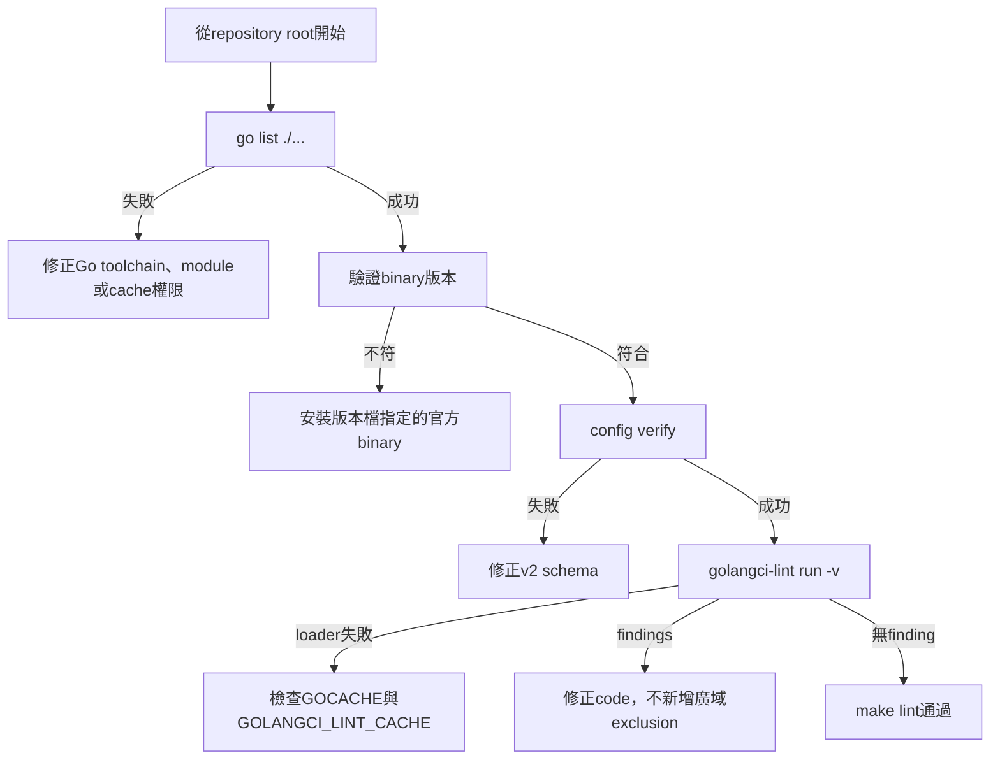

# 設計文件：golangci-lint 可重現設定與 Package Loading 診斷

## 設計摘要

本設計新增repository-owned golangci-lint v2 config與單一版本檔，讓Makefile與GitHub Actions共用相同工具版本。Config明確固定現有5個linters並使用readonly module loading；Makefile在分析前檢查binary版本。現有4個`errcheck`以CLI writer error handling修正，不使用全域exclusion。獨立lint workflow以只讀權限執行config verify與lint。受限環境的package loading問題以標準diagnostic與cache override文件化，不把個人路徑寫入repository。

## 文件定位

本設計實現同目錄`requirements.md`，收斂先前多個spec累積的lint工具債。它不屬於Webhook、authorization、policy schema或deployment behavior變更；唯一production code調整限於既有policy validation CLI的`io.Writer` error semantics。

## 已知契約狀態

- 需求來源: 使用者要求建立golangci-lint專案設定、確認package loading、使用v2 config、固定工具版本並讓`make lint`可重現通過。
- Go contract: module為`vault-agent`，go.mod指定Go `1.26.5`，`go list ./...`可列出9個packages。
- Make contract: `lint`目前直接呼叫PATH中的`golangci-lint run ./...`。
- Tool contract: discovery本機為v2.12.1；官方目前patch release為v2.12.2。
- Config contract: repository沒有config；v2 config唯一合法version為字串`"2"`。
- Linter baseline: 無config時v2.12.1啟用`errcheck`、`govet`、`ineffassign`、`staticcheck`、`unused`。
- Finding baseline: `policy_command.go`有4個unchecked output errors，其他packages沒有finding。
- CLI contract: success=0、validation failure=1、usage failure=2；stdout成功訊息與stderr錯誤訊息皆為英文；敏感policy值不得出現在error。
- CI contract: 現有Docker workflow對PR/main執行policy validate與image build，job具packages write；尚無lint gate。
- Security contract: workflow lint不需要packages write、secrets或外部服務credential。
- Environment evidence: 同一worktree在受限環境可能回報`no go files`，但具cache權限時loader成功；repository package缺失已被`go list`否定。

## Bounded Context

包含：

- golangci-lint v2 repository config
- golangci-lint單一版本來源與Makefile version guard
- package loading diagnostics與受限cache排障文件
- policy validation CLI的writer error handling及tests
- 獨立GitHub Actions lint workflow
- README與既有中英文開發文件
- 本spec狀態與驗證證據

不包含：

- Go版本、module dependencies或production dependencies升級
- tools.go、main go.mod tool directive或從source build golangci-lint
- 大量新linters、formatters、全專案style rewrite或baseline file
- policy schema、authorization、Webhook、Secret sync或backend behavior
- Docker build、Kubernetes manifests或release workflow重構
- 修正Codex、IDE或個人home目錄權限
- 自動下載未驗證的latest工具

## 設計原則

- repository ownership：設定不得取決於parent/home config。
- single version source：Makefile與CI讀取同一版本檔，避免雙重維護。
- official binary：遵循官方建議使用release binary，不污染主要Go module dependencies。
- explicit linters：固定已知規則集合，不依賴upstream defaults。
- no false green：修正finding，不用廣域exclusion、nolint或baseline掩蓋。
- deterministic diagnostics：先`go list`，再verbose lint，區分Go package、tool config與cache環境。
- truthful CLI：成功訊息寫不出去時不得回傳成功；既有failure path輸出失敗不得改寫原exit code。
- least privilege CI：lint workflow只需contents read，與image publishing權限隔離。

## 目標結構

```text
vault-agent/
├── .golangci.yml
├── .golangci-lint-version
├── Makefile
├── cmd/vault-agent/
│   ├── policy_command.go
│   └── policy_command_test.go
├── .github/workflows/
│   ├── docker-publish.yml
│   └── golangci-lint.yml
├── README.md
├── docs/
│   ├── README.zh-Hant.md
│   └── README.en.md
└── .specs/2026-08-04-16-55_Chore-golangci-lint-reproducibility/
```

## Package Loading 診斷流程



診斷優先序固定，避免看到generic suggestion就直接執行`go mod tidy`。只有`go list -mod=readonly`或module驗證明確指出go.mod/go.sum不完整時，才另行評估tidy；本spec預設不改module files。

## 關鍵技術決策

### 1. v2 repository config

建議最小設定：

```yaml
version: "2"

run:
  modules-download-mode: readonly

linters:
  default: none
  enable:
    - errcheck
    - govet
    - ineffassign
    - staticcheck
    - unused

issues:
  max-issues-per-linter: 0
  max-same-issues: 0
```

設計理由：

- `version: "2"`符合官方schema。
- `default: none`加explicit enable固定目前實際baseline，不因v2 patch/minor調整defaults。
- `modules-download-mode: readonly`避免lint偷偷修改module state。
- issue limits設為0，CI不得因預設上限隱藏部分findings。
- 暫不啟用formatters；專案既有`make fmt`與gofmt驗證另行處理。
- 不設定exclusions；若未來有必要，必須逐rule、逐path、有理由新增。

### 2. 單一版本檔

`.golangci-lint-version`內容固定：

```text
v2.12.2
```

此檔同時由Makefile與`golangci/golangci-lint-action`的`version-file`讀取。不得在workflow另寫`v2.12.2`，避免版本來源漂移。

選擇v2.12.2的理由：

- 是規劃日期官方文件列出的目前patch release。
- 已支援Go 1.26。
- 官方建議固定具體版本並使用binary release。
- 不採本機v2.12.1，避免把已知有後續patch的工具固化為專案基準。

### 3. Makefile version guard

Makefile新增或調整targets：

```make
GOLANGCI_LINT ?= golangci-lint
GOLANGCI_LINT_VERSION := $(shell cat .golangci-lint-version)

.PHONY: lint lint-version

lint: lint-version
	$(GOLANGCI_LINT) run --config .golangci.yml ./...
```

`lint-version`行為：

1. 確認binary存在。
2. 讀取`golangci-lint version --short`。
3. 與版本檔比較，處理version command輸出不含`v`前綴的差異。
4. 不符時以繁體中文輸出預期與實際版本並返回非0。
5. 不自動下載、不使用`latest`、不修改PATH。

Makefile明確傳`--config .golangci.yml`，避免向上搜尋home config。保留`./...`，執行位置仍為repository root。

### 4. CLI writer error handling

四個finding分成兩類：

| 類型 | 既有exit code | 新處理 |
|------|-------------|--------|
| usage或validation failure寫stderr | 2或1 | best-effort write，明確忽略write error並保留原failure code |
| validation success寫stdout | 0 | 檢查write error；失敗時best-effort寫英文stderr並返回1 |

建議使用小型package-private helper集中best-effort write，避免每個call site散落`nolint`：

```go
func writeBestEffort(w io.Writer, message string) {
    _, _ = fmt.Fprintln(w, message)
}
```

對success path則直接檢查error，不使用best-effort helper。若stdout失敗，stderr訊息只描述`write policy validation result failed`與error cause，不包含policy內容、path prefix或secret值。

`flags.Usage`介面無error return，因此只能best effort；這是局部、由interface限制導致的明確忽略，不使用`//nolint:errcheck`。

### 5. Writer failure tests

新增可控制writer：

```go
type failingWriter struct {
    err error
}

func (w failingWriter) Write([]byte) (int, error) {
    return 0, w.err
}
```

測試至少覆蓋：

- 有效policy＋stdout failure -> exit1，stderr有安全英文訊息。
- invalid command＋stderr failure -> exit2且不panic。
- invalid policy＋stderr failure -> exit1且不panic。
- 既有成功、usage與敏感值測試保持通過。

測試不得依賴closed pipe、磁碟滿或OS-specific errno。

### 6. 獨立CI lint workflow

新增`.github/workflows/golangci-lint.yml`：

- triggers：PR到main、push到main。
- permissions：`contents: read`。
- job與Docker publish分離，可並行且不取得packages write。
- checkout與setup-go沿用repository目前相容major，Go版本讀`go.mod`。
- 使用官方`golangci/golangci-lint-action@v9`。
- `version-file: .golangci-lint-version`。
- 保持action預設config verify，不設定`only-new-issues`，現有全部finding都必須修正。

不修改既有Docker workflow的publish semantics；lint gate由GitHub branch protection或required checks決定，repository文件只說明job本身。

### 7. 受限cache排障

文件說明兩個cache：

- Go build cache：`GOCACHE`
- golangci-lint cache：`GOLANGCI_LINT_CACHE`

當預設cache不可寫時，使用者可將兩者指向「該執行環境允許寫入」的暫存目錄。文件不得放入Vincent home、Codex sandbox或特定CI runner絕對路徑，也不得把cache放進Git追蹤。

## 需求對應

| 需求／驗收情境 | 設計處理 | 驗證 |
|----------------|----------|------|
| A package loading | 標準`go list`baseline | `go list ./...` |
| B v2 schema | repository config version 2 | `config verify` |
| C version mismatch | Makefile guard | fake/path替代binary shell test或人工驗證 |
| D success writer failure | checked stdout write | CLI unit test |
| E failure writer failure | best-effort stderr | CLI unit tests |
| F reproducible lint | fixed config＋version | `make lint` |
| G CI一致性 | version-file＋official action | YAML/static與CI run |

## 受影響檔案計畫

| 檔案 | 預期變更 | 原因 | 風險 |
|------|----------|------|------|
| `.golangci.yml` | v2 schema與explicit linters | 固定lint behavior | schema或rule設定錯誤 |
| `.golangci-lint-version` | `v2.12.2` | 單一版本來源 | 工具升級需明確PR |
| `Makefile` | version guard與explicit config | local可重現 | shell portability |
| `policy_command.go` | writer error handling | 修正4個errcheck | exit code漂移 |
| `policy_command_test.go` | failing writer tests | 固定CLI契約 | 測試只驗lint不驗行為 |
| `.github/workflows/golangci-lint.yml` | 獨立lint gate | CI enforcement | action/tool版本相容性 |
| README與雙語開發文件 | lint安裝、執行、排障 | developer UX | 版本資訊重複漂移 |
| 本spec | 狀態與證據 | traceability | Boundary漂移 |

## Protected Behavior

- `runCLI`的正常success=0、validation failure=1、usage failure=2語意不變，只有success output write failure新增exit1。
- policy usage、success與validation error文字保持英文。
- invalid policy error不得包含path prefix或其他敏感policy值。
- policy file/directory載入與validation behavior不變。
- Go module、dependencies、Webhook、authorization、Sync Worker與deployment不變。
- Docker publish workflow的build/push/tag behavior不變。
- `_workspace/`不納入。

## 替代方案

| 方案 | 優點 | 缺點 | 結論 |
|------|------|------|------|
| v2 config＋版本檔＋official binary | 行為明確、local/CI共用 | 本機需另行安裝binary | 採用 |
| 使用PATH任意版本 | 變更最少 | 結果漂移、無法重現 | 不採用 |
| `go tool`加入主要go.mod | Go原生版本固定 | 官方不建議，污染project dependencies | 不採用 |
| Docker image執行所有local lint | binary完全固定 | Docker daemon不一定可用，volume/cache複雜 | 不作為default |
| `linters.default: all` | 規則最多 | upstream新增規則會無預警阻擋 | 不採用 |
| 全域忽略fmt write errors | 快速綠燈 | 掩蓋success output failure | 不採用 |
| `go mod tidy`修no-files | 指令簡單 | 現有go list已成功，沒有證據支持 | 不採用 |

## 風險與處理方式

| 風險 | 影響 | 處理 | 驗證 |
|------|------|------|------|
| home config滲入 | local/CI不同結果 | explicit`--config` | verbose config path |
| binary版本漂移 | rule與Go support不同 | version file＋guard | version mismatch test |
| config隱藏finding | false green | explicit linters、no exclusions、unlimited issues | config review＋lint |
| readonly modules失敗 | lint不能自動補module | 明確失敗，另案修module | go list/mod readonly |
| success write失敗仍返回0 | automation誤判 | checked write＋test | failing writer test |
| stderr failure造成panic | CLI不穩定 | best-effort helper | failure writer tests |
| CI過度權限 | supply-chain blast radius | separate read-only workflow | YAML inspection |
| 受限cache不可寫 | loader generic failure | portable env override docs | verbose rerun |
| 版本升級停滯 | 漏掉修補 | 後續定期upgrade PR | 非本spec自動化 |

## 實作注意事項

- T1先在目標branch重跑discovery命令並保存exit code；不能只複製本規劃turn結果。
- 建立config後先執行schema verify，再執行lint；不要同時猜測多個設定欄位。
- 實作需要取得v2.12.2官方binary時屬網路與外部檔案操作，必須取得使用者授權；不得改用未固定版本完成驗收。
- version guard應支援`GOLANGCI_LINT`覆寫binary path，方便CI/test，不允許覆寫expected version繞過版本檔。
- Makefile shell應維持POSIX相容，不依賴bash-only array或GNU-specific readlink。
- CLI tests先建立red evidence，再修改production code。
- workflow先用local YAML parser與static assertions驗證；GitHub runtime只在push後觀察，不假造結果。
- 若v2.12.2 config schema與本design範例不一致，先依官方`config verify`更新design與tasks再繼續。
- 不修改`go.mod`、`go.sum`、Dockerfile或deployments。
- `_workspace/`不屬於本spec，不納入提交。

## 官方決策依據

- v2 config只有`version: "2"`：<https://golangci-lint.run/docs/configuration/file/>
- 官方建議固定binary release，不建議主要module的Go tool安裝：<https://golangci-lint.run/docs/welcome/install/local/>
- CI應固定具體版本：<https://golangci-lint.run/docs/welcome/install/ci/>
- 官方Action支援`version-file`與v9：<https://github.com/golangci/golangci-lint-action>
