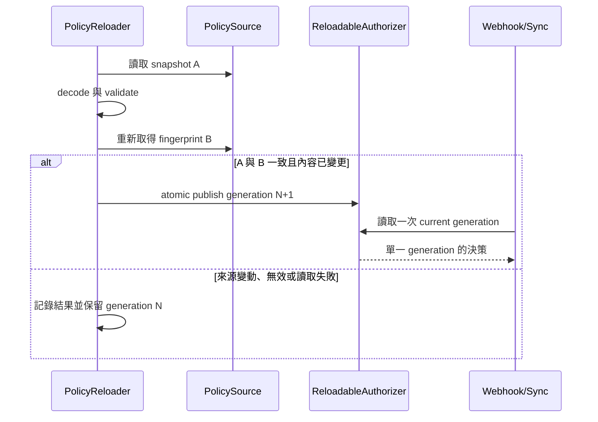

# 設計文件：Policy Hot Reload 與 Generation 一致性

## 設計摘要

新增以 polling 驅動的 `PolicyReloader`。Startup 先建立第一個有效 `PolicySnapshot`，再將 immutable policy 放入共享的 `ReloadablePolicyAuthorizer`。每輪 reload 讀取排序後的來源 bytes、計算只供程序內比較的 fingerprint、驗證候選，並再次擷取來源 fingerprint；只有來源前後一致、候選有效且內容改變時，才以 atomic pointer swap 發布下一個 generation。失敗保留 last-known-good，Webhook 與 sync worker 不需改變 `SecretAuthorizer` 介面。

## 文件定位

本設計實現同目錄 `requirements.md`，建立在既有 `domain.LoadPolicy`、`SecretAuthorizer`、application authorization wiring 與 `/app/policy` ConfigMap directory mount 上。它不改 policy schema、不新增 Kubernetes API client 權限，也不提供跨 replica 的一致性協定。

## 已知契約狀態

- 需求來源：`requirements.md` 的 hot reload、generation、一致 snapshot、last-known-good 與 observability 契約
- API / CLI / Hook contract：`SecretAuthorizer` 與 `vault-agent policy validate` 維持不變
- Data contract：`Policy`、`PolicyRule`、`ResourceRule` 的 YAML schema 維持 v1
- Config contract：既有 `authorization.enabled`、`policy_file`、`policy_dir` 保留；新增 `reload_interval_seconds`
- Deployment contract：ConfigMap 掛載在 `/app/policy`，使用 directory mount 且沒有 `subPath`
- 不可假造：單一 Pod generation 不代表所有 Pod 已收斂；volume 更新時間由 Kubernetes 控制

## Bounded Context

包含：

- authorization reload interval config 與 validation
- policy source snapshot、fingerprint 與一致性判斷
- reloadable authorizer 的 atomic generation publish
- background polling lifecycle 與 shutdown wait
- reload metrics、安全日誌與繁中操作文件
- file 與 directory source 的相同行為

不包含：

- policy public schema 或 matching algorithm 變更
- Vault/AWS server-side policy 修改
- Kubernetes informer、API watch、leader election 或額外 RBAC
- cluster-wide generation barrier
- HTTP 管理 API、signal reload、fsnotify
- 已開始 external fetch 的 retroactive cancellation

## 設計原則

- 驗證完成前不得影響現行授權。
- Policy 發布後不可修改；請求只讀取一次 generation pointer。
- Reload 失敗要可觀測，但不得將機密 metadata 寫入 log 或 label。
- Source event 只是提示；本設計以完整 snapshot 內容決定是否發布。
- Startup 與 CLI 必須共用相同 decode 與 semantic validation 邏輯。
- 不以 readiness 表達非致命 background reload failure，避免有效 last-known-good 因設定錯誤被流量隔離。

## 需求對應

| 需求 / 驗收情境 | 設計處理方式 | 驗證方式 |
|-----------------|--------------|----------|
| 有效更新原子發布 | `atomic.Pointer` 交換 immutable generation state | concurrent authorizer tests 與 race test |
| Webhook/sync 一致 | 兩個 use case 注入同一 wrapper | main wiring test |
| 無效更新保留現況 | validate-before-publish | reloader failure table tests |
| 防止混合來源 | snapshot 內容 fingerprint 前後比對 | controllable source mutation test |
| 相同內容不更新 | candidate fingerprint 與 current fingerprint 比對 | unchanged test |
| 空規則撤銷全部 | 有效 YAML 可發布，空目錄仍失敗 | deny-all 與 empty-directory tests |
| 零值停用 | builder 不啟動 background runner | config/main tests |
| 安全觀測 | 固定 result label，不記錄來源內容 | marker log/metric tests |

## 受影響檔案計畫

| 檔案 | 預期變更 | 原因 | 風險 |
|------|----------|------|------|
| `internal/configs/config.go` | reload interval 欄位、default 與 validation | 明確啟停及週期 | 零值語意混淆 |
| `internal/configs/config_test.go` | default、0、負數與來源組合測試 | 固定 config contract | 無 |
| `internal/syncer/domain/policy.go` | snapshot decode、fingerprint 與 immutable authorizer state | 一致載入與原子發布 | loader 回歸 |
| `internal/syncer/domain/policy_test.go` | source mutation、atomicity、unchanged、deny-all tests | 固定安全語意 | concurrency 測試不穩定 |
| `internal/syncer/application/policy_reloader.go` | polling runner 與 last-known-good state transition | 隔離 background orchestration | goroutine leak |
| `internal/syncer/application/policy_reloader_test.go` | fake clock/source 與結果測試 | 不依賴 sleep | fake abstraction 過度設計 |
| `cmd/vault-agent/main.go` | 建立共享 authorizer、啟動及等待 reloader | runtime wiring | startup/shutdown 回歸 |
| `cmd/vault-agent/main_test.go` | enabled/disabled wiring 與 cancellation tests | 保護 lifecycle | 無 |
| `internal/infra/metrics/metrics.go` | generation、reload result、最後成功時間 | 可觀測性 | label cardinality |
| `configs/config.sample.yaml` | 新增設定範例 | 可發現性 | 預設漂移 |
| `deployments/kustomize/base/deployment.yaml` | 新增 reload interval 環境變數 | production contract | 環境變數與設定 key 漂移 |
| `docs/config.zh-Hant.md`、`docs/deploy.zh-Hant.md` | 行為、延遲、操作與失敗模式 | 維運可操作性 | 無 |

## 目標結構或流程

```text
startup
  -> LoadPolicySnapshot(source)
  -> validate initial candidate
  -> NewReloadablePolicyAuthorizer(generation 1)
  -> inject the same authorizer into webhook and sync worker
  -> if reload interval > 0: start PolicyReloader

poll tick
  -> capture source snapshot A
  -> decode and validate candidate from A bytes
  -> capture current source fingerprint B
  -> A fingerprint != B: discard and retry next tick
  -> A fingerprint == current fingerprint: unchanged
  -> otherwise: atomic publish generation N+1

failure
  -> keep generation N
  -> increment failure metric
  -> log safe summary
```

## Mermaid Diagrams



## 介面與資料契約

### Config

```yaml
authorization:
  enabled: true
  policy_file: ""
  policy_dir: /app/policy
  reload_interval_seconds: 30
```

- `reload_interval_seconds > 0`：依秒數定期重載。
- `reload_interval_seconds = 0`：停用 hot reload，只在 startup 載入。
- `reload_interval_seconds < 0`：設定驗證失敗。
- Authorization 停用時不載入 policy，也不啟動 reloader；interval 值不產生 background work。

### Domain

建議新增內部資料結構：

```go
type PolicySnapshot struct {
    Policy      *Policy
    fingerprint [32]byte
}

type policyGeneration struct {
    policy      *Policy
    fingerprint [32]byte
    number      uint64
}

type ReloadablePolicyAuthorizer struct {
    current atomic.Pointer[policyGeneration]
}
```

- `PolicySnapshot` 不公開 fingerprint，不提供 String formatter。
- `policyGeneration` 發布後 immutable。
- `AuthorizeWebhook` 與 `AuthorizeSync` 在函式開頭各呼叫一次 `current.Load()`，同一決策不得再次讀取 pointer。
- Wrapper 繼續實作既有 `SecretAuthorizer`，application use cases 不感知 reload。
- Publish 由單一 reloader goroutine呼叫；generation number 只在有效且內容改變時加一。

### PolicySource snapshot

- 單檔：讀取 bytes 並計算 SHA-256 fingerprint，再由相同 bytes strict decode；basename 只用於安全錯誤定位，不影響內容識別。
- 目錄：解析受允許 root、列出排序後 `.yaml`/`.yml` basename、讀取每份 bytes，以長度前綴編碼 basename 與內容後計算 SHA-256，避免拼接碰撞。
- Directory symlink escape protection、KnownFields、單一 YAML document、版本一致與 duplicate rule ID 行為維持不變。
- 第一次 snapshot 產生候選；驗證完成後第二次只擷取來源 fingerprint。兩次 fingerprint 不同時回傳 source changed 結果，不發布候選。
- Snapshot 與 fingerprint helper 同時供 startup、CLI 與 reloader 使用，避免 validation divergence；既有 `LoadPolicy` 可保留為相容 wrapper。

### Background runner

```go
type policySnapshotLoader func(policyFile, policyDir string) (*domain.PolicySnapshot, error)

type PolicyReloader struct {
    // policy source、authorizer、interval、loader、ticker、clock
}

func (r *PolicyReloader) Run(ctx context.Context)
```

- 實作可使用內部 function fields 取代公開 interface，以符合現有專案慣例；測試必須可注入 tick，不使用真實 `time.Sleep`。
- `LoadPolicySnapshot` 內部在 decode/validate 前後各讀取一次來源 fingerprint，來源不一致時回傳 `ErrPolicySourceChanged`。
- 第一輪 background reload 在一個 interval 後執行；startup 已同步載入，不重複立即讀取。
- Context 取消時立即離開；main 持有 done channel 並在 shutdown 階段等待。
- Reload error 不回傳至 server supervisor，也不修改 readiness；以 metrics/log 呈現。

### Metrics

- `vault_agent_policy_generation`：目前程序內 generation gauge，初始成功為 `1`。
- `vault_agent_policy_reload_total{result="success|unchanged|failure"}`：固定三種 result。
- `vault_agent_policy_last_reload_success_unixtime`：最近一次成功發布的 Unix timestamp；startup 初始載入成功時設定。
- 不使用 namespace、ServiceAccount、backend path、rule ID、source path、fingerprint 或 error text 作為 label。

### Log 與 error

- 成功：`workload policy reloaded`，只附 generation。
- 無效候選：`workload policy reload failed; keeping last known good policy`，附固定 error category，不附底層敏感值。
- 來源在讀取期間改變屬可重試狀態，不使用 error level；不得記錄 fingerprint。
- Runtime 訊息維持英文，測試以敏感 marker 確認不洩漏內容。

## 關鍵行為

- 初始 policy 是 generation 1；它必須完成來源穩定性檢查與完整驗證後才啟動服務。
- 有效 reload 的 atomic publish 是 linearization point；在此之前開始的決策可使用舊 generation，在此之後開始的決策使用新 generation。
- 已通過授權並開始 external read 的請求不會被中途取消。下一次獨立授權才會套用撤銷結果。
- 多個 Pod 各自生成本地 generation number；數字只表示該程序成功發布次數，不能直接當作 cluster-wide policy identity。
- 空 policy directory 或全部 YAML 被移除是 failure；有效空規則 YAML 是 deny-all generation。
- File metadata、symlink target 或排序沒有直接決定 generation；最終以 canonical source bytes fingerprint 判斷內容是否改變。

## 前後端或跨模組設計

Config layer 提供 interval；domain layer負責安全 snapshot 與 atomic authorization；application layer負責 poll state machine；delivery/main layer只負責建立依賴與 lifecycle；infra metrics提供固定 collector。Webhook、sync worker 與 backend clients 不新增 reload-specific 判斷。

## Protected Behavior

- `SecretAuthorizer` public interface、rule matching、deny-by-default 與 backend normalization 不變。
- `policy_file`、`policy_dir` 互斥與 authorization enabled validation 不變。
- `vault-agent policy validate` 的 flags、exit codes 與安全錯誤 contract 不變。
- Startup 無有效 policy 時仍 fail-closed。
- Sync conflict retry 前的重新授權行為不變，並自然讀到當下 generation。
- Readiness、webhook failure policy、graceful HTTP shutdown 與 external client cleanup 不變。
- Kubernetes RBAC、Dockerfile `/app/policy`、ConfigMap directory mount 不變；禁止改為 `subPath`。
- `_workspace/` 不屬於本 spec。

## 替代方案

| 方案 | 優點 | 缺點 | 結論 |
|------|------|------|------|
| 監看每個 policy 檔案 | 事件延遲低 | Kubernetes symlink swap 可能使 watch 失效；動態檔案集合難維護 | 不採用 |
| fsnotify 監看父目錄 | 比 polling 即時 | 仍需處理事件合併、symlink 世代與遺失事件，且新增直接 dependency | 不採用 |
| Kubernetes ConfigMap API watch | 有 resourceVersion | 需要 API dependency、RBAC 與 reconnect 行為，偏離本機 file/dir contract | 不採用 |
| 固定週期完整 snapshot | 可攜、無新權限、file/dir 共用、可恢復遺失事件 | 生效有 interval 延遲且會重讀小型檔案 | 採用 |
| reload 失敗切換 deny-all | 安全撤銷偏保守 | 任一格式錯誤造成全服務拒絕與可用性事故 | 不採用；保留 last-known-good 並強制可觀測 |
| 原地更新 Policy | allocation 少 | 並行決策可能看到混合世代並產生 data race | 不採用 |

## 風險與處理方式

| 風險 | 影響 | 處理方式 | 驗證 |
|------|------|----------|------|
| snapshot 邏輯與既有 loader 分叉 | CLI 與 runtime 判斷不同 | 抽出 bytes-based single source of truth；`LoadPolicy` 只包裝它 | loader/CLI regression tests |
| reload 失敗保留已撤銷權限 | 安全變更延遲 | CI validation、failure metric、維運告警與文件 | invalid candidate test |
| atomic pointer 使用錯誤 | data race 或同一決策跨 generation | immutable state、每次方法只 Load 一次 | high-concurrency race test |
| 多 replica generation 數字不可比較 | 誤判全叢集已同步 | 文件標示 local counter；搭配 last success time | docs review |
| interval 太短造成讀取負擔 | 不必要 I/O | 預設 30 秒；policy 檔案應維持小型 | config tests/benchmark 非必要 |
| shutdown 未等待 reloader | goroutine leak | done channel 與 bounded wait沿用現有 lifecycle pattern | cancellation test |
| error 包裝洩漏 resource path | 機密 metadata 暴露 | category mapping與 marker test，不直接 log raw error | security test |

## 實作注意事項

- 先以 tests 固定 config、snapshot 與 atomic publish contract，再修改 production code。
- 不以 `time.Sleep` 測試 polling；注入 clock/tick channel。
- SHA-256 使用 Go 標準庫，只作內容識別，不作授權或加密用途。
- Fingerprint 比較可使用 fixed-size array equality；不得轉字串供 log。
- 若既有 metric collectors 為 package globals，測試避免重複註冊；沿用專案現有測試方式。
- 每完成 task 更新 `tasks.md` 的 Status 與 Implementation Notes。
- `_workspace/` 不得加入 diff 或 commit。
