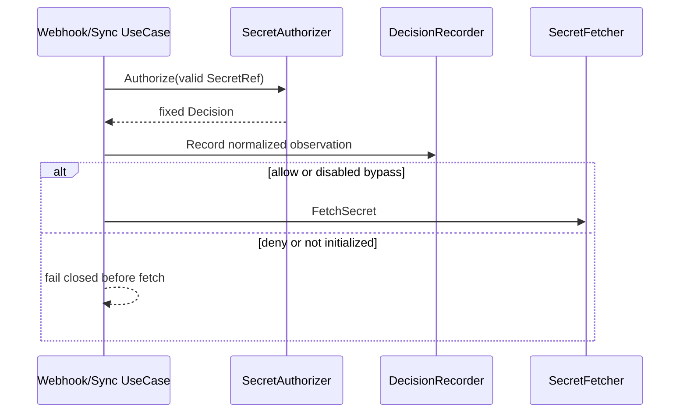

# 設計文件：Authorization Decision Observability 與安全稽核

## 設計摘要

在 application layer 建立可注入、無錯誤回傳的 `AuthorizationDecisionRecorder`。Webhook 與 Sync 在解析出有效 SecretRef 後，將 allow、deny、not initialized 或 disabled bypass 正規化為固定 observation，並在 external fetch 前記錄。Production recorder 永遠更新低基數 Prometheus counter；audit config 只控制 structured log。相鄰 operational logs 改用固定 error category，backend errors 保留 sentinel 語意但移除 path/key，避免 audit 與既有 raw error logging 洩漏機密 metadata。

## 文件定位

本設計實現同目錄 `requirements.md`，接續 secure secret access 與 policy hot reload。它只新增 decision observation、選配 audit 與安全 error redaction，不更改 caller authentication、AdmissionReview validation、policy decision、external fetch、sync conflict retry 或 admission response。

## 已知契約狀態

- 需求來源：`requirements.md` 的固定 metric taxonomy、exactly-once、pre-fetch、audit opt-in 與 redaction
- API / CLI / Hook contract：`/mutate`、AdmissionReview response、`SecretAuthorizer`、`policy validate` 不變
- Data contract：`domain.Decision` 目前 allow reason 為 `allowed`、deny reason 為 `no_matching_rule`，且包含不得對外觀測的 `RuleID`
- Config contract：Authorization 已有 enabled、file/dir 與 reload interval；新增 nested audit config
- Metrics contract：既有 collectors 使用 package globals 與 `InitMetrics` 預初始化固定 labels
- Logging contract：Runtime 訊息使用英文；Webhook context已有 request ID，Sync context已有 component/operation
- 不可假造：Sync authorization 只有 Secret namespace，沒有 Pod ServiceAccount；不得補虛構 identity

## Bounded Context

包含：

- workload authorization decision counter
- backend／decision／reason／surface normalization
- Webhook／Sync observation point與呼叫順序
- audit enabled 與 include identity config
- structured audit event與安全欄位
- application／delivery operational error category
- Vault／AWS error text的 path/key redaction
- metrics、application、infra、delivery、config與文件測試

不包含：

- caller authentication與Admission contract audit
- policy schema、RuleID、matching或hot reload變更
- policy source與跨 replica revision
- PrometheusRule、dashboard、SIEM、log retention或合規聲明
- traces、management API或手動 reload
- namespace／ServiceAccount hash或pseudonymization
- failure/recovery drills

## 設計原則

- Observation 不得影響 authorization control flow。
- Domain 不依賴 Prometheus 或 logger；surface-aware observation 留在 application layer。
- Metrics 使用封閉、低基數維度，不接受 raw input。
- Audit 與 metrics 分離；關閉 audit 不得關閉 security metric。
- Identity 必須明確 opt-in，且永遠不能進 metrics。
- Deny observation 必須位於 external fetch 前。
- Operational logs只輸出分類，不輸出 raw backend error。
- RuleID 保留內部 decision用途，但不作 label或audit欄位。

## 需求對應

| 需求 / 驗收情境 | 設計處理方式 | 驗證方式 |
|-----------------|--------------|----------|
| Allow pre-fetch | use case在 decision後立即呼叫 recorder | ordered fake recorder/fetcher |
| Deny no fetch | record後return | call count與event assertions |
| Nil fail closed | 固定 deny/not_initialized | Webhook/Sync table tests |
| Disabled bypass | 固定 bypass/disabled | disabled tests |
| Backend bounded | recorder normalize allowlist | sensitive marker test |
| 24 series | InitMetrics只建立合法 pair | gathered family exact count |
| Audit opt-in | nested config與recorder fields | config/log observer tests |
| Safe errors | sentinel category mapper與raw error omission | captured log marker tests |

## 受影響檔案計畫

| 檔案 | 預期變更 | 原因 | 風險 |
|------|----------|------|------|
| `internal/configs/config.go` | audit nested config、env、validation | 雙層開關 | 預設漂移 |
| `internal/configs/config_test.go` | default、env、invalid組合 | 固定config contract | 無 |
| `internal/infra/metrics/metrics.go` | decision CounterVec與24組初始化 | security metric | cardinality |
| `internal/infra/metrics/metrics_test.go` | metric schema、labels、series count | 防止動態label | global registry隔離 |
| `internal/syncer/application/authorization.go` | observation types、recorder、audit options、安全分類 | 共用邏輯 | 過度耦合 |
| `internal/syncer/application/authorization_test.go` | normalization與audit field tests | 安全contract | logger capture setup |
| `internal/syncer/application/mutate_usecase.go` | Webhook observation point | pre-fetch統計 | 重複計數 |
| `internal/syncer/application/mutate_usecase_test.go` | allow/deny/nil/disabled/order | 驗收 | global metric污染 |
| `internal/syncer/application/sync_worker_usecase.go` | Sync observation point與安全category | pre-fetch統計 | scan log回歸 |
| `internal/syncer/application/sync_worker_usecase_test.go` | allow/deny/nil/disabled/order | 驗收 | 無 |
| `internal/syncer/delivery/webhook_handler.go` | raw error改為固定category | 防止log洩漏 | 診斷資訊減少 |
| `internal/syncer/delivery/webhook_handler_test.go` | generic response與log marker | 保護redaction | logger capture setup |
| `internal/syncer/infra/vault_client.go`、`aws_client.go` | 移除path/key error text | sentinel仍可判斷 | 舊error assertion更新 |
| 對應 infra tests | errors.Is與marker assertions | 安全回歸 | 無 |
| `cmd/vault-agent/main.go`、`main_test.go` | 建立production recorder並注入enabled/disabled options | wiring | disabled漏記 |
| `configs/config.sample.yaml` | audit設定範例 | 可發現性 | 無 |
| `deployments/kustomize/base/deployment.yaml` | 明確false audit env | production安全預設 | env漂移 |
| `docs/config.zh-Hant.md`、`docs/deploy.zh-Hant.md` | metric、audit與資料分類 | 維運 | 無 |

## 目標結構或流程

```text
valid SecretRef
  -> authorization enabled?
     -> no: record bypass/disabled
     -> yes, authorizer nil: record deny/not_initialized -> return
     -> yes: call SecretAuthorizer
        -> allowed: record allow/matched
        -> denied: record deny/no_matching_rule -> return
  -> select fetcher
  -> external fetch
```

Recorder：

```text
AuthorizationObservation
  -> normalize surface/decision/reason/backend
  -> increment vault_agent_authorization_decisions_total
  -> audit enabled?
     -> no: return
     -> yes: log fixed fields
        -> include identity?
           -> no: omit identity
           -> yes: add available namespace/ServiceAccount
```

## Mermaid Diagrams



## 介面與資料契約

### Config

```yaml
authorization:
  enabled: true
  policy_dir: /app/policy
  reload_interval_seconds: 30
  audit:
    enabled: false
    include_identity: false
```

- Environment：`AUTHORIZATION_AUDIT_ENABLED`、`AUTHORIZATION_AUDIT_INCLUDE_IDENTITY`
- `include_identity=true` 需要 `audit.enabled=true`，否則 config validation失敗。
- Audit config不影響 metric記錄。
- Authorization disabled仍可記錄 bypass，因此 production recorder必須在 enabled/disabled兩種 wiring中存在。

### Observation

建議 application contract：

```go
type AuthorizationObservation struct {
    Surface       AuthorizationSurface
    Decision      AuthorizationDecision
    Reason        AuthorizationReason
    Backend       string
    Namespace     string
    ServiceAccount string
}

type AuthorizationDecisionRecorder interface {
    Record(context.Context, AuthorizationObservation)
}
```

- Enum types與constants限制 surface、decision、reason。
- Backend在 recorder內 normalize；use case不得自行建立label。
- Recorder沒有error return，避免觀測失敗改變授權。
- 測試使用fake recorder；production使用Prometheus＋zlogger recorder。
- Nil recorder視為no-op以維持existing constructor compatibility，但main production wiring必須非nil並由test固定。

### Metric

```text
vault_agent_authorization_decisions_total{
  surface="webhook|sync",
  decision="allow|deny|bypass",
  reason="matched|no_matching_rule|not_initialized|disabled",
  backend="vault|aws|unknown"
}
```

合法 pair：

| decision | reason | 語意 |
|----------|--------|------|
| allow | matched | Policy匹配並允許 |
| deny | no_matching_rule | 沒有匹配規則 |
| deny | not_initialized | Enabled但authorizer缺失，fail closed |
| bypass | disabled | Workload authorization明確停用 |

每個 pair搭配2個surface與3個backend，固定24條series。Namespace、ServiceAccount、RuleID、path、keys、Pod/Secret name、UID、generation、fingerprint與error不允許加入label。Prometheus官方指出每個唯一label組合都會建立新time series，應避免user ID等無界維度；本設計以固定allowlist限制cardinality。

### Audit log

- Message：`workload authorization decision`
- 固定fields：`surface`、`decision`、`reason`、`backend`
- Context既有fields：Webhook request ID；Sync component/operation
- Optional identity：`namespace`、`service_account`
- Sync沒有ServiceAccount時省略欄位，不輸出空值或`unknown`
- 禁止fields：path、keys、RuleID、Pod/Secret name、UID、policy source/version/generation/fingerprint、raw error、credential
- Allow、deny、bypass都使用Info level；告警應以counter rate為主，不依賴log level。

### Safe operational error

建議固定category：

| category | 範圍 |
|----------|------|
| `authorization_not_initialized` | enabled但authorizer nil |
| `authorization_denied` | policy deny |
| `invalid_secret_reference` | annotation parse失敗 |
| `unknown_backend` | fetcher不存在 |
| `secret_not_found` | errors.Is ErrSecretNotFound |
| `secret_fetch_failed` | errors.Is ErrSecretFetchFailed或其他fetch error |
| `mutation_failed` | patch/marshal等其他錯誤 |
| `sync_failed` | 非fetch／authorization的sync錯誤 |

- Webhook response仍為generic `secret injection failed`。
- Webhook/Sync error log只寫category，不寫raw error。
- Vault/AWS adapter回傳error仍可用`errors.Is`判斷sentinel，但message不得加入path、key、ARN、URL或backend SDK raw resource identifier。
- 若需底層除錯，應由受控backend telemetry或另案安全debug機制處理，不得在production application log回顯。

## 關鍵行為

- Observation只在成功解析出非nil SecretRef後發生。
- Enabled且authorizer存在時，observer使用decision結果；不重新執行policy matching。
- 不直接信任`Decision.Reason`；Allowed=true固定映射allow/matched，Allowed=false固定映射deny/no_matching_rule。
- Authorizer nil在呼叫前固定映射deny/not_initialized。
- Disabled固定映射bypass/disabled。
- Observation發生後，原有control flow不變；allow/bypass才進fetch，deny/nil立即return。
- Metrics recorder與audit logger不得panic；只使用已註冊collector與boundedfields。
- Policy hot reload切換不需改observer；每次use case取得的decision自然被記錄。

## 前後端或跨模組設計

Domain layer只產生授權Decision；application layer將surface與control state正規化為Observation；infra metrics持有CounterVec；production recorder協調metric與zlogger；main注入audit config。Delivery與backend infra只處理安全error category/redaction，不理解policy規則。

## Protected Behavior

- Caller authentication必須先於Admission decode與use case。
- AdmissionReview contract validation仍先於mutation。
- Deny-by-default、policy matching、RuleID與SecretAuthorizer介面不變。
- Deny與not initialized仍在external fetch前停止。
- Authorization disabled只略過workload policy，不影響caller authentication、contract validation與RBAC。
- Webhook response維持generic，不暴露內部原因。
- Sync conflict retry、Secret刪鍵、hot reload、readiness與graceful lifecycle不變。
- Metrics basic auth與operations listener不變。
- Runtime string保持英文；註解與文件使用繁體中文。
- `_workspace/`與外部Policy Source draft不屬於本spec。

## 替代方案

| 方案 | 優點 | 缺點 | 結論 |
|------|------|------|------|
| 在domain authorizer直接更新metrics | 不會漏decision | domain依賴Prometheus且無法觀察disabled/nil | 不採用 |
| 在Webhook handler與sync loop推斷error | 變更小 | 依賴error字串、無法可靠區分類型 | 不採用 |
| Application注入recorder | 可測、surface-aware、無domain耦合 | 需修改options與wiring | 採用 |
| Namespace／SA作metric label | 查詢直覺 | 無界cardinality與metadata exposure | 禁止 |
| RuleID作metric label | 能看rule命中 | Policy可任意增加ID且暴露內部結構 | 禁止 |
| Audit永遠啟用 | 無設定漏失 | 高volume與metadata exposure | 不採用 |
| Audit雙層開關 | 安全預設、identity可控 | 維運需明確設定 | 採用 |
| 保留raw error只移除顯式path | 診斷較多 | SDK error仍可能含URL／ARN／resource | 不採用 |

## 風險與處理方式

| 風險 | 影響 | 處理方式 | 驗證 |
|------|------|----------|------|
| 非法backend造成series爆增 | Prometheus負載 | recorder固定normalize unknown | marker與series tests |
| 合法pair以外的組合出現 | Dashboard語意錯誤 | enum＋single mapping helper＋24組init | exact labelset tests |
| Recorder呼叫位置錯誤 | deny後仍fetch或重複計數 | ordered fake與call count | use case tests |
| Identity意外出現在default audit | metadata exposure | default false與field absence assertion | zap observer tests |
| Raw error仍含敏感值 | log洩漏 | category-only log、adapter redaction | sensitive marker tests |
| Audit volume過高 | storage成本 | default off、文件說明容量／retention | config/deployment review |
| Recorder nil造成production漏metric | 安全控制不可見 | main wiring test涵蓋enabled/disabled | build authorization tests |
| Metrics global registry測試互相污染 | flaky tests | delta或family schema assertions，不依賴全域counter為0 | metrics tests |

## 實作注意事項

- 先建立fake recorder的red tests，固定exactly-once與pre-fetch順序，再修改use cases。
- Metric labels使用constants；禁止將`Decision.Reason`或annotation直接傳入`WithLabelValues`。
- `InitMetrics`只預建合法24組，不使用四維笛卡兒積建立無效pair。
- Audit logger測試使用zap observer或專案可用的等價capture，不改全域logger時需避免parallel。
- Sensitive marker應同時放入backend、path、key與wrapped SDK error，測試完整輸出不存在marker。
- 每完成task更新`tasks.md` Status與Implementation Notes。
- `_workspace/`與`.specs/drafts/2026-08-04-17-55_Draft-pluggable-policy-source`不得納入本feature實作提交。
