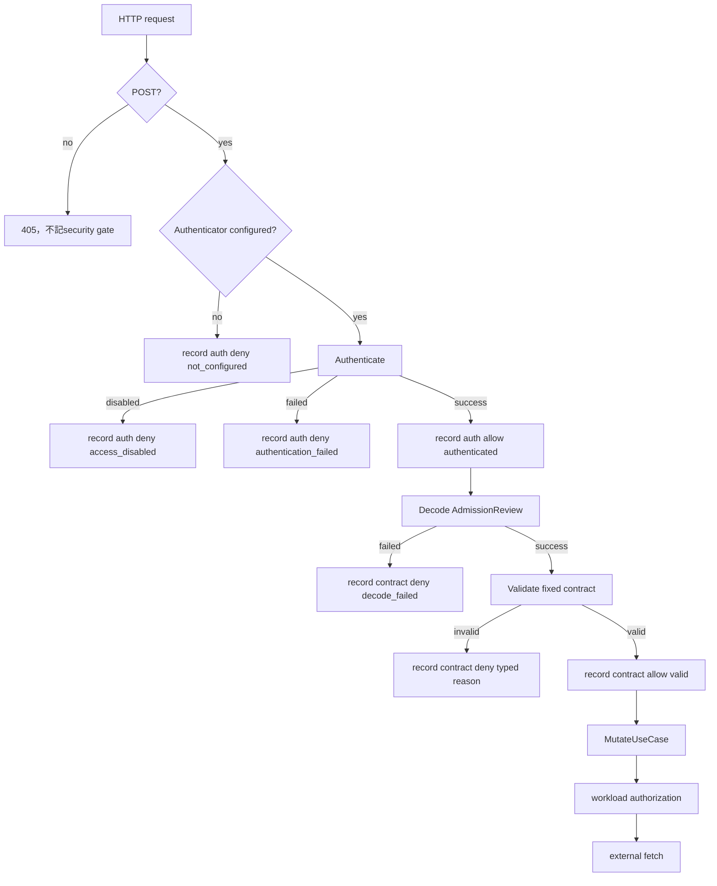

# 設計文件：Caller Authentication 與 Admission Contract 安全觀測

## 設計摘要

在delivery layer新增無error回傳的`AdmissionSecurityRecorder`，將caller authentication與Admission contract結果轉為固定enum，再寫入獨立Prometheus counter。Handler維持原本安全gate順序，在每個gate出口記錄一次；deny log只輸出固定gate／decision／reason。Authenticator與validator提供可被固定分類的sentinel／typed reason，但不改既有認證與contract接受語意。

## 文件定位

本設計實現同目錄`requirements.md`，接續secure secret access與authorization decision observability。它只處理delivery security gates，不修改application workload authorization、SecretFetcher、policy、sync worker、RBAC、failurePolicy或external policy source。

## 已知契約狀態

### 需求來源

- Caller authentication與AdmissionReview validation必須先於workload authorization與external fetch。
- Workload authorization已有獨立`vault_agent_authorization_decisions_total`與選配audit。
- 本功能不得把delivery security結果塞入既有authorization metric。

### HTTP contract

| 狀態 | Status | Response |
|------|--------|----------|
| method不符 | 405 | `method not allowed` |
| authenticator nil | 503 | `caller authentication is not configured` |
| authentication拒絕 | 401 | `caller authentication failed` |
| decode失敗 | 400 | `bad request` |
| contract拒絕 | 400 | `invalid AdmissionReview` |
| mutator失敗 | 200 | AdmissionResponse `Allowed=false`與generic message |

以上contract不得因觀測功能改變。

### Authentication contract

- `RequestAuthenticator.Authenticate(*http.Request)`回傳`CallerIdentity`與error。
- Bearer使用constant-time comparison。
- mTLS要求verified chain且principal在allowlist。
- DisabledAuthenticator永遠拒絕，不代表anonymous bypass。
- `CallerIdentity.Method`與`Principal`存在，但本設計不得輸出或作label。

### Admission data contract

Validator依序檢查：

1. AdmissionReview apiVersion／kind
2. request、UID與object存在
3. core/v1 pods resource
4. core/v1 Pod kind
5. CREATE operation
6. namespace存在
7. Pod object可decode
8. request與Pod namespace一致

不可假造或觀測AdmissionRequest.UserInfo、UID、namespace、Pod name或raw object。

## Bounded Context

### 包含

- Caller authentication allow／deny結果分類
- AdmissionReview decode與contract allow／deny分類
- 固定低基數Prometheus counter
- Deny category-only structured log
- Delivery recorder injection與main production wiring
- 繁體中文維運文件與測試

### 不包含

- Authentication credential rotation或新認證機制
- TLS handshake與network transport telemetry
- HTTP method security metric
- Workload authorization metric／audit修改
- Admission mutation、Secret fetch或sync telemetry
- Dashboard、alert、trace、SIEM與演練

## 設計原則

1. **先分類再觀測**：只有固定enum可以進入metric與log，禁止從error string推斷label。
2. **安全順序不變**：record位置貼近既有return，不移動gate或放寬條件。
3. **觀測不可失敗**：recorder沒有error return，不影響allow／deny。
4. **最小資料**：不使用CallerIdentity、HTTP header或AdmissionReview metadata。
5. **獨立taxonomy**：delivery security與workload authorization使用不同metric與型別。
6. **固定series**：只初始化14個合法組合，invalid observation直接忽略。
7. **拒絕才記log**：合法流量只更新counter，控制log容量。

## 目標流程



## 目標型別

```go
type AdmissionSecurityGate string
type AdmissionSecurityDecision string
type AdmissionSecurityReason string

type AdmissionSecurityObservation struct {
    Gate     AdmissionSecurityGate
    Decision AdmissionSecurityDecision
    Reason   AdmissionSecurityReason
}

type AdmissionSecurityRecorder interface {
    Record(context.Context, AdmissionSecurityObservation)
}
```

Production recorder只負責固定enum validation、counter increment與deny safe log。Handler不直接組Prometheus label values。

## Metric設計

```text
vault_agent_admission_security_decisions_total{
  gate="caller_authentication|admission_contract",
  decision="allow|deny",
  reason="fixed_allowlist"
}
```

CounterVec只有三個labels。14個合法組合由`InitMetrics`預先初始化。Recorder用完整tuple allowlist驗證，不只分別驗證每個label，避免例如`caller_authentication/allow/valid`等無效組合建立series。

### Series budget

| Gate | 合法組合數 |
|------|------------|
| caller_authentication | 4 |
| admission_contract | 10 |
| 合計 | 14 |

不加入`auth_mode`。認證模式是deployment設定，不需要在每次request label重複；若未來確實需要跨deployment比較，應由Prometheus target metadata或獨立build／config info metric處理，而非接受request-derived值。

## Authentication分類

### Sentinel

維持一般authentication失敗的單一sentinel，另為DisabledAuthenticator建立獨立sentinel。分類函式只接受：

| 條件 | Reason |
|------|--------|
| handler authenticator nil | not_configured |
| errors.Is disabled sentinel | access_disabled |
| 其他Authenticate error | authentication_failed |
| nil error | authenticated |

不區分missing header、wrong token、certificate缺失或principal不允許，避免提供credential probing訊號與擴張taxonomy。

## Admission contract分類

### Typed error

`validateAdmissionReview`回傳帶固定`AdmissionSecurityReason`的內部error，例如：

```go
type admissionContractError struct {
    reason AdmissionSecurityReason
}
```

其`Error()`只回傳固定英文訊息；handler直接取得typed reason，不解析string。Pod JSON unmarshal error不包入回傳文字或reject log。

Decode發生在validator外，由handler固定映射為`decode_failed`。Body超過1 MiB造成decoder error時使用相同reason，不增加body_size或raw decoder error分類。

## Handler integration

### Constructor

`WebhookHandler`增加`securityRecorder AdmissionSecurityRecorder`欄位。`NewWebhookHandler`使用明確第三個參數，讓main與tests都清楚注入。若為nil，helper安全no-op，但main production wiring必須非nil。

### Record points

| 位置 | Observation | 下一步 |
|------|-------------|--------|
| authenticator nil | auth deny/not_configured | 503 return |
| Authenticate error | auth deny/fixed reason | 401 return |
| Authenticate success | auth allow/authenticated | decode |
| Decode error | contract deny/decode_failed | 400 return |
| Validator error | contract deny/typed reason | 400 return |
| Validator success | contract allow/valid | mutator |

每個helper只呼叫一次recorder。Recorder由fake event list測試順序，mutator fake把`mutate`附加到同一event list。

## 安全日誌

Deny event固定message：

```text
admission security gate rejected request
```

固定security-specific fields：

```text
gate, decision, reason
```

不呼叫`zlogger.Err`，也不加入外部identity。Logger既有timestamp、level、caller、component、operation及程式產生的request ID可保留；Admission UID不得作為request ID。Request ID目前在authentication成功後建立，本設計不為auth deny額外產生identity。

Recorder對allow只更新metric，不寫log。Deny log function保留可注入點供marker tests擷取fields。

## 受影響檔案計畫

| 檔案 | 變更 | 理由 |
|------|------|------|
| `internal/infra/metrics/metrics.go` | counter與14 tuple初始化 | 固定series |
| `internal/infra/metrics/metrics_test.go` | family／labels／tuple assertions | 防cardinality drift |
| `internal/syncer/delivery/security_observation.go` | enum、recorder、safe log | 共用安全邊界 |
| `internal/syncer/delivery/security_observation_test.go` | invalid tuple與marker tests | 固定taxonomy |
| `internal/syncer/delivery/authenticator.go` | disabled sentinel與分類支援 | 區分control state |
| `internal/syncer/delivery/authenticator_test.go` | bearer、mTLS、disabled sentinel | 認證回歸 |
| `internal/syncer/delivery/webhook_handler.go` | record points與typed contract reason | exactly-once／order |
| `internal/syncer/delivery/webhook_handler_test.go` | handler scenarios | HTTP與短路回歸 |
| `internal/syncer/delivery/webhook_handler_internal_test.go` | typed reason／safe field tests | package內安全契約 |
| `cmd/vault-agent/main.go` | production recorder injection | 啟用metric |
| `cmd/vault-agent/main_test.go` | wiring contract | 防nil recorder |
| `docs/README.zh-Hant.md` | metric與security flow | 使用者文件 |
| `docs/deploy.zh-Hant.md` | PromQL與資料禁區 | 維運文件 |

若實作需要超出以上檔案，必須先更新`tasks.md` Boundary與原因。

## 關鍵行為

### Exactly-once

Recorder invocation是gate結果的唯一出口。Validator本身不record，避免handler與validator雙重計數。Authenticator也不自行record，避免同一authenticator在其他context重用時改變metrics。

### Nil recorder

Nil recorder採no-op，避免測試或初始化錯誤造成panic；但main test必須證明production handler使用非nil recorder。觀測缺失不能把deny改成allow。

### Error redaction

Authenticator與validator可保留內部固定error以供`errors.Is`／typed分類，但handler reject log只接收Observation。Raw auth／decode／validation error不傳給logger。

### Existing metrics

- `MutateRequestsTotal`仍只在mutator完成後記success／error。
- `AuthorizationDecisionsTotal`仍由application recorder記workload policy結果。
- 新counter不含backend，因此不能取代authorization counter。

## 測試策略

### Unit

- 14 tuple series與label names
- Invalid observation不建立series或log
- Disabled sentinel與unknown auth error normalize
- 八種validator reason與decode reason
- Deny fields不存在敏感marker

### Delivery flow

- auth allow → contract allow → mutate順序
- auth deny／nil／disabled只一筆且不decode／mutate
- contract deny前已有auth allow，之後不mutate
- valid request仍回傳既有AdmissionResponse
- generic HTTP response與status不變

### Regression

- Bearer與mTLS認證
- Body size、invalid JSON、resource／kind／operation／namespace contract
- Workload authorization與mutator error
- Race、vet、lint、policy validation與Kustomize render

## 風險與處理方式

| 風險 | 影響 | 處理 |
|------|------|------|
| Tuple驗證不完整 | 建立未預期series | 完整tuple allowlist與family count test |
| Validator typed error重構 | 改變拒絕順序或HTTP response | table test與response regression |
| Allow與deny重複record | rate失真 | ordered fake與exact count assertions |
| Raw error殘留log | credential／metadata洩漏 | helper field capture與source search |
| Principal被加入debug log | identity洩漏 | Protected Behavior與marker test |
| Recorder panic | 影響admission availability | nil-safe、invalid-safe、無error API |

## 未採用方案

| 方案 | 原因 |
|------|------|
| 擴充authorization counter加入security gate | 混淆delivery authentication與workload authorization語意 |
| 使用HTTP status作reason | 同一400無法區分decode與contract，且耦合response |
| 直接使用error.Error()作label | 無界cardinality與資料洩漏 |
| 加入principal或auth mode label | identity exposure；auth mode可由deployment metadata得知 |
| 每個allow request寫security audit log | 增加容量，且沒有新增調查價值 |
| 由Authenticator直接更新metric | 降低可測試性並可能在重用時重複計數 |

## 文件更新

繁中README記錄三層安全流程與新metric；部署文件提供依gate／decision／reason彙總的PromQL，並明確禁止把principal、token、certificate、UID、namespace、body或secret metadata補入log pipeline。

## 完成定義

1. 14-series metric contract由自動測試固定。
2. Authentication與contract exactly-once／order tests通過。
3. 所有deny在mutator／authorization／fetch前停止。
4. Reject log與metric marker tests通過。
5. Main production recorder wiring可驗證。
6. 既有HTTP、authenticator、AdmissionReview、authorization與mutation tests通過。
7. 全套quality gates與文件一致性檢查通過。
