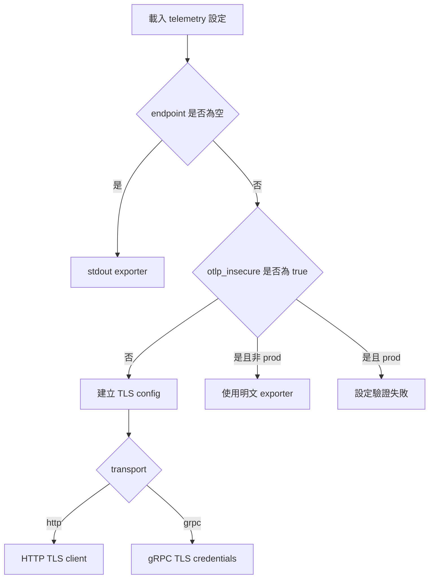

# 設計文件：OTLP 傳輸安全預設值

## 文件定位

本設計實作同目錄 `requirements.md` 的 TLS 預設值。它延伸既有 `TelemetryConfig` 與 `InitTracer`，不改變 OTLP endpoint、header、Basic Auth、compression 與 stdout exporter 的公開契約。

## 已知契約狀態

| 類別 | 現況與限制 |
| --- | --- |
| Config | Viper 以巢狀 key 與顯式 `BindEnv` 載入 telemetry 設定 |
| Exporter | endpoint 向後相容 `host:port`，並支援完整 URL；endpoint 為空時使用 stdout |
| 認證 | header 與 Basic Auth 在 `buildOTLPHeaders` 組合，Basic Auth 會覆寫 Authorization header |
| 環境 | `app.env=prod` 是 production 安全限制依據 |
| 錯誤 | tracer 初始化失敗目前只停用 tracing，server 繼續執行；不應輸出 credential |

## Bounded Context

### 包含

- OTLP client TLS 設定建立、驗證與套用。
- telemetry 設定欄位、環境變數、範例部署與文件。
- 與 TLS 模式有關的單元測試。

### 不包含

- Webhook／operations server TLS。
- Vault/OpenBao、AWS 或 Kubernetes API 連線安全。
- OTLP collector 端憑證、CA 發行或網路政策。
- mTLS client certificate 與憑證自動輪替。

## 設計原則

1. 安全預設：不設定時以 TLS 連線遠端 collector。
2. 顯式降級：明文傳輸只能由 `otlp_insecure=true` 啟用。
3. production fail fast：禁止在 production 靜默降級。
4. 最小揭露：log、error、metrics 不得紀錄認證或 CA 內容。
5. 共用建構：HTTP 與 gRPC 使用同一個 `*tls.Config` 建構流程，避免兩種 transport 漂移。

## 目標結構

```text
configs.TelemetryConfig
  ├─ OTLPInsecure
  ├─ OTLPTLSCAFile
  └─ OTLPTLSServerName
        │
        ▼
configs.Config.Validate
  └─ URL 與安全模式不相容，或 production + insecure => error
        │
        ▼
telemetry.buildOTLPTLSConfig
  └─ system roots + optional PEM CA + ServerName
        │
        ├─ HTTP：WithTLSClientConfig
        └─ gRPC：WithTLSCredentials
```



## 關鍵行為

### Endpoint 正規化與設定驗證

- 在 `Config.Validate` 正規化環境值後，若 `app.env` 不區分大小寫等於 `prod` 且 `telemetry.otlp_insecure=true`，回傳固定錯誤。
- 新增未匯出的 endpoint parser，接受空字串、既有 `host:port` 與完整 `http://`／`https://` URL。它回傳 HTTP URL、gRPC host:port 與由 scheme 判斷的傳輸安全意圖。
- `https://` endpoint 必須以 TLS 傳輸；`http://` endpoint 必須同時設定 `otlp_insecure=true`，並受 production 禁止規則限制。
- HTTP transport 保留 HTTPS URL 的 path；gRPC transport 只接受沒有 path、query、fragment 的 URL，並將其 host:port 傳給 `WithEndpoint`。
- 無 scheme 的既有 `host:port` 視為 TLS endpoint，維持向後相容但不再默認明文。
- endpoint 為空時不建立遠端 exporter；TLS 相關欄位可保留，避免只為切換 stdout 而使設定失效。
- CA 檔格式與可讀性由 TLS config 建構時驗證，因只有 endpoint 非空時才需讀檔。

### TLS config 建構

- 新增未匯出的 `buildOTLPTLSConfig(caFile, serverName string) (*tls.Config, error)`。
- CA 檔為空時，不設定 `RootCAs`，讓 Go 使用系統信任根。
- CA 檔非空時讀取 PEM，先取得系統 trust store；若系統 store 不可取得則建立空 pool，再附加 PEM。PEM 未加入任何憑證時回傳固定錯誤。
- `ServerName` 使用 `strings.TrimSpace` 後的值。
- 不設定 `InsecureSkipVerify`。

### Exporter 套用

- `otlp_insecure=true`：僅在合法的非 production `http://` endpoint 或無 scheme 相容設定下套用 `WithInsecure()`。
- HTTPS URL：HTTP 使用 `otlptracehttp.WithEndpointURL` 與 `WithTLSClientConfig`；gRPC 將正規化後 host:port 傳給 `WithEndpoint`，並使用 `WithTLSCredentials(credentials.NewTLS(tlsConfig))`。
- 無 scheme 的安全 endpoint：HTTP 與 gRPC 都使用正規化的 host:port，加上 TLS options。
- header、Basic Auth、compression 與 endpoint 仍在相同分支套用。

## 受影響檔案計畫

| 檔案 | 變更 |
| --- | --- |
| `internal/configs/config.go` | 新增三個 telemetry 欄位、環境變數、預設值與 production validation |
| `internal/configs/config_test.go` | 補 telemetry 不安全模式的設定驗證測試 |
| `internal/infra/telemetry/tracer.go` | 建立 TLS config，依模式套用 HTTP／gRPC options |
| `internal/infra/telemetry/tracer_test.go` | 補 TLS config 與 transport 行為測試 |
| `configs/config.sample.yaml` | 新增安全預設與欄位說明 |
| `deployments/kustomize/base/deployment.yaml` | 顯式設定 `TELEMETRY_OTLP_INSECURE=false` |
| `docs/config.*.md`、`docs/observability.*.md`、`docs/README.*.md` | 文件化 TLS 預設、私有 CA 與 production 限制 |

## 風險與處理方式

| 風險 | 處理方式 |
| --- | --- |
| 舊有明文 collector 升級後無法連線 | 僅非 production 可明確設定 `otlp_insecure=true`；文件列出遷移步驟 |
| 私有 CA collector 驗證失敗 | 提供 `otlp_tls_ca_file` 與 `otlp_tls_server_name` |
| 系統 trust store 取得失敗 | 指定 CA 時建立新 pool 並附加指定 CA；未指定 CA 時維持 Go 預設 TLS 行為 |
| 憑證或 endpoint 問題使 tracing 初始化失敗 | 沿用既有降級為無 tracing 的行為，但 log 僅記錄安全分類，不含認證資料 |
| HTTP 與 gRPC 安全設定不一致 | 共用 TLS config 建構函式，兩種 transport 皆有表格測試 |
